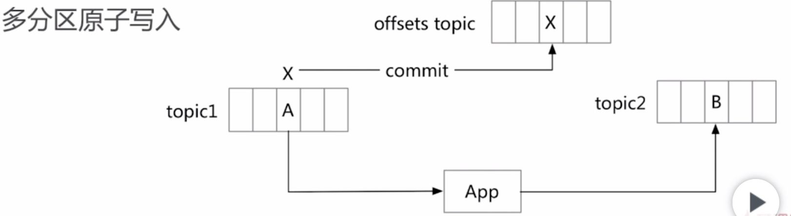
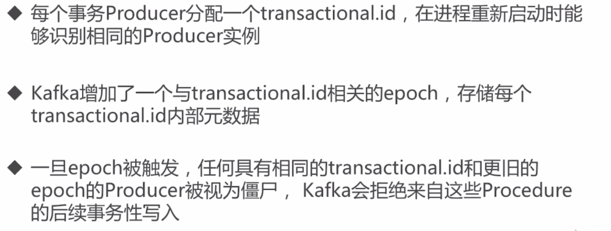
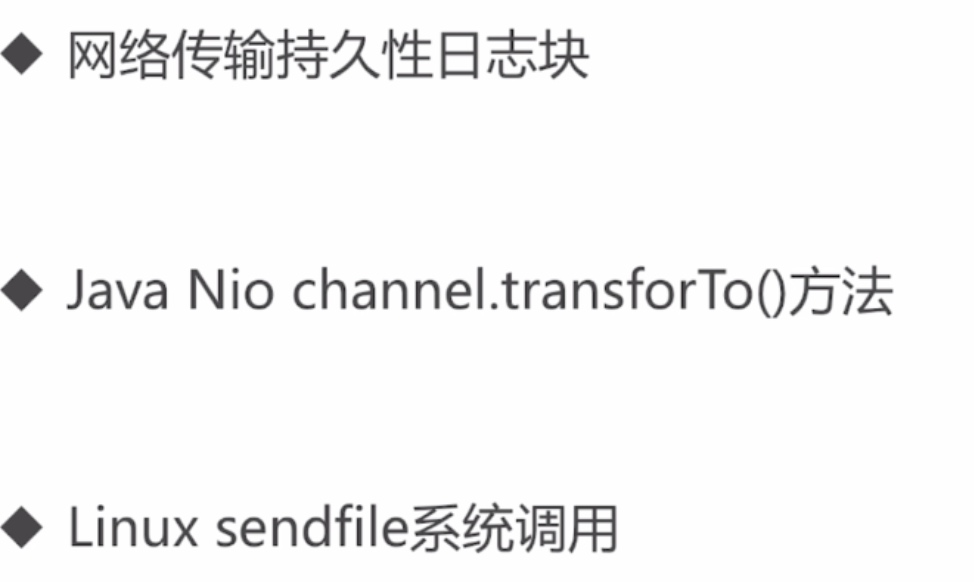
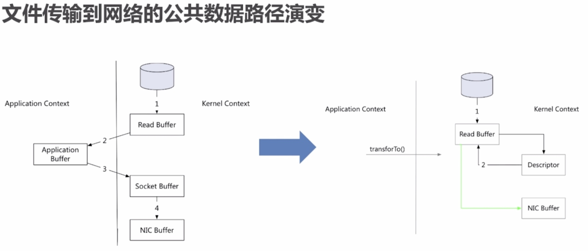

# kafka基本知识点
关键词：producer、consumer、broker、topic、partition、replication、replicationManager
[TOC]
## partition
1. partition：每一个topic被切分成多个partitions，partition是物理概念，而topic是逻辑概念，即producer发送主题消息到partiotion中，消费者从partition中消费消息。
2. broker group中的每个broker保存topic的一个或者多个partitions。也就是说，一个partition不会被多个broker同时保存；如果partition比较大，则多个broker可以共同维护这个partition，汇集起来才是全量数据，而不是每个broker有这个partition的全量数据。
3. 不同topic可以有不同数量的分区，可以在创建topic时指定分区数量。
4. 默认的分区策略：
    * 如果在发送消息时指定了分区，则消息会投递至指定的分区
    * 如果没有指定分区，但是消息的key不为空，则基于key的哈希值进行选择分区
    * 如果既没有指定分期，且消息的key为空，则轮询选择一个分区
4. 消费者是以组的名义订阅主题；同一时刻，一条消息只能被同一个组中的一个消费者进行消费；一个消费者读取topic的一个或者多个partition；每个分区只能从属于组中的一个消费者，不可能出现组中的两个消费者负责同一个分区。
5. 分区数 > 消费者数，则一个消费者会负责多个分区；
   分区数 = 消费者数，一个消费者负责一个分区，最理想的情况；
   分区数 < 消费者数，存在部分消费者数空闲的，不会负责任何分区；

## replication
* 当集群中有broker挂掉后，其他的broker可以继续提供服务；（冗余做到高可用）
* topic默认的replication系数为1，可以在创建topic时单独设置
* replication的基本单位是topic的partitin
* leader负责读和写，并同步数据到followers，followers是备份的
* 增加容错性和可扩展性

## kafka基本结构

## kafka消息结构

offset：消息所处的偏移位置
length：消息的长度
crc32:校验信息的完整性，只会对后面的部分进行校验，因为消息在到达broker后，offset会被重写，避免无用的计算开销。
## kafka特点
* 分布式
   1. 多分区：吞吐量
   2. 多副本：容错性和扩展性
   3. 多订阅者
   4. 基于zookeeper，负责存储元数据信息，如broker信息、offset等信息；具体的消息内容存在broker磁盘
* 高性能
   1. 高吞吐量：每秒几十万的高并发
   2. 低延迟：
   3. 高并发
   4. 时间复杂度O(1)
[为什么kafka那么快](https://mp.weixin.qq.com/s?__biz=MzIxMjAzMDA1MQ==&mid=2648945468&idx=1&sn=b622788361b384e152080b60e5ea69a7#%23)

* 持久性和扩展性
    1. 数据可持久化
    2. 容错性
    3. 支持在线水平扩展：broker或者topic有一个或者多个partition；consumer group的设计，组内的变动对整体kafka影响较小；增加新的机器；
    4. 消息自动平衡

## kafka应用场景
1. 消息队列
2. 行为跟踪：比如将用户浏览的行为发送到topic中，消费者进行处理
3. 元信息监控
4. 日志收集
5. 流处理
6. 事件源
7. 持久性日志（commit log）

## kafka事务
### 数据传输的事务定义
最多一次：消息不会被重复发送，最多传输一次，也有可能不传输；
最少一次：消息不会被漏发送，最少传输一次，要求消费者端做幂等；
只有一次：不会漏传输也不会重复传输，每个消息仅被传输一次；
### 事务保证
* 内部重试问题：procedure幂等处理（kafka内部超市或者失败，会进行重试，内部已经做好幂等）
* 多分区原子写入：即保证一个topic的所有分区的消息写入是原子性操作

* 避免僵尸实例：

## 零拷贝

文件传输到网络的公共数据路径
1. 操心系统将数据从磁盘读入到内核空间的页缓存
2. 应用程序将数据从内核空间读入到用户空间的缓存中
3. 应用程序将数据写回到内核空间的socket缓存中
4. 操作系统将数据从socket缓冲区复制到网卡缓冲区，以便将数据从网络发出

零拷贝过程--内核空间和用户空间无拷贝过程
1. 操作系统将数据从磁盘空间读入到内核空间的页缓存
2. 将数据的位置和长度的信息的描述符增加至内核空间（socket缓冲区）
3. 操作系统将数据从内核拷贝到网卡缓冲区，以便将数据从网络发出

## 问题
1. 如果多个消费者负责同一个分区？
    重复消费+无法保证同一个partition的顺序）
2. kafka原理？index谁负责维护？
3. kafka高吞吐量原因？
4. kafka为什么那么快？
