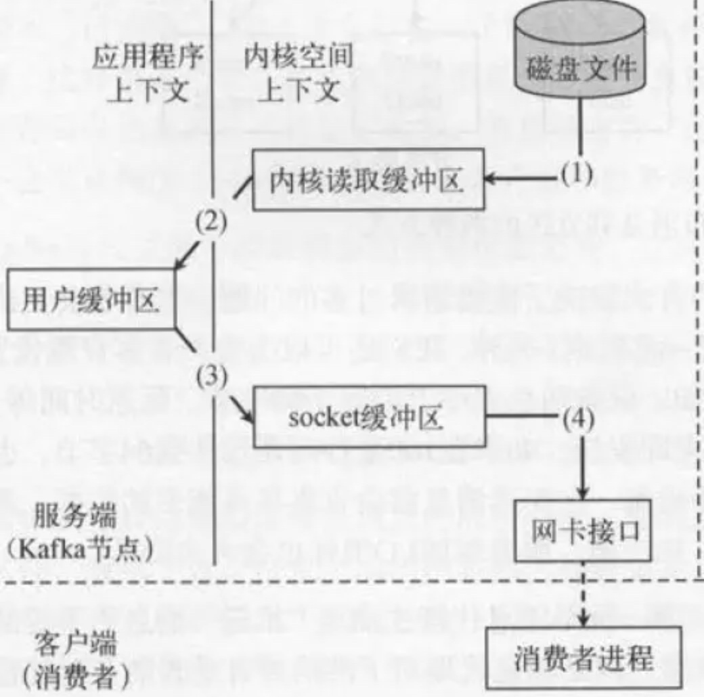
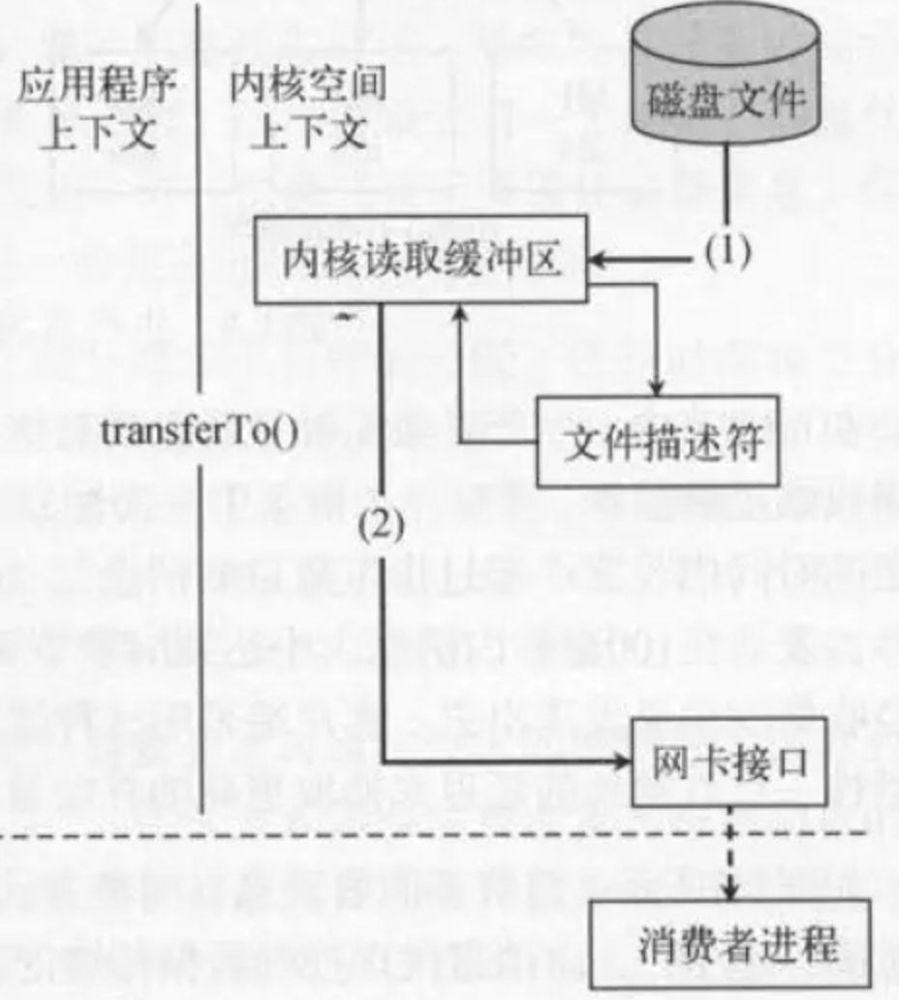

[TOC]
# 为什么Kafka这么快
[参考1-比较全面](https://www.jianshu.com/p/cbe0ae576266)
1. 批量处理消息：客户端采用了双线程模式：主线程和sender线程，主线程负责将消息存入客户端缓存，sender线程负责从缓存中发送消息，这个缓存可以将多个消息聚合为一个批次进行发送，减少网络调用。通过batch.size控制，producer会尝试批量发送属于同一个partition的消息以减少请求的数量. 这样可以提升客户端和服务端的性能. 默认大小是16348 byte (16k)。发送到broker的请求可以包含多个batch, 每个batch的数据属于同一个partition。
2. 顺序写盘：Kafka采用了文件追加的方式来写入消息，即只能在日志文件(partition就是文件)的尾部追加消息，不允许修改已写入的消息。对于顺序写盘，节省了寻道时间(磁头移动到对应的磁道)，而随机写需要每次重新进行寻道和旋转延迟的时间。因为不允许删除或者修改数据，所以每个消费者对每个topic都有一个offset来表示读取到了第几条数据，这个offset会保存在zk中。kafka提供两种策略删除数据，一是基于时间，二是基于分区文件大小。
3. 页缓存：将磁盘中的数据缓存到内存中，把对磁盘的访问变成内存访问，减少对磁盘IO操作。Kafka中大量使用了页缓存，消息都是先写入页缓存，然后由操作系统负责具体刷盘。Kafka的数据并不是实时的写入硬盘，它充分利用了现代操作系统分页存储来利用内存提高I/O效率。(Memory Mapped Files:内存映射文件，它的工作原理是直接利用操作系统的Page来实现文件到物理内存的直接映射。完成映射之后你对物理内存的操作会被同步到硬盘上（操作系统在适当的时候）。写到mmap中的数据并没有被真正的写到硬盘，操作系统会在程序主动调用flush的时候才把数据真正的写到硬盘。Kafka提供了一个参数——producer.type来控制是不是主动flush，如果Kafka写入到mmap之后就立即flush然后再返回Producer叫同步(sync)；写入mmap之后立即返回Producer不调用flush叫异步(async))
4. 零拷贝：Kafka使用了Zero Copy技术提升了消费的效率。
    消费者从kafka读取消息时，需要将磁盘文件的内容通过网络发送给消费者，传统的读取文件并发送到网络的流程如下：
    1. 操作系统将数据从磁盘文件读取到内核空间的页面缓存；
    2. 应用程序将数据从内核空间读取到用户空间的缓冲区；
    3. 应用程序将读取的数据写回内核空间并放入socket缓冲区；
    4. 操作系统将数据从socket缓冲区复制到网卡，然后通过网络发送；
    
而对于零拷贝而言，避免了数据从内核空间拷贝到用户空间再拷贝到内核空间这一过程，减少了cpu在内核和用户模式的上下文切换，只需要在内核空间中将磁盘数据直接传输给socket，而不需要通过应用程序传输。

1. 在内核空间中，将磁盘文件的数据读取到页面缓冲区(kernel buffer)；
2. 将数据拷贝到socket buffer中；（后来对该步骤进行优化，不需要拷贝，直接在socket buffer中追加当前要发生的数据在kernel buffer的位置和偏移量即可，又减少了一次copy）
3. 最后将socket buffer中的数据通过网卡传输出去；
通过零拷贝技术，将上下文切换的次数从4次减少到2次，数据copy的次数从4次减少到3次。