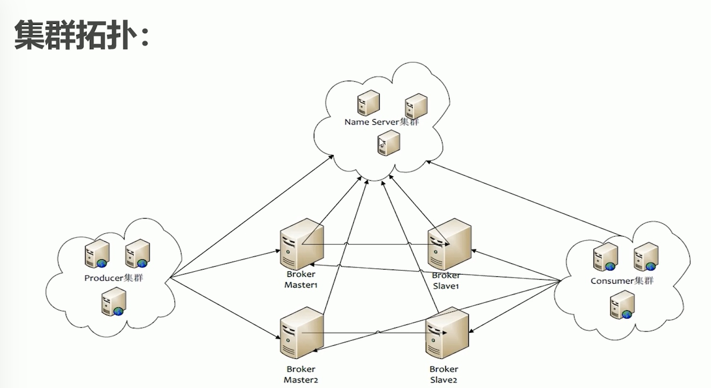

[TOC]
# 衡量MQ的指标
服务性能：并发，延迟，消息堆积，吞吐量
数据存储：
集群架构：
# 常见的MQ
1. Active Mq：在中小型企业应用广泛，高并发场景下性能表现一般；

利用zookeeper实现主备切换，从而达到高可用；
2. Kafka：基于Pull模式来消费消息，追求高吞吐量，适合产生大量数据的互联网服务的数据收集业务，如日志；
   
3. RocketMq：高吞吐量、高可用性、适合大规模分布式系统应用的特点；rocketMq思路起源于kafka，对消息的可靠传输及事务性做了优化，目前在阿里集团被广泛应用于交易、充值、流计算、消息推送、日志流处理、binglog分发等场景；

使用NameServer代替zk，做分布式协调；一些高级的功能需要收费才能使用，如分布式事务、主从自动切换等；
4. RabbitMq：erlang语言开发的开源消息队列系统，基于AMQP协议来实现。AMQP主要是面向消息、队列、路由（点对点和发布/订阅）、可靠性、安全。适应于对数据一致性、稳定性和可靠性（数据100%不丢失）要求很高的场景，对性能和吞吐量的要求在其次。

#为什么选RabbitMq
1. 开源，性能好，稳定性保障
2. 提供可靠性消息投递模式（confirm），返回模式（return）
3. 与springAMQP完美的整合，API丰富
4. 集群模式丰富，表达式配置，HA模式，镜像队列模型
5. 保证数据不丢失的前提做到高可靠性、可用性

# RabbiMq高性能的原因
1. Erlang语言最初用于交换机领域的架构模式，这使得RabbiMq在broker之间进行数据交互的性能是非常优秀的；
2. Erlang优点：erlang有着和原生socket一样的延迟；
3. erlang高并发，最小的执行单元为轻量级进程，每个进程都有垃圾回收器，那么当一个进程进行垃圾回收时不会影响到其他的进程；

# AMQP协议
高级消息队列协议，是一个提供统一消息服务的应用层标准高级消息队列协议，是应用层协议的一个开放标准，为面向消息的中间而设计。

# 消息如何流转
生产者将消息发送到exchange，exchange会根据routing-key将消息路由至指定的queue，消费者从queue上消费消息。
# 代码
1. 创建连接工厂ConnectionFactory
2. 通过连接工厂创建连接Connection
3. 通过Connection创建Channel
4. 生产者通过channel发送消息，消费者通过channel声明队列，创建consumer，消费消息
5. 关闭channel Connection

生产者如果在发送消息时未指定exchange，那么会指向默认的exchange-AMQP default，该exchange会将消息路由至与routing-key同名的queue，如果找不到合适的queue，那么会删除该消息。

# vhost
逻辑隔离，最上层的消息路由；
同一个vhost内的exchange和queue名称不能重复；
可以用来区分环境，比如生产、测试和开发环境使用不同的vhost；也可以用来做权限控制，比如有些vhost对外提供出去，这样不会暴露其他vhost内的exchange和queue；
# 队列
队列属性：
exclusive-是否排他，只对首次声明该队列的连接可见，且该客户端连接断开时，队列自动删除，不管是否设置为durable。即，当消费者是一个集群时，仅有一个消费者能够消费该队列，能够保证消息消费的顺序。
autoDelete-当队列没有被用到，如未和exchange绑定，那么该队列会自动删除。当最后一个监听被移除，该queue会被自动删除；
durable-持久化队列，即使服务器重启，队列也不会删除。

# Exchange
接收消息，并根据路由键转发消息至所绑定的队列；
属性：
1. type-direct、topic、fanout、headers
2. durability-是否需要持久化
3. name-交换机名称
4. auto delete-当最后一个绑定到exchange上的队列删除后，会自动删除该exchange
5. internal-当前exchange是否用于rabbitmq内部使用，默认false

## Direct Exchange（点对点）
所有发送至direct exchange的消息会被转发至routingKey中指定的queue；
需要将exchange和queue通过routingKey进行绑定；
注意：Direct模式可以使用rabbitMq自带的exchange-default exchange，所以不需要将exchange进行任何绑定操作，消息传递时，routingKey必须完全匹配才会被队列接收，否则会被丢弃。（routingKey=queueName）
多个队列可以采用相同的bindingKey和交换机绑定。（路由key在fanout 交换机时失效）

## Topic Exchange（组播）
所有发送至Topic Exchange的消息被转发到所有关心routingKey中指定topic的queue上；
exchange通过routingKey和queue进行绑定，该routingKey支持模糊匹配；

## Fanout Exchange（广播）
不处理路由键，只需要简单的将队列绑定至交换机上；
消息会被转发至与该exchange绑定的所有队列上；
fanout交换机转发消息是最快的，不需要匹配路由；

# headers
headers类型的Exchange不依赖于Routing Key与Binding Key的匹配规则来路由消息，而是根据发送的消息内容中的headers属性进行匹配。
在绑定Queue与Exchange时指定一组键值对；当消息发送到Exchange时，RabbitMQ会取到该消息的headers（也是一个键值对的形式），对比其中的键值对是否完全匹配Queue与Exchange绑定时指定的键值对。如果完全匹配则消息会路由到该Queue，否则不会路由到该Queue。

