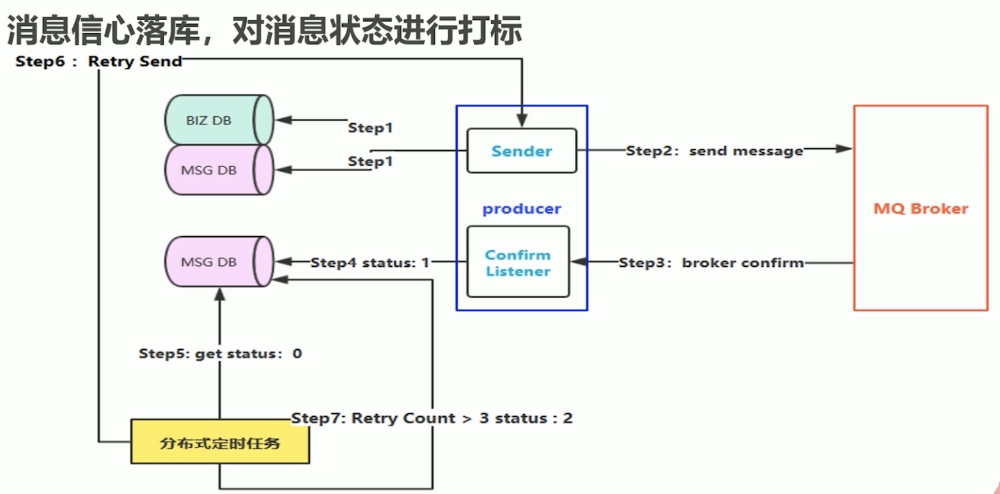
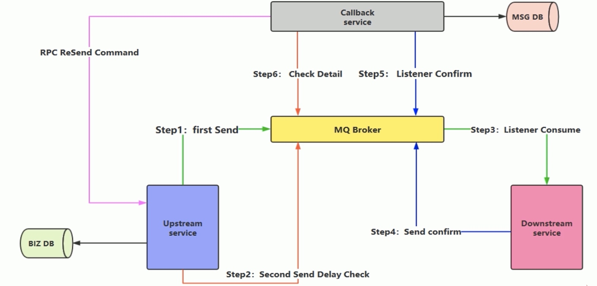
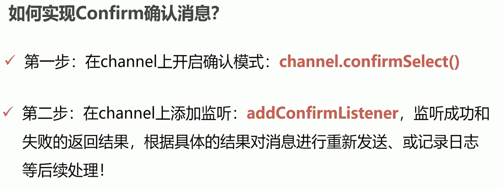
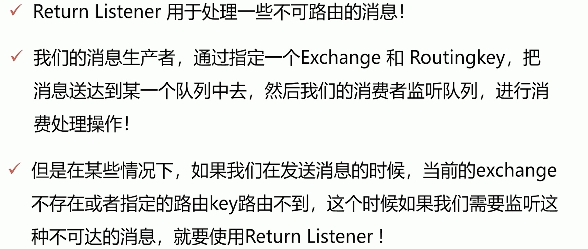
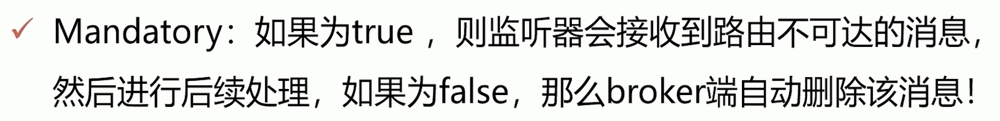
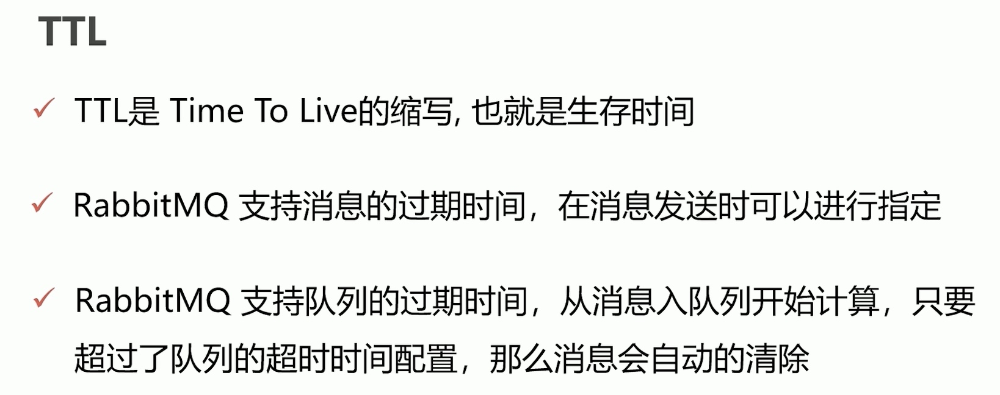

[TOC]
# 消息如何保证100%的投递成功？
## 生产端的可靠性投递
保障消息的成功发出
保障MQ节点的成功接收
发送端收到MQ节点（broker）确认应答
完善的消息补偿机制（防止因网络问题的因素影响）
### 解决方案
1. 消息落库，对消息状态进行打标（最大努力重试次数限制）

缺点：在高并发场景下，DB的操作可能会成为瓶颈。
2. 消息的延迟投递，做二次确认，回调检查
（业务消息先落库，再发mq，不需要分布式事务，性能太差）

step1和step2是将消息投递至不同的队列；生产者会生产出两条消息，一条是核心流程发送，另外一条是做延迟投递（如5分钟后投递）；消费者消费完消息后，需要向队列中发送消费ok的消息，供callBack service进行闭环；
在核心业务流程中，减少不必要的数据库操作（MSG DB），提高性能；新增一个callBack service，与核心流程无关，负责msg的检查及落库操作，如果延迟投递的消息未收到消费者的回调确认，那么会通知生产者重新发送一次消息；如果已经收到了消费者的确认，那么不做任何处理；
个人理解：延迟投递可以采用延迟定时任务来完成，但是依然会占用生产者的资源，因此主要看瓶颈是在服务器资源还是db操作；====》更好的做法：callBack service可以完全解耦核心流程业务，也可以单独部署，因此，producer发送消息时可以同时投递给业务队列和callBack service的队列，callBack service收到消息后，可以先将消息落库，然后等待消费者的回调消息，也进行落库；定时钟扫描两部分消息进行对比，如果指定时间内缺失，那么重发即可。
延迟投递无法保证100%投递成功的！因为消息如果都丢失了，那么callBack service是无法感知的！但是在高并发场景下，能够减少db的操作。

# 消费端-幂等性保障
幂等性：执行一次的结果和执行多次的结果是一样的。
## 方案
* 唯一ID + 指纹码机制，利用数据库主键去重
指纹码是与业务相关的标识，select count(1) from tb_order where id = 唯一ID+指纹码，
优点：实现简单
缺点：高并发时，数据库写入的性能瓶颈
解决方案：根据ID进行分库分表进行算法路由(对ID进行hash)，多库分担了单库的压力
* 利用redis的原子性实现，唯一ID存储在redis中
考虑的问题：
    1. redis中保存了唯一的标识，后续是否对该数据进行落库，如果落库，还需要解决数据库和缓存的一致性问题；
    2. 如果不进行落库，那么都存储在缓存中，如何设置定时同步的策略？数据最终都需要进行持久化；
* 白条的做法
    数据库层面采用唯一索引，利用重复主键冲突异常实现幂等。但是这样性能会比较低，因此在进行数据库操作前会加一层分布式锁(redis/zk)，这样可以解决加锁这个短时间内的幂等问题。

# 生产者->broker的可靠性   
rabbitmq为生产者发送消息到mq broker提供了可靠性的保证机制，主要有confirm和return。其中，confirm是为了解决rabbitmq事务机制性能开销大而提出的方案，其是异步发送的，生产者不需要同步等待mq broker的回调消息就可以继续发送下一条消息。
## Confirm确认消息
生产者投递消息后，如果broker收到消息，则会给生产者一个应答；生产者接收应答，用来确认这条消息是否正常的发送到broker，这种方式也是消息可靠性投递的核心性保障！
rabbitmq只能够保证消息投递到broker后的可靠性！！！生产者到mq broker的可靠性投递需要生产者自己处理！

## Return消息机制



# 消费端限流
场景：MQ服务器有上万条未处理的消息，这时随便打开一个消费者客户端，如果巨量消息全部推送过来，显然单个客户端是无法同时处理这么多数据的！
解决：rabbitmq提供了一种QOS(服务质量保证)的功能，即在非自动确认消息的前提下，如果一定数目的消息(通过基于consumer或者channel设置Qos的值)未被确认前，不进行消费新的消息。
```java
/**消费者端使用*/
void BasicQos(unit prefetchSize, ushort prefetchCount, bool global);
```
prefetchSize：消息的大小，0表示不做限制；
prefetchCount：MQ一次给消费推送消息的最大个数；一旦有N个消息还没有ack，则该consumer将阻塞住，直至有消息ack；一般设置为1；
global：false则在consumer上做限流，true则在channel上做限流，一般为false；

# 手动ACK和NACK
自动ACK的问题：
1. mq broker只要确认消息发送成功，无需等待应答就会自动丢弃消息，如果此时消费端还未处理完成，异常或者断电，那么会丢失消息；
2. 自动ACK无法根据消费者的处理能力来发送mq消息，如果消息数量比较多，可能打垮消费者；

手动进行ACK，在业务处理完成后发送ack给mq broker；
消费端必须保证回调ACK给broker，不能因为业务异常导致无法发送ACK。一般在finally中进行回调ACK。业务异常可以通过日志记录，然后进行补偿。
如果由于服务器宕机等严重问题，需要手动进行ACK保障消费端消费成功。如果消费者机器突然宕机了，那么可能无法回复ack。对于未ack的消息，mq broker不会丢弃，而是保存在unacked消息中，当消费端重新进行连接时，这些消息会变为ready状态，可以重新发送这些消息了。

NACK机制会将消息放到队列头部从而再次进行消费消息，因此需要注意，使用NACK时需要格外注意，最好在第一次处理失败时才会重回队列，而不是一直重回队列，否则会导致消费端一直处理异常消息，死循环。
一般都会设置为false，不使用NACK。

# TTL队列/消息


# 死信队列
DLX：Dead-Letter-Exchange
当消息在一个队列中变成死信后，会被重新publish到另外一个exchange，这个exchange就是DLX。
什么时候变为死信：
1. 消息被拒绝(basic.reject/basic.nack)并且requeue=false；
2. 消息ttl过期；
3. 队列达到最大长度（队列头部消息会成为死信）

将任何队列的属性设置一个死信队列，那么当这个队列中有死信时，会自动将这个消息重新发布到设置的exchange中，进而被路由到另一个队列。