[TOC]
# Erlang
Erlang是一种通用的面向并发的编程语言，其运行时系统内置了对并发、分布式和容错等处理；Erlang仅仅能够在具有相同的magic cookie系统之间进行通信。每一个Erlang VM都叫做一个节点Node，当两个或多个Node都知道对方后，这就形成了一个集群Cluster。Erlang集群默认情况下是完全连接的，即Erlang集群中的每个节点都知道其他节点，并且能够相互通信。因此，在Erlang集群中通常只会有几十个节点，不会有几百个或更多的节点，因为完全连接的网络中，节点越多，保持节点之间的通信开销越大。但是可以通过某个特殊的节点将多个cluster连接成一个更大的cluster，这样的cluster不是完全连接的，cluster之间是通过这个特殊的节点进行连接。
# 原理
[rabbitmq集群原理](https://www.jianshu.com/p/6376936845ff)
## 说明
RabbitMQ这款消息队列中间件产品本身是基于Erlang编写，Erlang语言天生具备分布式特性（通过同步Erlang集群各节点的magic cookie来实现）。因此，RabbitMQ天然支持Clustering。这使得RabbitMQ本身不需要像ActiveMQ、Kafka那样通过ZooKeeper分别来实现HA方案和保存集群的元数据。集群是保证可靠性的一种方式，同时可以通过水平扩展以达到增加消息吞吐量能力的目的。
集群中每个节点都会保存其他节点的元数据信息(交换机/队列/vhost/绑定关系等)，而队列的完整数据只会存在于创建它的所在的那个节点，其他节点只知道这个队列的元数据信息和这个queue所存在的节点的指针。(如果每个节点都完整的保存其他节点的数据，那么会有木桶效应，且无法通过增加MQ机器扩展容量)
用户访问集群中任意一个节点时，通过rabbitmqctl查询到的queue/user/exchange/vhost等信息都是相同的。

集群中节点分类：
* 磁盘节点
    将元数据信息存储在磁盘中，单节点要求必须是磁盘节点，集群中要求至少有一个磁盘节点；
* 内存节点
    将所有队列、交换机、绑定、用户等元数据信息保存在内存中，优点是可以使得交换机和队列的声明操作更快；
    
集群要求至少有一个磁盘节点，那么当其他内存节点发生故障了或离开集群，只需要通知磁盘节点进行元数据更新即可，但是如果唯一的磁盘节点也发生故障了，那么集群只能继续路由消息，不能执行创建队列/交换机等操作，因为这些操作需要将元数据信息保存到磁盘中，但是磁盘节点挂了，所以无法执行；因此，集群中可以有两个磁盘节点，这样当其中一个磁盘节点故障了，集群仍然可以保持运行，并且能够任何时候保存元数据变更。

默认的集群模式只是在各个节点复制了其他节点中的元数据信息，无法保证队列的高可用性，因为队列的内容不会复制。通过镜像队列实现了某个节点挂了，但是依然能够对外提供服务的高可用功能。(如果没有镜像队列，那么节点挂了后，队列中的消息如果没有持久化则丢失，且当前节点的队列无法对外提供服务了)
镜像队列的主队列(master)依然存在于一个节点上，其余从主队列拷贝的队列叫从队列(slave)。如果主队列没有发生故障，那么其工作流程依然跟普通队列一样，当发布消息时，消息依然是路由至主队列中，而主队列通过组播机制，将消息同步至从队列中；一旦主队列发生故障，那么集群就会从最老的一个队列选举为新的主队列，这就实现了队列的高可用。

## 镜像队列
[镜像队列源码解析](https://www.jianshu.com/p/f917067bcee3)
1. 对于镜像队列，当发布消息时，该操作会同步到所有节点，而其他操作则都是通过master进行中转。比如，客户端和slave节点建立了TCP连接，首先是slave将get请求发送master，由master准备好数据返回给slave，投递给消费者。
2. 镜像队列中最后一个停止的节点会是master，启动顺序必须是master先启动，如果slave先启动，它会有30s的等待时间，等待master启动后，然后加入cluster。
3. 当slave宕掉时，除了与slave相连的客户端连接全部断开之外，没有其他影响。当master宕掉时，会有以下连锁反应：1)与 master相连的客户端连接全部断开。2)选举最老的slave为master。若此时所有slave处于未同步状态，则未同步部分消息丢失。3)新的 master节点requeue所有unack消息，因为这个新节点无法区分这些unack消息是否已经到达客户端，亦或是ack消息丢失在到老 master的通路上，亦或是丢在老master组播ack消息到所有slave的通路上。所以处于消息可靠性的考虑，requeue所有unack的消 息。此时客户端可能受到重复消息。4)如果客户端连着slave，并且basic.consume消息时指定了x-cancel-on-ha- failover参数，那么客户端会收到一个Consumer Cancellation Notification通知，Java SDK中会回调Consumer接口的handleCancel()方法，故需覆盖此方法。如果不指定x-cancel-on-ha-failover参 数，那么消费者就无法感知master宕机，会一直等待下去。
4. 镜像队列有主从之分，一个主节点(master)，0个或多个从节点(slave)。当master宕掉后，会在slave中选举新的master。选举算法为最早启动的节点。
5. 当所有slave都在（与master）未同步状态时，并且ha-promote-on-shutdown设置为when-synced(默认)时，如果master因为主动的原因停掉，比如是通过rabbitmqctl stop命令停止或者优雅关闭OS，那么slave不会接管master，也就是此时镜像队列不可用；但是如果master因为被动原因停掉，比如VM或者OS crash了，那么slave会接管master。这个配置项隐含的价值取向是保证消息可靠不丢失，放弃可用性。如果ha-promote-on-shutdown设置为always,那么不论master因为何种原因停止，slave都会接管master，优先保证可用性。
6. 镜像队列不能作为负载均衡使用，因为每个操作在所有节点都要做一遍。
7. 当slave宕掉了，除了与slave相连的客户端连接全部断开之外，没有其他影响。
8. 当master宕掉时，会有以下连锁反应：
    1. 与master相连的客户端连接全部断开；
    2. 选举最老的slave节点为master。若此时所有slave处于未同步状态，则未同步部分消息丢失；
    3. 新的master节点requeue所有unack消息，因为这个新节点无法区分这些unack消息是否已经到达客户端，亦或是ack消息丢失在老的master的链路上，亦或者是丢在master组播ack消息到所有slave的链路上。所以处于消息可靠性的考虑，requeue所有unack的消息。此时客户端可能有重复消息；
    4. 如果客户端连着slave，并且Basic.Consume消费时指定了x-cancel-on-ha-failover参数，那么客户端会受到一个Consumer Cancellation Notification通知，Java SDK中会回调Consumer接口的handleCancel方法，故需覆盖此方法。如果未指定x-cancal-on-ha-failover参数，那么消费者就无法感知master宕机，会一直等待下去。
9. 配置镜像队列时有一个属性ha-sync-mode，支持两种模式 automatic 或 manually 默认为 manually。当 ha-sync-mode = manually，新节点加入到镜像队列组后，可以从左节点获取当前正在广播的消息，但是在加入之前已经广播的消息无法获取，所以会处于镜像队列之间数据不一致的情况，直到加入之前的消息都被消费后，主从镜像队列数据保持一致。当加入之前的消息未全部消费完之前，主节点宕机，新节点选为主节点时，这部分消息将丢失。当 ha-sync-mode = automatic，新加入组群的 Slave 节点会自动进行消息同步，使主从镜像队列数据保持一致。

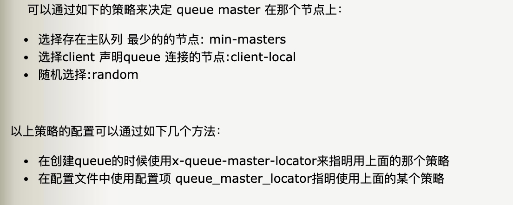

# 集群架构
RabbitMQ 本身是基于 Erlang 编写的，Erlang 天生支持分布式（通过同步 Erlang 集群各节点的 cookie 来实现），因此不需要像 ActiveMQ、Kafka 那样通过 ZooKeeper 分别来实现 HA 方案和保存集群的元数据。
## 主备模式
实现RabbitMQ的高可用集群，一般在并发和数据量不高的情况下使用；主备模式不同于主从模式，主备模式下，主节点提供读写，备节点不提供任何读写，只是一个备份功能，当主节点挂了，备节点会作为主节点继续提供读写服务，故障自动切换；而主从模式下，主节点提供读写，从节点提供只读的功能；
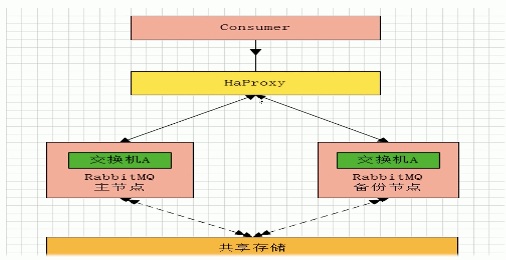
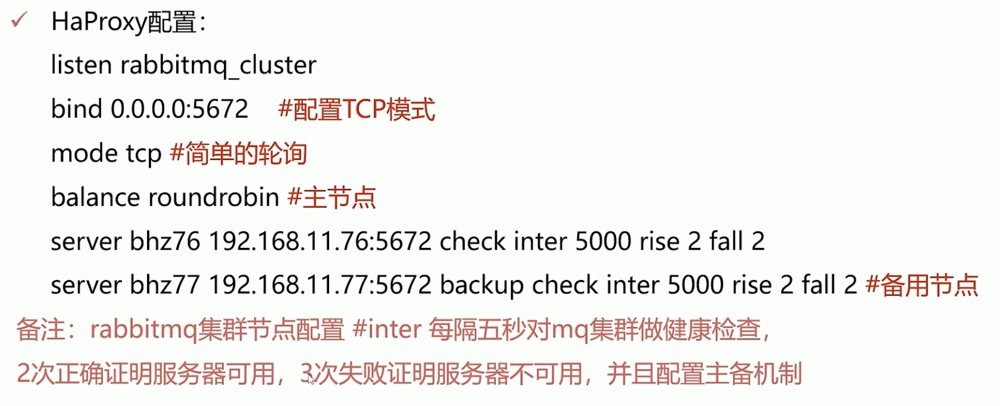
## 远程模式
远程模式(shovel)是可以实现双活的一种模式，即将消息进行不同数据中心的复制工作，可以跨地域让两个mq集群互联；
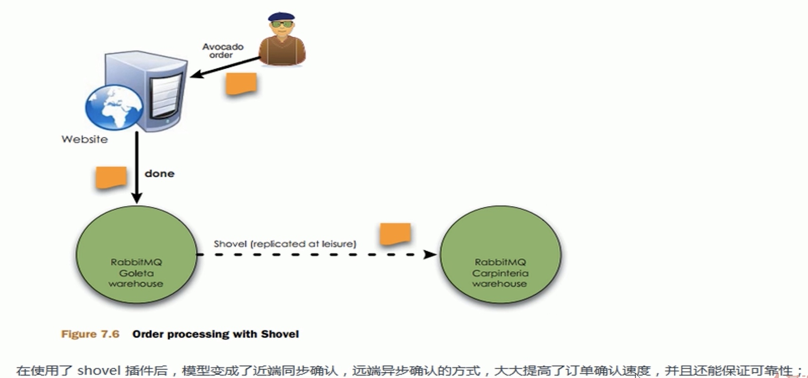
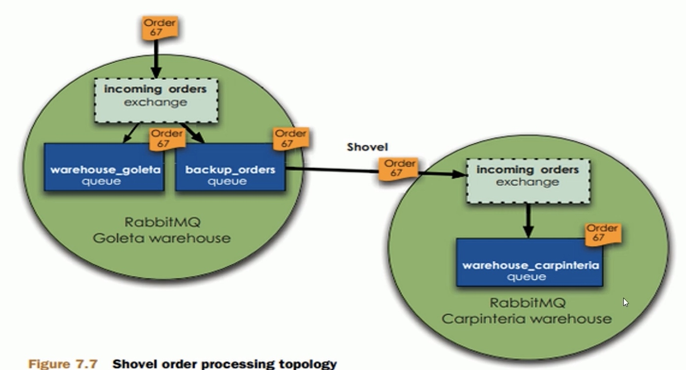
当本地的mq压力很大时，会将消息转移给远端的mq，从而分担本地mq集群的压力。现在这种模式很少使用。
## 镜像模式
* 介绍
能够保证数据100%不丢失，在实际中用的也最多，并且实现集群非常的简单，一般大厂都会用这种模式。
镜像队列，目的是为了保证rabbitmq数据的高可靠性，主要就是实现数据的同步，一般来说，2-3个节点实现数据同步(对于100%数据可靠性解决方案一般是3个节点)的集群架构如下：
 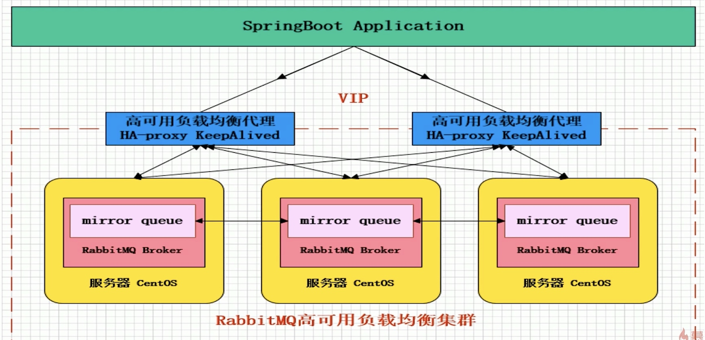
 
* 搭建：三个节点搭建镜像模式
    1. 三个节点上分别搭建单点MQ；
    2. 三个节点中选择节点1为master节点，并将master节点配置文件copy到其他两个节点；
    3. 节点2和节点3加入集群中(默认的集群名称为master节点的名称)，也可以在任意一个节点中修改集群名称；
    4. 任意一个节点上执行 设置镜像队列策略：将所有队列设置为镜像队列，即队列会被复制到各个节点，各个节点状态一致，rabbitMQ高可用集群就已经搭建好了。

    
## 多活模式
 这种模式是实现异地数据复制的主流模式，因为shovel模式配置比较复杂，所以一般来说，实现异地集群都是使用这种双活 或者 多活模型来实现。这种模型需要依赖rabbitmq的federation插件，可以实现持续的可靠的AMQP数据通信，多活模式在实际配置与应用非常的简单。
 RabbitMQ部署架构采用双中心模式(多中心)，那么在两套(或多套)数据中心中各部署一套MQ集群，各个中心的MQ服务除了需要为业务提供正常的消息服务外，中心之间还需要实现部分队列消息共享。
 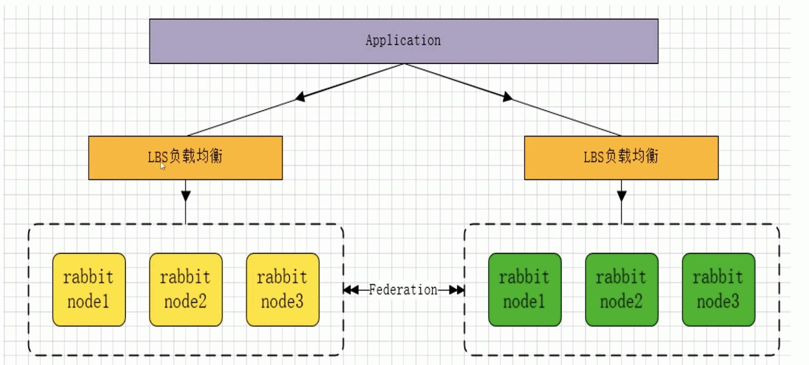
Federation插件是一个不需要构建Cluster，而在brokers之间传输消息的高性能插件，Federation插件可以在brokers或者cluster之间传输消息，连接的双方可以使用不同的users和virtual hosts，双方也可以使用不同版本的rabbitMQ和erlang。Federation插件使用AMQP协议通讯，可以接受不连续的传输。
Federation Exchanges可以看成是下游从上游主动拉取消息，但并不是拉取所有消息，必须是在下游已经明确定义绑定关系的exchange，也就是有实际的物理queue来接收消息，才会从上游拉取消息到下游。使用AMQP协议实施代理间通信，下游会将绑定关系组合在一起，绑定/解除绑定命令将发送到上游交换机。因为，federation exchange只接收具有订阅的消息。
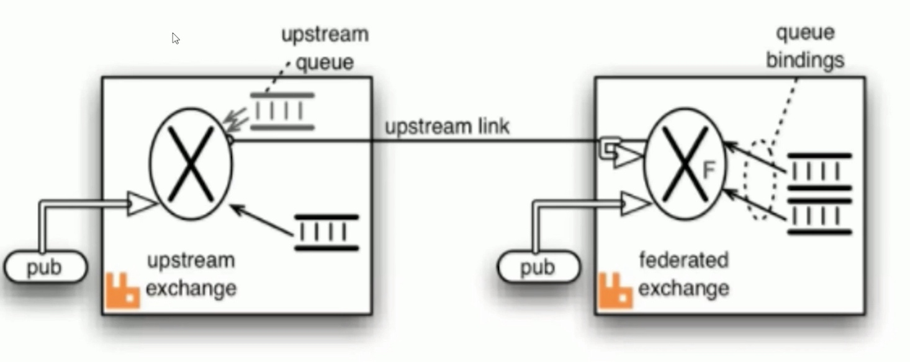

# 集群配置文件
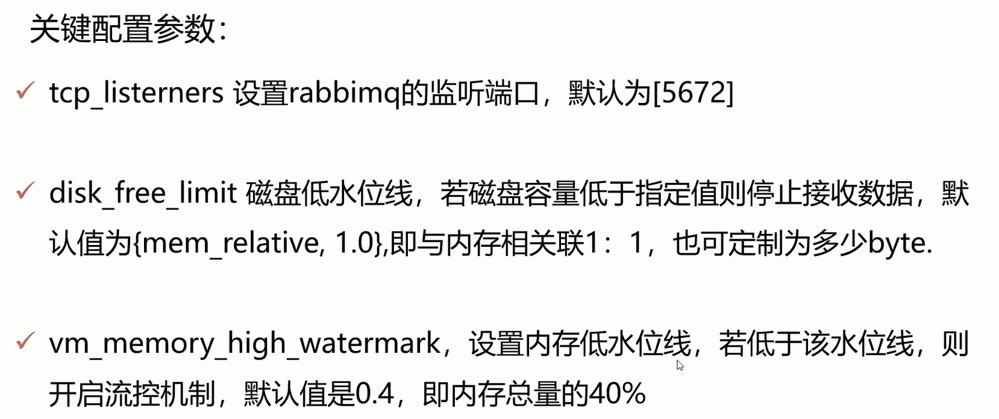
如果集群存储方式是磁盘存储，则以磁盘低水位线为准，但是如果是内存存储，则以内存低水位线为准。
 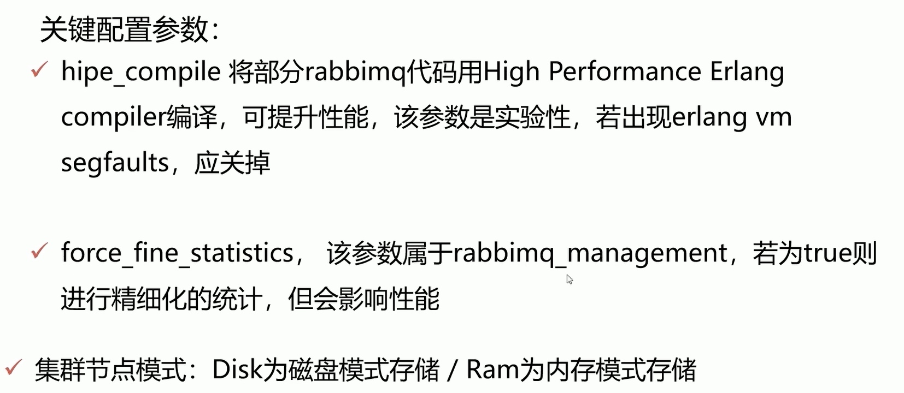

# 集群恢复与故障转移
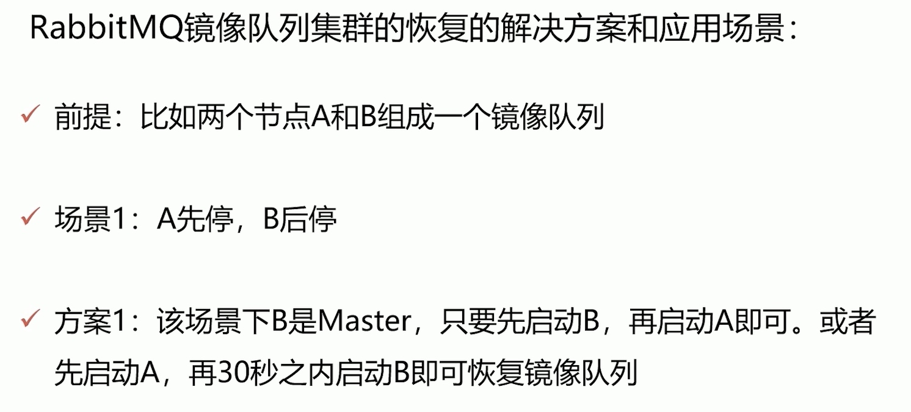

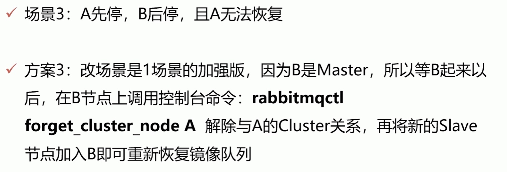
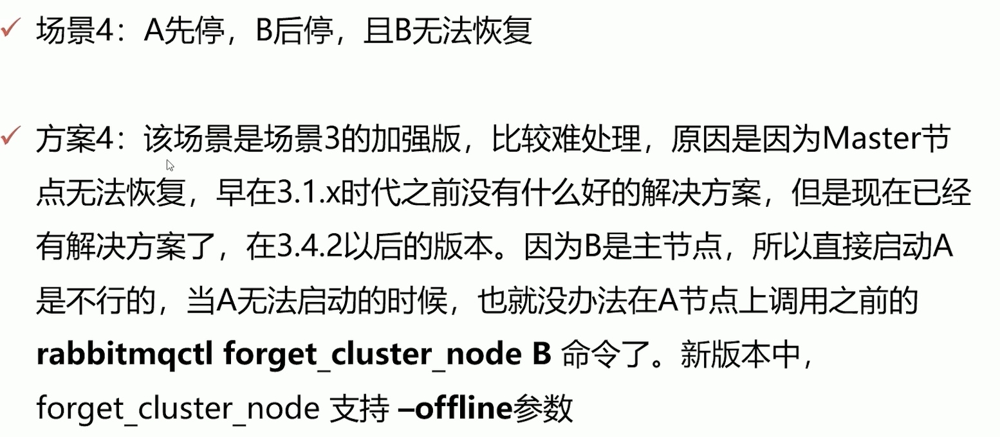
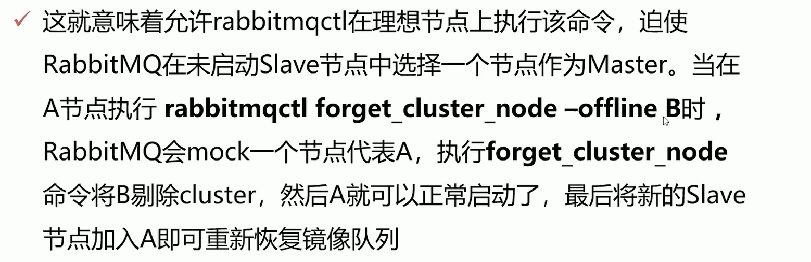
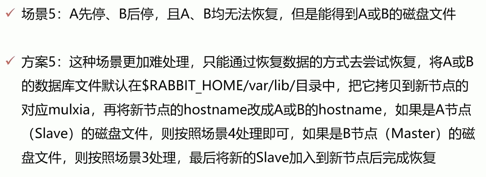

# 脑裂问题解决
RabbitMQ会将queues，exchanges，bindings等信息存储在erlang的分布式数据库Mnesia中。
如果另外一个节点在指定时间内不能连接上一个节点，那么Mnesia认为这个节点已经挂了，即使后续两个节点的网络连通，但是这两个节点都认为对方挂了，那么Mnesia此时认定发生了网络分区。
当一个集群发生网络分区时，这个集群会分成两部分（或者更多），它们各自为政，互相都认为对方分区内的节点已经挂了， 包括queues, bindings, exchanges这些信息的创建和销毁都处于自身分区内，与其他分区无关。如果原集群中配置了镜像队列，而这个镜像队列又牵涉到两个（或者多个）网络分区的节点时，每一个网络分区中都会出现一个master节点（译者注：如果rabbitmq版本较新，分区节点个数充足，也会出现新的slave节点。），对于各个网络分区，此队列都是互相独立的。当然也会有一些其他未知的、怪异的事情发生。
当网络（这里只网络连通性，network connectivity）恢复时，网络分区的状态还是会保持，除非你采取了一些措施去解决他。
未来从网络分区中恢复，首先需要挑选一个信任的分区，这个分区才有决定Mnesia内容的权限，发生在其他分区的改变将不被记录到Mnesia中而直接丢弃。

停止（stop）其他分区的节点，然后启动(start)这些节点，之后重新将这些节点加入到当前信任的分区之中。最后，你应该重启(restart)信任的分区中所有的节点，以去除告警。你也可以简单的关闭整个集群的节点，然后再启动每一个节点，当然，你要确保你启动的第一个节点在你所信任的分区之中。
rabbit对网络分区的处理策略：
（1）ignore
默认类型，不处理。
要求你所在的网络环境非常可靠。例如，你的所有 node 都在同一个机架上，通过交换机互联，并且该交换机还是与外界通信的必经之路。
（2）pause_minority
rabbitmq节点感知集群中其他节点down掉时，会判断自己在集群中处于多数派还是少数派，也就是判断与自己形成集群的节点个数在整个集群中的比例是否超过一半。如果是多数派，则正常工作，如果是少数派，则会停止rabbit应用并不断检测直到自己成为多数派的一员后再次启动rabbit应用。注意：这种处理方式集群通常由奇数个节点组成。在CAP中，优先保证了CP。
注意：pause_minority适用情形有限制，如3个节点集群，每次只down1个时，此模式适用。但如果网络都出问题，3节点会独立形成3个集群。
（3）autoheal
你的网络环境可能是不可靠的。你会更加关心服务的可持续性，而非数据完整性。你可以构建一个包含2个node的集群。
当网络分区恢复后，rabbitmq各分区彼此进行协商，分区中客户端连接数最多的为胜者，其余的全部会进行重启，恢复到同步状态。
# 延迟插件
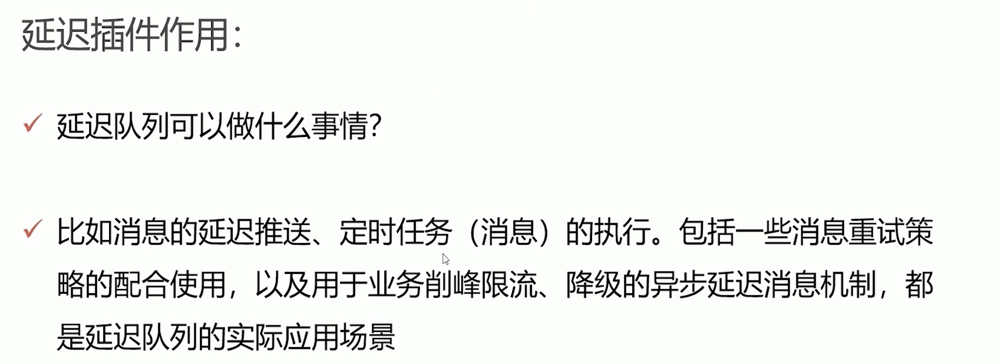
