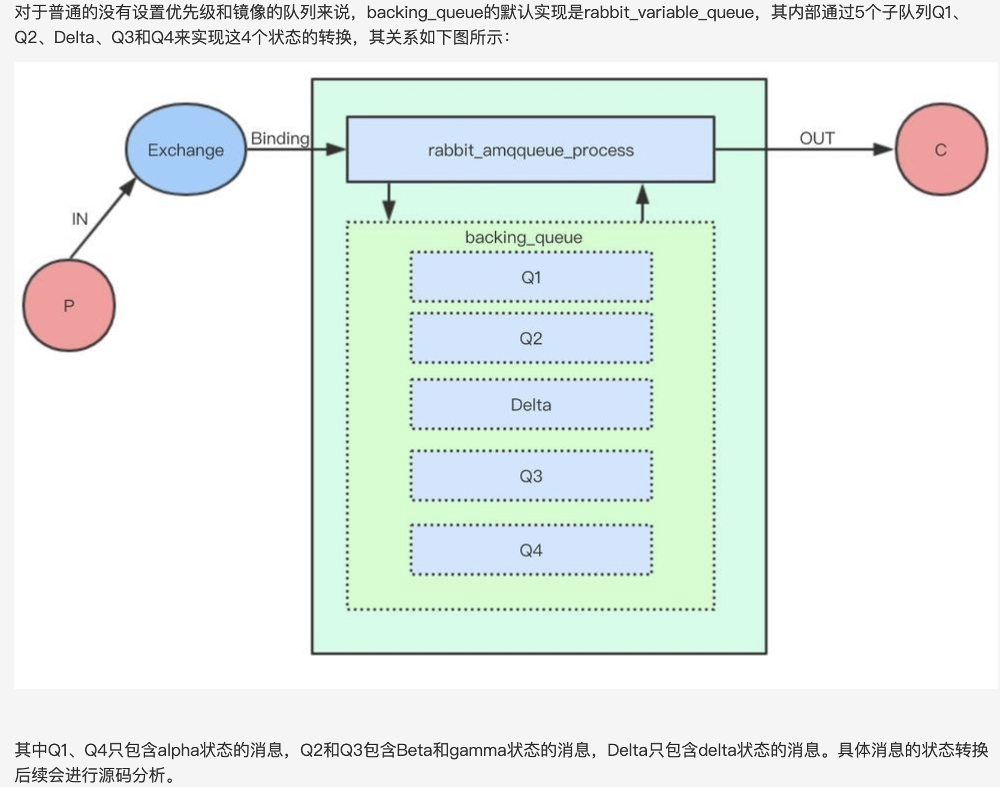
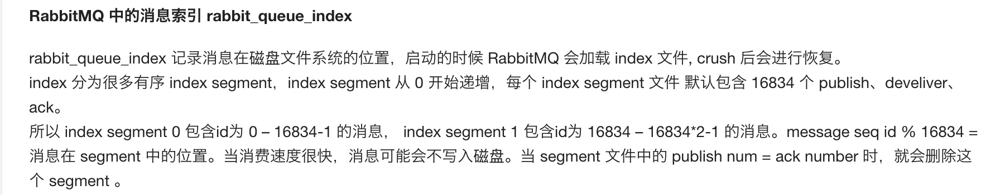
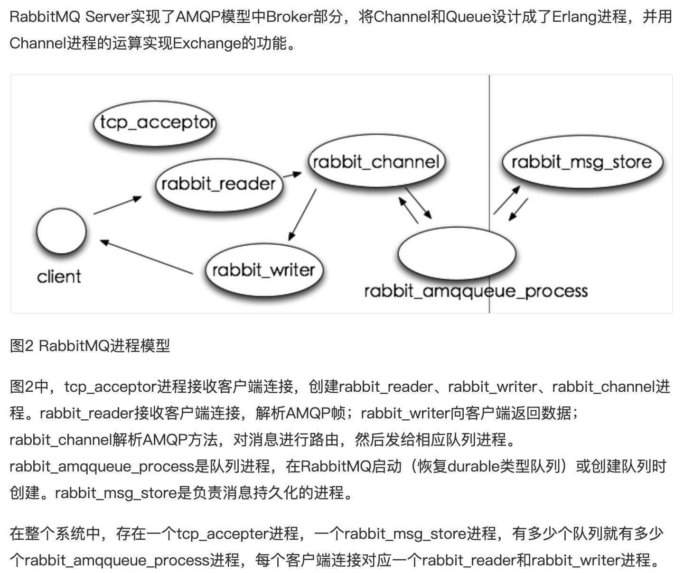
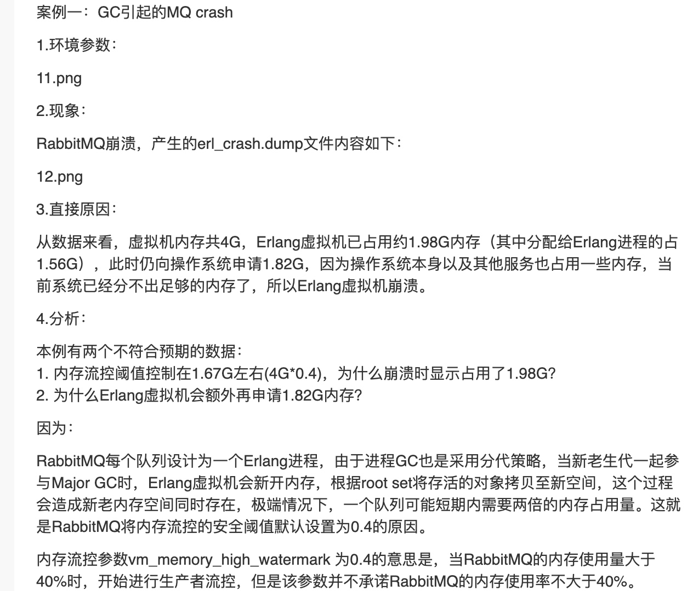
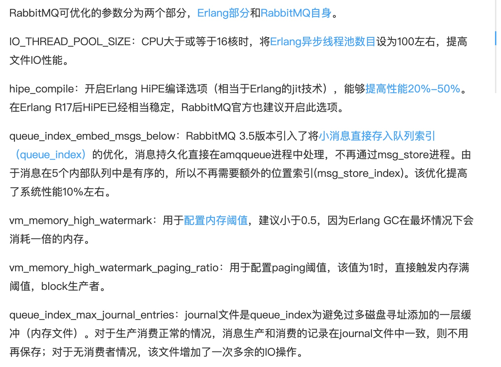
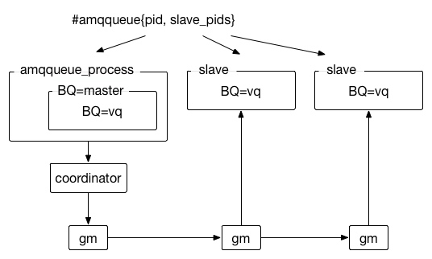

[TOC]
# 参考
[官方博客](https://www.rabbitmq.com/blog/)
[消息队列存储机制源码分析](https://sq.163yun.com/blog/article/163362787003510784)
[rabbitMQ的流控与镜像队列](http://hecenjie.cn/2019/05/08/RabbitMQ%EF%BC%9A%E9%95%9C%E5%83%8F%E9%98%9F%E5%88%97%E3%80%81/)
[存储机制和流控](https://blog.csdn.net/qq_40378034/article/details/89764446)
# 存储部分
## 消息的状态
```java
%% Definitions:
%%
%% alpha: this is a message where both the message itself, and its
%%        position within the queue are held in RAM(消息本身和消息位置索引都只在内存中)
%%
%% beta:  this is a message where the message itself is only held on
%%        disk (if persisted to the message store) but its position
%%        within the queue is held in RAM.(消息本身存储在磁盘中，但是消息的位置索引存在内存中)
%%
%% gamma: this is a message where the message itself is only held on
%%        disk, but its position is both in RAM and on disk.(消息本身存储在磁盘中，但是消息的位置索引存在内存中和磁盘中)
%%
%% delta: this is a collection of messages, represented by a single
%%        term, where the messages and their position are only held on
%%        disk.(消息本身和消息的位置索引都值存储在磁盘中)
```

## 内部队列
rabbitMQ队列由两部分组成，其中rabbit_amqqueue_process负责协议相关的消息处理，如消息的入队/出对/confirm/ack等，backing_queue主要负责持久化相关操作；


## 消息什么时候需要持久化
1. 消息本身就需要进行持久化时，那么mq broker在落盘后才会给生产者回复confirm消息；
2. 内存资源不够时，会将消息落盘，从而释放内存空间；(非持久化消息直接进入内存队列，此时效率比较高，当内存占用达到阈值时，消息和消息索引会逐渐向磁盘中移动，随着消费者的不断消费，内存占用减少，消息逐渐又从磁盘回转到内存队列中)、

每次入队消息后，判断RabbitMQ系统中使用的内存是否过多，此操作是尝试将内存中的队列数据写入到磁盘中。内存中的消息数量（RamMsgCount）及内存中的等待ack的消息数量（RamAckIndex）的和大于允许的内存消息数量（TargetRamCount）时，多余数量的消息内容会被写到磁盘中。但是对于等待ack的消息是不会进入磁盘中的。

## 消息什么时候会刷到磁盘
1. 写入文件前会有一个Buffer，大小为1M（1048576），数据在写入文件时，首先会写入到这个Buffer，如果Buffer已满，则会将Buffer写入到文件（未必刷到磁盘）；
2. 有个固定的刷盘时间：25ms，也就是不管Buffer满不满，每隔25ms，Buffer里的数据及未刷新到磁盘的文件内容必定会刷到磁盘；
3. 每次消息写入后，如果没有后续写入请求，则会直接将已写入的消息刷到磁盘：使用Erlang的receive x after 0来实现，只要进程的信箱里没有消息，则产生一个timeout消息，而timeout会触发刷盘操作。

## 消息在磁盘中的文件格式
消息保存于$MNESIA/msg_store_persistent/x.rdq文件中，其中x为数字编号，从1开始，每个文件最大为16M（16777216），超过这个大小会生成新的文件，文件编号加1。消息以以下格式存在于文件中：
<<Size:64, MsgId:16/binary, MsgBody>>
MsgId为RabbitMQ通过rabbit_guid:gen()每一个消息生成的GUID，MsgBody会包含消息对应的exchange，routing_keys，消息的内容，消息对应的协议版本，消息内容格式（二进制还是其它）等等。在进行消息存储时，rabbitMQ会在ETS表中记录消息在文件中的位置映射和文件相关信息，读取消息时先根据消息的msg_id找到对应的文件，如果文件存在且未被锁住则直接打开文件，如果文件不存在或者锁住了则发请求到rabbit_msg_store处理。

RabbitMQ的消息持久化实际包括两部分：队列索引(rabbit_queue_index)和消息存储(rabbit_msg_store)。rabbit_queue_index负责维护队列中落盘消息的信息，包括消息的存储地点、是否已经被交付给消费者、是否已被消费者ack等，每个队列都有一个与之对应的rabbit_queue_index。
rabbit_msg_store以键值对的形式存储消息，每个节点有且只有一个，所有队列共享。从技术层面讲rabbit_msg_store又可以分为msg_store_persistent和msg_store_transient，其中msg_store_persistent负责持久化消息的存储，不会丢失，而msg_store_transient负责非持久化消息的存储，重启后消息会丢失。



## 文件什么时候删除
消息的删除只是从ETS表删除执行消息的相关信息，同时更新对应的存储文件的相关信息，并不立即对文件中的消息进程删除，后续会有专门的垃圾回收进程负责合并待回收消息文件。

当所有文件中的垃圾消息（已经被删除的消息）比例大于阈值（GARBAGE_FRACTION = 0.5）时，会触发文件合并操作（至少有三个文件存在的情况下），以提高磁盘利用率。

publish消息时写入内容，ack消息时删除内容（更新该文件的有用数据大小），当一个文件的有
用数据等于0时，删除该文件。

# RabbitMQ进程模型



# 流控
## 全局流控
当RabbitMQ出现内存或者磁盘资源达到阈值时(默认内存达到40%，磁盘空闲空间小于50M)，会触发流控机制，阻塞生产者的Connection，让生产者不能继续发送消息，直至内存或者磁盘资源得到释放。(控制面板的state能够发现是否处于流控)(消息堆积可能会触发流控)
## 局部进程流控
除了上面两个阈值外，RabbitMQ在正常情况下还用流控（Flow Control）机制来确保稳定性。RabbitMQ基于Erlang开发，一个消息的生命周期中涉及多个进程之间的转发，进程之间不共享内存，每个进程都有自己独立的空间，如果没有合适的流控机制，那么会导致某个进程占用内存过大，导致OOM。
从Connection到Channel到队列再到消息持久化存储形成的流控链：
rabbit_reader(连接)-->rabbit_channel(通道)-->rabbit_amqqueue_process(队列处理-路由)-->rabbit_msg_store(持久化)
* rabbit_reader：Connection的处理进程，负责接收、解析AMQP协议数据包等
* rabbit_channel：Channel的处理进程，负责处理AMQP协议的各种方法、进行路由解析等
* rabbit_amqqueue_process：队列的处理进程，负责实现队列的所有逻辑
* rabbit_msg_store：负责实现消息的持久化

RabbitMQ的流控机制(这里是局部进程的流控)的原理实质上就是通过监控各进程的mailbox，当某个进程负载过高来不及接收消息时，这个进程的mailbox就会开始堆积消息，当堆积到一定量时，就会阻塞住上游进程让其不得接收新消息，从而慢慢上游进程的mailbox也会开始积压消息，到了一定的量也会阻塞上游的上游的进程，最后就会使得负责网络数据包接收的进程阻塞掉，暂停接收数据。或者信用证的方式，类似许可，控制上游发送消息速度。(<font size='2'>RabbitMQ使用了一种基于信用证的流控机制。消息处理进程有一个信用组{InitialCredit，MoreCreditAfter}，默认值为{200, 50}。消息发送者进程A向接收者进程B发消息，每发一条消息，Credit数量减1，直到为0，A被block住；对于接收者B，每接收MoreCreditAfter条消息，会向A发送一条消息，给予A MoreCreditAfter个Credit，当A的Credit>0时，A可以继续向B发送消息。</font>)
在erlang进程中，消息传递是进程之间通信的唯一方式。mailbox（进程邮箱）用于进程之间的通信，相当于一个阻塞队列，先进先出。每个进程都有一个邮箱，所有发送到该进程的消息都被按照它们到达的顺序依次存储在邮箱里。

因此，如果连接处于流控，则说明channel是瓶颈，主要受CPU限制，可能是路由逻辑，当发布小型瞬态消息时容易发现这种情况；
如果连接和通道都处于流控，则说明队列是瓶颈，服务器在接收消息进入队列时受cpu限制或者队列索引写入磁盘时受IO限制，发布小型持久性消息容易出现；
如果连接、通道和队列都是处于流控，则说明持久化是瓶颈，受IO限制，发布较大的持久性消息容易发现。
只要一个节点进程是瓶颈，其上游就会被流控，依次传播，最终影响了整个MQ服务器。

[这里推荐一个connection一个channel，防止流控时阻塞connection，影响其他业务](https://blog.csdn.net/qq_20892953/article/details/80617305)

## 流控的影响
流控会阻塞生产者继续发送消息，是Connection的维度。但是不会影响消费者继续消费消息。
<font color='#ff00'>因此当发生流控了，为了不影响业务，生产者需要注册block事件，这样被流控时能够收到回调通知，异步处理生产者发送消息，不能阻塞主流程。</font>

## 流控检测以及瓶颈解决
如果是全局流控，需要检查是否所有消息都需要进行持久化，减少磁盘压力。增加消费者个数或者prefetCount/concurrentConsumers，加快消费者的处理速度，减少内存压力。
对于局部进行流控，需要找到在哪里存在瓶颈。业务上，如果只使用一个队列，那么rabbit_amqqueue_process可能会成为瓶颈，导致上游阻塞，可以通过增加队列的方式解决；每个队列都有一个rabbit_amqqueue_process进程，但是队列过多，会导致channel成为瓶颈，这时需要增大channel个数来解决。

# 为什么流控设置的内存阈值40%呢？
Erlang为每个Erlang进程使用分代、空间拷贝的垃圾收集，并不会stop the world。每个进程有独立的堆，但是由于每个进程占用的内存很少，所以gc的时间可以忽略不计。而且，如果进程结束了，那么其内存也会被释放，因此gc并不是频繁的出现。
[erlang GC](http://wudixiaotie.github.io/erlang/2015/08/31/erlang-binary-GC.html)
[erlang 内存模型和GC详解](https://szpzs.oschina.io/2016/12/13/erlang-garbage-collection-details-and-why-it-matters/)
如何解决循环引用问题呢？使用弱引用，owner持有子的强引用，子持有owner的弱引用。或者类似python的垃圾回收，除了采用引用计数方式外，还会对容器对象进行可达性分析解决循环引用问题。
在进行垃圾收集时，它会在释放未使用的内存之前复制使用的进程内存，这可能导致GC时最差使用了2倍的内存。如果Erlang VM尝试分配的内存超过可用内存，则VM本身会崩溃，RabbitMQ会丢失所有非持久化数据。因此内存阈值一般小于0.5，0.5也是不安全的。
<font color='ff00'>建议使用许多队列，以便内存分配/垃圾收集分布在许多Erlang进程中；如果队列中的消息占用大量内存，建议使用延迟队列，以便它们尽快存储在磁盘上，并且不会在内存中保留超过必要的时间。</font>


# Connection & Channel
ConnectionFactory是连接池工厂，负责跟进uri创建Connection；
Connection是RabbitMQ的socket连接，封装了socket协议相关部分逻辑；
(socket是应用层和tcp/ip协议通讯的中间抽象层，相当于是门面模式，对底层的tcp/ip协议进行了封装，如果不主动关闭，那么会是socket长连接)
Channel是在Connection基础上创建的逻辑连接，一个Connection可以有多个Channel，如果应用程序支持多线程，通常每个thread创建单独的channel进行通讯，AMQP method包含了channel id帮助客户端和message broker识别channel，所以channel之间是完全隔离的。Channel作为轻量级的Connection极大减少了操作系统建立TCP connection的开销，通过Channel来定义队列、交换机、绑定关系、发布消息等；
RabbitMQ采用的是长连接。
* 为什么需要channel
    对于OS来说，建立和关闭TCP连接是有代价的，频繁的建立关闭TCP连接对于系统的性能有很大的影响，而且TCP的连接数也有限制，这也限制了系统处理高并发的能力。但是，在TCP连接中建立Channel是没有上述代价的。对于Producer或者Consumer来说，可以并发的使用多个Channel进行Publish或者Receive。一个Connection中创建的Channel个数理论上是没有限制的，但是Channel过多也会影响MQ性能，增大MQ的压力。
    (<font color=''>待确定：一个TCP连接上的多个虚拟连接，实际在传输数据的时候，虚拟连接还是会独占TCP连接，其他虚拟连接也在排队等待(可能是队列可能是加锁)</font>MQ会为每个Channel生成一个channel_id，不排除可以类似http2一样可以并行传输吧)
    如果多个客户端同时使用一个TCP连接发送数据，可能会导致数据错乱，因为TCP是面向字节流传输的，当发送数据比较小时，可以一次性填充到发送缓冲区中，此时不会出错；但是，如果一次发送数据包比较大，那么无法一次性将数据填充到发送缓冲区，这时其他线程就会将自己的任务也放入同一个缓冲区中；最终导致接收的数据和发送的数据是不一致的。
    推荐客户端的做法：使用一个Connection，在一个Connection上创建多个Channel，每个线程使用自己的Channel，不要让多线程使用同一个Channel，会导致并发错误，否则需要加锁或者排队处理。(不同于redis，redis客户端维护的是连接池，而且redis每次操作很快，即每个连接占用的时间很短，因此可以支持更高的并发；而rabbitMQ如果采用连接的方法，那么连接的操作很慢，那么会导致很多连接无法释放，影响并发性能。其实rabbitMQ客户端支持两种模式，一种是一个Connection一个Channel，一种是一个Connection多个Channel）
    
# 调优
其实这里的调优可以是针对MQ本身进行调优，也可以从业务角度出发。
业务：将免息/分期放款分为不同的队列，这样有多个队列进程进行处理；可以提高吞吐量；
不同的交换机类型，不使用topic类型；
[可参考的文章](https://segmentfault.com/a/1190000016351345)


# 镜像队列
[镜像队列和GM原理](https://my.oschina.net/hackandhike/blog/800334)
## 镜像队列结构

镜像队列中各个节点的进程是相互独立的，进程之间通过消息传递来通信。镜像队列中每个节点都会启动gm进程(guaranteed multicast，可靠多播)，镜像队列中所有的gm进程组成一个gm组。镜像队列中，原始的创建队列为master，其他为slave。
生产者发布消息需要通过master发布，然后由master通过GM协议确保所有的slave收到消息(保证原子性，要不然都收到，要不然都收不到)。消费者订阅消息即便是连接到slave，也必须通过master进行中转，master会把消息转给slave，slave再给订阅者。

## GM可靠多播协议
广播通常的实现方法是发送者将消息发给集群中的每个节点，这要求集群节点是全联通的（fully connected）。当发送节点挂掉时，消息可能没有发到集群中的每个节点，这就引入了集群中哪些节点要为已挂掉节点负责、继续发送消息的问题。
　　为简化网络拓扑和实现复杂度，GM组将集群中的节点组成一个环。环中节点挂掉时，很容易知道哪些节点已收到消息、哪些节点没有收到：如果一个节点挂掉，其左右邻居节点将获悉其退出信息，然后最近的上游节点（upstream）负责将挂掉节点未转发的消息（in-flight messages）继续发给最近的下游节点（downstream）。
　　这就要求GM组中每个节点缓存收到的消息（gm缓存队列），以便当下游节点挂掉时重新转发该消息。消息的最初发送者在收到自身发出的消息时，必须能够再次发出该消息的确认信息（gm ack message）在GM组中同步，这样其他节点才能够将缓存消息删除。当消息最初发送者再次收到确认消息时，说明整个集群已经同步该消息。此时新加入GM组的节点，将不会再收到该消息。