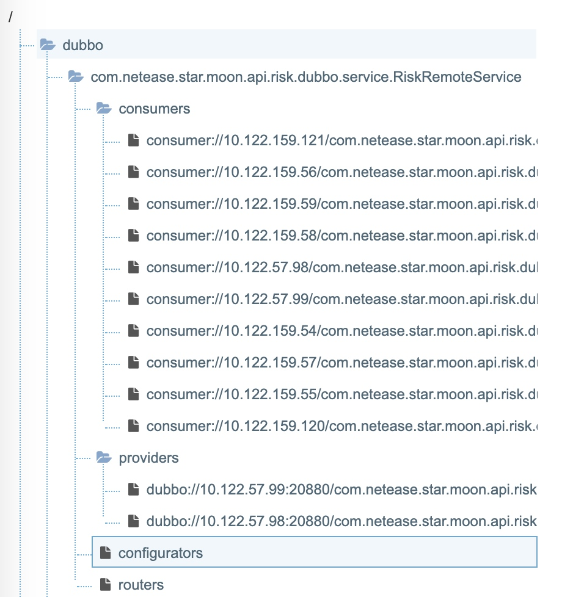

# Dubbo和ZK的交互

configurators与dubbo的配置有关，routers跟路由规则有关。
Dubbo里默认使用zkclient来操作zookeeper，也支持curator来操作。
暴露的服务、consumers目录、providers目录、configurators和router是都是持久化节点，具体的生产者和消费者客户端节点为临时节点。
Dubbo启动时，Consumer和Provider都会把自身的URL格式化为字符串，然后注册到zookeeper相应节点下，作为一个临时节点，当连断开时，节点被删除。
Consumer在启动时，不仅仅会注册自身到 …/consumers/目录下，同时还会订阅…/providers目录，实时获取其上Provider的URL字符串信息。
ZookeeperRegistry 在实例化时，调用父类构造函数。在父类构造函数中，会创建一个定时任务，每隔5S执行retry( ) 方法。

在retry( ) 方法中，重试那些失败的动作。重试的动作包括：

Provider向zookeeper注册自身的url，生成一个临时的znode
Provider从Dubbo容器中退出，停止提供RPC调用。也就是移除zookeeper内自身url对应的znode
Consumer订阅 " /dubbo/…Service/providers" 目录的子节点，生成ChildListener
Consumer从Dubbo容器中退出，移除之前创建的ChildListener
为什么如此设置？ 主要是和zookeeper的通信机制有关的。当zookeeper的Client和Server连接断开，或者心跳超时，那么Server会将相应Client注册的临时节点删除，当然注册的Listener也相应删除。
而Provider和Consumer注册的URL就属于临时节点，当连接断开时，Dubbo注册了zookeeper的StateListener，也就是状态监听器，当Dubbo里的zookeeper Client和Server重新连接上时，将之前注册的的URL添加入这几个失败集合中，然后重新注册和订阅。
ZookeeperRegistry 构造函数中为zookeeper的操作客户端添加了一个状态监听器 StateListener，当重新连接时( 重新连接意味着之前连接断开了 )，将已经注册和订阅的URL添加到失败集合中，定时重试，也就是重新注册和订阅。
zookeeper Client与Server断开连接后，会定时的不断尝试重新连接，当连接成功后就会触发一个Event，Dubbo注册了CONNECTED状态的监听器，当连接成功后重新注册和订阅。
zookeeper Server宕机了，Dubbo里的Client并没有对此事件做什么响应，当然其内部的zkClient会不停地尝试连接Server。当Zookeeper Server宕机了不影响Dubbo里已注册的组件的RPC调用，因为已经通过URL生成了Invoker对象，这些对象还在Dubbo容器内。当然因为注册中心宕机了，肯定不能感知到新的Provider。同时因为在之前订阅获得的Provider信息已经持久化到本地文件，当Dubbo应用重启时，如果zookeeper注册中心不可用，会加载缓存在文件内的Provider信息，还是能保证服务的高可用。
Consumer会一直维持着对Provider的ChildListener，监听Provider的实时数据信息。当Providers节点的子节点发生变化时，实时通知Dubbo，更新URL，同时更新Dubbo容器内的Consumer Invoker对象，只要是订阅成功均会实时同步Provider，更新Invoker对象，无论是第一次订阅还是断线重连后的订阅。

# 消费者和ZK
消费者在启动时，首先会连接zk注册中心，然后在某个服务下面的consumers目录下创建临时节点，表示消费者客户端，其实就是一个url信息，然后会订阅该服务的providers节点的孩子变化，并设置回调地址，这样当providers节点的孩子节点有变化时，则触发通知；

消费者收到zk通知后，会进入回调方法notify中，默认是异步更新本地缓存文件。通过版本号控制只会更新最新的请求(AutomicLong)。为了防止多个JVM进程同时修改cache文件，使用文件锁，即会创建一个lock文件，保证同一时刻只有一个进程对cache文件进行更新，其他没有获取到锁的进程则会抛出异常，然后异步执行重试，保证内存中的内容和cache文件的内容是一致的。

如果一台机器跑多个服务，即本地有多个dubbo实例，那么确实会存在多个jvm进程同时更新cache文件，那么就会发生冲突。cache文件命名规则：dubbo-registry-app-crocodile-10.177.96.195:2181.cache，可知是跟注册的应用名称和注册中心有关，可以在dubbo配置中添加不同的dubbo.registry.file进行区分，否则会有如下日志
```java
Can not lock the registry cache file " + file.getAbsolutePath() + ", ignore and retry later, maybe multi java process use the file, please config: dubbo.registry.file=xxx.properties
```
`文件锁：
文件锁和通道(file)关联.文件锁是以JVM进程为单位保持(OS特性).它们不适应于控制同一个JVM内多个线程对文件的访问.(多线程下对文件访问),但是fileLock对象可以在多线程环境中安全使用。FileLock最终直接映射为底层操作系统的"文件锁",FileLock的特性将受制于OS;因为任何进程都可以透明的获得文件锁的情况.在某些平台上,某个通道释放锁,会导致JVM进程释放底层文件的所有锁定,不管该锁是否为该通道获取的.因为我们为了避免这些因平台不同而带来的潜在问题,建议一个JVM进程中,对特定文件,FileChannel应该被唯一化。`
