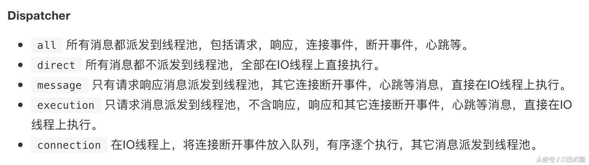

# 线程池调优
活动系统的dubbo版本比较老，当时压测的时候发现，provider端已经报了线程池耗尽的异常，但是consumer端的请求并没有立即返回失败，而是等待超时；
后来排查原因发现是因为网络抖动，导致log的时候阻塞很久，最终导致dubbo方法耗时太久，线程池的资源没有立刻得到释放，引起线程池资源耗尽。
至于为什么provider不是快速失败，而是等待超时。这个跟dispatcher分发策略有关，默认是all，那么会把所有的事件都交给业务线程池处理，默认是200，当抛出异常后，由于没有多余的线程处理异常，所以导致provider没有办法响应给consumer，导致consumer等待超时抛出异常。可以通过修改dispatcher的分发策略解决=message，当抛出异常后是由IO线程池进行响应。最好能够将IO线程和业务线程分开处理，message时，业务线程池只会对业务的请求进行处理。


```java
<dubbo:protocol name="dubbo" port="8888" threads="500" dispatcher="message" />
```
1. 调整线程池大小，默认为200，这里调整为300，再进行压测看结果
2. 修改log为异步写日志
3. 修改分发策略all为message
4. 由此引发出分布式事务的修改，tcc改为saga事务
5. 升级dubbo版本，版本太老有bug

# 协议修改
线上有个服务，通过dubbo查询商户中心采用的是heassian协议，hessian协议是多个短连接，适应于数据量并发小的场景，这里显然不适合；改成dubbo协议，也就是默认的协议方式。

# 序列化方式优化
针对java语言的kyro序列化性能优于hessian

# 超时重试
有个配置活动的接口，由于服务端超时，客户端会默认重试2次；服务端没有做好幂等，导致数据混乱，后来取消了重试，并且服务端加了幂等。

# 枚举类型序列化问题
dubbo的提供者和消费者有个枚举字段，序列化和反序列化时是按照顺序进行的，如果两边引用的版本不一致，那么导致反序列化后的结果不是客户端传过来的数据了。

阿里巴巴编码规范中也说明了，枚举类型可以作为参数，但是不要作为接口返回类型的属性，因为可能存在客户端和服务端版本不一致，导致反序列化异常；可以用code进行代替，客户端在收到code后解析成对应的枚举类型，如果是未定义的code，根据业务场景可以忽略或者有默认值进行兜底。