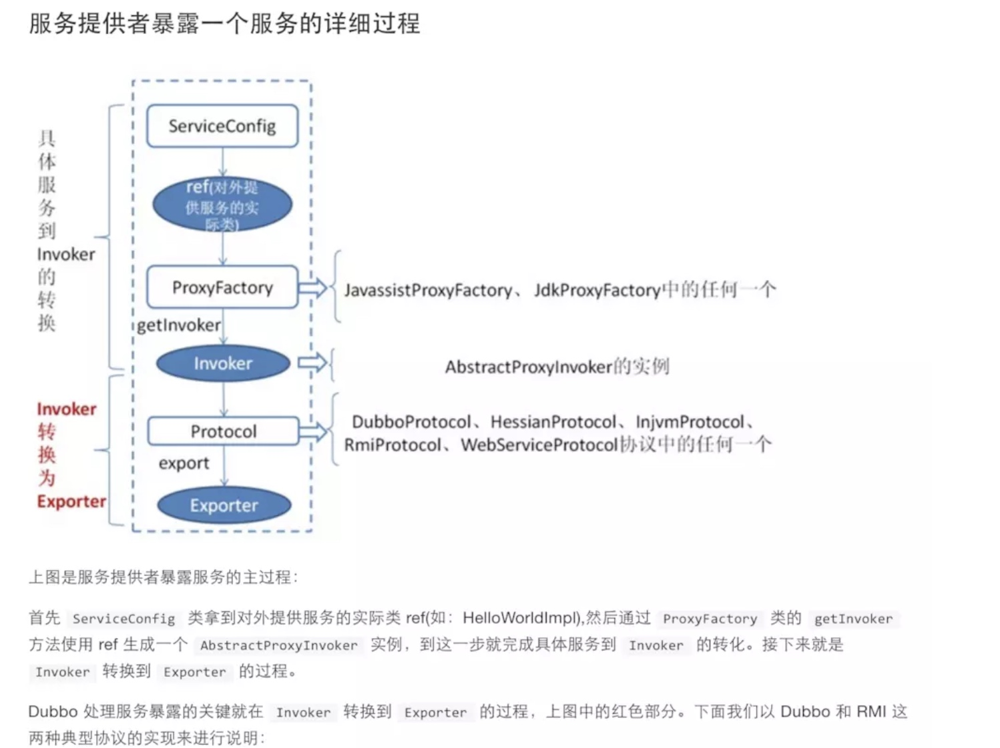
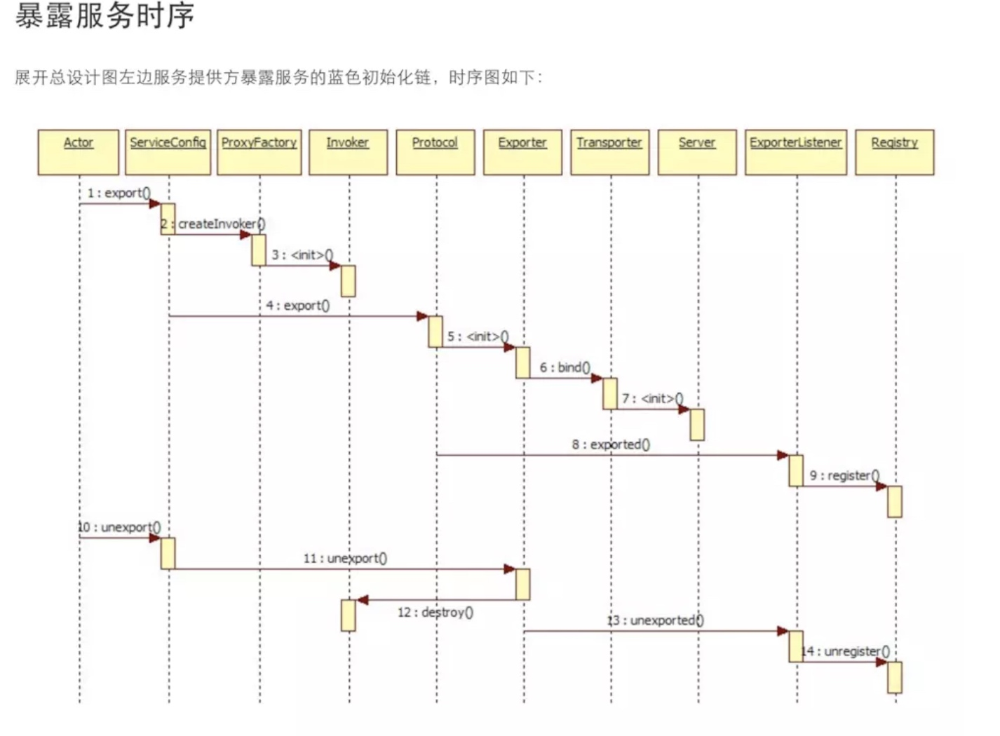
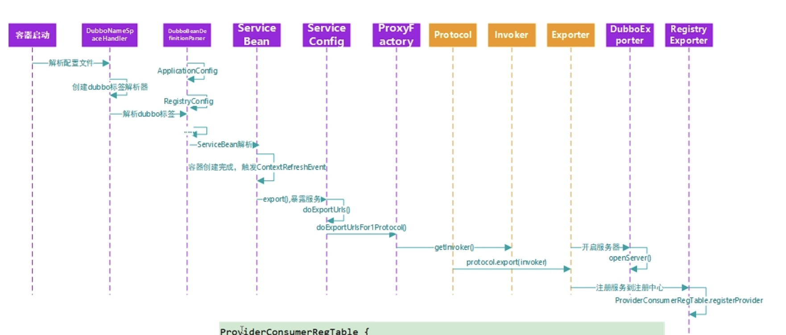
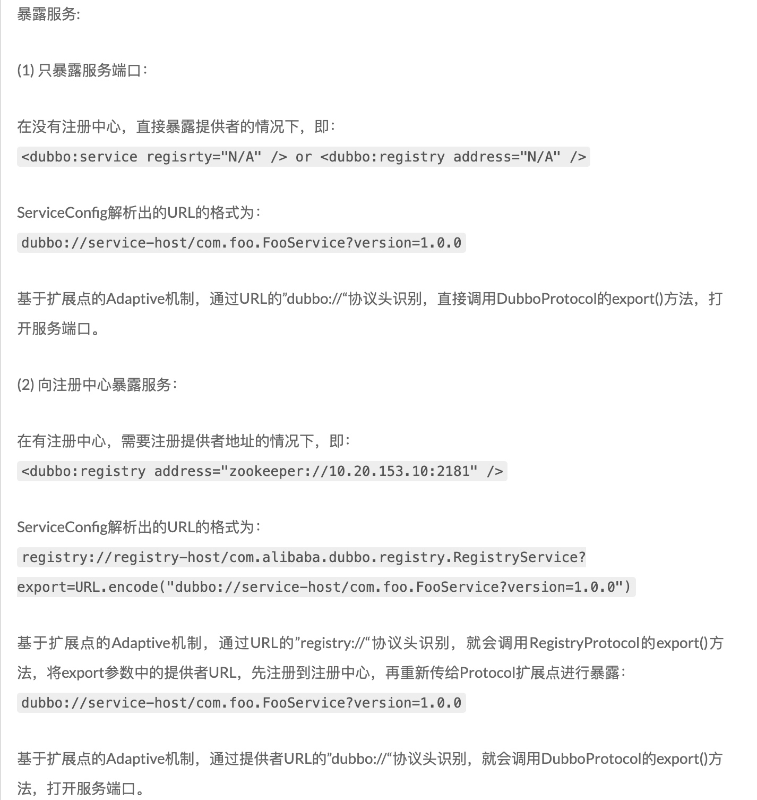
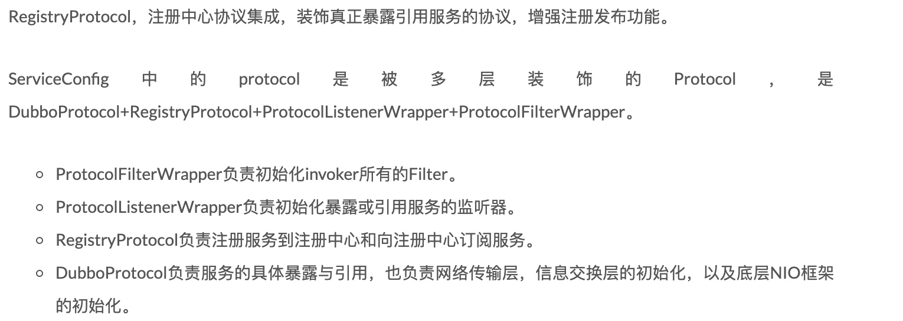

[TOC]
# 参考
[Dubbo中暴露服务的过程解析](https://cxis.me/2017/02/19/Dubbo%E4%B8%AD%E6%9A%B4%E9%9C%B2%E6%9C%8D%E5%8A%A1%E7%9A%84%E8%BF%87%E7%A8%8B%E8%A7%A3%E6%9E%90/)
[官方文档](http://dubbo.apache.org/zh-cn/docs/source_code_guide/export-service.html)

# 总结-暴露服务过程做了哪些事
暴露本地服务
暴露远程服务
启动netty
连接zookeeper
到zookeeper注册
监听zookeeper

# Dubbo核心领域模型
`Dubbo的核心领域模型：
ProxyFactory：实现了所有服务接口的的透明化代理。有两个方法，getInvoker 服务端使用，将实现类封装成一个Invoker。getProxy 客户端使用，创建接口的代理对象。
Protocol是服务域，负责服务地址的发布和订阅。它是Invoker暴露和引用的主功能入口，它负责 Invoker 的生命周期管理，是Dubbo中远程服务调用层。
Invoker 是实体域，它是 Dubbo 的核心模型，封装了一个服务相关的信息，其它模型都向它靠扰，或转换成它，它代表一个可执行体，可向它发起 invoke 调用，它有可能是一个本地的实现，也可能是一个远程的实现，也可能一个集群实现。在服务提供方，Invoker 用于调用服务提供类。在服务消费方，Invoker 用于执行远程调用。
Invocation 是会话域，它持有调用过程中的变量，比如方法名，参数等。
Exporter：具体执行Invoker的生命周期，对外暴露的服务，支持撤销服务。
Exchanger：负责数据交换和网络通信的组件。每个Invoker都维护了一个ExchangeClient的 引用，并通过它和远端server进行通信。
Transport：transport 网络传输层，抽象mina、netty的统一接口`

`Invoker，可执行的对象，执行具体的远程调用，能够根据方法名称，参数得到相应的执行结果。Invocation，包含了需要执行的方法，参数等信息。目前实现类只有RpcInvocation。
有三种类型的Invoker：本地执行类的Invoker。远程通信执行类的Invoker。多个远程通信执行类的Invoker聚合成集群版的Invoker。
以HelloService为例：
本地执行类的Invoker：在Server端有HelloServiceImpl实现，要执行该接口，只需要通过反射执行对应的实现类即可。
远程通信执行类的Invoker：在Client端要想执行该接口的实现方法，需要先进行远程通信，发送要执行的参数信息给Server端，Server端利用本地执行Invoker的方式执行，最后将结果发送给Client。
集群版的Invoker：Client端使用的时候，通过集群版的Invoker操作，Invoker会挑选一个远程通信类型的Invoker来执行。
提供者端的Invoker封装了服务实现类，URL，Type，状态都是只读并且线程安全。通过发起invoke来具体调用服务类。`

**有了Invoker，对调用者透明，使得调用者在进行RPC调用时就跟调用本地方法一样，动态代理，当调用到这个方法时，能够感知到在调用这个方法，从而做些其他逻辑的处理，如组装URL信息等。**

```java
@Extension("dubbo")
public interface Protocol {

    int getDefaultPort();

    //对于服务提供端，将本地执行类的Invoker通过协议暴漏给外部
    //外部可以通过协议发送执行参数Invocation，然后交给本地Invoker来执行
    @Adaptive
    <T> Exporter<T> export(Invoker<T> invoker) throws RpcException;

    //这个是针对服务消费端的，服务消费者从注册中心获取服务提供者发布的服务信息
    //通过服务信息得知服务提供者使用的协议，然后服务消费者仍然使用该协议构造一个Invoker。这个Invoker是远程通信类的Invoker。
    //执行时，需要将执行信息通过指定协议发送给服务提供者，服务提供者接收到参数Invocation，然后交给服务提供者的本地Invoker来执行
    @Adaptive
    <T> Invoker<T> refer(Class<T> type, URL url) throws RpcException;

    void destroy();

}
```

# 流程





# 原理分析
1. 当spring加载到非默认标签的的bean时，会由DubboNamespaceHandler类负责解析，这个类注册了对于不同dubbo标签由不同的类进行解析。对于dubbo:serivce标签最终解析为ServiceBean实例对象，reference标签会解析为ReferenceBean实例。
    `ServiceBean继承了ServiceConfig类，该类封装了标签的属性，如path,ref,methods等；
    ServiceBean实现了InitializingBean(bean初始化完成后暴露服务)，DisposableBean(bean销毁时取消暴露服务)，ApplicationContextAware(获取applicationContext)，ApplicationListener<ContextRefreshedEvent>(spring初始化完成后暴露服务)等接口；`
2. 下面就可以详细分析ServiceBean这个类。


## 暴露分类
<dubbo:service delay=""/>默认值为0，即非延迟暴露
* 延迟暴露：spring容器初始化完成后才暴露服务，当系统需要预热如初始化缓存、等待相关资源定位等；
* 非延迟暴露：当spring实例化这个bean时，就会把这个服务暴露出去（如果请求时的bean没有实例化，则继续实例化），如果请求线程中使用applicationContext.getBean()方法可能导致死锁。详细参考官网[延迟暴露](http://dubbo.apache.org/zh-cn/docs/user/demos/delay-publish.html)

由此可见，非延迟暴露是靠ServiceBean实现了InitializingBean接口重写了afterPropertiesSet()方法，该方法中会判断是否进行延迟暴露，否则立即暴露。延迟暴露是靠ServiceBean实现了ApplicationListener接口，监听ContextRefreshedEvent事件，(该事件会在spring容器初始化完成即所有bean都被成功装载才会触发)，在onApplicationEvent方法中会进行判断决定是否暴露服务，当且仅当延迟加载&&未暴露&&未取消暴露，那么才会暴露服务。
`spring事件监听是观察者设计模式，通过ApplicationEvent类和ApplicationListener接口，可以实现ApplicationContext事件处理。其中spring有一些内置的事件，当完成某种操作时会发出某些事件动作。ContextRefreshedEvent事件-spring容器初始化完成，即所有bean被装载，后处理bean被检测并激活，所有singleton bean被实例化，ApplicationContext容器可用；ContextStartedEvent，ContextStoppedEvent等。`
参考[spring事件监听](https://blog.csdn.net/liyantianmin/article/details/81017960)

## 暴露详细
暴露服务时会调用ServiceConfig的export()方法进行暴露服务。(对于延迟多少s暴露服务采用ScheduledExecutorService线程池实现)。
ServiceConfig初始化的时候，会先初始化静态变量protocol和proxyFactory，这两个变量初始化的结果是通过dubbo的SPI扩展机制得到的。
```java
//根据URL配置信息获取Protocol协议，默认是dubbo
private static final Protocol protocol = ExtensionLoader.getExtensionLoader(Protocol.class).getAdaptiveExtension();
//动态代理，默认的proxy是javassist
private static final ProxyFactory proxyFactory = ExtensionLoader.getExtensionLoader(ProxyFactory.class).getAdaptiveExtension();
```

### export步骤简介
    1. 首先检查各种配置信息(application,registry,protocol等)，并填充各种属性，保证服务暴露之前，所有东西都准备好，并且是正确的；
    2. 加载所有的注册中心，因为暴露的服务需要注册到注册中心去；获取注册中心url，会把注册的信息都放在一个URL对象中，一个URL内容如下：
        
        ```java
        registry://127.0.0.1:2181/com.alibaba.dubbo.registry.RegistryService?application=dubbo-provider&application.version=1.0&dubbo=2.5.3&environment=product&organization=china&owner=cheng.xi&pid=2939&registry=zookeeper&timestamp=1488898049284
        ```
    3. 根据配置的所有协议和注册中心url分别进行暴露服务；（支持多协议，一个注册中心可以用多种协议，与具体的暴露服务service有关，默认协议dubbo）。doExportUrlsFor1Protocol方法根据不同的协议将服务以URL形式暴露。如果scope配置为none则不暴露，如果服务未配置成remote，则本地暴露exportLocal，如果未配置成local，则注册服务registryProcotol。这里的URL为：
        
        ```java
        dubbo://192.168.1.100:20880/dubbo.common.hello.service.HelloService?anyhost=true&application=dubbo-provider&application.version=1.0&delay=5000&dubbo=2.5.3&environment=product&interface=dubbo.common.hello.service.HelloService&methods=sayHello&organization=china&owner=cheng.xi&pid=2939&side=provider&timestamp=1488898464953
        ```
    4. 进行暴露时又是各种属性的获取设置检查等操作，会拼接为URL(包括协议，ip，端口，参数等信息)进行暴露；
    5. 如果配置的是不是remote，则做本地暴露；
    6. 如果配置的不是local，则暴露为远程服务；
    7. 不管是本地暴露还是远程暴露，首先都会获取invoker；
    8. 获取完invoker后，转换为对外的exporter，并缓存起来；

    **本地暴露指的是消费者和生产者在同一个JVM进程中，那么只需进行本地暴露即可，不需要网络通信；远程服务则需要把服务注册到注册中心(ip和端口等信息暴露出去)，消费者和生产者需要进行网络调用。scope默认为null，dubbo2.2版本后默认把服务首先暴露在本地，除非显示设置scope=remote才会只暴露到远程服务**
    
### 本地暴露过程
```java
private void exportLocal(URL url) {
    if (!Constants.LOCAL_PROTOCOL.equalsIgnoreCase(url.getProtocol())) {
    	//这时候转成本地暴露的url：injvm://127.0.0.1/dubbo.common.hello.service.HelloService?anyhost=true&
        //application=dubbo-provider&application.version=1.0&dubbo=2.5.3&environment=product&
        //interface=dubbo.common.hello.service.HelloService&methods=sayHello&
        //organization=china&owner=cheng.xi&pid=720&side=provider&timestamp=1489716708276
        URL local = URL.valueOf(url.toFullString())
                .setProtocol(Constants.LOCAL_PROTOCOL)
                .setHost(NetUtils.LOCALHOST)
                .setPort(0);
        //首先还是先获得Invoker
        //然后导出成Exporter，并缓存
        //这里的proxyFactory实际是JavassistProxyFactory
        //有关详细的获得Invoke以及exporter会在下面的流程解析，在本地暴露这个流程就不再说明。
        Exporter<?> exporter = protocol.export(
                proxyFactory.getInvoker(ref, (Class) interfaceClass, local));
        //缓存？？？
        exporters.add(exporter);
        logger.info("Export dubbo service " + interfaceClass.getName() +" to local registry");
    }
}
```
本地调用使用了 injvm 协议，是一个伪协议，它不开启端口，不发起远程调用，只在 JVM 内直接关联，但执行 Dubbo 的 Filter 链。
从 2.2.0 开始，每个服务默认都会在本地暴露。在引用服务的时候，默认优先引用本地服务。如果希望引用远程服务可以使用一下配置强制引用远程服务。

## 远程服务暴露过程
```java
//对每个注册中心都需要暴露服务
for (URL registryURL : registryURLs) {
                        url = url.addParameterIfAbsent("dynamic", registryURL.getParameter("dynamic"));
                        URL monitorUrl = loadMonitor(registryURL);
                        if (monitorUrl != null) {
                            url = url.addParameterAndEncoded(Constants.MONITOR_KEY, monitorUrl.toFullString());
                        }
                        if (logger.isInfoEnabled()) {
                            logger.info("Register dubbo service " + interfaceClass.getName() + " url " + url + " to registry " + registryURL);
                        }
                        //根据服务具体实现，实现接口，以及registryUrl通过ProxyFactory将HelloServiceImpl封装成一个本地执行的Invoker
                        //invoker是对具体实现的一种代理。
                        //这里proxyFactory是上面列出的生成的代码
                        Invoker<?> invoker = proxyFactory.getInvoker(ref, (Class) interfaceClass, registryURL.addParameterAndEncoded(Constants.EXPORT_KEY, url.toFullString()));
                        DelegateProviderMetaDataInvoker wrapperInvoker = new DelegateProviderMetaDataInvoker(invoker, this);
                        //使用Protocol将invoker导出成一个Exporter
                        //暴露封装服务invoker
                        //调用Protocol生成的适配类的export方法
                        //这里的protocol是上面列出的生成的代码
                        Exporter<?> exporter = protocol.export(wrapperInvoker);
                        exporters.add(exporter);
                    }
```

## 获取invoker过程
不论是本地服务还是远程服务都会先生成invoker(动态代理)。invoker代表一个可执行体，在服务提供方，invoker负责调用服务提供类，通过反射调用具体服务的方法，用动态代理，这样可以在调用方法前后做一些操作，如过滤器。在消费方，invoker用于执行远程调用。
Invoker 是由 ProxyFactory 创建而来，Dubbo 默认的 ProxyFactory 实现类是 JavassistProxyFactory。（支持JDK动态代理，javassist动态代理，默认是javassist，性能好，测试可以参考[动态代理方案性能对比](https://javatar.iteye.com/blog/814426)）
以JavassistProxyFactory为例说明invoker创建过程。
`JavassistProxyFactory 创建了一个继承自 AbstractProxyInvoker 类的匿名对象，并覆写了抽象方法 doInvoke。覆写后的 doInvoke 逻辑比较简单，仅是将调用请求转发给了 Wrapper 类的 invokeMethod 方法。Wrapper 用于“包裹”目标类，Wrapper 是一个抽象类，仅可通过 getWrapper(Class) 方法创建子类。在创建 Wrapper 子类的过程中，子类代码生成逻辑会对 getWrapper 方法传入的 Class 对象进行解析，拿到诸如类方法，类成员变量等信息。以及生成 invokeMethod 方法代码和其他一些方法代码。代码生成完毕后，通过 Javassist 生成 Class 对象，最后再通过反射创建 Wrapper 实例。`

## 导出服务即生成exporter
### 导出服务到本地
调用InjvmProtocol的export方法导出服务，即将invoker封装为exporter，这里实现比较简单，创建了一个 InjvmExporter，封装了invoker信息，并将暴露的服务添加到本地缓存exporterMap中。
### 导出服务到远程
Invoker导出为Exporter分为两种情况，第一种是Registry类型的Invoker，第二种是其他协议类型的Invoker。源码跟到这里，调用的是RegistryProtocol.export()方法，在RegistryProtocol.export方法中会调用具体协议的export服务导出的方法。
#### RegistryProtocol讲解
RegistryProtocol 可以认为并不是一个真正的协议，他是这些实际的协议（dubbo . rmi）包装者，这样客户端的请求在一开始如果没有服务端的信息，会先从注册中心拉取服务的注册信息，然后再和服务端直连；RegistryProtocol 通过 URL 的 registry:// 协议头标识， DubboProtocol通过 URL 的dubbo://协议头标识；Registry类型Invoker不会被Filter拦截，实际的协议Invoker才会被拦截；
RegistryProtocol负责注册服务到注册中心和向注册中心订阅服务。
1. 调用具体协议如dubbo的export方法暴露服务（后面讲解），并将服务存入本地缓存map中，key为具体的url，value为exporter的wrapper包装器类。如果缓存中有这个服务，则不会再次暴露。
    
    ```java
    dubbo://192.168.177.8:20890/com.netease.wyxd.debit.api.service.DebitDataDubboService?accesslog=true&anyhost=true&application=app-crocodile&bind.ip=192.168.177.8&bind.port=20890&default.service.filter=accesslog&dubbo=2.6.0&generic=false&interface=com.netease.wyxd.debit.api.service.DebitDataDubboService&methods=queryDebitInfo,queryRefundDetailByDebitRequestId,queryEpayAccount,queryDebitRepayDetailByDebitRequestId,queryLend,queryBankSupportInfo,queryPurposeByDebitRequestId,queryDebitRequestByMerchantTradeID,queryDebitRecordByDebitSerial,queryIsAllFreeDebitsNormal&organization=netease.loan&owner=loan-open&pid=81398&revision=1.2.5-SNAPSHOT&side=provider&threads=500&timeout=60000&timestamp=1564643143132&validation=false
    ```
2. 连接至注册中心，Registry实例存入本地缓存，如果有值，说明已经连接过了，则直接返回Registry实例即可；（根据SPI机制获取具体的Registry实例，这里获取到的是ZookeeperRegistry）（FailbackRegistry抽象类负责如果服务注册失败，那么会进行失败重试，尝试重新注册服务到注册中心，具体实现由子类负责）
3. 调用远端注册中心的register方法进行服务注册，如果有消费者订阅这个服务，则推送消息给消费者引用此服务；注册中心缓存了所有提供者注册的服务以供消费者发现。
4. 提供者会订阅注册中心的所有注册服务的覆盖排职，当注册中心有此服务的覆盖配置注册进来时，推送消息给提供者，重新暴露服务。（当在管理页面操作的时候）
5. 返回暴露后的Exporter给上层ServiceConfig进行缓存，方便后期撤销暴露。撤销暴露服务的逻辑为：首先删除本地缓存中的暴露服务；然后取消服务在远端注册中心的注册服务；移除相应的订阅覆盖服务；

（将invoker封装为exporter对外进行暴露服务，exporter中还包含了撤销暴露的方法和invoker）

#### 其他协议讲解
其他协议会执行具体的暴露服务，也就是在RegistryProtocol类中调用doLocalExport方法进行具体服务暴露。主要是将本地ip和20880端口打开，进行监听，最后包装成exporter返回。

DubboProtocol在真正执行export方法前，会先执行过滤器和监听器的逻辑。
ProtocolFilterWrapper和ProtocolListenerWrapper在启动时加载Protocol扩展点时就会加载进去，它们对对Registry类型的invoker都不会进行拦截和监听。ProtocolListenerWrapper如果指定了listener就加载，否则就不加载；ProtocolFilterWrapper会构建filter链，我们要处理的那个invoker是调用链的最后一个。
DubboProtocol的export方法解析：
1. 封装DubboExporter，并放入缓存exporterMap中，key为url信息，value为对应的exporter。（当消费者进行远程调用时，提供者会通过这个key从缓存中取出对应的exporter，也就是要执行的invoker)
2. 判断是否有本地存根服务（客户端可以做参数验证、容错处理等），如果有，则客户端会生成Proxy实例，把Proxy通过构造函数传递给Stub，再把Stub暴露给用户，Stub可以决定要不要调用Proxy。
3. 根据URL绑定的ip和端口，启动NIO server（netty）。（提供者和消费者通过netty进行通信，客户端和zk通过socket长连接进行通信）
    一个ip和端口是唯一的标识，作为key，Server作为value存入缓存map中，如果server已经启动，则直接返回，否则新建server。（同一个JVM中，同协议的服务共享一个server，只有第一个暴露的服务创建server，后面相同的协议使用一个server）
    默认开启server关闭时发送readonly事件，默认开启hearbeat，默认使用netty；Exchanger负责数据交换和网络通信，从Protocol进入Exchanger，标志着程序进入了remote层。有两个线程池boss线程池和worker线程池。


# RegistryProtocol和DubboProtocol




# 销毁
ServiceBean实现了DisposableBean接口，重写了destroy方法，当bean销毁时会调用该方法释放资源。遍历本地缓存List<Exporter>(暴露服务时会将exporter存入缓存)，逐个调用exporter的unexport方法，即首先删除本地缓存中的暴露服务；然后取消服务在远端注册中心的注册服务；移除相应的订阅覆盖服务。
因为spring管理的bean，只有当spring容器关闭时才会销毁bean，回调destroy方法。对于多例bean，spring不会进行管理。

    

