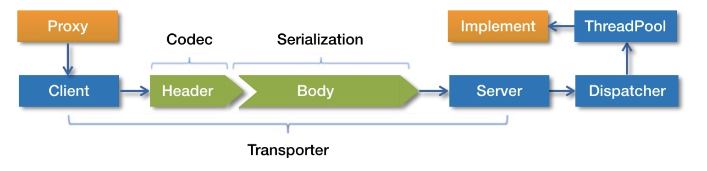
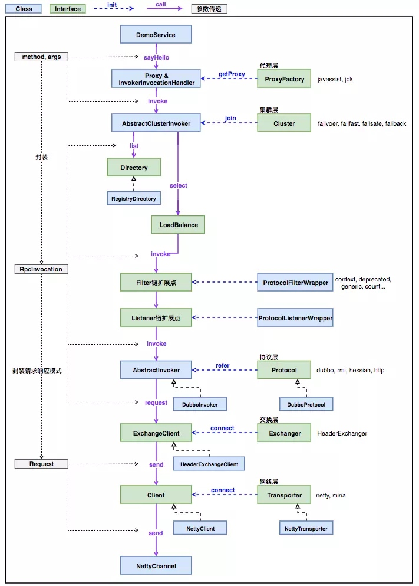
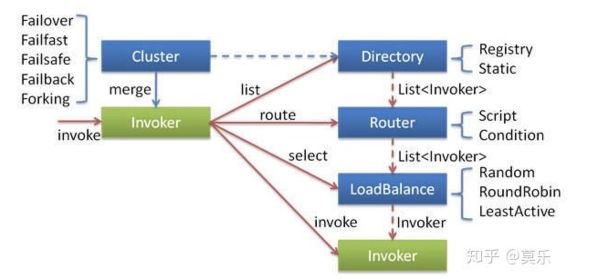

[TOC]
# 参考
[Dubbo中服务消费者和服务提供者之间的请求和响应过程](https://cxis.me/2017/03/21/Dubbo%E4%B8%AD%E6%9C%8D%E5%8A%A1%E6%B6%88%E8%B4%B9%E8%80%85%E5%92%8C%E6%9C%8D%E5%8A%A1%E6%8F%90%E4%BE%9B%E8%80%85%E4%B9%8B%E9%97%B4%E7%9A%84%E8%AF%B7%E6%B1%82%E5%92%8C%E5%93%8D%E5%BA%94%E8%BF%87%E7%A8%8B/)
[dubbo剖析：五 网络通信之 -- 请求发送与接收](https://www.jianshu.com/p/060ed3f26f8f)：主要流程解析，简单明了。
[官方文档-服务调用过程](http://dubbo.apache.org/zh-cn/docs/source_code_guide/service-invoking-process.html)
# 概要
服务提供者初始化完成之后，对外暴露exporter；
服务消费者初始化完成之后，得到的是proxy代理，spring管理的也是proxy代理，方法调用的时候就是调用代理proxy，代理会调用invoker的invoke方法执行远程调用。

默认采用javassist动态代理，也支持jdk动态代理。
# 流程图



上图从上往下展示了服务引用方发送一个RPC请求的关键步骤，经历了“代理层”、“集群层”、“过滤监听扩展点”、“调用协议层”、“信息交换层”、“网络传输层”。
紫色实线条表示各层关键类的方法调用，蓝色虚线表示关键类的初始化过程。


# 消费者发起调用请求
InvokerInvocationHandler实现了InvocationHandler接口，当调用helloService.sayHello()方法时，实际会调用InvokerInvocationHandler的invoke方法。该方法最终调用invoker.invoke(new RpcInvocation(method, args)).recreate()方法。RpcInvocation实现了Invocation接口，含有调用过程中的变量，如方法名、参数类型等。
这里的invoker实际上是MockClusterInvoker(集群包装过的invoker)。

## MockClusterInvoker.invoker()
获取mock属性的值，默认为false；(可以通过控制台动态控制，在收银台利益点文案用过)
    1. 如果为false，则会调用FailoverClusterInvoker.invoke方法(failover故障转移，即调用A机器失败，那么会自动调用到B机器上，与重试次数有关)
    2. 如果以“force”开头，则直接走mock调用，不会进行远程调用；
    3. 否则，先进行远程调用，RpcException时才会走mock调用。

## FailoverClusterInvoker.invoke()
    1. 调用父类AbstractClusterInvoker的invoke方法
        1. 首先检查服务是否被销毁，根据invocation中的方法参数获取所有的invoker列表(从RegistryDirectory中获取所有的invoker，如果配置了路由策略，则会进行筛选。Directory目录，可以理解为资源，包含了invoker的信息)；
        2. 选择负载均衡策略，默认为random，SPI机制实现；
        3. 如果是异步操作，需要记录invocation id；
        4. 调用子类的FailoverClusterInvoker.doInvoke方法；
    2. FailoverClusterInvoker.doInvoke方法
        1. 获取重试次数，默认重试次数为2，即调用三次；
        2. 在重试调用(非第一次)时，需要重新检查服务是否被销毁+获取invokers列表，防止在重试过程中，服务提供者出现变化。注意：如果列表发生了变化，那么invoked判断会失效，因为invoker示例已经改变。
        3. 根据负载均衡策略选择invoker执行；
        4. 调用过的invoker会进入集合invoked，那么下次经过负载均衡选出的invoker如果已经被调用过，则会进行重新选择。(invokers集合不会删除已经调用过invoker，否则概率就不相等了，只不过在重新选择时，会优先从未调用过的invoker中进行负载均衡)(如果一共只有三个提供者，重试四次，那么会在已经调用过的invoker中进行负载均衡选取)
        5. RpcContext.getContext().setInvokers((List)invoked);
        6. 执行具体的调用invoker.invoke(invocation)；如果调用中有异常则会进行重试，会将所有的异常都封装为RpcException，如果超过重试之后依然失败，则抛出RpcException。

## invoker.invoke()
首先进入InvokerWrapper，然后进入ListenerInvokerWrapper的invoke方法，接着进入AbstractInvoker的invoke；最终调用DubboInvoker.doInvoke方法。
1. 获取ExchangeClient，在服务引用初始化时会保存一个连接到服务端；
2. 如果是单向的，则发送完毕后不会等待结果，也不需要知道结果，直接返回；client.send(invocation, isSent);
3. 如果是异步的，发送完毕后需要能够拿到结果，因此需要得到future；(ResponseFuture)
4. 同步调用，client.request(invocation, timeout).get()等待获得结果；最终调用HeaderExchangeChannel的request方法调用提供者，传过去的参数封装在invocation中，即类似于methodName = "sayHello" parameterTypes = {Class[0]@2814} arguments = {Object[0]@2768} attachments = {HashMap@2822}  size = 4 invoker = {DubboInvoker@2658}
5. NettyChannel的send将消息请求到服务端；请求会被封装为Request对象，包含data，id，是否是心跳事件等；

`ResponseFuture实现：利用lock和condition实现，请求和响应的消息根据id进行关联，请求的时候判断状态是否完成，否则condition.await阻塞等待；收到响应后，对应的condition.signal唤醒即可。`
参考[（十）dubbo原理](https://blog.csdn.net/jjavaboy/article/details/75103483)

# 服务提供者处理并响应请求
服务端在指定端口监听，等待请求到来。当服务消费者发送调用请求时，会经过netty处理，然后到dubbo的codec相关方法中先进行解码，入口为NettyCodecAdapter.messageReceived()。解码完成后会进入到NettyHandler.messageReceived()方法。
对心跳请求和心跳响应进行处理，处理业务消息。
业务消息是在AllChannelHandler的received方法中得到处理的，解码之后到HeaderExchangeHandler的received方法进行处理。
最终是交给DubboProtocol处理，从Request对象中取出data，也就是Invocation类的实例对象，invocation中保存服务调用的上下文信息，然后从exporterMap暴露服务集合中获取到exporter对象(key是由端口号，方法名称，版本号，组等组成唯一标识)，exporter中有对应的invoker对象。调用invoker.invoke进行处理。
会先进入InvokerWrapper，接着进入AbstractProxyInvoker的invoke方法处理，调用doInvoke方法，该方法是在javassist动态代理或者jdk动态代理中实现的。
JavassistProxyFactory:
```java
public <T> Invoker<T> getInvoker(T proxy, Class<T> type, URL url) {
        // TODO Wrapper cannot handle this scenario correctly: the classname contains '$'
        final Wrapper wrapper = Wrapper.getWrapper(proxy.getClass().getName().indexOf('$') < 0 ? proxy.getClass() : type);
        return new AbstractProxyInvoker<T>(proxy, type, url) {
            @Override
            protected Object doInvoke(T proxy, String methodName,
                                      Class<?>[] parameterTypes,
                                      Object[] arguments) throws Throwable {
                return wrapper.invokeMethod(proxy, methodName, parameterTypes, arguments);
            }
        };
    }
```
wrapper.invokeMethod就会调用具体的业务逻辑代码了。
消息处理完成后，返回到HeaderExchangeHandler的received方法，构造响应信息response，然后调用channel发送响应了。

# 消费者收到提供者返回响应后的处理
服务提供者端接收到消费者端的请求并处理之后，返回给消费者端，消费者这边接受响应的入口跟提供者差不多，也是NettyCodecAdapter.messageReceived()，经过解码，到NettyHandler.messageReceived()处理。最终进入HeaderExchangerHandler.received方法中处理，handleResponse方法中调用future.received方法处理，该方法会唤醒get方法并释放锁，这里是同步转异步的重要一步，超时时间也是由DefaultFuture进行控制。
然后就是return (Result) currentClient.request(inv, timeout).get();在DubboInvoker中，这里继续执行，然后执行Filter，最后返回到InvokerInvocationHandler.invoker()方法中，方法得到调用结果，结束！
        
    
