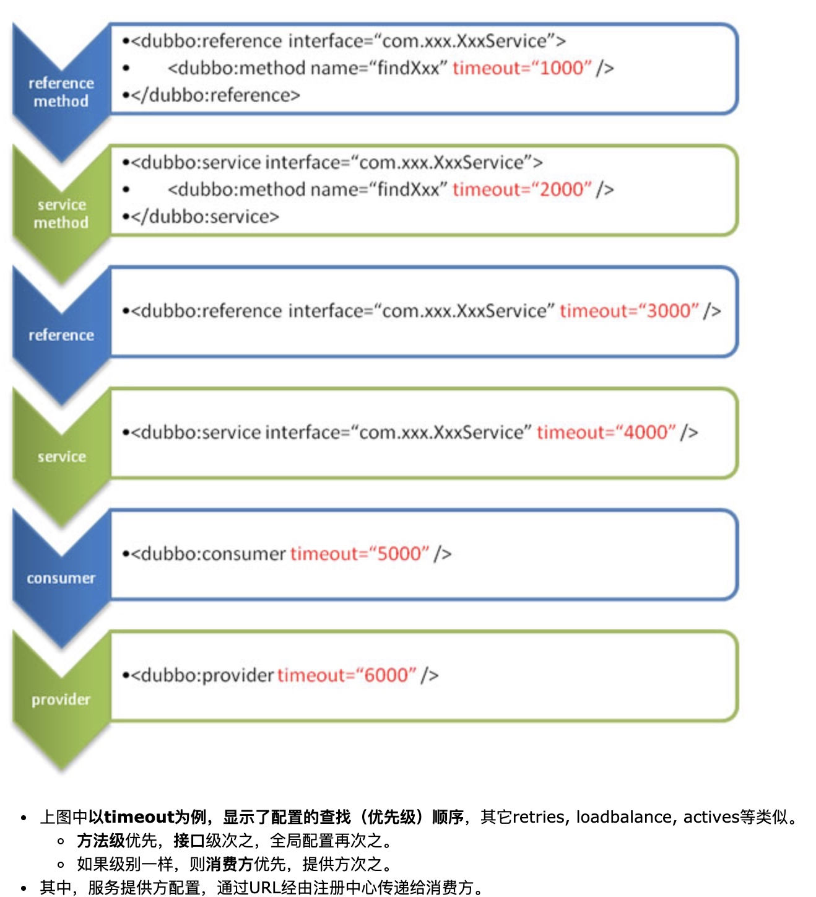
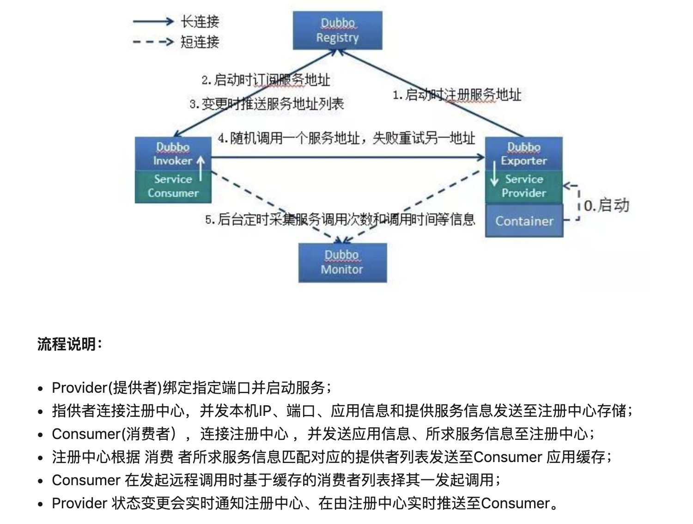
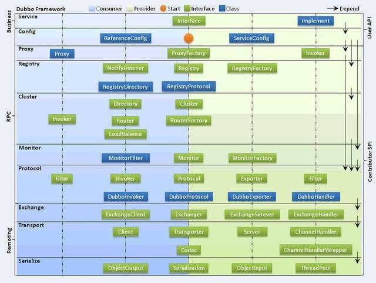
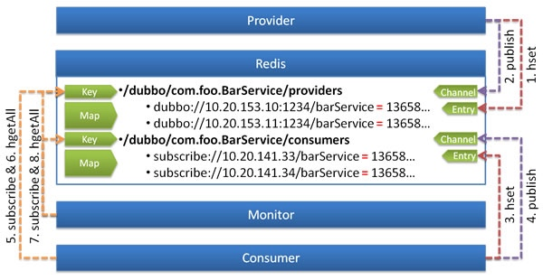
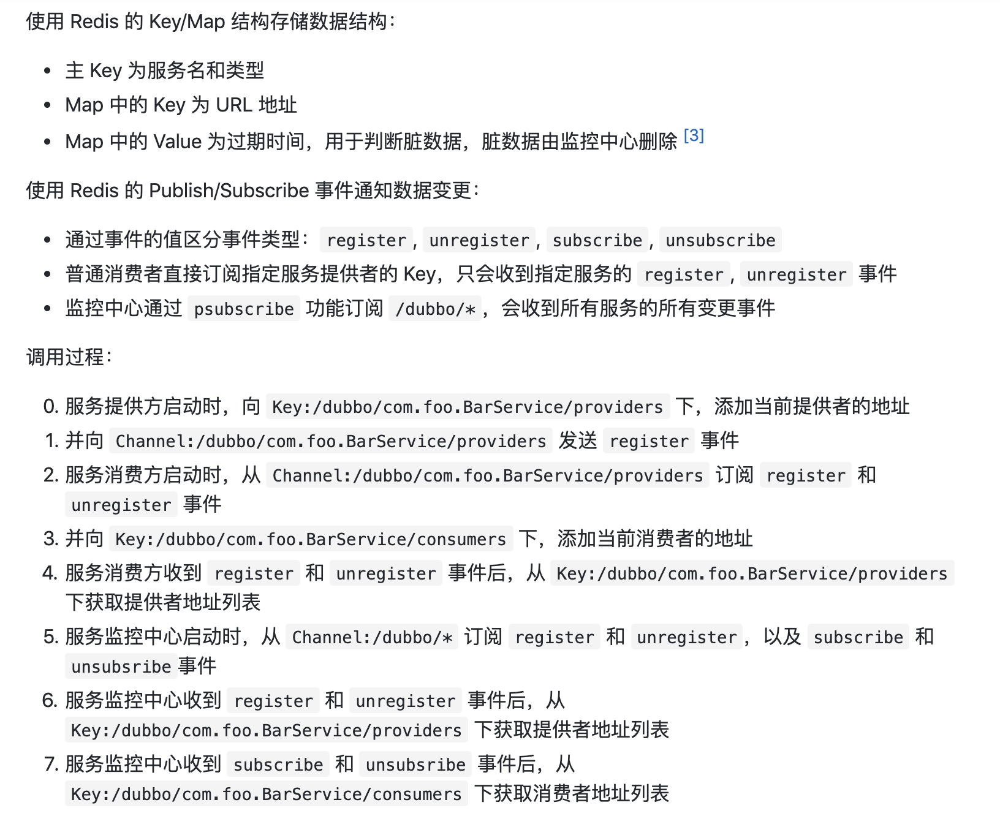
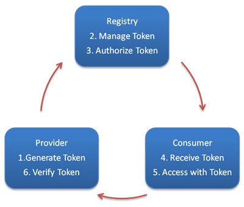
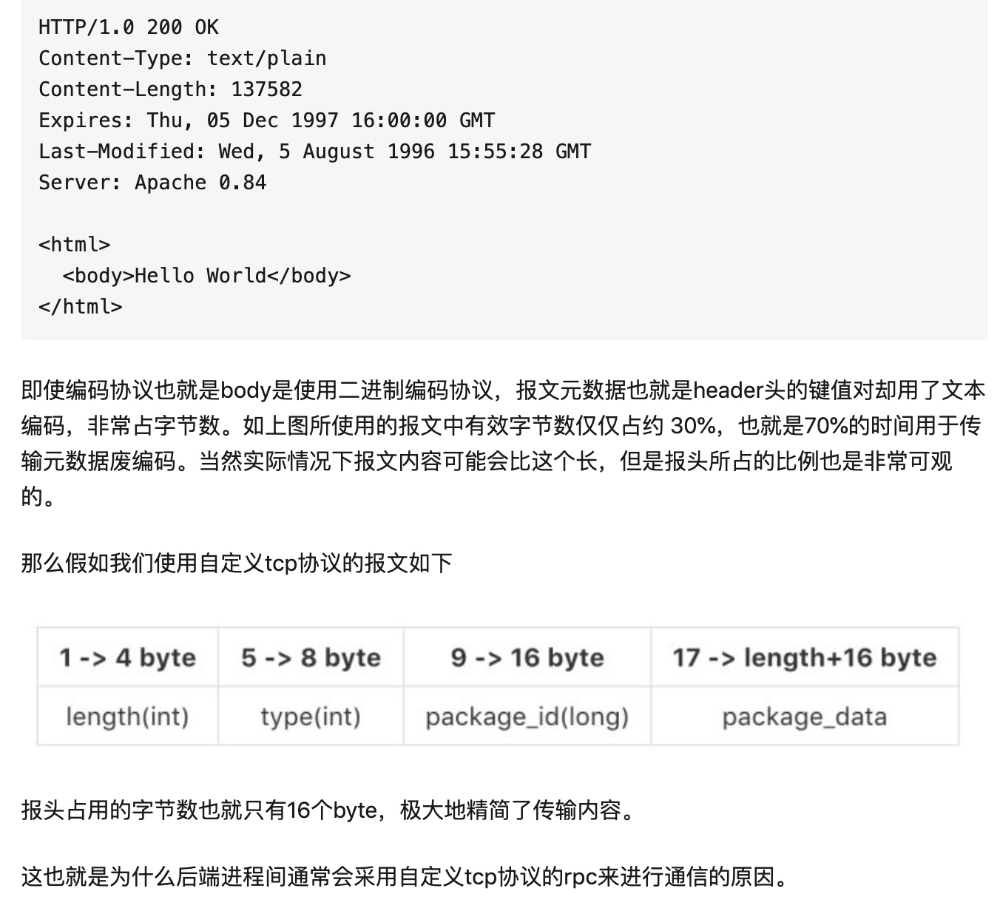
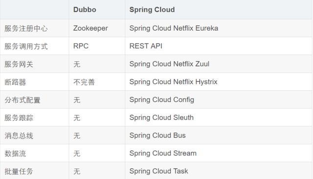

[TOC]
# dubbo线程池模型
dubbo分为IO线程池和业务线程池，IO线程池默认大小为cpu核数+1（NettyServer在初始化时分别为boss和worker创建cached类型的线程池，同时设置worker线程池的最大个数为cpu核数+1，boss线程默认为1），业务线程池默认大小为200.
IO线程池包含netty的boss和worker线程池。

`Boss线程：
每个server服务器都会有一个boss线程，每绑定一个InetSocketAddress都会产生一个boss线程，比如：我们开启了两个服务器端口80和443，则我们会有两个boss线程。一个boss线程在端口绑定后，会接收传进来的连接，一旦连接接收成功，boss线程会指派一个worker线程处理连接。
Worker线程：
一个NioServerSocketChannelFactory会有一个或者多个worker线程。一个worker线程在非阻塞模式下为一个或多个Channels提供非阻塞 读或写
线程的生命周期和优雅的关闭
在NioServerSocketChannelFactory被创建的时候，所有的线程都会从指定的Executors中获取。Boss线程从bossExecutor中获取，worker线程从workerExecutor中获取。因此，我们应该准确的指定Executors可以提供足够数量的线程，最好的选择就是指定一个cached线程池（It is the best bet to specify a cached thread pool）。`

如果事件处理的逻辑能迅速完成，并且不会发起新的 IO请求，比如只是在内存中记个标识，则直接在 IO线程上处理更快，因为减少了线程池调度。

但如果事件处理逻辑较慢，或者需要发起新的 IO 请求，比如需要查询数据库，则必须派发到线程池，否则 IO 线程阻塞，将导致不能接收其它请求。

如果用 IO 线程处理事件，又在事件处理过程中发起新的 IO 请求，比如在连接事件中发起登录请求，会报“可能引发死锁”异常，但不会真死锁。

# question
## 服务发布过程中做了哪些事

## dubbo都有哪些协议,他们之间有什么特点,缺省值是什么

## 什么是本地暴露和远程暴露
1. 本地暴露不需要将服务注册到注册中心，(也不需要启动netty服务器)，用于在用一个JVM上的生产者和消费者，避免网络调用的开销；远程暴露需要将服务注册在注册中心，生产者和消费者需要通过网络通信。
2. 本地暴露采用的是injvm协议，ip为127.0.0.1，端口为0；远程暴露默认为dubbo协议，端口20880；
3. 消费者在调用服务时默认先查找是否有本地暴露的服务，没有才会去查找远程暴露服务。
4. 本地暴露和远程暴露都需要先生成invoker，将invoker封装为exporter进行暴露；

## @Adaptive注解的作用
[Dubbo SPI之Adaptive详解](https://www.jianshu.com/p/dc616814ce98)
主要是和@SPI注解配合使用。
1. 注解在类上，相当于装饰者模式，那么在加载@SPI接口的时候会默认加载@Adaptive注解标记的类，主要用于固定其他已知的类，可以把其他的实现类放在缓存中；Dubbo中有两个类被标记了该注解：AdaptiveCompiler和AdaptiveExtensionFactory
    1. 为什么AdaptiveCompiler这个类是固定已知的？因为整个框架仅支持Javassist和JdkCompiler。
    2. 为什么AdaptiveExtensionFactory这个类是固定已知的？因为整个框架仅支持2个objFactory,一个是spi,另一个是spring
2. 注解在方法上，表示该方法是一个自适应方法，Dubbo在为扩展点生成自适应实例时，如果方法有@Adaptive注解，会为该方法生成对应的代码。方法内部会根据方法的参数，来决定使用哪个扩展。主要用于SPI，因为SPI的实现类是不固定、未知的、可扩展的类，通过动态Adaptive类，在运行时会根据参数来决定采用哪个实现类。如LoadBalance等，用户可以自定义扩展。根据url的协议名称选择对应的扩展点实现。

## 配置优先级

# 注册中心的容错策略
1. 主要包含 集群故障转移策略failover等。
2. mock
[注册中心的容错策略](https://yestermorrow.github.io/2018/03/24/dubbo%E7%B3%BB%E5%88%97%E4%B9%8B%E9%9B%86%E7%BE%A4%E5%AE%B9%E9%94%99-Cluster%E9%9B%86%E7%BE%A4/)
1. 有定时重试机制，当客户端和zk之间的网络发生抖动，导致注册、订阅、推送通知服务失败，或者zk端临时节点被删除，会通过定时任务将服务重新注册到注册中心，重新订阅服务等。
2. 本地文件缓存。主要是针对服务消费者。在启动consumer时，会加载本地已经缓存过的cache文件(文件放在用户目录下，以注册的应用名称+zk的ip和端口为维度进行缓存)，该文件保存了最近一次provider相关的数据，即provider的各种服务URL信息。这样，当网络抖动或者zk挂了，consumer仍然可以尝试连接这些provider，而不是直接让consumer失败。(当zk推送服务给消费者时，消费者会去更新这个文件，目前zk的推送服务依然是全量服务)

# 服务提供者能实现失效踢出是什么原理
服务提供者和消费者在zk中注册的都是临时节点，临时节点的生命周期和客户端的会话进行绑定，当客户端会话失效后，那么临时节点也就会自动删除。

# Dubbo有哪些领域模型
invoker：实体域，是可执行体，封装服务相关的信息，对于提供者来说是调用具体的服务类(反射)，对于消费者来说是执行远程调用。
proxy：代理，客户端(消费者)获得是服务的代理对象，通过代理调用invoker的invoker方法；
exporter:对invoker进行封装，表示对外暴露的服务，支持服务撤销等功能；
procotol：服务域，负责服务的发布和订阅，管理invoker的生命周期，
invocation：会话域，包含服务调用的上下文信息，如方法名，参数类型，参数值等；
exchanger：进行数据交换和网络通信的组件，每个invoker都维护了一个exchangeClient引用和远端进行通信；
transport：传输层，对网络通信框架netty和mina的封装；

# 说说你看的源码
## 服务暴露的初始化流程
spring对dubbo标签解析时会交给DubboNamespaceHandler类处理，具体的解析是由DubboBeanDefinitionParser类进行解析，每一个dubbo:service标签都会创建一个ServiceBean的实例，支持延迟暴露和立即暴露。
然后调用ServiceConfig.export方法，首先进行本地服务暴露，然后进行远程服务暴露，都会通过ProxyFactory获得接口实现类对应invoker实例(默认javassist动态代理)，然后将invoker转换为exporter作为对外暴露的服务，由具体的protocol服务进行服务的暴露。
protocol分为RegistryProtocol和其他协议的protocol，RegistryProtocol并不是一个真正的协议，而是其他的协议的包装，会调用其他具体的协议如dubboProtocol执行服务暴露动作，RegistryProtocol主要是连接注册中心、注册服务到注册中心和订阅服务。dubboProtocol则执行具体的服务暴露和引用，将exporter进行缓存、开启netty服务器监听本地端口这些操作。

## 服务引用的初始化流程
dubbo:reference标签会解析ReferenceBean实例对象，它是一个FactoryBean，默认是在该bean的引用被注入其他bean中或者调用getBean方法时才会进行初始化，但是如果配置init属性，则bean初始化完成后就会进行服务引用的初始化。
会调用RegistryProtocol.refer方法完成连接注册中心，并将消费者注册到注册中心的操作，如果采用的是zk，那么注册中心初始化时会添加一个状态监听器，当发生断线重连时，会将订阅的服务加入到失败重试的集合中，等待定时任务进行重试，即重新订阅服务；
注册中心接收到消费者发送的订阅请求后，会根据提供者注册服务的列表，推送服务消息给消费者。消费者端接收到注册中心发来的提供者列表后，进行服务的引用。触发Directory监听器的可以是订阅请求，覆盖策略消息，路由策略消息。
然后调用DubboProtocol.refer方法，会执行具体的服务引用操作，和服务端建立连接，返回invoker对象，后续通过这个invoker对象进行远程调用，最后根据这个invoker生成代理对象proxy，也就是将proxy对象交给spring管理，我们业务中使用的也就是proxy对象。

## 服务调用
消费者初始化完成后，得到的是proxy代理对象，我们在调用业务方法时，也就是调用代理对象的方法。这里采用的是动态代理，那么最终也就是调用invoker.invoke方法，通过invocation变量封装了调用的参数信息如方法名、参数类型等。
对于集群来说，invoker就是MockClusterInvoker，如果配置了mock，那么会在调用异常返回mock值，否则就会调用默认FailoverClusterInvoker.invoke方法；它会从RegistryDirectory中获取所有的invoker列表，执行路由策略过筛选出invokers，然后根据负载均衡策略选择某个invoker进行调用，如果调用失败，那么会failover策略重新选择invoker进行调用，这里会先检查服务是否被销毁、重新获取invokers列表，防止在重试时，服务发生了变化。
在执行具体的invoker方法时，会先经过filter和listener，最终会调用服务的invoke方法。
服务提供者收到请求后，会交给业务线程池处理，从Request对象取出对应的data对象，也就是invocation对象，然后从exporterMap缓存集合中找到对应的exporter，exporter中有invoker，最终调用invoker.invoke方法执行业务逻辑。
提供者处理完成后，会返回响应给消费者。消费者通过future.get同步等待结果，最后返回给上层业务。
总结：代理层执行--》集群容错和负载句哼--〉执行filter链--》调用协议层执行--〉交换层执行---》网络层执行

# Dubbo filter实现原理
[dubbo中的Filter链原理及应用](https://www.jianshu.com/p/f390bb88574d)
[dubbo自定义filter](https://www.jianshu.com/p/d279349435cd)
dubbo中filter链的入口在ProtocolFilterWrapper中，这是Protocol的一个包装类，在其服务暴露和服务引用时都进行了构建filter链的工作。基于Dubbo的SPI机制，会加载ProtocolFilterWrapper类。ProtocolFilterWrapper类中会构建filter链，装饰器模式，每个filter都会调用下个filter的invoke方法，而服务的invoker方法也是最后被调用。

filter链默认先执行 原生的filter，再执行用户自定义的。可以在配置中手动改变执行顺序，filter也是根据@Activate注解的属性before、after和ordered进行排序。

# 实现透传traceID
利用RpcContext和filter可以实现消费者和生产者透传traceID，但是RpcContext只是存在一次调用会话中，如A调用B后，A会清除RpcContext的属性信息，B会清除整个Context信息，但是A可能调用B多个服务，也有可能一个服务方法调用多次，因此需要自定义filter，在每次调用前需要把tracID保存至RpcContext中。同时也将traceID存入log的上下文信息中或者MDC中即可。

# Dubbo是同步还是异步的？
Dubbo底层是依赖Netty进行通信，因此在通信层是异步的，但是对于使用者来说做了阻塞等待，实现了同步的效果。ResponseFuture既可以同步也可以异步，看get的时机了。

# Dubbo心跳机制
[官网-Dubbo 现有心跳方案总结以及改进建议](http://dubbo.apache.org/zh-cn/blog/dubbo-heartbeat-design.html)
目前采用的是双向心跳机制，客户端和服务端都维护两个定时任务，一个用来检测对端是否存活，一个用来执行重新连接、断开连接。默认的检测周期为60s，执行频率为其1/3，并且通过记录上一次的读或者写的时刻和当前时刻进行对比，如果大于检测周期才会进行心跳检测，防止忙时检测。
客户端在三次检测发现没有心跳返回后，则进行重新连接；服务端则直接关闭连接，因为客户端会进行重新连接。

* 改进
    利用底层通信框架自带的心跳检测机制，如Netty本身就提供了空闲检测的逻辑，这样可以减少编码复杂性，而且Netty的是客户端单向检测，服务端没必要维护。
    
# Dubbo线程池模型
https://www.cnblogs.com/xhj123/p/9095278.html

# Dubbo处理TCP粘包和拆包
[Dubbo源码解析（十七）Dubbo 处理TCP粘包拆包](https://blog.csdn.net/u013076044/article/details/89279699)
补充：UDP是-用户数据报协议，是面向无连接的，面向消息的，提供高效率服务的，不会使用块的合并优化算法，由于UDP是一对多的模式，所以接收端的套接字缓冲区中采用链式结构记录每一个到达的UDP包，每个UDP包中就有了消息头(来源地址，端口等信息)，这样对于接收端来说就容易区分处理了。
TCP是面向连接的，基于数据流的，流是没有边界的。TCP前提是双方需要建立好socket连接，为了提高发送的效率，在发送端采用Nagle算法进行优化，即将短时间间隔内的数据包进行合并到缓冲区中再发送，如果原有的数据报文太大或者太小，就会发生拆包和粘包了。

拆包和粘包需要上层协议来解决，传输层无法关心上层的数据报文大小。
解决方案：
1. 采用固定长度。这样接收端每次读取固定长度就OK了。
2. 采用特殊字符作为边界，比如换行等，FTP就是这样做的。
3. 增加消息头，消息头部包含长度信息。
4. 自定义应用层的协议来做，自己做编解码。

# 简单问题
## Dubbo应用场景或者核心功能
透明化的远程方法调用，就像调用本地方法一样调用远程方法，只需简单配置，没有任何API侵入。

软负载均衡及容错机制，可在内网替代F5等硬件负载均衡器，降低成本，减少单点。

服务自动注册与发现，不再需要写死服务提供方地址，注册中心基于接口名查询服务提供者的IP地址，并且能够平滑添加或删除服务提供者。

## Dubbo服务发现与注册流程

## Dubbo架构设计

服务接口层（Service）：该层是与实际业务逻辑相关的，根据服务提供方和服务消费方的业务设计对应的接口和实现；
配置层（Config）：对外配置接口，以ServiceConfig和ReferenceConfig为中心；
服务代理层（Proxy）：服务接口透明代理，生成服务的客户端Stub和服务器端Skeleton；
服务注册层（Registry）：封装服务地址的注册与发现，以服务URL为中心；
集群层（Cluster）：封装多个提供者的路由及负载均衡，并桥接注册中心，以Invoker为中心；
监控层（Monitor）：RPC调用次数和调用时间监控；
远程调用层（Protocol）：封将RPC调用，以Invocation和Result为中心，扩展接口为Protocol、Invoker和Exporter；
信息交换层（Exchange）：封装请求响应模式，同步转异步，以Request和Response为中心；
网络传输层（Transport）：抽象mina和netty为统一接口，以Message为中心。

## Dubbo支持的协议及应用场景
* dubbo： 单一长连接和NIO异步通讯，适合大并发小数据量的服务调用，以及消费者远大于提供者。传输协议TCP，异步，Hessian序列化；Dubbo 缺省协议不适合传送大数据量的服务，比如传文件，传视频等，除非请求量很低。Dubbo 协议缺省每服务每提供者每消费者使用单一长连接，如果数据量较大，可以使用多个连接。
    * 为什么消费者个数比提供者个数多
    因 dubbo 协议采用单一长连接，假设网络为千兆网卡（1024Mbit=128MBytae） [3]，根据测试经验数据每条  连接最多只能压满 7MByte(不同的环境可能不一样，供参考)，理论上 1 个服务提供者需要 20 个服务消费者才能压满网卡。
    * 为什么不能传大包
    因 dubbo 协议采用单一长连接，如果每次请求的数据包大小为 500KByte，假设网络为千兆网卡 [3:1]，每条连接最大 7MByte(不同的环境可能不一样，供参考)，单个服务提供者的 TPS(每秒处理事务数)最大为：128MByte / 500KByte = 262。单个消费者调用单个服务提供者的 TPS(每秒处理事务数)最大为：7MByte / 500KByte = 14。如果能接受，可以考虑使用，否则网络将成为瓶颈。
    * 为什么采用异步单一长连接
    因为服务的现状大都是服务提供者少，通常只有几台机器，而服务的消费者多，可能整个网站都在访问该服务，比如 Morgan 的提供者只有 6 台提供者，却有上百台消费者，每天有 1.5 亿次调用，如果采用常规的 hessian 服务，服务提供者很容易就被压跨，通过单一连接，保证单一消费者不会压死提供者，长连接，减少连接握手验证等，并使用异步 IO，复用线程池，防止 C10K 问题。
    
* rmi： 采用JDK标准的rmi协议实现，传输参数和返回参数对象需要实现Serializable接口，使用java标准序列化机制，使用阻塞式短连接，传输数据包大小混合，消费者和提供者个数差不多，可传文件，传输协议TCP。 多个短连接，TCP协议传输，同步传输，适用常规的远程服务调用和rmi互操作。在依赖低版本的Common-Collections包，java序列化存在安全漏洞；

* hessian： 集成Hessian服务，基于HTTP通讯，采用Servlet暴露服务，Dubbo内嵌Jetty作为服务器时默认实现，提供与Hession服务互操作。多个短连接，同步HTTP传输，Hessian序列化，传入参数较大，提供者大于消费者，提供者压力较大，可传文件；

* http： 基于Http表单提交的远程调用协议，使用Spring的HttpInvoke实现。多个短连接，传输协议HTTP，传入参数大小混合，提供者个数多于消费者，需要给应用程序和浏览器JS调用；

* memcache： 基于memcached实现的RPC协议；

* webservice： 基于WebService的远程调用协议，集成CXF实现，提供和原生WebService的互操作。多个短连接，基于HTTP传输，同步传输，适用系统集成和跨语言调用；

* redis： 基于redis实现的RPC协议。

## Dubbo注册中心实现
1. ZK：zk作为注册中心，支持订阅推送，临时节点等；
2. redis：
    

3. multicast：组播服务，不需要依赖任何中心节点，消费者启动时会组播自己订阅的服务，提供者会把自身的服务信息推送给消费者；组播受网络结构限制，只适合小规模应用或开发阶段使用；
    提供方启动时广播自己的地址。
    消费方启动时广播订阅请求。
    提供方收到订阅请求时，单播自己的地址给订阅者，如果设置了unicast=false，则广播给订阅者。
    消费方收到提供方地址时，连接该地址进行RPC调用。

## Dubbo集群的容错方案
Failover Cluster
失败自动切换，当出现失败，重试其它服务器。通常用于读操作，但重试会带来更长延迟。
Failfast Cluster
快速失败，只发起一次调用，失败立即报错。通常用于非幂等性的写操作，比如新增记录。
Failsafe Cluster
失败安全，出现异常时，直接忽略。通常用于写入审计日志等操作。
Failback Cluster
失败自动恢复，后台记录失败请求，定时重发。通常用于消息通知操作。
Forking Cluster
并行调用多个服务器，只要一个成功即返回。通常用于实时性要求较高的读操作，但需要浪费更多服务资源。可通过 forks="2" 来设置最大并行数。
Broadcast Cluster
广播调用所有提供者，逐个调用，任意一台报错则报错 。通常用于通知所有提供者更新缓存或日志等本地资源信息。

## Dubbo安全机制如何解决？
通过令牌验证在注册中心控制权限，以决定要不要下发令牌给消费者，可以防止消费者绕过注册中心访问提供者，另外通过注册中心可灵活改变授权方式，而不需修改或升级提供者。

## rpc和http
rpc和http不是一个并行的概念，rpc是远端过程调用，其调用协议包含传输协议和序列化协议。传输协议包含: 如著名的grpc使用的 http2 协议，也有如dubbo一类的自定义报文的tcp协议。
序列化协议包含: 如基于文本编码的 xml json，也有二进制编码的 protobuf hessian等。
http协议是支持连接池复用的，也就是建立一定数量的连接不断开，并不会频繁的创建和销毁连接。二一要说的是http也可以使用protobuf这种二进制编码协议对内容进行编码，因此二者最大的区别还是在传输协议上。

所谓的效率优势是针对http1.1协议来讲的，http2.0协议已经优化编码效率问题，像grpc这种rpc库使用的就是http2.0协议。这么来说吧http容器的性能测试单位通常是kqps，自定义tpc协议则通常是以10kqps到100kqps为基准简单来说成熟的rpc库相对http容器，更多的是封装了“服务发现”，"负载均衡"，“熔断降级”一类面向服务的高级特性。可以这么理解，rpc框架是面向服务的更高级的封装。如果把一个http servlet容器上封装一层服务发现和函数代理调用，那它就已经可以做一个rpc框架了。所以为什么要用rpc调用？因为良好的rpc调用是面向服务的封装，针对服务的可用性和效率等都做了优化。单纯使用http调用则缺少了这些特性。

## dubbo和spring cloud
Dubbo 是 SOA 时代的产物，它的关注点主要在于服务的调用，流量分发、流量监控和熔断。而 Spring Cloud 诞生于微服务架构时代，考虑的是微服务治理的方方面面，另外由于依托了 Spirng、Spirng Boot 的优势之上，两个框架在开始目标就不一致，Dubbo 定位服务治理、Spirng Cloud 是一个生态。

最大的区别：Dubbo底层是使用Netty这样的NIO框架，是基于TCP协议传输的，配合以Hession序列化完成RPC通信。

而SpringCloud是基于Http协议+Rest接口调用远程过程的通信，相对来说，Http请求会有更大的报文，占的带宽也会更多。但是REST相比RPC更为灵活，服务提供方和调用方的依赖只依靠一纸契约，不存在代码级别的强依赖。

## Dubbo内置了哪几种服务容器？
Spring Container
Jetty Container
Log4j Container
Dubbo 的服务容器只是一个简单的 Main 方法，并加载一个简单的 Spring 容器，用于暴露服务。

## 当一个服务接口有多种实现怎么处理
当一个接口有多种实现时，可以用 group 属性来分组，服务提供方和消费方都指定同一个 group 即可。

## 服务上线怎么兼容旧版本？
通过版本号控制。
服务提供者发布一半机器，然后服务消费者发布全部机器，再将提供者剩下一半机器发布即可。

    