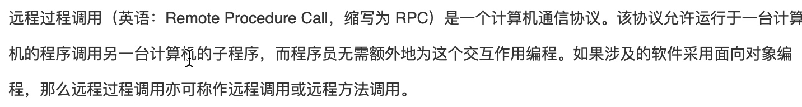
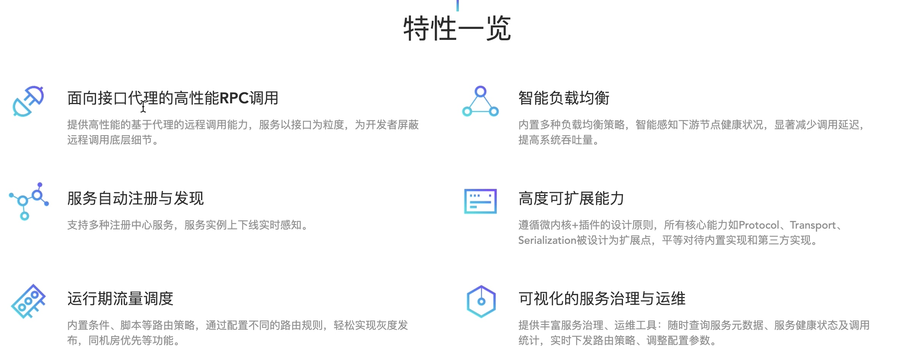
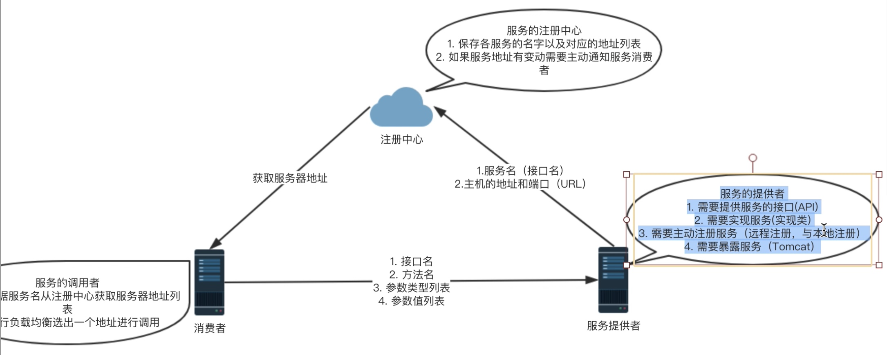
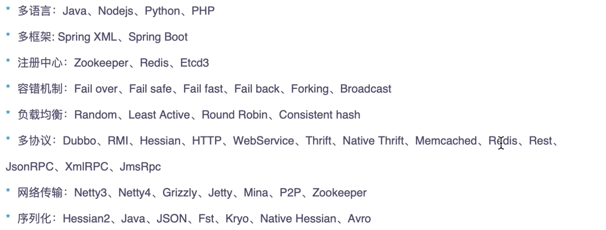
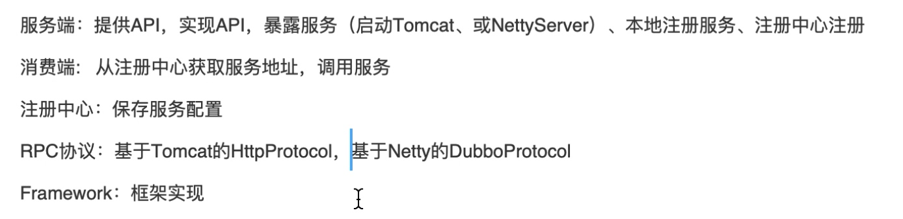

[TOC]
# 参考
[dubbo官方文档](http://dubbo.apache.org/zh-cn/docs/user/preface/architecture.html)
# RPC

http/tcp/webService/socket都可以认为RPC。
# Dubbo特性

# Dubbo架构

本地注册：提供者在进行远程注册时，顺便会进行本地注册，将服务的实现类和暴露出去接口的映射关系保存在本地，这样有rpc调用过来时，就可以通过接口名找到实现类进行执行。

# Dubbo生态系统

# 手动实现Dubbo

可以看视频[分布式之---程序员想进阿里，Dubbo是你最好的敲门砖]()