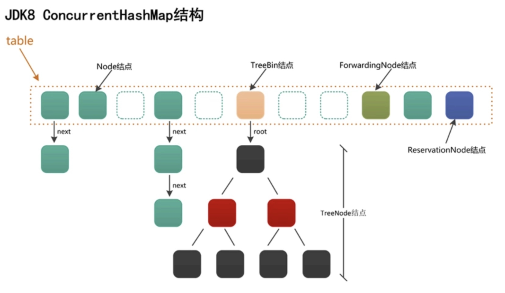

[TOC]
# 参考
[基本原理1](https://segmentfault.com/a/1190000016096542)
[基本原理2](https://segmentfault.com/a/1190000016124883)
# 基本属性
# 弱一致性？
如果key已经存在则直接覆盖value，value是volatile，具有可见性；但是如果key不存在，那么情况比较复杂，可能存在弱一致性问题。
但是通过getObjectVolatile，每次从内存地址中读取最新的数据，也保证了内存可见性，说不通。。。===待确定
[弱一致性分析](https://my.oschina.net/hosee/blog/675423)
[数组元素的可见性](https://www.jianshu.com/p/5808db3e2ace)

# CAS操作
java不能直接访问操作系统底层，只能通过本地方法访问。Unsafe类中提供了硬件级别的原子操作。通过调用Unsafe.compareAndSwapXXX（）方法能够实现原子性的更新操作。

CAS操作有三个操作数，内存值M，预期值E，新值U，如果M==E，则将内存值修改为U，返回true，否则啥也不做。最外层可以通过while循环不停的更新，直至更新成功。

注意：变量需要用volatile修饰，保证可见性。当在读取volatile变量时，会从主内存中读取；当修改了volatile变量时，会强制把该变量的值从每个线程的工作内存刷新回主内存。保证了多线程环境下，各个线程都能看到最新的volatile变量。
<font color='#ff00'>volatile如果修饰数组/对象，只是保证了数组/对象的引用具有可见性，无法保证数组中的元素/对象的属性具有可见性。</font>AtomicReferenceArray操作数组，保证了数组中的元素具有可见性。（也可以参考ConcurrentHashMap中的put方法，采用getObjectVolatile/putObjectVolatile方法来操作，强制从主内存读取数据，传入的参数需要有地址偏移量，以此来解决了数组中元素的原子性操作）

CAS操作只能对一个共享变量执行原子操作，当对多个共享变量操作时，可以采用锁，或者将多个共享变量合成为一个共享变量来操作（高位和低位表示不同的含义）;或者通过AtomicReference来保证引用对象之间的原子性，将多个变量放在一个对象里面来进行CAS操作。AtomicReference保存了对象的内存地址偏移量，方便快速的操作。

ABA问题，可以通过添加版本号解决。

多核心CPU时，CAS的操作依然有效。对于多核处理器上运行时，jvm会为cmpxchg指令添加lock前缀，否则就省略lock前缀(单核处理器自身会维护处理器内的顺序一致性，不需要lock前缀提供的内存屏障效果，在同一时刻只能有一个线程执行)

[多核处理下如何保证可见性](http://www.pianshen.com/article/81043901/)
[原子性如何实现](https://juejin.im/entry/5a7090086fb9a01ca0722123)
[面试CAS](https://blog.csdn.net/v123411739/article/details/79561458)
[缓存一致性协议](https://blog.csdn.net/muxiqingyang/article/details/6615199)
[volatile和CAS](https://www.jianshu.com/p/cd4744d799e4)
# 构造函数
ConcurrentHashmap和HashMap一样，采用的是懒加载模式，只有当首次插入键值对的时候才会初始化table数组；
构造函数中也就是做了些table初始容量大小的计算。
# 属性说明
```java
/**
 * 最大容量.
 */
private static final int MAXIMUM_CAPACITY = 1 << 30;

/**
 * 默认初始容量
 */
private static final int DEFAULT_CAPACITY = 16;

/**
 * The largest possible (non-power of two) array size.
 * Needed by toArray and related methods.
 */
static final int MAX_ARRAY_SIZE = Integer.MAX_VALUE - 8;

/**
 * 负载因子，为了兼容JDK1.8以前的版本而保留。
 * JDK1.8中的ConcurrentHashMap的负载因子恒定为0.75
 */
private static final float LOAD_FACTOR = 0.75f;

/**
 * 链表转树的阈值，即链接结点数大于8时， 链表转换为树.
 */
static final int TREEIFY_THRESHOLD = 8;

/**
 * 树转链表的阈值，即树结点树小于6时，树转换为链表.
 */
static final int UNTREEIFY_THRESHOLD = 6;

/**
 * 在链表转变成树之前，还会有一次判断：
 * 即只有键值对数量大于MIN_TREEIFY_CAPACITY，才会发生转换。
 * 这是为了避免在Table建立初期，多个键值对恰好被放入了同一个链表中而导致不必要的转化。
 */
static final int MIN_TREEIFY_CAPACITY = 64;

/**
 * 数据转移时，每个线程负责的数据转移的最小值；防止有过多的内存争用
 */
private static final int MIN_TRANSFER_STRIDE = 16;

/**
 * 用于在扩容时生成唯一的随机数.
 */
private static int RESIZE_STAMP_BITS = 16;

/**
 * 可同时进行扩容操作的最大线程数.（2^16）
 */
private static final int MAX_RESIZERS = (1 << (32 - RESIZE_STAMP_BITS)) - 1;

/**
 * The bit shift for recording size stamp in sizeCtl.
 */
private static final int RESIZE_STAMP_SHIFT = 32 - RESIZE_STAMP_BITS;

static final int MOVED = -1;                // 标识ForwardingNode结点（在扩容时才会出现，不存储实际数据）
static final int TREEBIN = -2;              // 标识红黑树的根结点 TreeBin的hash
static final int RESERVED = -3;             // 标识ReservationNode结点（）
static final int HASH_BITS = 0x7fffffff;    // usable bits of normal node hash

/**
 * CPU核心数，扩容时使用
 */
static final int NCPU = Runtime.getRuntime().availableProcessors();

/**
 * Node数组，标识整个Map，首次插入元素时创建，大小总是2的幂次.
 */
transient volatile Node<K, V>[] table;

/**
 * 扩容后的新Node数组，只有在扩容时才非空.
 * 必须要维护，确保多线程环境下，其他线程能够查找key，如果不维护，直接类似hashmap一样覆盖引用，扩容时，其他线程无法查找key了。
 */
private transient volatile Node<K, V>[] nextTable;

/**
 * 控制table的初始化和扩容.
 * 0  : 初始默认值
 * -1 : 有线程正在进行table的初始化
 * >0 : table初始化时使用的容量，或初始化/扩容完成后的threshold
 * -(1 + nThreads) : 记录正在执行扩容任务的线程数
 */
private transient volatile int sizeCtl;

/**
 * 扩容时需要用到的一个下标变量.
 */
private transient volatile int transferIndex;

/**
 * 计数基值,当没有线程竞争时，计数将加到该变量上。类似于LongAdder的base变量
 */
private transient volatile long baseCount;

/**
 * 计数数组，出现并发冲突时使用。类似于LongAdder的cells数组
 */
private transient volatile CounterCell[] counterCells;

/**
 * 自旋标识位，用于CounterCell[]扩容时使用。类似于LongAdder的cellsBusy变量
 */
private transient volatile int cellsBusy;


// 视图相关字段
private transient KeySetView<K, V> keySet;
private transient ValuesView<K, V> values;
private transient EntrySetView<K, V> entrySet;
```
# 基础结构

与HashMap不同，如果是红黑树，那么会直接把树的root节点放在数组中(TreeNode)，这里放的是TreeBin节点，TreeBin相当于是一个代理节点，指向红黑树的根节点，包含了对树的操作，如构建、左旋、右旋等；而且包含了当前锁的状态；
```java
TreeNode<K, V> root;                // 红黑树结构的根结点
volatile TreeNode<K, V> first;      // 链表结构的头结点
volatile Thread waiter;             // 最近的一个设置WAITER标识位的线程
volatile int lockState;             // 整体的锁状态标识位
static final int WRITER = 1;        // 二进制001，红黑树的写锁状态
static final int WAITER = 2;        // 二进制010，红黑树的等待获取写锁状态
static final int READER = 4;        // 二进制100，红黑树的读锁状态，读可以并发，每多一个读线程，lockState都加上一个READER值
```
# JDK8以前的ConcurrentHashMap
JDK8之前的ConcurrentHashMap采用分段锁的设计思想，以减少热点域的冲突，提高并发性；有一个Segment数组，默认长度是2^16，即允许2^16的线程同时进行分段操作，Segment数组中存储HashEntry数组，HashEntry数组就是数组+链表/红黑树构成。
在获取元素时，首先会hash到segment数组的位置，然后再hash找到具体的hashEntry位置，存放也是一个道理；对于跨段操作，需要获取每个分段锁，按顺序获取锁和释放，防止死锁。

每一个segment都是一个HashEntry<K,V>[] table， table中的每一个元素本质上都是一个HashEntry的单向队列。比如table[3]为首节点，table[3]->next为节点1，之后为节点2，依次类推。
首先通过hash算法定位到属于哪一个segment，然后再次通过hash算法定位属于哪一个table的节点。
## jdk8为什么放弃分段锁
1. 加入多个分段锁浪费内存空间。
2. 生产环境中， map 在放入时竞争同一个锁的概率非常小，分段锁反而会造成更新等操作的长时间等待。
3. 为了提高 GC 的效率；
4. 分段锁支持的并发线程个数等于分段数组的大小，jdk8后的锁的粒度更小；
5. jdk1.7中Segment是一个继承了ReentrantLock的分段锁，在每次put操作时，是将整个Segment分段里面的transient volatile HashEntry<K,V>[] table 整个锁住，而Segment的个数在初始的时候就确定了，即使Map进行扩容也不会增加Segment的个数，所以jdk1.7中ConcurrentHashMap 的concurrentLevel（并发数）基本上是固定的。而jdk8的并发个数会随着数组扩容而增加。

## jdk8相比jdk7做了哪些优化改进
1. 放弃分段锁，直接采用hashEntry数组保存数据，如果需要加锁，也只是对table中的数组元素加锁，加锁的粒度更细；
2. 将原先table数组＋单向链表的数据结构，变更为table数组＋单向链表＋红黑树的结构

## 为什么用synchronized而不是lock
1. 减少内存开销
假设使用可重入锁来获得同步支持，那么每个节点都需要通过继承AQS来获得同步支持。但并不是每个节点都需要获得同步支持的，只有链表的头节点（红黑树的根节点）需要同步，这无疑带来了巨大内存浪费。（每个segment需要基础ReentrantLock类实现加锁）
2. 获得JVM的支持
可重入锁毕竟是API这个级别的，后续的性能优化空间很小。
synchronized则是JVM直接支持的，JVM能够在运行时作出相应的优化措施：锁粗化、锁消除、锁自旋等等。这就使得synchronized能够随着JDK版本的升级而不改动代码的前提下获得性能上的提升。
# JDK8 ConcurrentHashMap的特性
1. 不支持key或value为null，不同于hashmap；
2. 取消分段锁，通过CAS操作和volatile变量，将锁的粒度更加细致化，以table[i]中的元素作为锁，最高支持的并发性也就是table[i]数组的大小；(synchronized)；
3. 扩容时，通过cas操作只允许一个线程创建新数组(2*oldCap），允许多个线程同时执行数据迁移的操作，线程将旧table中的数组迁移至新的table中，每次负责迁移的最小的桶长度为16；当旧table数组中的一个hash桶的全部节点被迁移至新table后，会使用ForwardingNode节点占据旧桶的位置，该节点是一个临时节点，只有在扩容过程中才会出现，hash值为-1，不存储实际数据。这样当读操作碰到ForwardingNode节点时，会将操作转发到扩容后的新table数组上执行；写操作碰见它时则尝试帮助扩容。
4. put操作时，自旋式插入，即cas操作失败会一直重试；只有当发生hash冲突，即桶中已经有元素了，才会对table[i]节点进行加锁，否则只会cas(如table[i]==null或者hash=-1则会协助转移数据，转移数据里面也会对该桶进行加锁)；链表尾部插入或者红黑树插入；判断是否进行树化以及扩容操作(在增加计数方法里面);todo--树插入时需要获取锁，即判断TreeBin状态是否为0，没有其他线程正在读写。
5. get操作时，首先计算桶位置，如果table[i]的key和查找的key相同则直接返回；如果table[i]是普通链表节点(hash>0)，那么遍历链表查找；否则(hash<0)，按照特殊节点查找方式查找。特殊节点包括：
    * TreeBin：表明是红黑树，由于红黑树的插入/删除可能会涉及整个结构的调整，存在读写冲突，需要加锁防止读写并发问题；但是ConcurrentHashMap采用了一种类似读写锁的方式，当有线程持有写锁时(修改红黑树)或者等待写锁时(treebin对象中有状态表示lockState)，如果读线程需要查找，不会阻塞等待，而是按照链表方式进行查找(next指针),否则读线程数量增加READER大小(4)，并采用红黑树的查找方式查找key；最后如果当前线程是最后一个读线程且有写线程因为读锁而阻塞，则会调用LockSupport.unpark(thread)方法唤醒写线程重新获取锁；(TreeBin对象中存了当前锁的状态、正在等待的线程对象)。
    * ForwardingNode：临时节点，只有在扩容时才会出现。所以查找也会在扩容的table上查找。查找方法同上。（不会加锁）
    * ReservationNode是保留节点，不存储实际数据，直接返回null。

6. 计数实现，在put()方法最后会调用addCount()方法，计算公式：
   sum=baseCount+∑i=0nCounterCell[i]。计数思路类似于[LongAdder](https://segmentfault.com/a/1190000015865714)；采用分段计数的方法，baseCount表示计数基值，当没有线程竞争时，计数直接加到该变量上；CounterCeller[] counterCells，计数数组，出现并发冲突时使用；cellsBusy自旋标识位，用于counterCells扩容时使用；首先会将计数通过CAS操作累加到baseCount，成功则返回，否则，CAS尝试更新counterCells[i]的值，成功则返回，失败则说明发生了并发冲突，可能需要扩容，必须是2的次幂。数组扩容的最大大小要求小于cpu核心个数。这里是采用ThreadLocalRandom.getProbe，线程私有的伪随机数生成器，返回int类型，内部维护，Unsafe获取偏移量，每个线程是唯一的。
   
# hash表扩容包含两个步骤：
* table数组扩容
  单线程完成，不允许并发；（cas操作比较sizeCtl状态，大于0则表明没有线程执行扩容，小于0则有）
* 数据迁移
  由于数组长度是2的N次幂，扩容后，数据元素的新位置要不然保持原有位置不变，要不然在原有位置基础上加上数组长度；这个特性非常有利于多线程同时进行数据迁移操作，因为各个桶节点迁移互不影响，可以将table数组划分为很多部分，每一部分包含一定区间的痛，每个线程处理各自区间中的节点。
  真正进行数据迁移时，会对table[i]加锁synchronized，也就是说此时如果有写入操作，正好该桶正在迁移，则会等到迁移完成后，锁释放，然后再次进行判断，发现该桶元素变为ForwardingNode节点，则会协助进行数据迁移，协助完成后，再把元素插入到新的数组中。
  链表数据迁移：遍历链表元素，分为两部分，hash & oldLength == 0表示位置不变，==1表示原来的位置+oldLength；runBit为0或者1，lastRun记录最后一个相邻runBit不同的节点，然后再次遍历链表，分为高位和低位，顺序已经改变了。（最后一个节点变为第二个节点了，不知道为啥这样做，不同于HashMap的数据迁移）。完成后释放锁。
  红黑树数据的迁移：以链表方式进行遍历，根据高低位组装成两个链表，然后判读是否需要执行红黑树到链表的转换(元素<=6）。（和HashMap相同，都是通过链表完成），释放锁。
  第一个线程领取的桶位置是length-spide,length-1;第二个领取桶位置是length-2spide,length-spide-1。。。以此类推，spide如果很小，那么会有更多的线程参与其中，导致冲突比较多，所以默认最小值为16；每个线程需要帮助迁移完成后才能离开，除非根本没有获得迁移权限的线程。  

```java
  //i<0 说明已经遍历完旧的数组，也就是当前线程已经处理完所有负责的 bucket
            if (i < 0 || i >= n || i + n >= nextn) {
                int sc;
                if (finishing) {//如果完成了扩容
                    nextTable = null;//删除成员变量
                    table = nextTab;//更新 table 数组
                    sizeCtl = (n << 1) - (n >>> 1);//更新阈值(32*0.75=24)
                    return;
                }
                // sizeCtl 在迁移前会设置为 (rs << RESIZE_STAMP_SHIFT) + 2
                // 然后，每增加一个线程参与迁移就会将 sizeCtl 加 1，
                // 这里使用 CAS 操作对 sizeCtl 的低 16 位进行减 1，代表做完了属于自己的任务
                if (U.compareAndSwapInt(this, SIZECTL, sc = sizeCtl, sc - 1)) {
                 /* 第一个扩容的线程，执行 transfer 方法之前，会设置 sizeCtl = (resizeStamp(n) << RESIZE_STAMP_SHIFT) + 2)
                    后续帮其扩容的线程，执行 transfer 方法之前，会设置 sizeCtl = sizeCtl+1
                    每一个退出 transfer 的方法的线程，退出之前，会设置 sizeCtl = sizeCtl-1
                    那么最后一个线程退出时：必然有
                    sc == (resizeStamp(n) << RESIZE_STAMP_SHIFT) + 2)，即 (sc - 2) == resizeStamp(n) << RESIZE_STAMP_SHIFT
                    如果 sc - 2 不等于标识符左移 16 位。如果他们相等了，说明没有线程在帮助他们扩容了。也就是说，扩容结束了。
                    */
                    if ((sc - 2) != resizeStamp(n) << RESIZE_STAMP_SHIFT)
                        return;
                    // 如果相等，扩容结束了，更新 finising 变量
                    finishing = advance = true;
                    // 再次循环检查一下整张表
                    i = n; // recheck before commit
                }
            }
```

# ConcurrentHashMap读写会阻塞么
可能会阻塞。红黑树情况下，如果是读线程先改变了状态，那么写线程会被阻塞住。其他应该不会阻塞。
volatile变量保证了可见性和有序性，因此不需要加锁。
数组用volatile修饰，主要是保证在扩容时的修改引用的可见性。
UNSAFE操作
remove节点也会synchronized。
# casTabAt(tab,((long)i<<ASHITF + ABASE, c, v)
```java
/*

 *但是这边为什么i要等于((long)i << ASHIFT) + ABASE呢,计算偏移量

 *ASHIFT是指tab[i]中第i个元素在相对于数组第一个元素的偏移量，而ABASE就算第一数组的内存素的偏移地址

 *所以呢，((long)i << ASHIFT) + ABASE就算i最后的地址

 * 那么compareAndSwapObject的作用就算tab[i]和c比较，如果相等就tab[i]=v否则tab[i]=c;

 */

static final <K,V> boolean casTabAt(Node<K,V>[] tab, int i,

                                    Node<K,V> c, Node<K,V> v) {

    return U.compareAndSwapObject(tab, ((long)i << ASHIFT) + ABASE, c, v);

}
```
# 为什么用synchronized不是lock
细粒度的控制，当然通过Node对象继承ReenTrantLock也能实现细粒度控制。
synchronized是jvm层面，能够被jvm优化，lock是api层面的，jvm无法做优化。
[参考这里吧](https://blog.csdn.net/significantfrank/article/details/80399179)
使用的锁：cas操作，自旋锁，冲突时才会重量级锁synchronized
  