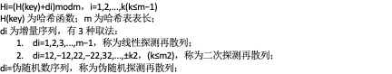
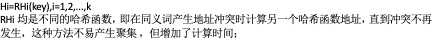
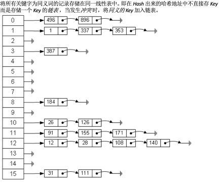
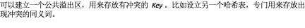
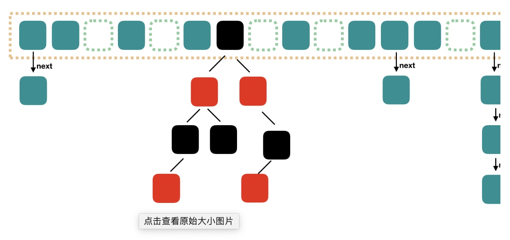
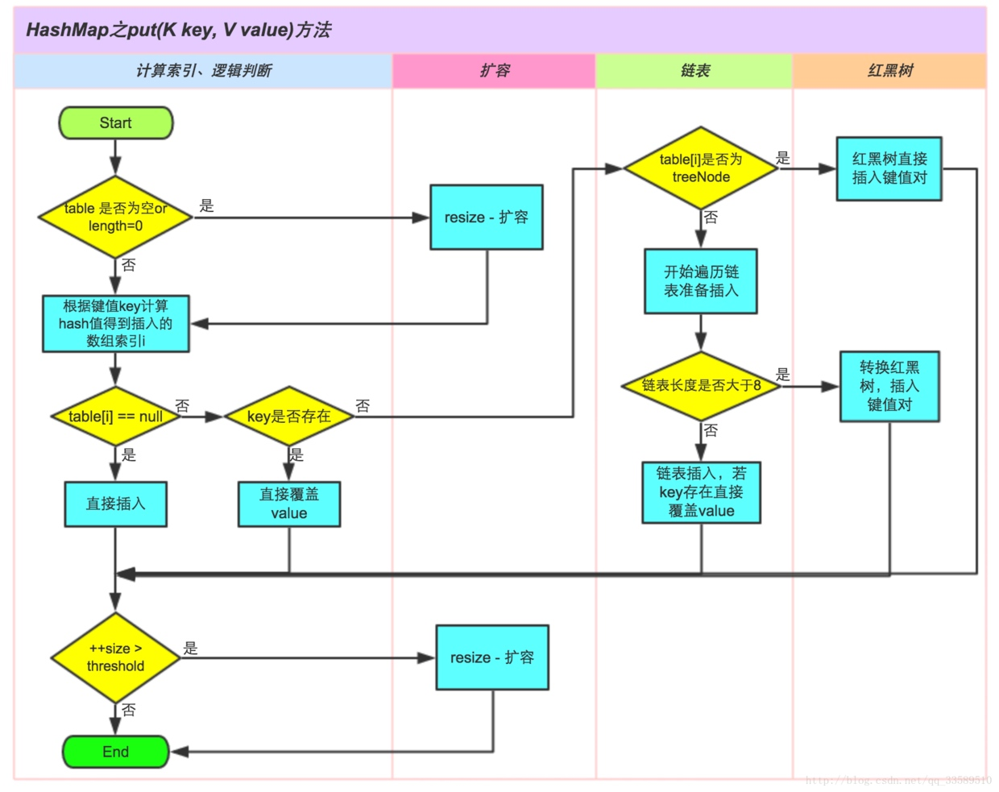

[TOC]
# 哈希表
哈希算法(如md5)：将任意长度的输入值转换为固定长度的输出值。可以用来加密、快速查找；
哈希表：采用哈希算法实现的数据结构，根据设定的hash函数和处理冲突的方式将一组关键字映射到一个有限的地址区间上，并以关键字在地址区间中的映射作为记录在表中的存储位置，这种表称为哈希表或者散列。
# hash函数构造方法
hash函数是一个压缩的映射，随着数据集合的增大，必然会产生冲突。
1. 直接定址法：哈希函数是关键字的线性函数，即f(key)=a*key + b,有多少个关键字就有多少个地址对应，不会产生冲突。一般不采用；
2. 数字分析法：找出关键字的规律，尽可能采用差异数据来构造hash；需要提前知道所有可能的关键字。一般不采用；
3. 平方取中法：求出关键字的平方，然后取平方值的中间几位作为哈希地址。因为平方后的中间几位和关键字中的每一位都有关系，所以不同关键字会以较高的概率产生不同的hash地址。
4. 折叠法：将关键字分为位数相同的几部分(最后一部分可以不同)，然后取这几部分的叠加和作为hash地址。数位叠加可以采用移位叠加-分割后的每一部分的最低位对齐，然后叠加；间接叠加-从一端向另一端沿分割线来回折叠，对齐叠加；
5. 随机数法：取关键字的随机函数值作为hash地址，通常用于关键字长度不同的场合；
6. 除留取余法：k mod p

# 冲突解决
1. 开放定址法


2. 再哈希法：

3. 链地址法：


4. 公共溢出区：


# 查找长度
一般来说，hash表的查找长度与hash函数、解决冲突的方法和装填因子有关；装填因子表示hash表装满的程度，=表中填入的记录数/hash表长度；装填因子越大，发生冲突的可能性也越大；
# hash表大小的选择
最好选择比较大的素数(奇数)作为hash表大小，因为，计算机是用二进制存储数据的，当一个二进制数对一个2的整数幂求模后，结果就是该二进制数的后面几位，前面几位的信息都丢失了，即丢失了一部分信息，进而导致hash表的元素分布不均匀。
因此hashmap在实现的时候，采用了扰动函数对hash函数改写，意图将前面几位和后面几位的信息进行整合，再对2的整数幂求模，获得更好的随机性。
[为啥是素数](https://blog.csdn.net/zhishengqianjun/article/details/79087525#23) ---- 结论：数列元素的分布间隔和模的因子关系会影响冲突概率，素数只有两个因子1和自身，对于随机序列，肯定要选取模的因子最少的素数了。

# 结构


# HashMap源码
# 属性说明
1. 默认的初始容量为16
2. 数组允许的最大容量为1<<30，是2^30，因为Integer.MAX_VALUE=2^31-1,是小于最大值的2的次幂。
3. 装填因子0.75f
4. 链表进行树化时，需要满足条件：链表中元素的个数大于8，且数组容量大于64，否则，会进行resize来解决过多的hash冲突；
5. 树转换为链表的条件：树元素个数小于6
6. modCount：表示HashMap的数据被修改的次数，用于fail-fast机制，在多线程时如果并发修改，会有线程安全问题，操作前判断备份的count和modCount不相等，则抛出异常终止。

## 基本
HashMap实现了Map接口/Cloneable接口(clone方法，浅拷贝)/Serializable接口；
transient Node<K,V>[] table
transient int size
transient int modCount（不会被序列化）
## writeObject && readObject
HashMap实现了Serializable接口，意味着该类可以被序列化。JDK提供的对于java对象序列化操作的类是ObjectOuputStream，反序列化类是ObjectInputStream。ObjectOuputStream对于不同类型提供了不同的序列化方法，如writeBoolean,wrietInt,writeLong等，对于自定义类型，提供了writeObject方法。writeObject方法中会调用writeSerialData方法，该方法中判断了被序列化的对象是否重写了writeObject方法，如果重写则会调用序列化对象自己的writeObject方法(私有的，反射调用)。

writeObject和readObject都是私有的，那么该方法无法被子类重写，子类也可以实现自己的序列化方法，无需关心HashMap的部分。如果是非私有的，那么继承HashMap的子类也会继承该方法，也会强制改为HashMap的序列化方式了。而且，表明为私有，表示只希望被自身调用，不希望被其他类调用，安全性考虑。

为什么要单独实现序列化呢，而不采用jdk默认的序列化？==》 序列化的目的是为了在某一时刻能够反序列化。由于在HashMap中计算某个key的桶位置时用了key.hashcode，在不同的JVM实现中计算出来的hash值可能是不同的，对于跨平台的序列化和反序列化来说，如果采用默认的序列化方式，那么在新的平台上反序列化的结果和旧的平台上是一模一样的。此时在新的平台上去取key1的值，可能会误取到key2的值，造成冲突。而且，避免对整个数组Node对象进行序列化，只序列化具体元素，也可以节省空间(数组大小大于实际元素的数量，类似ArrayList一样，只会序列化有值的元素)。不序列化的包括：Entry[] table,size,modCount

如何解决呢？自己实现writeObject方法，只是将元素个数以及元素的key和value进行序列化，那么在进行反序列化时，会重写计算key对应的桶的位置，重新填充数组。

## tableSizeFor(int cap)
该方法是在HashMap的构造方法中被调用，如果指定了initialCapacity，那么构造方法中会调用tableSizeFor方法，目的是获得大于等于initialCapacity的最小的2的幂。
```java
static final int tableSizeFor(int cap) {
        int n = cap - 1;
        n |= n >>> 1;
        n |= n >>> 2;
        n |= n >>> 4;
        n |= n >>> 8;
        n |= n >>> 16;
        return (n < 0) ? 1 : (n >= MAXIMUM_CAPACITY) ? MAXIMUM_CAPACITY : n + 1;
    }
```
理解：如果cap已经是2的幂，那么经过下面位移操作，将会返回2*cap而不是cap，所以减一。(cap & (cap-1) == 0 则表明是2的幂)。经过一系列位移操作，实际上是将n的第一个1以后的所有低位都置为1，只需要再加1，就能得到2的幂。
[参考文章](https://blog.csdn.net/fan2012huan/article/details/51097331)

## put()
详细的自己看源码，这里只表述大致逻辑。
1. 调用putVal(hash(key),key,value,false,true); 参考hash方法;
2. 首先判断table数组是否为null，如果为null，表明第一次插入数据，则调用resize方法进行扩容从而实现初始化；
3. 计算key在数组中的位置 (n-1)&hash，如果该位置没有元素，则直接新建Node对象存放在该数组中；否则执行4；
4. 判断数组中已有元素和新插入元素的key是否相等(逻辑：先比较Node对象hash值是否相等，再比较引用，最后调用equal方法比较)，如果key相同，则更新value值，方法结束，否则5；
5. 走到这里则表明hash冲突了。判断Node是否为TreeNode实例，如果不是，表明是链表，执行6；否则执行7；
6. 遍历链表中的元素，如果key相同则更新value，方法结束，否则在链表尾部插入Node对象。然后，判断binCount(链表中元素数量)是否大于8，是则调用treeifyBin()方法进行树化。(treeifyBin中首先判断桶的容量是否大于64，是则树化，否则进行resize)，参考treeifyBin方法逻辑；
7. 调用TreeNode的putTreeVal()方法，将新的元素插入到红黑树中。
8. 对于key相同，覆盖旧值的操作不会增加++modCount，也不会引起是否resize的操作；

数组中元素是Node对象，同一个位置重复的元素会作为该Node对象next节点存放。

jdk8采用尾部插入的方式，避免了在并发情况下进行resize时，链表成环，从而出现死循环。(resize前后的链表元素顺序不变)

## get(Object key)
1. 根据hash函数计算key的hash值，然后(n-1)&hash计算key在数组中的位置；
2. 判断数组中的第一个Node的key是否等于查询的key，比较hash || 比较引用 || equals比较，如果等于，则直接返回；否则则遍历链表或者红黑树查找key。(Node instanceof TreeNode)

## remove(Object key)
链表情况：如果table[i] == node，即删除的node在数组中，那么table[i] = node.next;否则，p.next = node.next，即调整链表指针，直接跳过该node。
树：removeTreeNode方法

## treeifyBin()
```java
final void treeifyBin(Node<K,V>[] tab, int hash) {
        int n, index; Node<K,V> e;
        if (tab == null || (n = tab.length) < MIN_TREEIFY_CAPACITY)
            resize();
        else if ((e = tab[index = (n - 1) & hash]) != null) {
            TreeNode<K,V> hd = null, tl = null; //定义首尾节点
            do {
                //节点转换为树节点
                TreeNode<K,V> p = replacementTreeNode(e, null);
                if (tl == null)
                    hd = p;
                else {
                    //双向链表结构，新节点插入到尾部
                    p.prev = tl;
                    tl.next = p;
                }
                tl = p;
            } while ((e = e.next) != null);
            //上面是把单向链表转换为双向链表
            if ((tab[index] = hd) != null) // 替换数组位置上的节点为头节点
                hd.treeify(tab); //参考该方法
        }
    }
```
进入该方法的前提是，链表中元素个数达到8个，会进行树化。如果数组的长度小于最小限制(64)，则通过resize来解决hash冲突。
## 树的操作
[参考这个](https://www.cnblogs.com/mfrank/p/9227097.html)
### treeify(Node<K,V>[] tab)


### putTreeVal()

## resize()
1. table == null，则初始化table数组；否则进行扩容。会将数组容量和阈值扩展为原来的两倍，capacity/threshold << 1；(数组最大容量的2的30次方，而不是2的31次方，当容量达到最大时，threshold会变为Integer.MAX_VALUE = 2^31 - 1，这样后续就不会发生resize操作，直至数组越界异常。为什么不是2^32，是因为最高位作为符号位来表示，小于最大值的2的次幂)；
2. 数组扩容，实际上是申请一个新的数组(此时如果有元素插入进来，会插入到新的数组中，因为在新建新数组后就将引用赋值给全局变量table了)；然后遍历旧数组，取出旧数组中的元素(Node对象包含了hash值)，如果next==null,则重新做一次(newCap-1) & hash的操作，在新数组中找到新的位置存放；否则判断如果是TreeNode，则执行4；是Node，执行3；
3. 将链表元素重新赋值给新的数组，这里取了巧，并不是遍历整个链表的元素然后逐一计算每个Node元素在新数组的位置，而是在遍历链表元素时，分为两个部分，一部分是迁移到新的数组，位置不会发生变化；另外一部分是在新的数组位置发生改变，新的数组位置 = 原来的位置 + 原先数组大小；
```java
Node<K,V> loHead = null, loTail = null;
                        Node<K,V> hiHead = null, hiTail = null;
                        Node<K,V> next;
                        do {
                            next = e.next;
                            if ((e.hash & oldCap) == 0) {
                                if (loTail == null)
                                    loHead = e;
                                else
                                    loTail.next = e;
                                loTail = e;
                            }
                            else {
                                if (hiTail == null)
                                    hiHead = e;
                                else
                                    hiTail.next = e;
                                hiTail = e;
                            }
                        } while ((e = next) != null);
                        if (loTail != null) {
                            loTail.next = null;
                            newTab[j] = loHead;
                        }
                        if (hiTail != null) {
                            hiTail.next = null;
                            newTab[j + oldCap] = hiHead;
                        }
```

    需要明白，新的数组扩容为原来数组大小的2倍，即二进制位上的1向左移动一位；如果hash & oldCap == 0，则hash的oldCap位置上为0，在put新数组时是由hash的后几位决定的，hash没有改变，所以位置也不会变；如果hash & oldCap != 0，即hash的oldCap位置上是1，那么put新数组时，位置是由这个1和hash后面几位决定的，产生了位置偏移，偏移量正好是原先数组的长度，即oldCap；
    从上述源码中可知，是直接链表中的元素直接赋值给table[j]了，也就是说这个时候如果有其他线程在进行put，恰巧也是[j]位置，那么就发生线程安全问题了。
    [解释为啥扩容这样做](https://blog.csdn.net/li_cangqiong/article/details/81876159) ==少了一个对链表每个元素赋值到数组的过程以及解决hash冲突的过程

## hash()
```java
static final int hash(Object key) {
        int h;
        return (key == null) ? 0 : (h = key.hashCode()) ^ (h >>> 16);
    }
```
首先拿到对象的散列值，返回的是32位的int类型，如果直接使用，那么需要40亿的映射空间，内存中是放不下的。在使用之前，需要对数组的长度进行取模运算，得到的余数就是数组的下标。但是取模%运算的效率比较低，为了采用位操作，发现当h是2的N次方时，(h - 1) & hash = hash % h；(h为2的N次方，即1后面有N个0，减一之后，低位是N个1)。问题来了，即便散列值(hashcode)再松散，如果只取最后几位的话，碰撞也会比较严重。因此，将hashcode值无符号右移16位，再与自身异或，就是为了混合原始哈希码的高位和低位，以此来加大低位的随机性。（低位也包含了高位的信息）（测试表明，扰动函数确实有助于减少hash冲突）
（计算机中采用二进制来存储数据，进行位运算时，占用更少的cpu周期，更快）
（X % 2^n = X & (2^n – 1)，X/2^n相当于X右移n位得到的是商，余数则是被移掉的那n位，所以X&（2^n-1）也就是拿到低n位的数字）
注意：这里采用的是无符号位移，也就是说即使hashcode为负数，经过hash之后也一定为正数了。

# 线程安全问题
1. 在put数据时，A和B线程同时进行put，假设两个线程put的key经过hash运算后值是一样的，A线程执行到获取桶中的元素，发现为null，此时B线程也执行到这里了，也发现该位置的元素为null，然后A和B线程交叉执行赋值操作，总会有一个线程的值被覆盖掉了。（单核机器）
2. resize时，两个线程都在执行resize操作，然后申请新的数组赋值给全局变量table，导致其中一个线程的数组丢失；
3. resize引起的死循环（jdk7引起，尾部遍历，jdk8没有了，采用了头尾两个指针）
    jdk7在插入元素时，采用的是头部插入，即数组中存储的Node是最近插入的。可能是因为最近插入的是最有可能被使用的。jdk8采用尾部插入的方式了，即数组中存储的元素是最一开始的节点。
    jdk7在resize时，转移操作=遍历旧链表 + 依次在新链表头部插入，即扩容前后，链表顺序是相反的；多线程时会出现环形链表，死循环。jdk8，扩容前后链表元素顺序不变。
[参考jdk7的死循环问题](https://www.cnblogs.com/andy-zhou/p/5402984.html)

# 线程安全问题解决
1. ConcurrentHashMap
2. Collections.synchronizedMap


# 链表转换为红黑树（树化）
数组+链表/数组+红黑树：链表查询O(N)，红黑树O(logN)
当链表中的元素个数超过8，则转换为红黑树；当元素个数小于6，则转换为链表；
从源码中作者的注释可以知道，当hashcode离散性很好时，数据会均匀的分布在桶中，几乎不会有桶中的链表长度达到阈值；但是对于随机的hashcode，离散性可能变得很差，然而jdk又不能阻止用户实现这种不好的hash算法，因此可能导致不均匀的数据分布。不过理想情况下，随机hashcode算法下的所有桶中结点的分布频率会遵循泊松分布式，一个桶中链表长度达到8个元素的概率为亿分之6，几乎不可能发生的。
个人理解：当小于8个节点时，链表平均查找长度为n/2=3，红黑树为log(n)=3，相差不大；为什么是小于6而不是8时将红黑树转换为链表呢？可能是担心频繁的插入和删除，链表和树之间不停的转换，对性能有损耗吧。
或者是，在空间和查找复杂度之间的权衡，树占用的空间要比链表大，而且发生hash冲突的毕竟比较少。所以作者在设计时，是优先扩容，如果扩容后还没解决hash冲突才会将链表进行树化。
（ps:这里的链表插入是尾部插入，一样需要遍历所有的元素进行比较，是O(N)，而红黑树的插入只需要O(logN)）

<font color="#ff00">注意：</font>
链表进行树化后，TreeNode节点中依然维护着链表的结构(pre,next，双链表），为的是从树转换为链表的时，直接用next连接即可。
[参考这里](https://www.jianshu.com/p/2674f3e6d57c)
# 红黑树转换为链表（链表化）
入口有两个地方：1. 执行删除操作时，remove  2. resize操作时
bin个数小于等于6时就进行链表化。
## 问题
1. hashmap数组长度为什么是2的n次方
2. hash()函数如何实现的
3. 有哪些印象比较深刻的位移操作
当传入capacity时，hashmap会选取大于该值的最小的2次幂作为初始化大小；hash函数的过程；resize过程
1. resize时，链表元素的映射原理
2. hash冲突怎么解决
3. 链表和红黑树

# 参考
[jdk8的hashmap分析](http://www.tianxiaobo.com/2018/01/18/HashMap-%E6%BA%90%E7%A0%81%E8%AF%A6%E7%BB%86%E5%88%86%E6%9E%90-JDK1-8/#%E7%BA%A2%E9%BB%91%E6%A0%91%E9%93%BE%E5%8C%96)

 