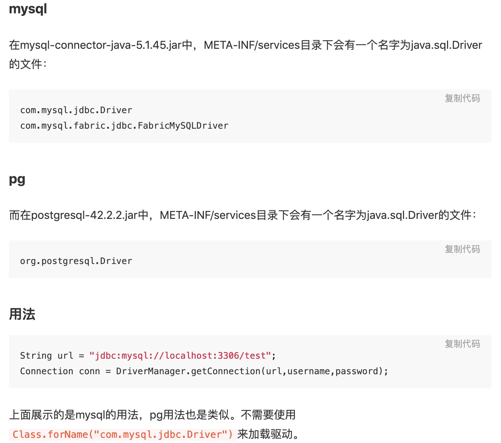

[TOC]
# JNDI理解
[JNDI理解](https://www.cnblogs.com/wlzjdm/p/7856356.html)
JNDI即Java Naming and Directory Interface（JAVA命名和目录接口），那么java命名目的就是为了记录一些不方便记录的内容，就像人的名字或DNS中的域名与IP的关系。
从数据源连接认识JNDI，但是认识完JNDI后，一定要跳出来，JNDI是一个命名目录接口，提供与外界的一个访问关系，只要相关应用、设备能提供服务，那么我们就可以通过JNDI来连接处理。
JNDI 提出的目的是为了解藕，是为了开发更加容易维护，容易扩展，容易部署的应用。
JNDI 是一个sun提出的一个规范(类似于jdbc),具体的实现是各个j2ee容器提供商，sun   只是要求，j2ee容器必须有JNDI这样的功能。 
JNDI 在j2ee系统中的角色是“交换机”，是J2EE组件在运行时间接地查找其他组件、资源或服务的通用机制。 
JNDI 是通过资源的名字来查找的，资源的名字在整个j2ee应用中(j2ee容器中)是唯一的。

# SPI
[java SPI源码解析](https://cxis.me/2017/04/17/Java%E4%B8%ADSPI%E6%9C%BA%E5%88%B6%E6%B7%B1%E5%85%A5%E5%8F%8A%E6%BA%90%E7%A0%81%E8%A7%A3%E6%9E%90/)
[JDK和Spring中SPI的实现原理和区别](https://my.oschina.net/kipeng/blog/1789849)
SPI 全称为 (Service Provider Interface) ，是JDK内置的一种服务提供发现机制，是Java提供的一套用来被第三方实现或者扩展的API，它可以用来启用框架扩展和替换组件。SPI是一种动态替换发现的机制， 比如有个接口，想运行时动态的给它添加实现，你只需要添加一个实现。我们经常遇到的就是java.sql.Driver接口，其他不同厂商可以针对同一接口做出不同的实现，mysql和postgresql都有不同的实现提供给用户，而Java的SPI机制可以为某个接口寻找服务实现。
Java SPI 实际上是“基于接口的编程＋策略模式＋配置文件”组合实现的动态加载机制
SPI的核心思想就是解耦。

# 如何使用
1. 当服务提供者提供了接口的一种具体实现后，在jar包的META-INF/services目录下创建一个以“接口全限定名”为命名的文件，内容为实现类的全限定名；
2. 接口实现类所在的jar包放在主程序的classpath中；
3. 主程序通过java.util.ServiceLoder.load()动态装载实现模块，它通过扫描META-INF/services目录下的配置文件找到实现类的全限定名，把类加载到JVM；
4. SPI的实现类必须携带一个不带参数的构造方法；

# 原理
ServiceLoader先判断成员变量providers对象中(LinkedHashMap类型)是否有缓存实例对象，如果有缓存，直接返回。
如果没有缓存，执行类的装载：
* 读取META-INF/services/下的配置文件，获得所有能被实例化的类的名称
* 通过反射方法Class.forName()加载类对象，并用instance()方法将类实例化
* 把实例化后的类缓存到providers对象中(LinkedHashMap类型）然后返回实例对象。

# 应用案例
适用于：调用者根据实际使用需要，启用、扩展、或者替换框架的实现策略
数据库驱动加载接口实现类的加载
JDBC加载不同类型数据库的驱动
日志门面接口实现类加载
SLF4J加载不同提供商的日志实现类
Spring
Spring中大量使用了SPI,比如：对servlet3.0规范对ServletContainerInitializer的实现、自动类型转换Type Conversion SPI(Converter SPI、Formatter SPI)等
Dubbo
Dubbo中也大量使用SPI的方式实现框架的扩展, 不过它对Java提供的原生SPI做了封装，允许用户扩展实现Filter接口

当服务的提供者提供了一种接口的实现之后，需要在classpath下的META-INF/services/目录里创建一个以服务接口命名的文件，这个文件里的内容就是这个接口的具体的实现类。当其他的程序需要这个服务的时候，就可以通过查找这个jar包（一般都是以jar包做依赖）的META-INF/services/中的配置文件，配置文件中有接口的具体实现类名，可以根据这个类名进行加载实例化，就可以使用该服务了。JDK中查找服务实现的工具类是：java.util.ServiceLoader。

DriverManager是jdbc里管理和注册不同数据库driver的工具类。针对一个数据库，可能会存在着不同的数据库驱动实现。我们在使用特定的驱动实现时，不希望修改现有的代码，而希望通过一个简单的配置就可以达到效果。
在使用mysql驱动的时候，会有一个疑问，DriverManager是怎么获得某确定驱动类的？我们在运用Class.forName("com.mysql.jdbc.Driver")加载mysql驱动后，就会执行其中的静态代码把driver注册到DriverManager中，以便后续的使用。
在JDBC4.0之前，连接数据库的时候，通常会用Class.forName("com.mysql.jdbc.Driver")这句先加载数据库相关的驱动，然后再进行获取连接等的操作。而JDBC4.0之后不需要Class.forName来加载驱动，直接获取连接即可，这里使用了Java的SPI扩展机制来实现。
在java中定义了接口java.sql.Driver，并没有具体的实现，具体的实现都是由不同厂商来提供的。

Class.forName()主要是做类加载的操作，（加载-验证-准备-解析-初始化）(newInstance才会进行实例化)，会调用Driver的静态代码块，在静态代码块中调用了registerDriver()方法，会将驱动信息保存在集合中，然后在getConnection方法中会使用这个驱动信息。

# 缺点
我们使用SPI查找具体的实现的时候，需要遍历所有的实现，并实例化，然后我们在循环中才能找到我们需要实现。这应该也是最大的缺点，需要把所有的实现都实例化了，即便我们不需要，也都给实例化了。