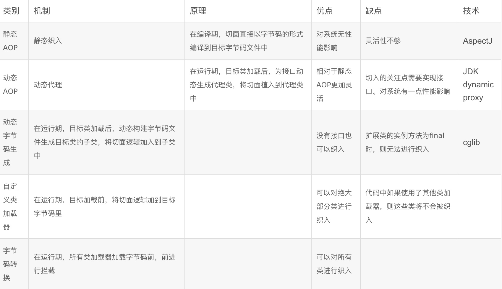

[TOC]
# 动态代理实现
JDK动态代理使用简单，它内置在JDK中，因此不需要引入第三方Jar包，但相对功能比较弱。CGLIB和Javassist都是高级的字节码生成库，总体性能比JDK自带的动态代理好，而且功能十分强大。ASM是低级的字节码生成工具，使用ASM已经近乎在于使用Javabytecode编程，对开发人员要求较高，也是性能最好的一种动态代理生辰工具。但ASM的使用是在过于繁琐，而且性能也没有数量级的提升，与CGLIB等高级字节码生成工具相比，ASM程序的可维护性也较差。
java中主要
## JDK代理
### JDK静态代理
* 实现
    代理类和被代理类需要实现同一个接口，代理类中持有被代理类的引用，从而在目标方法执行前后进行增强，客户端通过调用代理类来执行方法。
* 缺陷
    1. 静态代理只能为一个类服务，如果需要代理的类很多，那么需要编写大量的代理类。当然，也可以通过一个代理类实现多个接口，但是会导致代理类过于庞大，且不符合单一职责的原则。
    2. 当接口需要增加删除修改方法时，目标对象和代理类需要同时修改，不易维护。
    静态代理类在编译的时候就已经对应的代理类。
    
* 优点
    1. 客户端只需要关心代理即可，解耦，通过代理可以对原先的类进行增强。
    
### JDK动态代理
jdk动态代理是基于接口实现的，要求被代理的类必须实现接口。
代理类需要实现InvocationHandler接口，重写invoke方法，invoke方法会传入代理对象、方法名称和参数决定调用代理的哪个方法。
#### 使用
接口
```java
public interface IHello {
    public void sayHello();
}
```
被代理类
```java
public class HelloImpl implements IHello {
    public void sayHello() {
        System.out.println("Hello World...");
    }
}
```
代理类(可以代理多个不同的接口)
```java
public class ProxyHandler implements InvocationHandler {
    private Object target;
    public ProxyHandler(Object target) {
        this.target = target;
    }
    public Object proxyInstance() {
        return Proxy.newProxyInstance(target.getClass().getClassLoader(),
                target.getClass().getInterfaces(), this);
    }
    public Object invoke(Object proxy, Method method, Object[] args)
            throws Throwable {
        System.out.println("aspect before ... ");
        Object result = method.invoke(this.target, args);
        System.out.println("aspect after ... ");
        return result;
    }
}
```
测试
```java
public class Main {
    public static void main(String[] args) {
        ProxyHandler proxy = new ProxyHandler(new HelloImpl());
        IHello hello = (IHello) proxy.proxyInstance();
        hello.sayHello();
    }
}
```
    
#### Proxy源码解析
[Java 动态代理 原理解析](https://www.jianshu.com/p/e63b0685e8ee)
核心方法：Proxy.newProxyInstance
返回值：代理类实现了业务接口并继承Proxy类，对接口中的每个方法都进行代理，并自动生成了equals、toString、hashcode方法；

首先调用getProxyClass0()方法生成代理类的Class对象，然后通过反射生成代理类的实例对象，并返回。

getProxyClass0()首先被代理类实现的接口数量是否小于65535(接口个数用2个byte存储)，然后通过classLoader获取该classLoader下所有的代理类缓存map，从代理类缓存map中根据代理类实现的所有接口来查找代理类，如果没有找到，则会生成代理类。
通过ProxyGenerator.generateProxyClass()方法动态生成代理类字节码，然后通过defineClass方法将字节码数组流生成代理类的Class对象，并返回。
ProxyGenerator.generateProxyClass()在生成代理类字节码时，会默认添加三个代理方法：hashCode、equals和toString方法。然后迭代所有的接口，将接口中的所有方法都生成代理方法。
可以自己调用ProxyGenerator.generateProxyClass()方法将动态生成的代理类持久化到磁盘中，然后反编译查看代理对象。发现代理对象中的每个方法都会调用this.h.invoke(this, m3, null)方法来执行逻辑，h为代理类的父类Proxy的InvocationHandler，然后调用其invoke方法，即最终就是调用handler的invoke方法。**这里，我们就可以发现，当我们调用$proxy0.sayHello()方法时，最终是调用invoke()方法，这个逻辑是在生成代理类的字节码时实现的。**

接口定义的方法互相调用不会调用到InvocationHandler的invoke方法，即无法实现嵌套代理。

#### 为什么只能针对接口呢
在生成代理类的过程中，会对接口中的每个方法生成对应的代理方法，最终生成的代理类实现了该接口，这个是预先定义好的规则，因此后续也必须遵守这个规则。

#### 优缺点
优点：
1. 扩展性好。

缺点：
1. 只能代理实现接口的类，没有实现接口的类不能通过JDK动态代理。
2. 反射在性能上有一定程度的性能损耗。

### 异同点
jdk静态代理需要指定对哪个类进行代理，在编译时就已经创建了对应的代理类；动态代理则是在运行时利用反射机制创建代理类。

### 应用
* JDK动态代理
    1. 当需要对很多类进行代理实现某个功能，如日志打印、耗时监控等，可以采用动态代理；如果采用静态代理，那么需要很多代理类；
    2. Spring AOP的实现；
    3. RPC即远程过程调用，它的实现中使用到了动态代理。实际上RPC框架要解决的一个问题就是: 如何调用他人的远程服务？像调用本地服务一样调用远程服务。如何封装数据，通过网络传输给远程服务，使远程接口透明，这就需要动态代理的帮助了。所以透明化远程服务调用就是要利用动态代理，在代理层对数据进行封装，网络传输等操作。
     
## CGLIB动态代理
JDK动态代理只能代理 实现了接口 的类，如果类没有实现接口，则无法使用JDK动态代理。CGLIB是针对类进行代理的，原理是对指定的目标类生成一个子类，并覆盖其中的方法进行增强，但是因为采用继承，所以类和方法不能用final修饰。
cglib是一种基于ASM的字节码生成库，用于生成和转换Java字节码.

### 实现
```java
public Object getInstance(Object target){
    this.target = target;
    Enhancer enhancer = new Enhancer();
    enhancer.setSuperclass(this.target.getClass());
    //设置回调方法
    enhancer.setCallback(this);
    //创建代理对象
    return enhancer.create();
}
```

设置回调方法
```java
@Override
public Object intercept(Object o, Method method, Object[] objects, MethodProxy methodProxy) throws Throwable {
    System.out.println("UserFacadeProxy.intercept begin");
    methodProxy.invokeSuper(o,objects);
    System.out.println("UserFacadeProxy.intercept end");
   return null;
}
```

## Javassist
javassist是一个运行时编译库，可以动态的生成或修改类的字节码。它有两种实现动态代理的方案： javassist提供的动态代理接口和javassist字节码。
因为javassist提供动态代理接口比较慢，所以这里主要分析javassist字节码，先不考虑其动态代理接口。

# 比较
jdk动态代理只能针对实现接口的类生成代理，利用了java反射机制；
cglib动态代理(字节码生成)则是基于ASM字节码生成框架实现的，生成目标类的子类作为代理类，并重新父类的方法，所以目标类和方法不能是final的。
JDK动态代理创建速度优于CGLIB动态代理，但是在函数的调用性能上远不如CGLIB和Javassist。故CGLIB和Javassist整体性能上比JDK动态代理好。
它们都是通过字节码生成来实现动态代理的。只不过是它们生成的字节码不一样，像JDK，CGLIB都考虑了很多因素，以及继承或包装了自己的一些类，所以生成的字节码非常大，而我们很多时候用不上这些，手工生成的字节码非常小（Javassist是手工生成的字节码），所以速度快。
另外，ASM也是手工生成的字节码，速度也很快，但是它没有一个数量级，通常情况下选用Javassist生成字节码的方式。

# 代理的比较
类的编写到运行大致经过：java文件经过编译后变为字节码文件，然后类加载器加载class文件到内存中生成Class对象（类加载），最后进行类的实例话生成实例对象。
所以生成代理有三个思路：1 编译期修改源代码 2 字节码加载前修改字节码 3 字节码加载后动态创建代理类的字节码



# 面试题
## 描述动态代理的几种实现方式？分别说出相应的优缺点
代理可以分为 "静态代理" 和 "动态代理"，动态代理又分为 "JDK动态代理" 和 "CGLIB动态代理" 实现。
静态代理：代理对象和实际对象都继承了同一个接口，在代理对象中指向的是实际对象的实例，这样对外暴露的是代理对象而真正调用的是 Real Object

优点：可以很好的保护实际对象的业务逻辑对外暴露，从而提高安全性。
缺点：不同的接口要有不同的代理类实现，会很冗余

JDK 动态代理：
为了解决静态代理中，生成大量的代理类造成的冗余；
JDK 动态代理只需要实现 InvocationHandler 接口，重写 invoke 方法便可以完成代理的实现，


jdk的代理是利用反射生成代理类 Proxyxx.class 代理类字节码，并生成对象


jdk动态代理之所以只能代理接口是因为代理类本身已经extends了Proxy，而java是不允许多重继承的，但是允许实现多个接口

优点：解决了静态代理中冗余的代理实现类问题。

缺点：JDK 动态代理是基于接口设计实现的，如果没有接口，会抛异常。

CGLIB 代理：
由于 JDK 动态代理限制了只能基于接口设计，而对于没有接口的情况，JDK方式解决不了；

CGLib 采用了非常底层的字节码技术，其原理是通过字节码技术为一个类创建子类，并在子类中采用方法拦截的技术拦截所有父类方法的调用，顺势织入横切逻辑，来完成动态代理的实现。
实现方式实现 MethodInterceptor 接口，重写 intercept 方法，通过 Enhancer 类的回调方法来实现。
但是CGLib在创建代理对象时所花费的时间却比JDK多得多，所以对于单例的对象，因为无需频繁创建对象，用CGLib合适，反之，使用JDK方式要更为合适一些。
同时，由于CGLib由于是采用动态创建子类的方法，对于final方法，无法进行代理。
优点：没有接口也能实现动态代理，而且采用字节码增强技术，性能也不错。
缺点：技术实现相对难理解些。

## AOP 拦截器 代理之间的关系
aop:面向切面编程，有一系列的规范和配置;
拦截器：一种机制，简单理解就是在待“执行的方法”的前后各调用一个方法，before()、after();
代理：在不破坏原有类方法封装的前提下，使用代理模式调用原有类的方法，在执行方法前调用 before() ,执行后调用 after();
之间关系：要实现 aop 需要使用代理模式，实现代理模式就需要用到拦截器；


