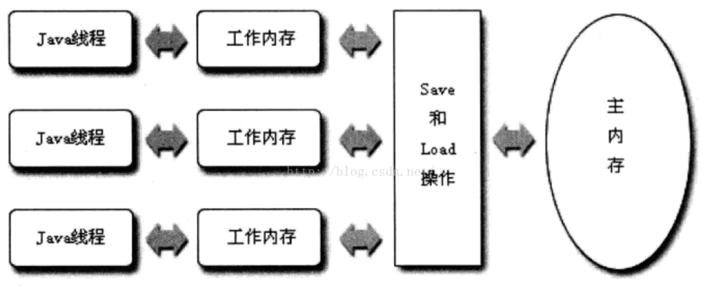

[TOC]
# 线程状态流转
https://blog.csdn.net/pange1991/article/details/53860651
# 内存模型
java内存模型分为主内存和工作内存，主内存是所有线程共享的区域，工作内存是java线程独有的，在工作内存中存有主内存的部分数据拷贝。
java线程无法直接操作主内存，需要通过工作内存来完成，线程间变量值的传递均需要通过主内存来完成。(工作内存可以使用cpu高速缓存，速度更快)

# 生产者消费者模式
生产者和消费者是不同的处理线程，生产者负责生产数据，消费者负责消费数据。如果队列满了，则生产者需要等待，如果队列为空，消费者需要等待；
1. wait && notify 要求对同一个对象加锁，锁内部执行wait和notifyAll操作；
2. lock notFullCondition notEmptyCondition
3. blockingQueue
4. mutexSemaphore notFullSema notEmptySema
[五种实现方式](https://juejin.im/entry/596343686fb9a06bbd6f888c)
注：semaphore(0)表示开始执行acquire时就阻塞，release后就可以继续执行；许可证为1类似于互斥锁；

# Lock
lock阻塞等待，不能被中断，和synchronized一样
lockInterruptibly阻塞等待，但是可以被中断
需要显示的加锁和释放锁，而且释放锁需要在finally中进行，防止抛出异常，锁没有释放。