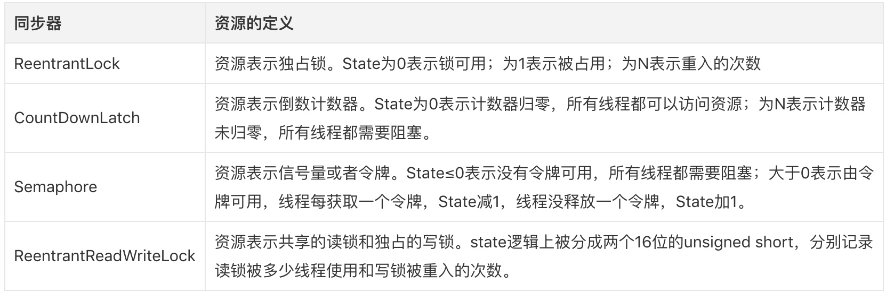

[TOC]
# 参考
[AQS综述](https://segmentfault.com/a/1190000015562787)
# 简介
## 说明
AbstractQueuedSynchronizer简称AQS，JUC包中的大多数同步器都是基于AQS来构建的。ReentrantLock,CountDownLatch,ReentrantReadWriteLock,Semaphore等同步器，其实都是通过内部类实现了AQS框架暴露的API，以此实现各类同步器功能。AQS框架提供了一套通用的机制来管理同步状态（synchronization state）、阻塞/唤醒线程、管理等待队列。

CyclicBarrier是依赖Lock实现的。
## 模版框架
对于AQS框架的使用者来说，不需要关心内部复杂的细节。AQS利用了模版方法模式实现了这一点，其大多数方法都是final或private的，Doug Lea不希望用户直接使用这些方法，而是只覆盖部分模版规定的方法来实现自己的功能。
# 源码分析
## 以ReentrantLock为例进行分析