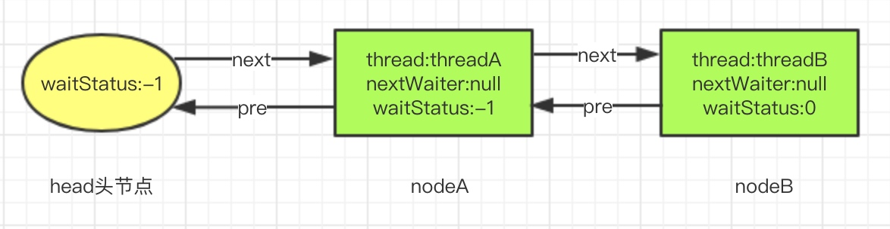
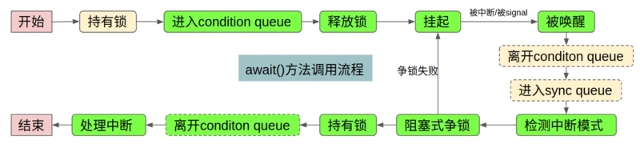
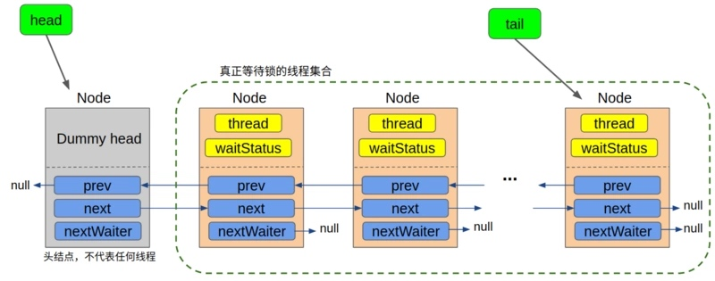
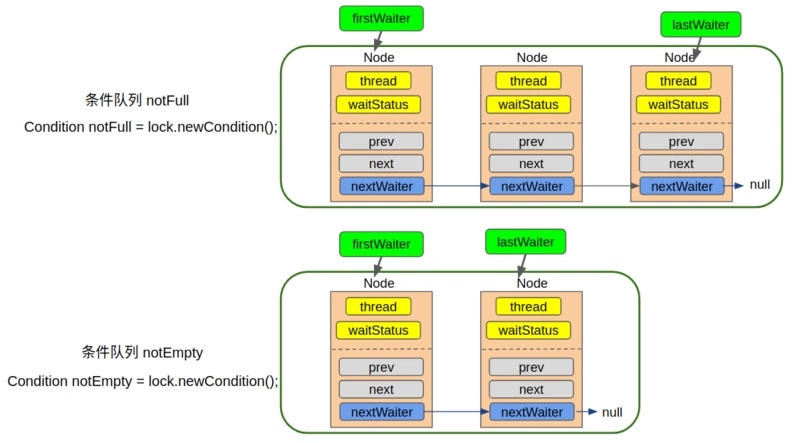

[TOC]
# 简介
ReentrantLock实现了Lock接口，是可重入的独占锁，与synchronized类似，但是功能更强大。ReentrantLock内部通过内部类实现了AQS框架(AbstractQueuedSynchronizer)的API来实现独占锁的功能。
本文从ReentrantLock出发，比较完整的分析了AQS内部独占锁的实现，总体来说实现的思路很清晰，就是使用了标志位+队列的方式来处理锁的状态，包括锁的获取，锁的竞争以及锁的释放。在AQS中，state可以表示锁的数量，也可以表示其他状态，state的含义由子类去定义，自己只是提供了对state的维护。AQS通过state来实现线程对资源的访问控制，而state具体的含义要在子类中定义。
AQS在队列的维护上的实现比较复杂，尤其是节点取消时队列的维护，这里并不是通过一个线程来完成的。同时，AQS中大量的使用CAS来实现更新，这种更新能够保证状态和队列的完整性。
AQS内部维护了两种队列，分别是等待队列和条件队列；对于一个Lock只会有一个等待队列，但是可以有多个Condition对象，因此可以有多个条件队列。

# 公平和非公平锁
公平锁：多线程竞争同一把锁，按照线程 先来后到 的顺序，先到的线程先获取锁，后到的线程后获取锁，不会有线程饿死的情况发生；
非公平锁：多线程竞争同一把锁，获得锁的线程是随机的（底层OS调度）
公平锁相比非公平锁来说，具有较低的吞吐量，因为此时在线程调度上面的开销比较大。
case：假设a线程获得了锁，b线程正在等待锁，在a锁释放的时候进行notify，如果此时来了c线程，如果采用非公平策略，那么c线程可以立即获得锁，线程c使用完后并释放锁，线程b可能刚刚唤醒完成，此时线程b又可以获得锁执行任务，无缝衔接，系统吞吐量提升，性能好；但是，如果采用公平策略，即使c线程可以立即获得锁使用，c线程也不会那样做，而是进行等待，等待b线程完成后再获取锁执行，系统吞吐量低。（在恢复一个被挂起的线程与该线程真正运行之间存在着严重的延迟，cpu需要在用户态和内核态进行切换，影响效率。切换的时候涉及上下文信息保存，参数传递和返回）[CPU上下文切换](https://segmentfault.com/a/1190000017457234)
因此，当线程持有锁的时间相对较长或者线程请求锁的平均时间间隔较长时，可以考虑使用公平策略。此时线程调度产生的耗时间隔影响会较小。
# 问题
1. 解锁时，如果head的后继结点已经被取消，那么会采用尾部遍历的方式找到最靠前waitStatus<=0的结点进行唤醒，为什么采用尾部遍历？
   因为对于刚刚加入队列的结点，入队并不是原子操作，首先设置node的前驱结点，然后cas操作将当前节点设置成新的尾节点，最后再将前驱结点的next指针指向当前节点；如果cas操作后，第三步还没来得及执行，unparkSuccessor唤醒线程的方法就开始执行了，pred.next的值还没有设置为node，所以从前向后遍历是无法遍历到尾部结点的；但是此时尾结点已经设置完成了，从尾部遍历是可以遍历到了。（即多线程并发情况下，如果一个节点的next属性为null，并不能保证其是尾节点，但是一个节点能够入队，那么其pre属性一定有值的）
   但是如果从尾部遍历，此时如果新的节点进来了，是无法遍历到的，但是不影响，因为新插入的节点还是会重新尝试获取锁的。
   
## 底层实现
依赖AQS框架实现，AQS是对CLH队列进行了优化，CLH队列的后继结点需要监听前驱结点的状态位来进行操作，但是如果内存中这两个节点相差比较远，那么会有性能影响。AQS底层将每个线程封装为一个Node节点组成双向链表，前驱结点的waitStatus表示后继结点的后续的操作状态，如果小于0表示后继结点需要被唤醒，会调用LockSupport.unpark(thread)唤醒指定的线程对象，不需要后继结点监听。对于Node结点取消时，会将该节点自身的waitStatus设置为1表示取消，而不是设置前驱结点。
# 源码
ReentrantLock中有抽象内部类Sync继承了AQS类，Sync有两个内部类的实现，分别是FairSync和NonfairSync，表示公平和非公平锁的实现。
[主要参考-多个线程获取和释放锁的流程](https://segmentfault.com/a/1190000015804888#articleHeader9)
[释放锁的补充](https://segmentfault.com/a/1190000015752512#articleHeader4)
[比较完整,有取消锁的变化图](http://www.ideabuffer.cn/2017/03/15/%E6%B7%B1%E5%85%A5%E7%90%86%E8%A7%A3AbstractQueuedSynchronizer%EF%BC%88%E4%B8%80%EF%BC%89/)
## lock()
1. 底层调用LockSupport.park()进行阻塞等待，该方法能够响应中断，但是不抛出异常，只是修改标志位，此时阻塞的线程会中断唤醒后，由于最外层的for(;;)的死循环，所以会再次尝试获取锁，如果没有获取到，则再次被挂起。如果线程在阻塞期间被中断过，那么会保留这个中断的状态，具体抛不抛出中断异常由上层决定，业务也能够根据这个中断状态进行决策。
2. 无论是公平锁还是非公平锁，每次都是唤醒队列首位的元素，而不是唤醒所有线程，避免了激烈的竞争；只不过公平锁在获取锁的时候需要判断队列中是否有其他线程在本线程前面，而非公平锁是直接尝试CAS修改同步器的状态，不会关心队列中是否有线程。

### 公平锁
线程A尝试获取锁时，首先判断同步器的状态state是否为0，0表示锁未被占用，1表示被占用；如果是0，则判断等待队列中的当前线程前有无其他线程，没有，则CAS更新state状态0到1，更新成功则设置当前线程为锁的持有线程；
如果是1，则判断锁的持有线程是否为本身，是，则将state加1，表示重入线程的数量；
如果获取锁失败，则调用addWaiter方法，将当前线程封装为Node结点，模式设置为独占锁(即nextWaiter指针为null)，利用自旋和cas将node结点加入队列尾部；(自旋是为了防止并发插入)
然后调用acquireQueued方法进行再次获取锁以及决策是否进行挂起(因为线程的挂起和恢复需要cpu在内核态和用户态切换，性能差，所以最后才会选择挂起代替自旋)。如果当前线程是等待队列的首个结点，则调用tryAcquire方法尝试获取锁，如果获取成功，则将head结点置为当前Node结点，返回；如果不是首个结点或者获取锁失败，则判断是否需要阻塞线程，阻塞一个线程的前提是更新其前驱结点的waitStatus为-1，表示后续需要唤醒下一个节点，然后调用LockSupport.park(this)方法阻塞当前线程；
<br><font size='2'>waitStatus取值：0-初始状态，默认值，1-取消，表示当前节点被中断或者超时，需要移除队列;-1-发信号，表示后继结点被阻塞，需要唤醒;-2-condition专用，表示当前节点在condition队列中，因为等待某个条件而阻塞。</font></br>
如果线程被唤醒后，会调用Thread.interrupted()方法，如果阻塞期间被中断过，那么会清除中断标志位，并返回true，否则返回false；然后线程又开始自旋操作尝试获取锁，获取锁成功后会将头节点置为当前节点，并清除线程信息。最后，如果被中断过，那么调用Thread.currentThread.interrupt()方法重新中断线程。
最后在finally会调用cancelAcquire(node)方法，如果获取锁过程抛出异常或者中断退出，则会取消当前节点的获取锁操作，该方法主要是将当前节点的waitStatus置为1表示取消，如果当前节点是尾节点则直接删除（cas失败没关系，这里不会重试，因为已经改了状态，下次新的节点会跳过已取消的节点），如果当前节点不是head的后继结点，则通过移动next进行删除；如果是head的后继结点，则尝试进行unparkSuccessor(node)的操作。

### 非公平锁
和公平锁的区别：
1. 公平锁获取锁时会判断等待队列中是否有排在当前线程前面的线程，如果没有，才会获取锁。非公平锁获取锁时，不关心等待队列中是否有线程在等待，直接尝试修改同步器的状态。

### 场景
假设锁已经被线程C获取到，此时线程A和线程B来获取锁，此时队列如下图所示：


注意：
1. 锁释放后，只会唤醒threadA，threadB依然阻塞；
2. threadA获取到锁后，head = nodeA，nodeA.thread=null,nodeA.pre=null;
3. 线程挂起，前提是其前驱结点的waitStatus为-1；
## unlock()
释放锁时，会将同步状态(state)减1，如果state=0表示没有线程占用锁，则清除占有线程，更新状态值；只有在state=0时才会执行unparkSuccessor方法，唤醒队列首个结点。首先，会将head结点的waitStatus从-1变为0（cas操作），正常情况下会唤醒head结点的后继结点，但是如果后继结点的waitStatus大于0，说明该节点已经被取消了，那么会从队列尾部进行遍历，向前找到第一个未被CANCELLED的结点进行唤醒。

## lockInterruptibly()
锁可中断，如果线程在阻塞过程中被中断，那么会抛出InterruptedException异常。和不可中断锁的实现区别在于，LockSupport.park()方法响应中断后，不可中断锁只是用一个变量记录了是否被中断过，然后向上层传递；而可中断锁在获取中断事件后，会主动抛出InterruptedException异常。

## tryLock(timeout)
tryLock如果不带参数，如果没有获取到锁那么立即返回false，不会等待；带有超时时间的tryLock，会在给定时间内进行等待，如果依然没有获取到锁，则返回false；
原理是，用当前的时间戳和deadline进行比较，如果小于则直接返回了；注意，在进行park前，会判断deadline-System.nanoTime()<1000，是则直接返回false，不会进行挂起操作。最终调用LockSupport.parkNanos(this,nanosTimeout)进行限时等待。

## newCondition()
[主要参考-Condition接口实现](https://segmentfault.com/a/1190000016462281)
JUC包提供了Condition接口用以对原生的Object.wait()和Object.notify()进行增强。Condition接口的实现类在AQS中--ConditionObject，ReentranLock的newConditon方法其实是创建了一个AbstractQueuedSynchronizer.ConditionObject对象，相当于创建了一个条件队列。ConditionObjec有两个重要属性，
```java
/** 条件队列的队头 */
private transient Node firstWaiter;
/** 条件队列的队尾 */
private transient Node lastWaiter;
```
## Condition.await()
1. 将当前线程封装为Node节点加入到条件队列尾部中，Node的waitStatus=-2，通过nextWaiter连接。（这里没有cas，因为不存在并发，同一时刻只有一个线程有锁）
2. 释放当前线程占用的锁fullyRelease。这里是完全释放，不论一个线程重入几次，都会释放锁(如果在等待队列的首个节点)；这里就是tryRelease(args)的args的作用，args此时传入的不是1，而是state的值；该方法会抛出IllegalMonitorStateException异常，这里校验了调用await方法必须是持有锁的线程Thread.currentThread() == getExclusiveOwnerThread()；然后进入finally模块，将Node的状态改为cancelled状态，这样也不会等待了；
3. 判断当前线程是否在等待队列中，如果不在才会调用LockSupport.park(this)把当前线程挂起，否则不会执行挂起操作；(因为在第二步已经释放了锁，那么其他线程可以获得锁然后执行signal操作，signal会把条件队列的线程移动到等待队列中，因此这里需要判断是否在等待队列中，如果都已经在等待队列中，那么不需要再调用挂起操作了)
4. 如果被唤醒了(可能是中断可能是signal，signal中不一定会调用unPark)，则会尝试重新获取锁，获取不到则进入等待队列中再次挂起；获取到了，则会从头遍历清空 条件队列 中的非Condition结点；（这里传入的需要获取锁的重入数量是savedState，即之前释放了多少，这里就需要再次获取多少）
5. 中断这里可以参考[Condition接口实现部分](https://segmentfault.com/a/1190000016462281)。
await方法虽然能够响应中断，但不是一定抛出中断异常。
        发生中断时，如果此时没有被signal(检查waitStatus状态即可)，则中断模式为THROW_IE，不是立即抛出中断异常，而是尝试获取锁，获取锁失败则会一直阻塞，只有在获取锁成功然后退出await方法时才会抛出这个异常；这里的中断的目的就是让线程退出条件队列而已。
        发生中断时，如果此时被signal了（signal可能没有unPark），则中断模式为REINTERRUPT，只是在退出await方法时会再次自己中断一下而已。
        


## Condition.signal
1. 首先判断执行唤醒操作的线程是否为持有锁的线程；
2. 对于signal方法只会唤醒条件队列的首个节点，signalAll方法会首先将条件队列清空lastWaiter=firstWaiter=null；然后将条件队列中的节点依次拿出来(nextWaiter=null,waitStatus=0)，再通过transferForSignal方法一个个添加到等待队列的尾部。此时从条件队列进入等待队列的线程节点依然处于挂起状态，然后判断前驱结点的状态如果处于取消或者无法将前驱结点状态改为Signal，则唤醒该线程，如果还是抢不到锁则再次被挂起。（这里保证了当前线程结点如果处于挂起，则其前驱必然是Signal）；也就是说，如果线程被signal后，不一定会真正执行unPark方法，算是一种优化吧。
3. 注意这里只是进入等待队列，不一定会调用unPark方法，即不一定去获取锁。除非调用unPark方法。


## await/signal && wait/notify
<br><font size='2'>调用wait方法的线程首先必须是已经进入了同步代码块，即已经获取了监视器锁；与之类似，调用await方法的线程首先必须获得lock锁
<br>调用wait方法的线程会释放已经获得的监视器锁，进入当前监视器锁的等待队列（wait set）中；与之类似，调用await方法的线程会释放已经获得的lock锁，进入到当前Condtion对应的条件队列中。
<br>调用监视器锁的notify方法会唤醒等待在该监视器锁上的线程，这些线程将开始参与锁竞争，并在获得锁后，从wait方法处恢复执行；与之类似，调用Condtion的signal方法会唤醒对应的条件队列中的线程，这些线程将开始参与锁竞争，并在获得锁后，从await方法处开始恢复执行。</font>

ConditionObject

## 同步队列 & 条件队列
所有等待锁的线程会被封装为Node节点，在 等待队列 中等待锁的释放；


每次创建一个Condition对象就会创建出一个 条件队列，每次调用一个await方法的线程就会被包装成Node节点进入条件队列；条件队列之间都是独立的，互不影响；


不同的是，等待队列是双向链表(尾部遍历)，条件队列是单向链表，采用nextWaiter来串联单链表。对于条件队列来说，如果线程节点的waitStatus不是Condition(-2)，那么就认为不再等待了，此时需要从条件队列中出队；

当调用signal方法时，会将某个或所有等待在这个条件队列的线程唤醒，被唤醒的线程和普通线程一样要去争用锁，如果没有抢到，则需要被加到等待队列中；此时线程从条件队列移动到了等待队列中。进入条件队列的线程必然是已经获得了锁。
condition queue：入队时已经持有了锁 -> 在队列中释放锁 -> 离开队列时尝试获取锁 -> 获取锁失败则转移到sync queue
sync queue：入队时没有锁 -> 在队列中争锁 -> 离开队列时获得了锁