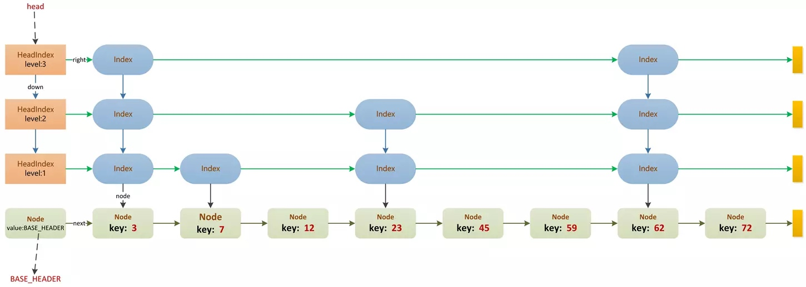

[TOC]
# 参考
https://segmentfault.com/a/1190000016168566
# 基本结构

ConcurrentSkipListMap内部一共定义了3种不同类型的结点，元素的增删改查都从最上层的head指针指向的结点开始；
# 基本知识点
1. ConcurrentSkipListMap会基于比较器——Comparator ，来进行键Key的比较，如果构造时未指定Comparator ，那么就会按照Key的自然顺序进行比较，所谓Key的自然顺序是指key实现Comparable接口。
2. key和value不能为null；和hashTable/treeMap一样；hashMap允许key和value为null；
3. put方法时，从顶层head采用两个指针cur,next进行向右遍历，如果插入的key大于next，则继续向右移动，cur=next,next=next.right;如果小于或者为null，则向下遍历，cur=cur.down,next=cur.next；如果等于，则采用CAS操作进行赋值。期间会判断是否存在并发修改(n == b.next?)，存在则重新开始遍历；如果有些节点被标记为删除，则帮助删除节点，value == null；（代码实现中：首先调用findPredecessor方法找到最底层且是index的节点，然后作为单链表向后遍历）最后，会调用ThreadLocalRandom生成随机数，>>>1 &1 != 0来判断是否需要在上层层级中添加该节点。（随机数算法，1/2）
4. 删除remove节点时，不会立即删除，而是引入了 标记节点，以懒删除的方式进行，提高并发效率；会在要删除节点的后面添加一个value为null的节点，调整节点指针，最终该节点会被gc回收。采用标记节点的好处是，其他线程可以帮忙一起清理节点，否则如果层级比较多，还是浪费时间的。