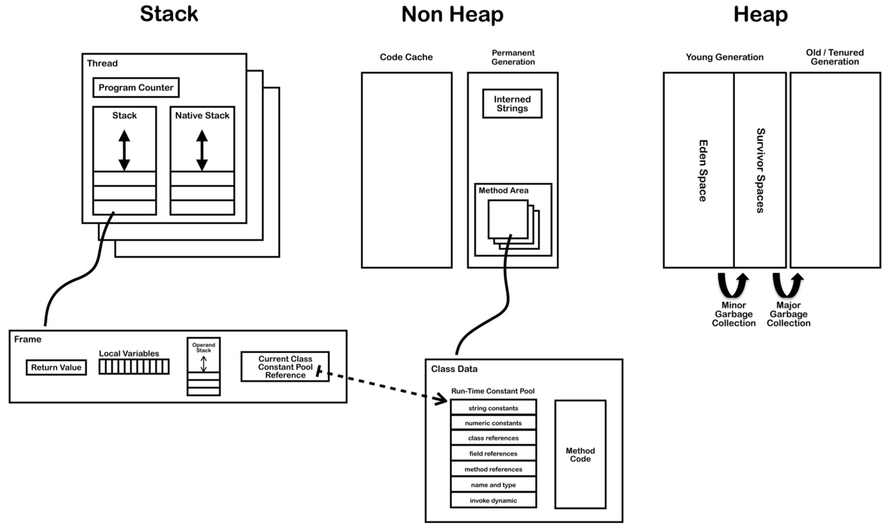

一般来说，堆和栈的生长方向是不同的，是为了最大程度的利用内存空间。一个从低地址向上增长，一个从高地址向下增长。如果都是朝一个方向增长的话，那么堆和栈需要有一个分界线，这个分界不好控制。
堆是向上生长的，栈是向下生长的。人们对数据的访问是习惯向上的，比如new一个数组，低位元素是放在低地址，高位元素是放在高地址，所以堆向上生长比较符合习惯。而栈对方向不敏感，只有入栈和出栈的操作，无所谓向上还是向下。
51单片机只有栈，所以栈是向上生长。
ARM对栈同时支持向上和向下生长。

# JDK8的变化
1. 元数据空间取代了永久代，实现方法区。元数据空间不再占用JVM内存，而是占用本地内存。之前的永久代需要占用JVM内存，不管是否需要，JVM都会占用这部分的空间，如果设置太小，那么很容易发生永久代的内存溢出，如果设置太大，那么会浪费JVM的内存；元数据空间放在本地内存实现，使得JVM不需要关注这块内存；但是为了防止内存泄露，需要对元数据空间进行监控，或设置最大的MaxMetaspaceSize；
2. 由于永久代内存经常不够用或发生内存泄露，爆出异常java.lang.OutOfMemoryError: PermGen

# 元数据空间如何回收
当元数据空间大小达到MaxMetaspaceSize会触发fgc进行垃圾回收；