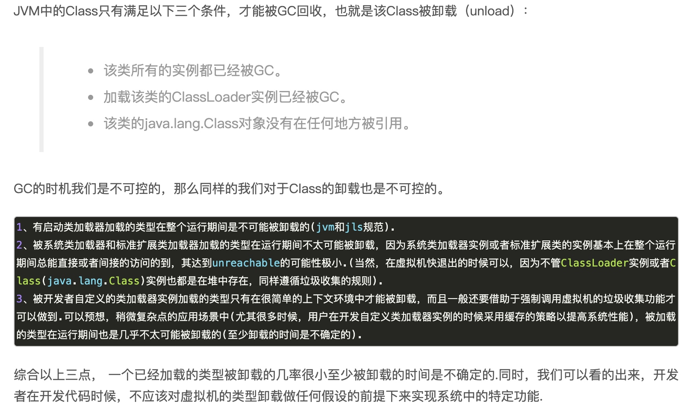
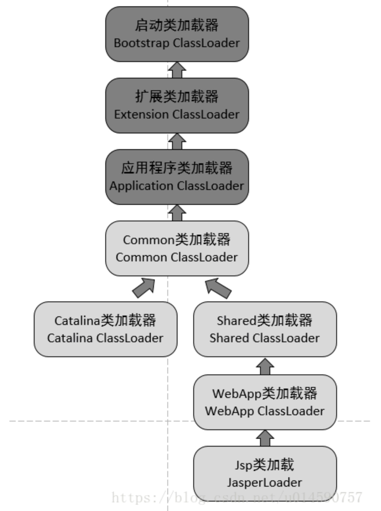
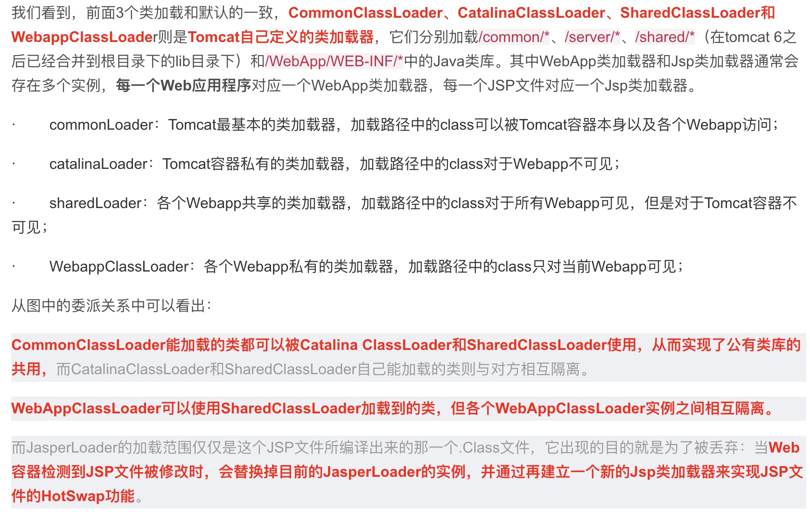
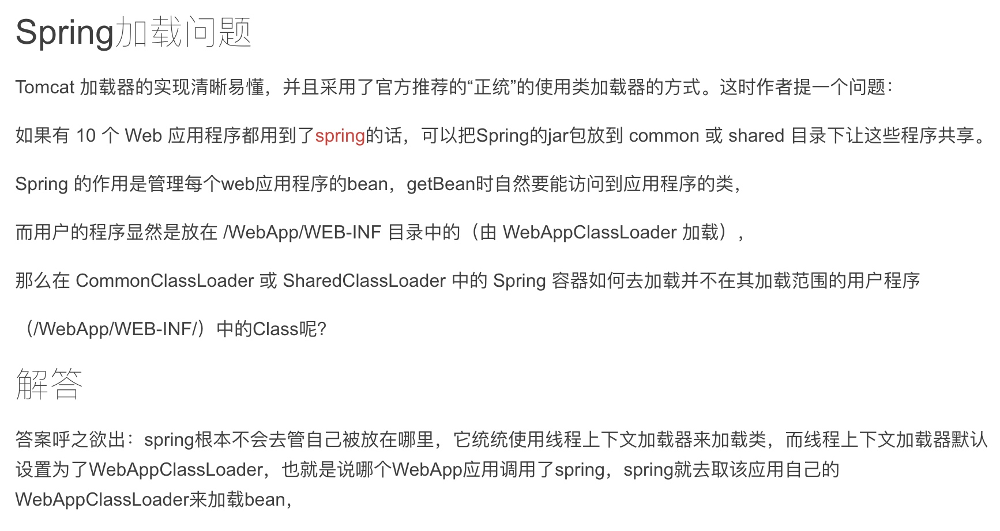

[TOC]
# 引用计数 & 可达性分析
引用计数：给对象中添加一个引用计数器，每当有一个地方引用它时，计数器的值就加1；当引用失效时，计数器值就减1；任何时刻计数器为0的对象就是不可能再被使用的。这也就是需要回收的对象。
采用引用计数法的VM：python和Erlang
优点：
1. 实现简单，效率高；
2. 内存管理的开销分布于整个应用程序运行期间，无需挂起应用程序的运行来做垃圾回收；
3. 空间上的引用局部性比较好，当某个对象的引用计数值变为0时，系统无需访问位于堆中其他页面的单元；
4. 可以在对象的引用计数为0的时候立即回收，因此可以保证堆上时刻没有垃圾对象存在；、
5. 引用计数法的最大暂停时间短。由于没有了独立的GC过程，而且不需要遍历整个堆来标记和清除对象，取而代之的是在对象引用计数为0时立即回收对象，这相当于将GC过程“分摊”到了每个对象上，不会有最大暂停时间特别长的情况发生。

缺点：
1. 循环引用
2. 引用计数的增减开销有时比较大，如一些根引用的指针更新比较频繁
3. 对象引用计数器本身需要占用内存空间，而计数器要占用多少位也是一个问题，理论上系统内存可寻址的范围越大，对象计数器占用的空间就要越大，这样在一些小对象上就会出现计数器空间比对象本身的域还要大的情况，内存空间利用率就会降低。
[引用计数法分析](https://nullcc.github.io/2017/11/11/%E5%9E%83%E5%9C%BE%E5%9B%9E%E6%94%B6(GC)%E7%AE%97%E6%B3%95%E4%BB%8B%E7%BB%8D(2)%E2%80%94%E2%80%94GC%E5%BC%95%E7%94%A8%E8%AE%A1%E6%95%B0%E7%AE%97%E6%B3%95/)

解决循环引用：
1. 使用弱引用
2. 对于引用对象采用可达性分析方法，算是一种优化吧

# 为什么要两个Survivor
如果只有Eden，那么每次新生代存活的对象就会进入老年代，会提前触发Full GC，使用Survivor能够让对象到达一定的分代年龄(16)后才会进入老年代。
如果只有一个Survivor，那么第一次minor gc后，eden将存活对象复制到survivor，第二次minor gc时，eden和survivor都有存活对象，也有死的对象，如果还是直接复制到survivor，会产生内存碎片，因此采用两个survivor，每次只使用eden和其中的一个survivor。

# 类加载机制和jar包冲突
## ClassLoader是什么
`类加载器负责将字节码形式的Class数据流解析成内存形式的Class对象，加载到JVM中。类加载器并没有完全放在jvm内部实现，而是直接暴露在java语言层面，从而具有更好的灵活性和扩展性，比如类隔离，OSGI，热部署，类字节码加密等。`

站在Java虚拟机的角度来讲，只存在两种不同的类加载器：
`启动类加载器：它使用C++实现（这里仅限于Hotspot，也就是JDK1.5之后默认的虚拟机，有很多其他的虚拟机是用Java语言实现的），是虚拟机自身的一部分。
所有其他的类加载器：这些类加载器都由Java语言实现，独立于虚拟机之外，并且全部继承自抽象类java.lang.ClassLoader，这些类加载器需要由启动类加载器加载到内存中之后才能去加载其他的类。`

站在Java开发人员的角度来看，类加载器可以大致划分为以下三类：
`启动类加载器：Bootstrap ClassLoader，跟上面相同。它负责加载存放在JDK\jre\lib(JDK代表JDK的安装目录，下同)下，或被-Xbootclasspath参数指定的路径中的，并且能被虚拟机识别的类库（如rt.jar，所有的java.* 开头的类均被Bootstrap ClassLoader加载）。启动类加载器是无法被Java程序直接引用的。
扩展类加载器：Extension ClassLoader，该加载器由sun.misc.Launcher$ExtClassLoader实现，它负责加载JDK\jre\lib\ext目录中，或者由java.ext.dirs系统变量指定的路径中的所有类库（如javax.*开头的类），开发者可以直接使用扩展类加载器。
应用程序类加载器：Application ClassLoader，该类加载器由sun.misc.Launcher$AppClassLoader来实现，它负责加载用户类路径（ClassPath）所指定的类，开发者可以直接使用该类加载器，如果应用程序中没有自定义过自己的类加载器，一般情况下这个就是程序中默认的类加载器。`
 
## 双亲委派 类加载的工作流程：
`如果一个类加载器收到了类加载的请求，它首先不会自己去尝试加载这个类，而是把请求委托给父加载器去完成，依次向上，因此，所有的类加载请求最终都应该被传递到顶层的启动类加载器中，只有当父加载器在它的搜索范围中没有找到所需的类时，即无法完成该加载，子加载器才会尝试自己去加载该类。`

## 为什么使用 双亲委派：
`1.Java类随着它的类加载器（说白了，就是它所在的目录）一起具备了一种带有优先级的层次关系，通过这种层级关可以避免类的重复加载，当父亲已经加载了该类时，就没有必要子ClassLoader再加载一次，防止内存中出现多份同样的字节码文件，这对于保证Java程序的稳定运作很重要。例如，类java.lang.Object类存放在JDK\jre\lib下的rt.jar之中，因此无论是哪个类加载器要加载此类，最终都会委派给启动类加载器进行加载，这边保证了Object类在程序中的各种类加载器中都是同一个类；否则系统中会出现多个不同的Object类，那么类之间的比较结果(前提是被同一个类加载器进行加载才有比较意义)和类的唯一性也无法保证了。
2.其次是考虑到安全因素，java核心api中定义类型不会被随意替换，假设通过网络传递一个名为java.lang.Integer的类，通过双亲委托模式传递到启动类加载器，而启动类加载器在核心Java API发现这个名字的类，发现该类已被加载，并不会重新加载网络传递的过来的java.lang.Integer，而直接返回已加载过的Integer.class，这样便可以防止核心API库被随意篡改。即使自己向核心api类库中添加自定义的类，需要访问权限，否则会报类加载错误。`

## 加载类时，首先是哪个类进行加载？
`sun.misc.Launcher类是java的入口，在启动java应用的时候会首先创建Launcher类，创建Launcher类的时候会准备应用程序运行中需要的类加载器。
在Launcher类的构造方法中，会将appClassLoader设置到当前Thread，在新建一个线程时，会将原来线程的ClassLoader设置到新的线程中，一直传播下去。通过Thread.getContextClassLoader()获取当前的类加载器，通过setContextClassLoader()方法直接设置当前线程的类加载器。如果A类中引用了B类，java虚拟机将使用加载类A的加载器去加载B。还可以直接调用ClassLoader.loadClass()方法来指定某个类加载器去加载某个类。`

## jar包冲突
[重新看待Jar包冲突问题及解决方案](http://www.yangbing.club/2017/07/15/solution-for-jar-conflicts/)
* 原因
    1. 多版本jar包中，由于低版本jar包中的类加载导致高版本jar包中的同名类无法加载，从而导致高版本jar包依赖的函数无法被找到，因为该函数只存在高版本的类中。
    2. 不同的jar包却存在相同路径的类(类的全限定名相同，package+className相同)，那就会导致两个不同jar包的同名类只有一个类会被加载，同样存在找不到函数问题。

* maven加载顺序
    1. 优先按照依赖管理<dependencyManagement>元素中指定的版本声明进行仲裁，此时下面的原则都无效了
    2. 依赖路径最短优先：一个项目依赖了两个jar包，A-B-C-X(1.0)，A-D-X(2.0)，所以项目中使用的是X2.0.
    3. pom文件中申明顺序优先：如果路径长度一样，则maven会根据声明顺序进行加载。
    4. 覆写优先：子pom内的声明优先父pom中的依赖。

* jar包冲突现象
    1. ClassNotFoundException
    2. NoSuchMethodError
    3. NoClassDefFoundError
    4. 没有报错异常，但应用的行为跟预期不一致

* maven冲突解决
    1. 通过们mvn dependency:tree查看依赖树，通过maven的依赖原则来调整坐标在pom文件的申明顺序是最好的办法。(将高版本的jar包放在maven声明文件的前面)
    2. 通过exclude排除一些间接依赖，或者把依赖的jar包调整到最前面，按照maven加载顺序最前面加载了jar包后间接引用就不会生效了。

## 类隔离
`一个应用如果需要依赖同一个jar包的不同版本，按照双亲委派模型，那么会按照加载顺序加载其中一个版本的jar包，那么可能导致ClassNotFound错误。因此可以通过自定义类加载器，加载指定的jar包URL，从而实现类的隔离。`

## 能不能自己写一个java.lang.String类
`java类加载采用双亲委派机制，首先会先去内存查找，看是否已经加载了。真正的java.lang.String是由BootstrapClassloader加载的（由System.class.getClassLoader()==null 可以判断出），等你去内存找的时候，就直接返回正确的java.lang.String了。所以自定义的String类是无法被加载到内存中的。
如果通过自定义类加载器，重写findClass方法呢？jvm出于安全考虑，是不能写以java.*开头的类，否则是无法被加载到内存中。即使自定义类加载器强行去加载，那么抛出SecurityException异常，该逻辑判断是在defineClass()中的，该方法是final类型，是无法被重写的，通过defineClass方法将字节数组中的内容转换为java类型对象`

## 自定义类加载器
* loadClass和findClass区别
    loadClass遵守了双亲委派模型，首先检查类是否被加载，如果已经加载则直接返回，如果未加载，则将加载请求传递给父类加载器进行加载，如果没找到才会调用本加载器的findClass()方法。
    如果直接重写loadClass方法，则会破坏双亲委派模型，不推荐，因此推荐通过重写findClass(）方法来自定义类加载器。

* 自定义加载器的应用 
    1. tomcat可以部署多个不同的应用，但是它们可以使用同一份类库的不同版本，这就需要自定义类加载器，以便对加载的类库进行隔离，否则会出现问题。
    2. 对于非.class的文件，需要转换为java类，就需要自定义类加载器，比如jsp文件或者字节码存放在数据库/云端等。
    3. 对java核心代码的加密。比如有些算法不想让别人反编译得到，可以采用自己编写加密算法，对字节码进行加密，加大反编译的难度。
        流程：加密.class，删除原.class文件->自定义类加载器，解密.class，初始化->通过反射调用类方法
    4. 当通过网络传输类的字节码时，为了安全性，可以先对这些字节码进行加密处理，然后接收端通过自定义类加载器读取加密的字节码进行解密和验证。
    5. 如果需要加载两个相同的类，可以通过自定义类加载器来做到类加载的隔离。
    6. 热替换类，即修改java代码后，不需要重启jvm。

## 热部署
一般来说，热替换或者热部署都是通过自定了类加载器实现的，如果重复调用defineClass
方法对一个类，则会报错，且一个类被加载后不会被再次加载。因此热替换时，每次都需要是一个新的ClassLoader，并卸载老的ClassLoader。
### 类卸载
在Java中class也是可以unload。JVM中class和Meta信息存放在PermGen space区域。如果加载的class文件很多，那么可能导致PermGen space区域空间溢出。引起：java.lang.OutOfMemoryErrorPermGen space. 对于有些Class我们可能只需要使用一次，就不再需要了，也可能我们修改了class文件，我们需要重新加载 newclass，那么oldclass就不再需要了。那么JVM怎么样才能卸载Class呢。

 
### Tomcat的热部署和热加载
[jsp热部署原理](https://www.jianshu.com/p/01805c2a1036)
[jvm热加载技术](https://yq.aliyun.com/articles/65023)
    `tomcat容器启动时，会启动一个后台线程，定时检测是否需要进行重新部署，条件是：1.配置文件中的reloadable是否为true 2.判断文件是否被修改(比较修改时间戳的方式)，都满足则调用reload方法重启tomcat容器。
    reloadable:如果这个属性设为true，tomcat服务器在运行状态下会监视在WEB-INF/classes和WEB-INF/lib目录下class文件的改动，如果监测到有class文件被更新的，服务器会自动重新加载Web应用。`
    热部署：清空session，释放内存，不会影响JVM中的其他应用程序。
 

## 破坏双亲委派的案例
1. 双亲委派模型自身的缺陷：它很好的解决了各个类加载器的基础类统一问题（越基础的类由越上层的加载器进行处理，基础-总是作为被用户代码调用的API）。但是如果基础类需要调用用户的代码如何处理呢？即父类加载器需要调用子类加载器加载的代码。典型的案例就是JNDI，或者其SPI机制，在SPI中，由ServiceLoader类去加载配置文件中的类，但是ServiceLoader是由启动类加载器进行加载，而配置文件中是用户自定义的类，启动类加载器无法识别这些代码，因为这些类不在rt.jar包中，自然无法加载。如何处理呢？引入**线程上下文类加载器**，这个类加载器可以通过Thread.setContextClassLoader方法进行设置，如果创建线程时没有设置，则从父类继承，默认采用应用程序类加载器。JNDI服务通过线程上下文类加载器加加载所需的SPI代码，也就是**父类加载器请求子类加载器去完成类加载的工作**。
    `受到加载范围的限制，父类加载器无法加载到需要的文件，以Driver接口为例，由于Driver接口定义在jdk当中的，而其实现由各个数据库的服务商来提供，比如mysql的就写了MySQL Connector，那么问题就来了，DriverManager（也由jdk提供）要加载各个实现了Driver接口的实现类，然后进行管理，但是DriverManager由启动类加载器加载，只能记载JAVA_HOME的lib下文件，而其实现是由服务商提供的，由系统类加载器加载，这个时候就需要启动类加载器来委托子类来加载Driver实现，从而破坏了双亲委派`
2. Tomcat类加载器
    tomcat需要解决的问题：1.一个web容器可以部署多个应用程序，不同应用程序可能依赖同一个第三方类库的不同版本，双亲委派无法满足这个需求。2.tomcat自身容器的类库和应用程序的类库应该隔离开来，安全性考虑。双亲委派无法满足。3.jsp文件需要编译成class文件才能在虚拟机中运行，但是tomcat需要支持jsp文件的动态加载，即不需要重启虚拟机，如果jsp文件修改后，但是类名还是一样，类加载器已经加载过该类不会重新加载。因此，可以直接卸载掉这个jsp的类加载器，每个jsp文件对应唯一一个类加载器，当一个jsp文件修改了，就直接卸载掉这个类加载器，重新创建类加载器，重新加载jsp文件。
    

tomcat 为了实现隔离性，没有遵守这个约定，每个webappClassLoader加载自己的目录下的class文件，不会传递给父类加载器。

    

