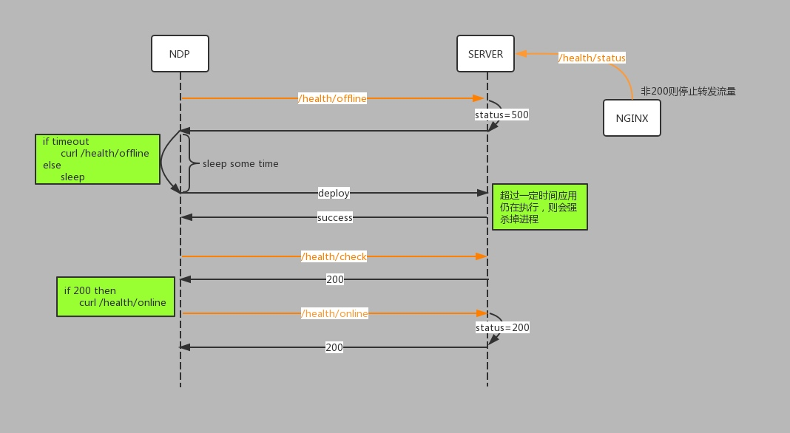

[TOC]

## 是神马？

​	在关闭系统应用时，不是要求系统立刻退出，而是允许系统能够做一些善后的工作，能够有计划而平滑的退出。总的来说，就是不能影响正常业务的执行，不会引发异常情况的发生。

## 概要

​	在java程序中，通常是通过添加关闭钩子实现优雅停机，即应用中会向jvm注册一个已经初始化但是尚未开始的线程，当jvm收到系统关闭的通知后，会回调这些钩子线程，并发地执行。

​	触发回调钩子线程的场景：

1.程序正常退出；  2.system.exit()     3.终端采用ctrl + c 触发的中断   4.kill pid杀掉进程

​	对于kill -9 pid或者系统断电等情况，是无法触发jvm回调钩子线程的。

​	白条系统的应用主要是利用NDP的工作机制实现了优雅停机，即在上线和下线时，做一些系统或者中间件的初始化和清理的工作，从而尽可能地保证业务逻辑执行的完整性，不同于强杀进程。

​	下面首先介绍一个NDP的工作机制，利用其机制实现优雅停机。

## NDP

### 工作机制


​	前提：在服务器本地需要维护一个全局变量statusCode，online后变为200，此时Nginx会转发流量至该服务器；offline后变为500（非200即可），此时Nginx会将该服务器置为下线状态，不再转发流量至该服务器。

1. 用户在操作页面点击“部署”按钮，然后，ndp发送请求/health/offline至server；
2. server收到offline请求后，将statusCode标记为500；（nginx配置健康检查，定时请求server的/health/status接口，连续返回500，nginx则把该server置为down，不再转发流量至该server）
3. ndp收到从server返回的offline响应后，会休眠sleep时间，然后向server发送命令，删除旧的文件，重新部署文件，重启应用；
4. ndp向server发送/health/check请求，如果返回200，表示应用启动成功，否则会重试请求直至最大重试次数；
5. ndp收到server的check响应为200后，会调用/health/online接口；
6. server收到online请求后，将statusCode置为200，此时应用已经上线成功；（nginx定时检查/health/status接口，连续返回200后，则认为该server已经up，从而为该server分发流量）

### 注意事项

1. 三个参数的含义：timeout-请求的超时时间；retry-请求的重试次数；sleep-睡眠时间，即每两次请求的间隔时间；

   示例：{"timeout":20,"retry":5,"sleep":10}，单位为秒。

2. 由于server会在offline接口中做一些停机前的资源关闭操作，目的是禁用外部流量进入即将关闭的系统，所以，<font color="00ff">sleep时间尽量稍微大于系统一次最长处理业务的时间，</font>以免业务执行一半被强行杀掉；

3. offline接口和online接口是互相对应的，offline中做的资源关闭操作，必须对应的在online中做资源开启操作；

4. offline和online接口需要做权限控制，只能允许白名单内的IP进行操作控制；

5. online接口中，在等待所有资源初始化完成后，再将statusCode改为200；

6. offline接口中，先将statusCode置为非200，此后nginx不会转发流量至该server，然后再做一些资源关闭和清理操作；

## 优雅停机具体实现

​	对于分布式系统来说，实现优雅停机的通常做法是，首先隔断流量，然后关闭应用程序。我们系统流量入口的来源大致有http、dubbo(rpc调用)和mq(或者kafka)的场景(暂不考虑定时任务)，下面对此一一介绍。

### HTTP

​	目前来说，http请求都是先到nginx，然后再到后端服务器，因此只需要利用nginx的健康检查机制来做流量隔断即可。

​	以quhua的nginx配置为例：

```xml
upstream quhua-dai {
	server 10.172.165.62:8080;
	server...;
	server...;
	check interval=3000 rise=2 fall=5 timeout=3000 type=http;
	check_http_send "HEAD /health/status HTTP/1.0";
	check_http_expect_alive http_2xx http_3xx;
}
```

​	参数说明：interval-每次请求的时间间隔    rise-请求连续成功次数到达rise次，则该server被标识为up状态     fall-请求连续失败次数到达fall次，该server被标识为down状态    timeout-请求的超时时间   type-请求的类型    HEAD-建议的请求方式，只会返回头部信息，节省网络带宽   check_http_expect_alive-返回2XX或者3XX时则认为OK。

### DUBBO
[dubbo优雅停机](http://b.shiwuliang.com/Dubbo%E6%BA%90%E7%A0%81%E8%A7%A3%E6%9E%90%E2%80%94%E2%80%94%E4%BC%98%E9%9B%85%E5%81%9C%E6%9C%BA.html)
​	dubbo早期的版本是通过注册jvm的关闭钩子来支持优雅停机的，但是仍存在bug；并在版本2.6.3后得到修复，配置方法如下：

```xml
<dubbo:registry address="" wait="10000"/> 表示在注册中心配置的优雅停机超时时间
```

对于服务提供者来说，首先标记为不再接收新的请求，当有新请求调用过来后，直接报错，让客户端重试其他机器；

对于服务消费者来说，不会发起新的调用请求，所有新的调用在客户端直接报错，对于已经发出响应则等待返回直至超时；

​	但是对于NDP的online和offline操作，并不是真实的关闭和启动spring容器，因此也没有用到这个dubbo这个优雅关闭的配置，而是手动实现的（@caojingui），实现机制类似于dubbo优雅关闭的一部分

​	实现原理如下：

1. 获取dubbo所有的注册中心；（ZK实现）

2. 将dubbo提供者的方法从注册中心上删除；（反射调用doUnregister方法）

   对于下线来说，完成上面两步已经足够。既保证了ndp在调用offline接口时，提供者不会将自己的方法暴露在注册中心，但是由于注册中心是异步通知提供者该方法不存在，存在一定的时延，也保证了提供者依然能够在短时间内处理消费者新调用过来的方法。

online方法中实现的逻辑与上述步骤相反，即将提供者的方法逐个注册到对应的注册中心上即可。

### MQ

#### RABBITMQ

​	MQ的提供者不存在优雅关闭之说，只需要控制好外部流量的入口，保证在容器超时关闭的时间内处理完业务即可。

对于消费者来说，需要保证即将关闭的应用不能再接收新的消息，保证正在处理的消息能够顺利完成。

​	项目中采用的spring框架，一般都会使用SimpleMessageListenerContainer对队列中的消息进行监听，从而获取队列中的消息，进行消费然后回调ACK通知。

​	因此，只需要在offline时关闭SimpleMessageListenerContainer即可保证消费者不会再接收新的消息；并且一条消息的处理速度足够快，尽量在sleep时间范围内。（正如上面提到的，尽量保证应用业务的最长处理时间要在sleep时间范围内，只有这样才是可控制的）

​	在online时必须开启SimpleMessageListenerContainer，保证对队列中的消息恢复监听。

​	核心方法：

``` java
@Autowired
private List<SimpleMessageListenerContainer> containerList;

public void method() {
    containerList.forEach(container->{
        container.stop();// container.start();
    })
}

```

#### KAFKA

​	暂未接触kafka的应用，参考@caicongyang之前写的kafka优雅停机，大致思路如下：监听线程在状态标志位为true时会不停监听并获取kafka消息，然后由业务线程池负责处理消息；在程序启动时，会注册jvm的关闭钩子，在关闭钩子中会修改状态标志位为false，这样应用即将关闭时，会回调关闭钩子，修改状态标志位false，监听线程不会再获取kafka消息。(<font color="ffff">状态标志位需要volatile，保证可见性</font>)

核心代码如下：

```java
private volatile boolean running = true; 
//注册关闭钩子
Runtime.getRuntime().addShutdownHook(new Thread(){
            public void run() {
                logger.info("get system shutdown event, stop running kafka and threadExecutor" );
                running = false;
                executor.shutdown();
            }
        });
//消费
executor.execute(() -> {
            consumer.subscribe(Collections.singletonList(topic));
            while (running) {
                ConsumerRecords<String, String> records = consumer.poll(kafkaTimeOut);
                for (ConsumerRecord<String, String> record : records) {
                    final String message = record.value();
                    bizExecutor.execute(() -> {
                        try {
                            kafkaMsgHandler.handleMsg(message);
                        } catch (Throwable t) {
                            logger.error("handle kafka message error! message = " + message, t);
                        }
                    });
                }
            }
        });
```

### 线程池

#### 实现

​	线程池同样存在优雅关闭的问题。试想一下，如果线程池依赖容器来关闭，如果在容器关闭的超时时间内仍有任务没有完成，那么最终会强杀掉进程；而这些操作对于用户层面来说是完全无感知的，即无法知道线程池当前正在执行的任务有无处理完成，队列中是否还有任务尚未得到处理。因此，需要实现线程池的优雅关闭。

​	如果未依赖spring容器，那么可以通过Runtime.getRunTime().addShutDownHook()方法注册一个关闭钩子来实现优雅停机，否则，也可以通过以下方法 1.bean实现DisposableBean接口 2.@PreDestroy注解 3.xml指定destroyMethod方法 来达到让spring容器在销毁bean前做一些指定的操作。不管怎样，线程池关闭的核心逻辑是一样的。

​	线程池关闭离不开两个方法:

 	1. shutdown()：将线程池的状态从RUNNING变为SHUTDOWN，不再接收新的任务，但是会处理队列中的任务；
 	2. shutdownNow()：将线程池的状态从RUNNING或者SHUTDOWN变为STOP，中断正在执行的任务，并返回队列中未执行任务的列表；（如果正在执行的任务无法响应中断，那么任务永远不会停止）

shutdown()和shutdownNow()方法只是异步通知线程池进行相关操作，需要调用awaitTermination()方法同步等待其处理。

核心代码如下：

```java
public void shutdownGracefully() {
    for (Map.Entry<String, ExecutorService> entry : executorPoolMap.entrySet()) {
            try {
                ExecutorService executor = entry.getValue();
                log.info("ready to shutdown executor, type = {}", entry.getKey());
                //不再接收新的任务
                executor.shutdown();
                //阻塞，若超时时间内未执行完，则shutdownNow
                if (!executor.awaitTermination(SHUTDOWN_WAIT_TIME, TimeUnit.SECONDS)) {
                    //返回未执行的任务列表-中断执行的线程
                    List<Runnable> runnableList = executor.shutdownNow();
                    log.warn("executor type = {} is ready to shutdownNow, todo Tasks size = {}", entry.getKey(), runnableList.size());
                    //阻塞，若未中断成功或者任务仍在执行，则error，人工介入
                    if(!executor.awaitTermination(SHUTDOWN_WAIT_TIME, TimeUnit.SECONDS)) {
                        log.error("executor type={} cannot be shutdown within wait-time, task may be inconsistent...")
                    }
                }
            } catch (InterruptedException e) {
                log.error("shutdown executor exception",e);
            }
        }
}
```

#### 注意事项


1. shutdownNow只是给正在执行的线程发出中断信号，具体能不能响应中断是由正在执行的线程进行决定；

2. shutdown后，线程池不再接收新的任务，对于非定时任务的场景，因为事先已经隔断了外部流量的入口，因此不会出现新的任务；但是对于定时任务的场景，如果shutdown后依然继续提交任务，那么会抛出异常，人工介入，或者在调用线程池执行任务前，对线程池的状态进行判断，如果已经shutdown了，则可利用wait-time时间将任务持久化或者输出详细日志，人工介入；

3. shutdownNow返回的runnableList，无法感知具体的业务信息，可以自定义MyRunnable类实现Runnable接口，在MyRunnable中实现getID()方法，关联具体的业务信息。代码如下：

   ``` java
   log.info("runnableList = {}", runnableList.stream().map(runnable -> ((MyRunnable) runnable).getID()).collect(Collectors.toList()));
   ```

4. executorPoolMap为业务线程的map集合，key-业务类型，value-执行业务的线程池executor，简单的实现了线程池的业务隔离；这里需要注意的是，如果map中元素过多，由于上述方法是串行依次进行关闭，可能会导致关闭时间太久，最终被容器强杀进程，<font color="ffff">后续可以对该部分实现进行多线程处理，或者对于每个业务线程池单独注册关闭钩子，并发执行关闭操作。</font>

<font color="00ff">具体代码可以参考KYLIN的ExecutorFactory实现</font>

### 定时任务（待补充）

​	定时任务的场景比较特殊，一般来说，执行时间比较久，对于定时任务的停机，个人想法如下：

1. 定时任务，最好依赖线程池的线程进行执行。在执行任务开始就将所有资源准备好，交给线程池调度，这样能够依赖线程池的优雅关闭来关闭，并返回未执行的任务；==》弊端：可能内存溢出
2. 对于单个长时间执行的任务，是否可以拆分成小任务执行，保证能够最快的执行结束；
3. 单线程执行多个相同的任务时，可以分批次执行，保证每个批次执行时间不宜太久<sleep时间，并在每个批次执行开始判断是否已经被中断，优雅的退出；
4. 定时任务做幂等处理，允许重复执行；
5. 涉及到多个表操作时，放在一个事务中执行，保证原子性；
6. 将所有定时钟任务的调度集中在后台管理系统，通过后台管理系统能够方便查询哪些任务正在调度、调度失败和成功的状态；
7. 在spring容器关闭时，做资源清理操作，如释放redis锁等；

## 关闭钩子注意点

1. 通过Runtime.getRuntime.addShutdownHook(()->{})进行调用；
2. 本质上是在程序开始时初始化一个尚未执行的线程，当jvm收到停机信号(如kill pid)时，会回调该钩子线程，做收尾工作；
3. 注册在一个jvm的多个关闭钩子会并发执行，无法保证执行顺序，尽量避免竞态条件或者死锁，建议在一个钩子中执行一系列操作；
4. hook线程会延迟jvm的关闭时间，因此在编写hook时尽量避免出现耗时的计算、等待用户IO等操作；
5. 禁止在hook线程中调用system.exit()，否则会卡住jvm关闭过程，但是可以调用Runtime.halt()
6. hook线程中抛出的异常，不会影响其他的hook线程；
7. 对于kill -9 pid、系统断电、Runtime.halt()、jvm系统内部错误等情况是无法触发关闭钩子的执行；
8. 关闭的钩子一旦执行，只能通过Runtime.halt()（或者外部kill -9）才能终止；
9. 一旦进行关闭钩子，不能再注册新的关闭钩子或者取消先前注册地钩子，尝试这些操作会导致IllegalStateException;

## 注意点

1. jvm关闭时，非守护线程如果正在执行，那么不会强制关闭，会等待所有非守护线程执行完毕后，才会关闭；
2. 线上的应用不会允许在关闭jvm进程时无限长的等待，会有一个超时时间，如果还没处理完成，会强杀；
3. tomcat和jvm的关系，tomcat是web服务器，其运行离不开jdk，是jvm中的一个进程。==CatalinaShutdownHook 

## 白条系统可能需要注意的问题

1. 在调用offline接口后，系统会将statusCode标识为非200，即失败状态；

   以quhua的nginx配置为例，此时nginx会每隔3s请求服务器查看statusCode状态，连续5次失败则标识server为down状态，不会再转发流量；即在offline请求发出到截至流量转发最长需要15s，而ndp在offline后会休眠10s，再进行部署应用，重启容器；那么在第10s-15s期间，仍然会有流量流入即将关闭的服务器。由于在关闭容器的时候，不是立刻关闭，在超时时间允许范围内，所以系统依然有可能处理完10-15s期间的请求；一旦超过了超时时间，那么jvm进程就会被强杀掉，保证应用顺利被发布，即使此时仍有任务正在处理，也是无法感知的。

   可以通过适当调整sleep或者fall参数解决该问题。（一般来说，retry要稍微大点，sleep稍微小点，这样ndp就能频繁检查应用有无响应）

1. 定时任务无感知，在系统重启时，可能导致定时任务执行一半，或者未释放第三方资源如redis锁等；参考 定时任务 章节；