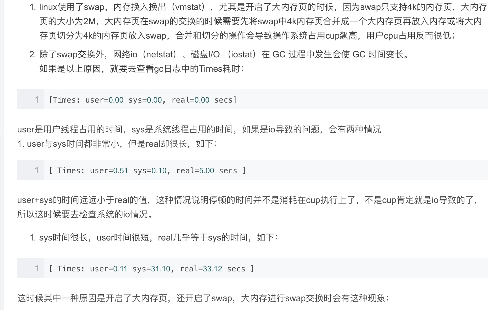

[TOC]
# GC一般参数
Minor GC执行时间不到50ms;
Minor GC执行不频繁，约10秒一次；
Full GC执行时间不到1s;
这些条件时，一般不需要优化。

# 默认的垃圾收集器
jdk1.7 默认垃圾收集器Parallel Scavenge（新生代）+Parallel Old（老年代）

jdk1.8 默认垃圾收集器Parallel Scavenge（新生代）+Parallel Old（老年代）

jdk1.9 默认垃圾收集器G1；Java9将G1设置为默认GC的最主要动机是G1能减少FullGC的次数，这是G1相比JDK8默认的ParallelGC一个很大的改进。G1的目标是在不受到堆大小或存活对象数量限制的情况下最小化暂停时间。这是通过并发进行大部分GC工作，只对部分堆的压缩来实现的，这个GC过程被称为mixed gc。尽可能避免做FullGC是G1的主要优点之一。

* 对GC时间停顿敏感且内存比较大的，采用G1，如web应用；
    CMS一般和ParNew配合使用；我们的应用是16G，采用的就是CMS收集器。G1的目标就是代替CMS收集器，以下情况时可以把CMS或者parallelOldGC切换到G1:1.full gc频繁或者时间太长 2.垃圾回收时间太长或者内存整理的时间 3. 内存很大的时候；否则，其他时候，如果现有的GC能够满足业务需求，没有必要替换。
    G1相比CMS：停顿时间能够预测，不会产生内存碎片，对于大堆回收的效率更高，几乎不会出现full gc。
* 如果对延迟要求低，更看重吞吐量的应用上，则采用ParallelGC，比如数据导入导出、跑报表的系统；

# 为什么一定要STW
stop the world
gc线程通过可达性分析找到了 不存活的 对象，此时由于业务线程还在执行，又将该对象重新加入了引用链中，而且第二次标记时，该对象也没有写finalize方法，因此垃圾收集器就会回收不该回收的对象了。

`jvm会根据可达性分析算法来分析对象是否存活，即会从gc roots作为起点，向下搜索的引用链中包含了哪些对象，那么这些对象就是存活的，在垃圾回收时不会被回收，其他不在引用链中的对象则会被回收。
比如现在有两个gc root1，分别为root1和root2，对象A在root2的引用链中，jvm首先沿着root1查找，查找完毕后，准备以root2作为起点开始搜索，此时如果用户线程还在运行，并将对象A从root2移动到了root1的引用链中，那么jvm在对root2向下搜索时也没发现对象A，那么在回收的时候就把对象A回收了，显然回收了不该回收的对象。
`

# 什么时候stw-安全点和安全区域
ygc和fgc都会有stw。
jvm会在一些特定的指令位置设置 一些安全点，当程序运行到这些安全点时，就会暂停当前所有运行的线程(除了gc线程)，暂停后就再进行gc roots的可达性分析。

安全点的位置主要在：
1. 循环的末尾
2. 方法返回前/调用方法后
3. 可能抛出异常的位置

安全点位置不能太少，否则gc等待时间太长，不能太多，否则会增加运行负荷。选择的依据是是否具有让程序长时间执行的特征。

线程在安全点暂停有两种方案：抢先式中断和主动式中断，抢先式中断是在gc发生时将线程全部中断，如果发现线程不在安全点上，则恢复线程，跑到安全点上再暂停，基本没有采用这个算法的。主动式中断是gc发生时，会对线程设置一个标志，线程执行时会在安全点处查询该标志，如果为真，则挂起自己线程。
安全点机制保证了程序在执行时能够进入GC的问题，但是如果程序处于阻塞或者sleep状态呢，是无法响应中断请求的，jvm也不可能一直等待线程唤醒，这就需要安全区域了。安全区域是指一段代码片中，引用关系不会发生变化，在这个区域任何地方GC都是安全的，安全区域可以看做是安全点的一个扩展。线程执行到安全区域的代码时，首先标识自己进入了安全区域，这样GC时就不用管进入安全区域的线程了，线层要离开安全区域时就检查JVM是否完成了GC Roots枚举，如果完成就继续执行，如果没有完成就等待直到收到可以安全离开的信号。

# CMS收集器有几次stw
在初始标记和重新标记阶段会stop the world。
初始标记是标记gc roots可以直达的对象，比较快，这里进行stw，是为了防止业务程序的继续执行，导致标记的对象不准确，这样在并发标记可以做尽可能准确的间接标记存活的对象；
重新标记时，需要扫描堆内存，对并发标记中对象引用关系变化的进行修复（对产生的活对象进行标记，也会区分出死的对象）；这里需要stw，如果业务程序还在继续执行，那标记的依然不准确，下一步就是并发清理了。
（第二次stw：可能有用户线程修改某些活跃对象的字段，指向了一个未标记过的对象，如下图中红色对象在并发标记开始时不可达，但是并行期间引用发生变化，变为对象可达，这个阶段需要重新标记出此类对象，防止在下一阶段被清理掉，这个过程也是需要STW的。特别需要注意一点，这个阶段是以新生代中对象为根来判断对象是否存活的。）

# gc roots枚举
可能成为gc roots的对象：
1. 虚拟机栈（栈帧中的本地变量表）中引用的对象；
2. 方法区中的类静态属性引用的对象；
3. 方法区中常量引用的对象；
4. 本地方法栈中JNI（即一般说的Native方法）中引用的对象

gc roots枚举的难点：
1. 扫描范围大，需要在方法区中和栈中扫描；
2. 必须在快照中进行：在枚举过程中，程序不能再运行。因为这会导致gc roots的不断变化，造成统计不准确。
3. 要求短时间内进行枚举。

Hotspot采用了准确式的GC来提升GC roots的枚举速度。准确式GC，就是让JVM知道内存中某位置数据的类型是什么，这样JVM能够很快缺点所有引用类型的位置，从而更有针对性的对GC roots进行枚举。
Hotspot是利用OopMap结构来实现准确式GC的，当类加载完成后，HotSpot虚拟机就将对象内存布局中什么偏移量上是一个什么样的类型的数据这些信息放入OopMap中；在 HotSpot 的 JIT 编译过程中，同样会插入相关指令来标明哪些位置存放的是对象引用等，这样在 GC 发生时，HotSpot 就可以直接扫描 OopMap 来获取对象引用的存储位置，从而进行 GC Roots 枚举。

程序会在安全点进行gc，也会在安全点记录虚拟机的相关信息，如OopMap信息的录入等；

# CMS收集器
[CMS垃圾收集器](https://juejin.im/post/5c7262a15188252f30484351)

## 垃圾回收特点
1. cms只会回收老年代和永久带（1.8开始为元数据区，需要设置CMSClassUnloadingEnabled），但是会扫描新生代的对象来判断老年代对象是否存活；配合ParNew收集器，负责回收新生代。
2. cms是一种预处理垃圾回收器，它不能等到old内存用尽时回收，需要在内存用尽前，完成回收操作，否则会导致并发回收失败；所以cms垃圾回收器开始执行回收操作，有一个触发阈值，默认是老年代或永久带达到92%；
## 处理流程
1. 初始标记：标记gc roots直达的对象，很快，会有stop the world；
2. 并发标记：gc和业务线程并发执行，期间老年代对象的引用关系会发生变化，可能会发生新生代对象晋升到老年代、或者是直接在老年代分配对象、或者更新老年代对象的引用关系等；对于这些对象，都需要重新进行标记，否则这些对象会被遗漏；为了提高 重新标记 的效率，该阶段会把对象所在的card标识为dirty，后续只需要扫描这些dirty card的对象即可，避免扫描整个老年代；并发标记阶段只是负责将引用关系发生变化的card标记为dirty状态，不负责处理。
3. 并发预清理阶段：该阶段主要处理上一个阶段引用关系发生变化导致没有标记到的存活对象，会扫描所有标记为dirty的card，然后向下搜索，标记哪些对象是存活的。**意义：cms收集器是以获取最短停顿时间为目的的GC，重新标记需要stw，因此重新标记的工作要尽可能的在并发阶段完成，减少stw的时间，预清理阶段会标记并发标记阶段中新的活的对象。**
4. 可中断的并发预清理阶段：gc线程与用户线程并发执行；这个阶段也能做些预处理，同时能够响应中断决定什么时候终止这个阶段，减少最终标记的时间。XX:CMSScheduleRemarkEdenSizeThreshold默认为2m，控制abortable-preclean阶段什么时候开始执行，即当eden区域的使用空间达到此值时才会开始中断预清理阶段，否则就会跳过这个阶段；XX:CMSScheduleRemarkEdenPenetratio默认为50%，控制abortable-preclean阶段什么时候结束，即当eden区域内存利用率到达50%时会终止，-XX:CMSMaxAbortablePrecleanTime默认为5s，即可中断这个阶段最长保持时间为5s；
    **增加这个阶段是为了避免在重新标记阶段后紧跟着发生一次ygc，否则两次停顿时间加起来就会变长了。这里是eden到达50%，也就是说不太可能很快就会发生ygc了**
5. 重新标记：处理上个阶段引用关系发生变化的对象，需要扫描整个堆；有stop the world；这里也需要扫描新生代，因为对于老年代中的对象，如果被新生代中的对象引用，那么就会视为 存活，即使新生代对象已经不可达。可以加入参数-XX:+CMSScavengeBeforeRemark，在重新标记前，先执行一次ygc，回收掉年轻代中无用的对象，并将对象放入幸存代或者老年代，这样再扫描年轻代时，只需要扫描幸存代中的对象即可，一般幸存代很小，大大减小了扫描时间。
6. 并发清理：到这里，老年代所有存活的对象都被标记了，然后清理无用的对象。

## 存在的问题
1. 并发意味着多线程抢占cpu资源，可能会造成用户线程的执行效率下降。cms默认开启的回收线程数为(cpu个数+3)/4，也就是说，如果cpu个数大于4时，回收线程至少占用25%的cpu资源，可以接受，但是如果cpu资源少呢，那么cms会启动一个gc线程，相当于占用了50%的CPU资源，可能导致用户线程的执行效率下降了50%，不太能接受。（基本不考虑，因为现在机器基本上都是多核心了）
2. 并发清理阶段，用户线程依然在执行，就会产生新的垃圾，称为 浮动垃圾，只能下次再清理。由于用户线程依然在执行，因此需要预留内存空间给用户线程使用，而不能像其他回收器意义，等老年代满了再回收。默认的比例为92%，即老年代到了92%的时候，会进行gc。设置太小会导致频繁的cms gc，产生大量停顿，设置太大，会导致用户线程在并发清理阶段无法获得足够的内存空间，会产生Concurrent  Mode Failure错误，即并发模式失败，这个时候jvm会启动serial old收集器重新对老年代进行垃圾回收(单线程，会停止用户线程)，这样停顿时间变得更长。实CMS有动态检查机制。CMS会根据历史记录，预测老年代还需要多久填满及进行一次回收所需要的时间。在老年代空间用完之前，CMS可以根据自己的预测自动执行垃圾回收。
3. cms采用的是标记清除算法，可能会导致大量的内存碎片，内存碎片多，当进行大对象内存分配时可能就会出现空间不足，不得不提前触发fgc。开启UseCMSCompactAtFullCollection参数，在要进行fgc时进行内存碎片整理，这个过程需要stw。虚拟机还提供了另外一个参数CMSFullGCsBeforeCompaction，用于设置执行多少次不压缩的Full GC后，跟着来一次带压缩的（默认为0，每次进入Full GC时都进行碎片整理）。CMS是基于标记-清除算法的，CMS只会删除无用对象，不会对内存做压缩，会造成内存碎片，这时候我们需要用到这个参数：-XX:CMSFullGCsBeforeCompaction=n意思是说在上一次CMS并发GC执行过后，到底还要再执行多少次full GC才会做压缩。默认是0，也就是在默认配置下每次CMS GC顶不住了而要转入full GC的时候都会做压缩。 如果把CMSFullGCsBeforeCompaction配置为10，就会让上面说的第一个条件变成每隔10次真正的full GC才做一次压缩。
4. Promotion Failure，提升失败。MinorGC过程中，Survivor可能不足以容纳Eden和另外一个Survivor中存活的对象，如果Survivor中的存活对象溢出，多余的对象将被移到年老代。在MinorGC过程中，如果年老代满了无法容纳更多的对象，则MinorGC之后，通常会进行FullGC，这将导致遍历整个java堆，这称为提升失败（Promotion Failure）。
    过早提升的原因：1. survivor空间太小，无法容纳新生代存活的对象；2.对象太大；
    提升失败的原因：1. 老年代空间不足 2.老年代有空间，但是内存碎片太多，没有连续的空闲空间存放该对象；
    解决办法：1. cms进行空间压缩解决内存碎片问题 2. 调大survivor 3. 调大老年代或者将cms触发的阈值调低

# 跨代引用
由于存在着跨代引用，即新生代对象引用老年代对象，或者老年代对象引用新生代对象；那么在进行ygc时，就不能只扫描新生代了，还需要扫描老年代？
统计信息显示，老年代持有新生代对象引用情况不足1%，因此JVM引入卡表card table来避免ygc时扫描全堆。
卡表会将老年代的空间分成大小为512B的若干张卡，卡表本身是单字节数组，数组中的每个元素对应着一张卡，当发生老年代引用新生代时，虚拟机将该卡对应的卡表元素设置为适当的值。如上图所示，卡表3被标记为脏（卡表还有另外的作用，标识并发标记阶段哪些块被修改过），之后Minor GC时通过扫描卡表就可以很快的识别哪些卡中存在老年代指向新生代的引用。这样虚拟机通过空间换时间的方式，避免了全堆扫描。
这个只是在ygc时避免了全堆扫描，空间换时间了；
但是当对老年代进行回收时，还是需要全堆扫描的，可能因为新生代比较小，或者，老年代很大可能持有新生代对象，此时再用空间换时间不划算。

# 什么时候触发fgc
ygc时，survivor区放不下从eden和survivor区存活的对象，那么会将这些对象放入老年代，但是如果老年代也放不下，那么会触发fgc。
当老年代空间满了，触发major gc，一般都会有ygc，但并不是绝对的。
CMS收集器是和用户线程并发运行的，在CMS工作的时候，如果年轻代发生了gc，一部分存活的对象需要进入老年代，而此时CMS还没有收集完成，老年代没有足够的空间容纳晋升的对象，因此提升失败，进而发生Full GC。

# CMS收集器为什么没有采用标记-整理算法，而是用标记-清除算法
[并发垃圾收集器（CMS）为什么没有采用标记-整理算法来实现](https://hllvm-group.iteye.com/group/topic/38223)
CMS在并发清理阶段，是允许gc线程和用户线程并发执行的。标记整理算法会有移动对象的过程，会将存活的对象移动到内存一侧，然后直接清除另外一侧不存在的对象，这样就无法和用户线程并发执行了，否则会清理掉用户线程新产生的对象。也就是说，使用标记整理算法，那么无法再整理阶段并发执行，使用清除算法，不需要移动对象，所以对用户线程不影响，可以并发。
`标记整理和复制算法都需要移动对象，标记清除算法不需要移动对象；
对于老年代来说，对象的存活率比较高，进行拷贝或者移动对象不划算，不如直接就地清理的方式。
速度快到慢：复制>标记清理>标记整理
空间开销大到小：复制>标记清理、标记整理
是否移动对象：标记清理不需要移动对象
整体耗时来看，标记整理 大于 复制 大于 标记清理；整理时需要先计算对象的目标地址，然后移动对象，然后再修改指针；而复制可以把这几个步骤放在一起做，可以更快点。`

# CMS做了哪些事保证最短停顿时间
1. 除了在初始标记和重新标记阶段，其他时候gc线程和用户线程并发执行；
2. 增加了并发预处理阶段，处理了并发标记阶段对象引用关系的变化，减少重新标记的时间；
3. 增加了可中断的并发预处理阶段，这个阶段会尽量等待一个ygc的完成，减少重新标记遍历新生代对象的时间；
4. 使用了清除算法而不是整理算法，这样在并发清理阶段允许用户线程和gc线程并发执行；

# G1收集器
[Java Hotspot G1 GC的一些关键技术](https://tech.meituan.com/2016/09/23/g1.html)
G1是采用复制算法和标记-整理算法；
G1之前的收集器是将整个堆划分年轻代、老年代和永久代(1.8后用元数据空间代替)，而且新生代和老年代需要用不同的垃圾收集器配合使用；而G1是将整个堆划分为大小相等的块(1-32M，可以配置)，称为region，每一块的内存是连续的。和分代算法一样，G1会将每个region分配eden、survivor、old和Humongous角色，还有一部分区块是空闲区，不属于任何一个区，g1可以在需要的时候指定空闲区属于什么类型的。各个分代在物理上是不连续的，方便扩容和缩容。Humongous是用来存放大对象，当对象大小超过了region的1/2时会分配到该区间。（因为大对象可能是短期存在的，如果直接进入老年代，那么会提前触发老年代的垃圾回收，所以单独一块区域存放大对象；如果一个H区放不下一个大对象，那么G1会寻找连续的H分区来存储，为了找到连续的H分区，有时候不得不启动fgc）

G1可以设置指定期望的停顿时间，-XX:MaxGCPauseMillis=200，通过 停顿预测模型来满足用户指定的停顿时间目标，并基于目标来选择进行垃圾回收的region数量，每次进行增量回收，而不是回收整个堆。

G1主要包含young gc和mixed gc，两种都会stop the world。

## young gc
Young GC主要是对Eden区进行GC，它在Eden空间耗尽时会被触发。在这种情况下，Eden空间的数据移动到Survivor空间中，如果Survivor空间不够，Eden空间的部分数据会直接晋升到年老代空间。Survivor区的数据移动到新的Survivor区中，也有部分数据晋升到老年代空间中。最终Eden空间的数据为空，GC停止工作，应用线程继续执行。
G1通过rset避免在进行ygc时扫描老年代，从而避免全堆扫描。
阶段1：根扫描
静态和本地对象被扫描
阶段2：更新RS
处理dirty card队列更新RS
阶段3：处理RS
检测从年轻代指向年老代的对象
阶段4：对象拷贝
拷贝存活的对象到survivor/old区域
阶段5：处理引用队列
软引用，弱引用，虚引用处理

## mixed gc
Mix GC不仅进行正常的新生代垃圾收集，同时也回收部分后台扫描线程标记的老年代分区。
gc分为两个步骤：1.全局并发标记 2.拷贝存活对象
在进行mixed gc之前，首先进行 全局并发标记，详细包含：
1. 初始标记：对roots对象进行标记
2. 根区域扫描：在初始标记的存活区扫描对老年代的引用，并标记被引用的对象；可与应用程序并发执行，非stw；
3. 并发标记：在整个堆中查询存活的对象，与应用程序并发执行，非stw；
4. 最终标记：stw
5. 并发清理

## full gc
G1垃圾收集器是不包含full gc的，某些情况下，G1会退化到使用serial收集器完成垃圾清理工作，它仅仅使用单线程来完成GC工作，GC暂停时间将达到秒级别的。整个应用处于假死状态，不能处理任何请求，我们的程序当然不希望看到这些。那么发生Full GC的情况有哪些呢？
并发模式失败
G1启动标记周期，但在Mix GC之前，老年代就被填满，这时候G1会放弃标记周期。这种情形下，需要增加堆大小，或者调整周期（例如增加线程数-XX:ConcGCThreads等）。

晋升失败或者疏散失败
G1在进行GC的时候没有足够的内存供存活对象或晋升对象使用，由此触发了Full GC。可以在日志中看到(to-space exhausted)或者（to-space overflow）。解决这种问题的方式是：
a,增加 -XX:G1ReservePercent 选项的值（并相应增加总的堆大小），为“目标空间”增加预留内存量。
b,通过减少 -XX:InitiatingHeapOccupancyPercent 提前启动标记周期。
c,也可以通过增加 -XX:ConcGCThreads 选项的值来增加并行标记线程的数目。

巨型对象分配失败
当巨型对象找不到合适的空间进行分配时，就会启动Full GC，来释放空间。这种情况下，应该避免分配大量的巨型对象，增加内存或者增大-XX:G1HeapRegionSize，使巨型对象不再是巨型对象。

## 三色标记算法
提到并发标记，我们不得不了解并发标记的三色标记算法。它是描述追踪式回收器的一种有用的方法，利用它可以推演回收器的正确性。 首先，我们将对象分成三种类型的。

黑色:根对象，或者该对象与它的子对象都被扫描
灰色:对象本身被扫描,但还没扫描完该对象中的子对象
白色:未被扫描对象，扫描完成所有对象之后，最终为白色的为不可达对象，即垃圾对象

从gc roots作为起点，遍历heap，对可达对象先标记white为gray，然后再标记gray为black，遍历完成后，所有可达对象都是black，所有white都是可以被回收的。

在并发标记时，由于gc线程和用户线程并发执行，那么可能存在，白色对象的引用原先由灰色对象持有，用户线程变更了引用关系，将白色对象的引用变更为黑色对象持有，那么会导致白色对象明明应该存活，却被回收，这个是不被允许的。

刚好这对应CMS和G1的2种不同实现方式：
在CMS采用的是增量更新（Incremental update），只要在写屏障（write barrier）里发现要有一个白对象的引用被赋值到一个黑对象 的字段里，那就把这个白对象变成灰色的。即插入的时候记录下来。
在G1中，使用的是SATB（snapshot-at-the-beginning）的方式，删除的时候记录所有的对象，它有3个步骤：
1，在开始标记的时候，生成一个快照图，标记存活对象。（之后并发收集过程中新申请的对象都认为是存活的对象，这个是依赖region内有两个指针，在并发标记时，新申请的对象会分配在这两个指针中；之所以为快照，后续即便这些对象不再被引用，也是认为存活的，只能下次才会收集）
2，在并发标记的时候所有被改变的对象入队（在write barrier里把所有旧的引用所指向的对象都变成非白的，这样就不会被回收掉了）
3，可能存在游离的垃圾，将在下次被收集

## Rset和Cset
Rset中记录了跨代引用的情况，从而避免全堆扫描。Rset不同于CMS的card table，CMS收集器中，在老年代会有一块区域来记录指向新生代的引用，这是一种point-out，即该老年代中有哪些对象引用了新生代的对象，那么在进行ygc时，只需要扫描这一块区域即可，不需要扫描整个老年代；但是在G1中，Rset并不是采用point-out，主要是因为分区数量比较多，且分区小，如果用point-out，会造成大量的扫描浪费，有些根本不需要GC的分区引用也扫描了（G1会按照停顿时间预测模型扫描某些分区，并不是所有的分区）；于是G1采用了point-in，即在本分区中会存储哪些分区引用了当前分区中的对象，从而避免无效的扫描。

CSet(collection set)。它的意思是在一次垃圾收集器中被收集的区域集合。

Young GC：选定所有新生代里的region。通过控制新生代的region个数来控制young GC的开销。
Mixed GC：选定所有新生代里的region，外加根据global concurrent marking统计得出收集收益高的若干老年代region。在用户指定的开销目标范围内尽可能选择收益高的老年代region。

## G1中的数据结构
* Remembered Sets：每个区块都有一个 RSet，用于记录进入该区块的对象引用（如区块 A 中的对象引用了区块 B，区块 B 的 Rset 需要记录这个信息，这里记录的是其他区块的对象引用本区块对象的信息），它用于实现收集过程的并行化以及使得区块能进行独立收集。总体上 Remembered Sets 消耗的内存小于 5%。
* Collection Sets：将要被回收的区块集合。GC 时，在这些区块中的对象会被复制到其他区块中，总体上 Collection Sets 消耗的内存小于 1%。

## G1调优
* 并发标记
    InitiatingHeapOccupancyPercent默认45%，当堆空间的占用达到该阈值时，会开启并发周期，并发标记的初始标记阶段伴随着一次ygc的暂停；如果阈值设置太高，可能会有并发模式失败或者提升失败的风险，这里可以通过增加并发线程数，尽快的回收。

* MaxGCPauseMillis
    MaxGCPauseMillis范围内。 那G1是如何做到最大暂停时间的呢？这涉及到另一个概念，CSet(collection set)。它的意思是在一次垃圾收集器中被收集的区域集合。需要在吞吐量跟MaxGCPauseMillis之间做一个平衡。如果MaxGCPauseMillis设置的过小，那么GC就会频繁，吞吐量就会下降。如果MaxGCPauseMillis设置的过大，应用程序暂停时间就会变长。G1的默认暂停时间是200毫秒，我们可以从这里入手，调整合适的时间。

## 为什么称为garbage first
标记阶段和业务线程并发执行，标记结束后，就能知道每个region的情况，哪些基本是垃圾，存活对象少，g1优先回收这些region，因为从这些region进行垃圾回收能够释放更大的内存可用空间。

# GC排查和优化思路
[从实际案例聊聊Java应用的GC优化](https://tech.meituan.com/2017/12/29/jvm-optimize.html)
[JVM 学习笔记(四) CMS GC日志详解](https://blog.csdn.net/bmwopwer1/article/details/71947137)
ygc差不多10ms左右，几分钟一次吧，fgc差不多100多ms，两三天偶尔有一次；

## ygc频繁
ygc频繁的原因一般是新生代空间较小，导致eden区很快被填满，触发ygc。此时可以通过增大新生代空间来降低ygc频率。
但是增加新生代空间，可能会增加单次ygc的时间？

## 单次ygc时间
ygc的时间由两部分组成：扫描新生代的时间(可能还需要扫描部分老年代，因为老年代中可能会持有新生代对象的引用)和复制存活对象到survivor区的时间；
如果增加新生代的大小，会减少ygc的频率，也会增加扫描新生代的时间，但是可能也会省去复制存活对象的成本，因为对象可能已经死了，因为ygc频率变低了，或者空间大了，即便对象活，也不一定需要复制了。而且，复制的成本要高于扫描的成本，所以单次ygc的时间会更多取决于gc后存活对象的数量，而非eden的大小。因此，如果短期对象比较多，那么扩容新生代，单次ygc不会显著增加的。而且，新生代空间大的话，那么只有经历足够大的分代年龄后才会进入老年代，从而使老年代增速变慢，fgc自然也少了。

## ygc有毛刺
大多数情况下，ygc的时间应该差不多，一天偶尔几次会有毛刺；期间系统没有任何变化，请求也没变多啥的。。那么是因为新生代的存活对象变多了，导致复制的时候花的时间久了。说明这个时候可能加载了很多新生的对象到年轻代中了。

## CMS问题
cms remark耗时1s多，此时会执行stop the world，即业务线程无法执行，显然这个是无法忍受的。初始标记的时间很短，忽略不计；重新标记时，是为了对并发标记期间可能导致引用关系发生变化的对象进行修补，因为有些对象在并发标记开始时是不可达的，但是并行期间引用关系发生变化了，变为对象可达了，这个阶段需要重新标记出此类对象，防止被清理掉。这个阶段是以新生代中对象为根来判断对象是否存活的！！！
cms是针对老年代的回收，remark阶段不能只扫描老年代，因此存在跨代引用的情况。即新生代对象持有老年代的引用，因此remark阶段需要扫描整合堆来判断对象是否存活。但是此时，新生代有很多对象已经不可达了，仍然会被扫描到。新生代GC和老年代的GC是各自分开独立进行的，只有Minor GC时使用根搜索算法，标记新生代对象是否可达，也就是说虽然一些对象已经不可达，但在Minor GC发生前不会被标记为不可达，CMS也无法辨认哪些对象存活，只能全堆扫描（新生代+老年代）。由此可见堆中对象的数目影响了Remark阶段耗时。 分析GC日志可以得出同样的规律，Remark耗时>500ms时，新生代使用率都在75%以上。这样降低Remark阶段耗时问题转换成如何减少新生代对象数量。
新生代中对象的特点是“朝生夕灭”，这样如果Remark前执行一次Minor GC，大部分对象就会被回收。CMS就采用了这样的方式，在Remark前增加了一个可中断的并发预清理（CMS-concurrent-abortable-preclean），该阶段主要工作仍然是并发标记对象是否存活，只是这个过程可被中断。此阶段在Eden区使用超过2M时启动，当然2M是默认的阈值，可以通过参数修改。如果此阶段执行时等到了Minor GC，那么上述灰色对象将被回收，Reamark阶段需要扫描的对象就少了。

除此之外CMS为了避免这个阶段没有等到Minor GC而陷入无限等待，提供了参数CMSMaxAbortablePrecleanTime ，默认为5s，含义是如果可中断的预清理执行超过5s，不管发没发生Minor GC，都会中止此阶段，进入Remark。 根据GC日志红色标记2处显示，可中断的并发预清理执行了5.35s，超过了设置的5s被中断，期间没有等到Minor GC ，所以Remark时新生代中仍然有很多对象。

对于这种情况，CMS提供CMSScavengeBeforeRemark参数，用来保证Remark前强制进行一次Minor GC。

优化后，cms的时间由1s变成了200多ms。

## 其他可能导致停顿时间长的原因

# 命令
jstat -gc pid 5000 - 每5s打印一次gc情况

# 你有没有进行过jvm调优
促销系统的执行活动的接口正常只需要执行100多ms，偶尔会超过1s，而且那个阶段整个系统都变慢了。后来排查的时候发现发生fgc了，耗时3s多，采用的cms收集器，发现remark的时间有1s，但是也不是一定会发生，只是偶尔发生。而且那个点没有发生ygc，后来加了CMSScavengeBeforeRemark参数，保证remark前会强制进行一次ygc，这样扫描新生代时就会扫描比较少的对象了。后来运行一段时间后，这个问题不再发生了，基本上fgc可以控制在300ms以内。

1. 将Xmx和Xms设置为一样大小，避免在扩容带来的额外性能开销；
2. cms在重新标记时，会扫描堆内存，包含新生代，如果此时新生代的对象比较多，那么会加大重新标记的时间，所以最好能够在进行重新标记前执行一次ygc，保证新生代的存活的对象比较少；但是cms在可中断的预处理阶段无法保证一定会有ygc的发生，最长等待CMSMaxAbortablePrecleanTime默认5s，只要到了5s，不管有没有ygc，都会终止这个阶段，进入重新标记。可以配置CMSScavengeBeforeRemark参数，强制在重新标记前进行一次ygc。（好处是 减少了重新标记的时间，坏处是ygc后紧跟着重新标记的stop the world，两个加起来，导致停顿时间比较久）（gc日志中能够看到在重新标记时的新生代大小，发现比较大）
3. fullGC调优，几天会出现一次fgc。查看gc日志的时候发现，出现了promotion failed，这是新生代晋升到老年代空间不足导致，然后触发Serial Old从而进行fgc；但是此时的老年代空间还1g多，gcLogViewer统计显示每次ygc后新生代晋升到老年代的内存大小也就100多k，当然也不排除当时有大对象产生，但是请求量很平均，所以排除这种情况。也就是说，可能是内存碎片导致的。fgc会进行碎片整理。可以配置发生多少次cms gc时，执行一次内存碎片的整理。

# 什么时候不用CMS
堆内存小于3G不要考虑CMS收集器，堆内存大于3g时优先考虑ParallelOldGC，而不是CMS GC，只有在 暂停时间无法接受的情况下才考虑CMS GC。但是堆内存大于8g后基本会选择CMS，否则停顿时间太长。
1. cms触发的阈值不好设置，默认92%，如果设置阈值太大，那么很容易就会发生并发模式失败，jvm会用serial old来重新进行收集，时间显然会更长；如果阈值设置太小，那就会频繁的cms gc了，gc线程会抢占cpu资源的；
2. 内存碎片问题；

## 结论
1. 首先确定代码有没有问题，然后再进行调优。
2. 如果应用中有大量的短期对象，应该选择较大的年轻代，如果存在较多的持久对象，老年代应该适当增大。
3. CMS增加参数确保在remark前进行ygc；