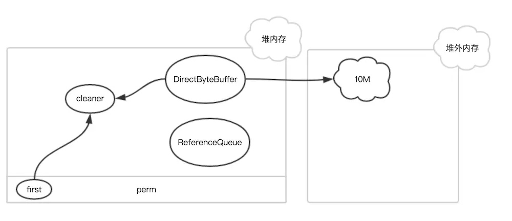

# 参考
[关于JVM堆外内存的一切](https://juejin.im/post/5be538fff265da611b57da10)
# 为什么有堆外内存
堆外内存是JVM进程申请的堆外内存，属于用户空间。
对于jvm堆内存，当需要把堆内存中的数据进行传输时，需要把数据从堆内存拷贝到堆外内存，然后才能进行传输；因此如果直接使用堆外内存，可以省去 拷贝 这个步骤，效率更高。
1. 减少垃圾回收，垃圾回收会暂停其他线程的工作；
2. 加快复制速度，省去了 堆内存拷贝到堆外内存的步骤；

# 为什么数据在堆内存中需要拷贝到堆外内存呢
当需要把数据从堆内存传输到远程时，需要把一个地址通过JNI传递给底层的C库，一个基本的要求是这个地址的内容不能失效或者说，这个内存区域是确定了的。而堆内存是被GC管理的，如果直接把堆内存的地址传递给JNI函数，操作系统正在访问这个内存地址时，JVM执行了GC操作，数据在内存中的位置就会发生变动，导致JNI调用的数据错乱，这段地址的内存就失效了；因此要把数据放到一个GC管不着的地方，这个就是调用native方法之前，数据一定要存在堆外内存的原因，JNI调用的内存是不能进行GC操作的。

# 堆外内存的垃圾回收
[Netty之Java堆外内存扫盲贴](http://calvin1978.blogcn.com/articles/directbytebuffer.html)
堆外内存不归JVM管理，GC算法不会对堆外内存进行回收。
堆外内存的申请和释放：JDK的ByteBuffer类提供了allocateDirect进行堆外内存的申请，底层通过unsafe.allocateMemory实现，最底层通过调用malloc方法申请内存，这块内存可以手动释放，通过Unsafe提高了的freeMemory方法可以对堆外内存进行释放；

如何回收？
JDK使用DirectByteBuffer对象表示堆外内存，每个DirectByteBuffer对象在初始化时，都会创建一个对应的Cleaner对象，这个Cleaner对象会在合适的时候执行unsafe.freeMemory(address)，从而回收这块堆外内存。
Cleaner就是PhantomReference（虚引用）的子类，当GC时发现它除了虚引用外已经不可达（持有它的DirectByteBuffer已经失效），那么会把它放进Reference类的静态列表中，有专门的线程监控这个列表，发现对象类型是Cleaner的时候，就会执行clean方法；（虚引用在进行垃圾回收时能够收到一个通知，从而做一些操作）
当初始化一块堆外内存时，对象的引用关系如下：

Cleaner对象在初始化时会被添加到Cleaner链表，ReferenceQueue是用来保存需要回收的Cleaner对象。如果该DirectByteBuffer对象在一次GC中被回收了，此时，只有Cleaner对象唯一保存了堆外内存的数据（开始地址、大小和容量），在下一次FGC时，把该Cleaner对象放入到ReferenceQueue中，并触发clean方法。
Cleaner对象的clean方法主要有两个作用：
1、把自身从Clener链表删除，从而在下次GC时能够被回收
2、释放堆外内存，调用unsafe.freeMemory

如果JVM一直没有执行FGC的话，无效的Cleaner对象就无法放入到ReferenceQueue中，从而堆外内存也一直得不到释放，内存岂不是会爆？
其实在初始化DirectByteBuffer对象时，也就是申请堆外内存时，如果空间不足，会主动调用System.gc()强制执行FGC，然后等待100ms，再次查看堆外内存是否足够，如果仍然不足则抛出OOM异常，这个是最后的保证。

Netty是自己主动回收堆外内存的。

# 堆外内存必须等待FGC么
并不是，我们做ygc的时候会将新生代里的不可达的DirectByteBuffer对象及其堆外内存回收了，但是无法对old里的DirectByteBuffer对象及其堆外内存进行回收，这也是我们通常碰到的最大的问题。( 并且堆外内存多用于生命期中等或较长的对象 )

# 注意
如果我们使用了堆外内存，并且用了DisableExplicitGC设置为true，那么就是禁止使用System.gc，这样堆外内存将无从触发极有可能造成内存溢出错误，在这种情况下可以考虑使用ExplicitGCInvokesConcurrent参数。

