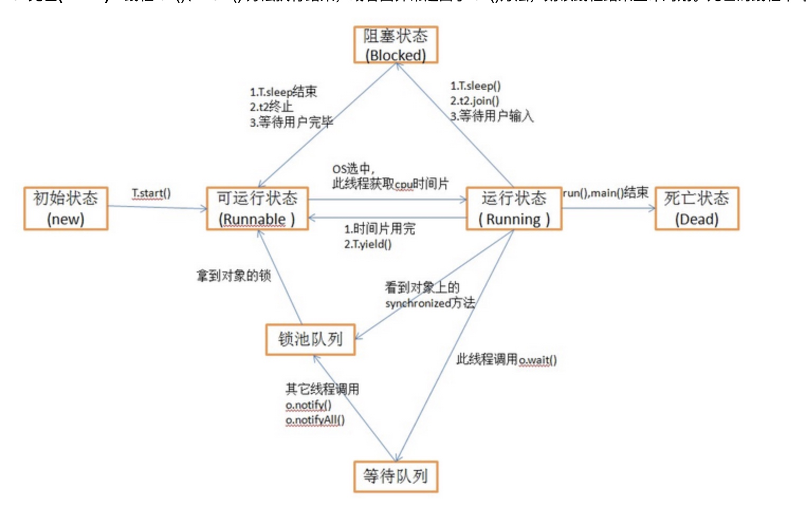

[TOC]
# 目的
jstack指令用于生成java虚拟机当前时刻的线程快照，线程快照是当前java虚拟机每一条线程正在执行的方法堆栈的集合，通过线程快照能够定位线程出现长时间停顿的原因，如果线程间死锁、死循环、请求外部资源导致的长时间等待等；
# 注意
jstack会导致jvm停顿
# monitor
监视器，是线程之间用于同步的手段，可以认为是对象或者class的锁。每个对象仅有一个monitor。
* 进入区（Entry Set）：线程准备获取锁，如果成功获取，则进入拥有者，变为活跃线程；否则在进入区等待锁释放，一旦释放锁，则立即参与竞争锁；
* 等待区（Wait Set）：线程对象在获取锁后调用wait等方法释放对象锁，则在等待区等待被唤醒，重新获取锁；
* 拥有者：线程成功获取到了锁；
# 线程状态
new：新建状态，未启动，不会出现在dump中；
runnable：就绪状态/可执行状态，只有获得cpu使用权后才可以运行线程；
running：运行状态，线程获得cpu使用权；
blocked：阻塞状态，阻塞并等待监视器锁，在entry set区；下次如果竞争锁成功则变为runnable状态；
waiting：等待状态，在wait set区；调用wait或者await或者thread.join()等方法进入等待状态；被唤醒后，则进入blocked状态;
timed_waiting：限时等待状态，超过等待时间则自动唤醒进入blocked或者就绪状态；thread.sleep(time),object.wait(time),thread.join(time)都会进入限时等待；
terminated：死亡状态，已退出的；

[线程状态及转换图](https://www.cnblogs.com/hejing-swust/p/8038263.html)
# 命令
jstack pid
jstack -help
stack -l pid > jstack.log （-l参数输出额外的锁信息，性能有损耗）
# 分析
jstack pid 显示的信息包含：线程名称、id和优先级，线程的状态和锁住的资源，线程的调用栈等信息；
[参考1](https://blog.csdn.net/lmb55/article/details/79349680)
[参考2](https://www.jianshu.com/p/f36a1db63ad2)
[参考3](https://blog.csdn.net/wangshuminjava/article/details/80982193)
[参考4](https://jameswxx.iteye.com/blog/1041173)
