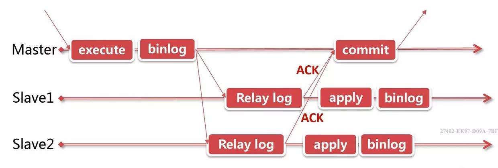
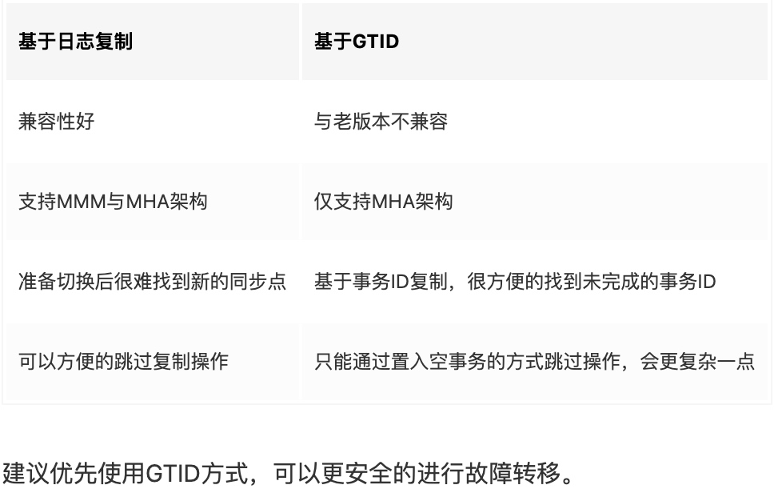
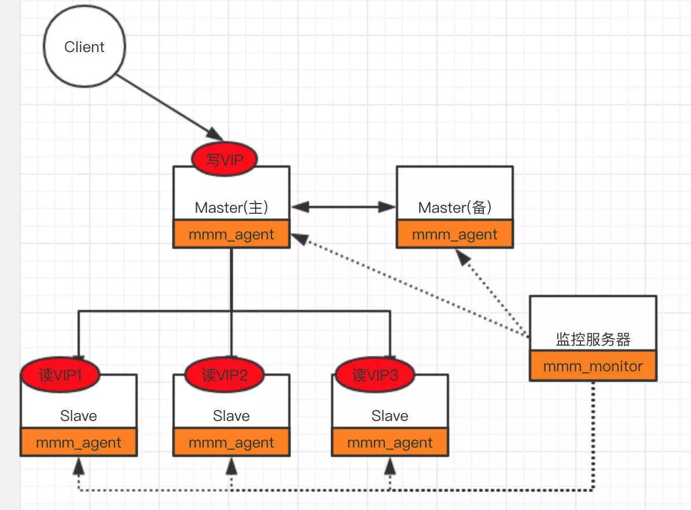
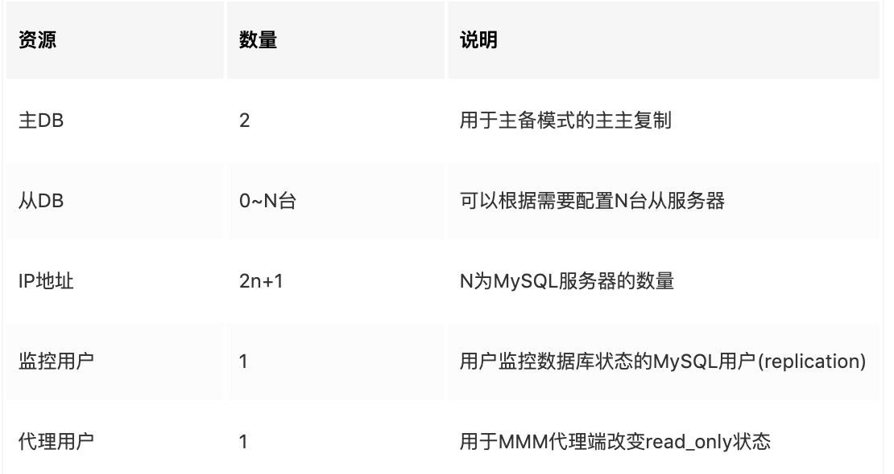
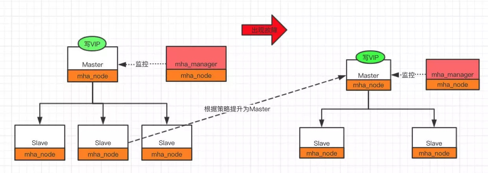
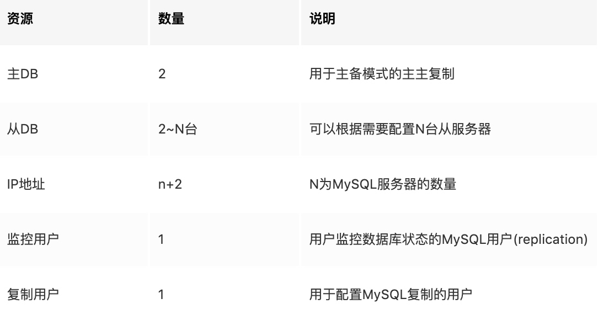
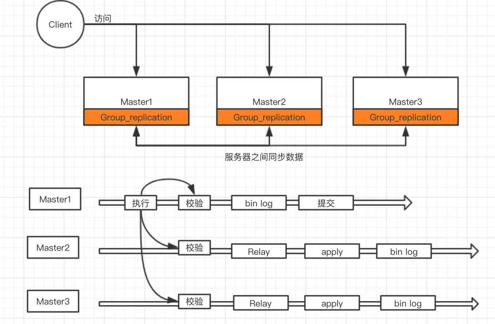

[TOC]

# 总结和问题
读负载大问题：增加slave，读写分离，增加中间层(mycat等)；
写负载大：增加中间层，多主，分库分表
数据库架构变化：
单库-->主从-->主主-->多主多从-->
# 主从架构
## 介绍
主从架构：主负责写，从库负责读；这种场景下，主库未做到高可用；
1. master需要开启binlog日志的功能；主库记录二进制日志，每次准备提交事物完成数据库更新前，先记录二进制日志，记录二进制日志后，主库会告诉存储引擎可以提交事物了；
2. 备库将主库的二进制日志复制到本地的中继日志中，首先，备库会先启动一个工作进程，称为IO工作线程，负责和主库建立一个普通的客户端连接。如果该进程追赶上了主库，它将进入睡眠状态，直到主库有新的事件产生通知它，他才会被唤醒，将接收到的事件记录到中继日志中。
3. 备库的SQL线程执行最后一步，该线程从中继日志中读取事件并且在备库执行，当SQL线程赶上IO线程的时候，中继日志通常记录在系统缓存中，所以中继日志的开销很低。SQL线程也可以根据配置选项来决定是否写入其自己的二进制日志中。
4. 支持异步复制、半同步复制和同步复制
5. slave是主动从master中拉取数据，而不是master推送；因为slave可能会在master中途连接上，需要全量拉取或者按需拉取；

## 半同步复制
在主库commit返回之前，需要先将binlog日志同步到从库，主库可以设置同步binlog的过期时间，在binlog复制到从库之后，从库后续会自行重放中继日志。半同步复制增加了客户端的延迟。
       

## 复制原理
基于GTID和日志
日志：传统的方式，默认的方式。依赖二进制日志，根据日志的偏移量。事务不断提交，二进制日志的偏移量也会不断的变化。需要从库告诉主库，自己明确复制到了偏移量的什么位置。
GTID: 全局事务ID，在一个集群内的一个GTID是唯一的， GTID= source_id:transcation_id，source_id为那一台机器上的，slave增量复制还未同步的GTID即可。

## 主从复制延迟
* 延迟原因
    1. 主节点如果执行一个很大的事务(更新千万行语句，总之执行很长时间的事务)，那么就会对主从延迟产生较大的影响
    2. 网络延迟，日志较大，slave数量过多。
    3. 主上多线程写入，从节点只有单线程恢复

* 解决办法
    1. 大事务：将大事务分为小事务，分批更新数据。
    2. 减少Slave的数量，不要超过5个，减少单次事务的大小。
    3. MySQL 5.7之后，可以使用多线程复制，使用MGR复制架构
    
# 多主架构
1. 可以对多主进行多写，提高写的性能；
2. 也可以只写一个主1，另外一个主2作为备份，正常情况下不对外提供服务，只有主1挂了，主2才会对外提供服务；
3. 主主之间则是互为主从的关系，需要进行数据同步；
4. 如果多主可以同时写，那么需要考虑主键ID问题，不能冲突；可以每个主设置不同的自增初始值和步长，或者业务生成唯一ID；
5. 多主可以做到高可用；
6. 多主架构需要keepalived，使用VIP对外提供服务，当master1挂了，vip会自动漂移到master2，由master2继续对外提供服务；

# 高可用架构
[美团点评MySQL数据库高可用架构从MMM到MHA+Zebra以及MHA+Proxy的演进](https://cloud.tencent.com/developer/article/1056162)
对主从复制集群中的Master节点进行监控
自动的对Master进行迁移，通过VIP。
重新配置集群中的其它slave对新的Master进行同步

## MMM
需要两个Master，同一时间只有一个Master对外提供服务，可以说是主备模式。

需要的基础资源：

故障转移步骤：
* Slave服务器上的操作：slave服务器指向新的主服务器
    * 完成原主服务器上已经复制的日志恢复
    * 使用Change Master to命令连接新的主服务器
* 主服务器上操作：主备服务器切换为新的主服务器
    * 设置read_only=off
    * 迁移VIP到新主服务器

* 优点：
提供了读写VIP的配置，试读写请求都可以达到高可用
工具包相对比较完善，不需要额外的开发脚本
完成故障转移之后可以对MySQL集群进行高可用监控

* 缺点：
故障简单粗暴，容易丢失事务，建议采用半同步复制方式，减少失败的概率
目前MMM社区已经缺少维护，不支持基于GTID的复制

* 适用场景：
读写都需要高可用的
基于日志点的复制方式

## MHA

需要的资源：

MHA采用的是从slave中选出Master，故障转移：

* 从服务器：
    1. 选举具有最新更新的slave节点
    2. 尝试从宕机的master中保存二进制日志
    3. 应用差异的中继日志到其它的slave节点
    4. 应用从master保存的二进制日志
    5. 提升选举的slave为master
    6. 配置其它的slave向新的master同步

* 优点：
MHA除了支持日志点的复制还支持GTID的方式
同MMM相比，MHA会尝试从旧的Master中恢复旧的二进制日志，只是未必每次都能成功。如果希望更少的数据丢失场景，建议使用MHA架构。（可能只是响应超时，并不是真正的宕机了）

* 缺点：
未必能够获取老的master未同步的日志，建议采用5.7版本之后的半同步复制；
MHA需要自行开发VIP转移脚本。
MHA只监控Master的状态，未监控Slave的状态，只保证了master的高可用，未保证slave的高可用

## MGR
MGR是基于现有的MySQL架构实现的复制插件，可以实现多个主对数据进行修改，使用paxos协议复制，不同于异步复制的多Master复制集群。
支持多主模式，但官方推荐单主模式：

多主模式下，客户端可以随机向MySQL节点写入数据
单主模式下，MGR集群会选出primary节点负责写请求，primary节点与其它节点都可以进行读请求处理.

优点：

基本无延迟，延迟比异步的小很多
支持多写模式，但是目前还不是很成熟
数据的强一致性，可以保证数据事务不丢失

缺点:

仅支持innodb
只能用在GTID模式下，且日志格式为row格式

适用的业务场景：

对主从延迟比较敏感
希望对对写服务提供高可用，又不想安装第三方软件
数据强一致的场景

 
