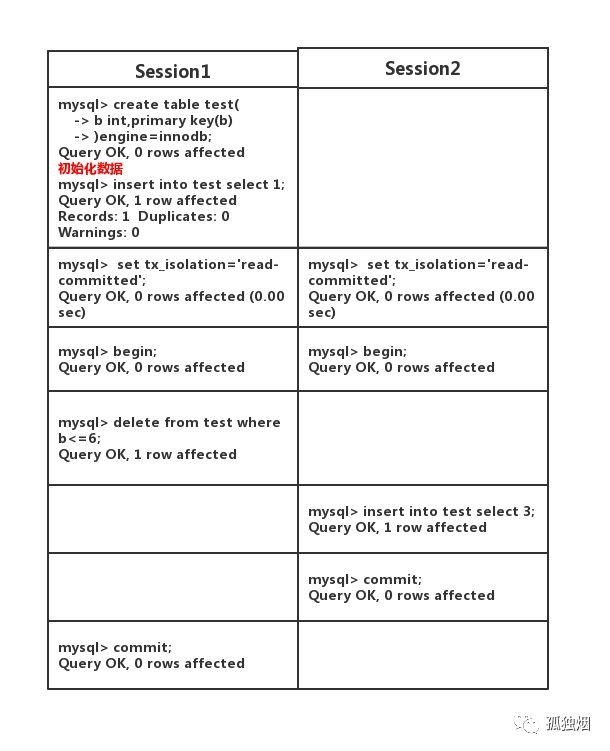

[TOC]
# mysql隔离级别
读未提交、读已提交(RC)、可重复读(RR)、串行化；
mysql默认的隔离级别是可重复读，一般来说，互联网场景下会采用RC的隔离级别，而不是RR级别。

# 为什么选用RC而不是RR
总结：性能好，能够承受更高的并发。
首先声明一点，项目中不会用读未提交和串行化的，对于读未提交，一个事务能够读到另外一个事务未提交的数据，如果另外一个事务回滚了呢？显然不可行。对于串行化，每个读操作都会加锁，读写冲突，性能很差。

RC相比RR的优势在哪里呢？
1. 在RR隔离级别下，存在间隙锁，导致出现死锁的概率比RC大的多。
2. RR级别下，条件列如果没有命中索引，那么会导致锁表，而在RC级别下，只会锁行，因为会先走聚簇索引，进行全表扫描，但是在mysql server层，会根据条件进行过滤，将不满足条件的记录释放锁，因此最终加锁也只会对满足条件列的主键进行加锁。在RR级别下，也是先走聚簇索引，进行全表扫描，最后将整个表锁上，直至事务提交或者回滚。（可见，RC级别的释放锁的操作违反了两阶段协议）
3. RC级别，半一致性读 的特性增加了update操作的并发性。一个update语句，如果读到一行已经加锁的记录，此时innodb返回最近提交的版本，然后mysql server判断此版本是否满足where条件，如果满足则mysql会重新发起一次读操作，并加锁，但是如果不满足条件，则直接返回，不必等待其他事务执行完成。即，半一致性读减少了update语句时行锁的冲突，对于不满足update更新条件的记录可以提前释放锁，直接返回，减少并发冲突的概率，提高update操作的并发性。

在RC级别下，不可重复读和幻读的问题怎么办呢？其实是可以接受的，因为毕竟数据都已经提交了，读出来的问题不太大。
在RC级别下，主从复制的binlog采用row格式，基于行的复制。

# 为什么隔离级别默认是RR
这个是有历史原因的，主从复制是基于binlog实现的，binlog的格式有三种：statement-记录的是修改sql语句，row-记录的是每行数据的变更，mixed-statement和row模式的混合；在5.0版本以前，binlog只有statement这种格式，然而这个格式在RC级别下有bug的，如下所示，在master上执行以下事务：

此时在master上查询出来的数据是3，但是在slave上查询时，数据为空，出现了主从不一致的情况。因为statement格式下是按照事务提交的顺序来记录sql的顺序，由于事务2先于事务1提交，所以slave是先插后删，导致数据为空了。
解决方案：
1. 隔离级别设置为可重复读，该级别下有间隙锁，当session1执行delete时，会锁住间隙，那么session2执行插入语句就会被阻塞。
2. binlog格式改为row，基于行的复制，自然就不会出现sql执行顺序不一样的问题。这个是在5.1版本后才引入。
因此由于历史原因，mysql将默认的隔离级别改为可重复读。