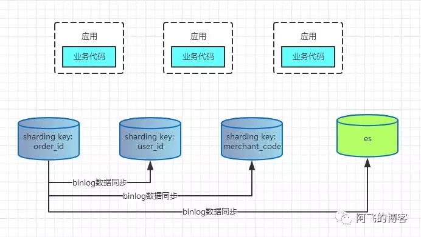

[TOC]

# 名次解释
库database。表table。 分库分表sharding

# 数据库架构演变
刚开始，单机数据库能够满足我们的要求，随着并发量越来越大，需要进行读写分离，主负责写，多个从库负责读，从库从主库拉取binlog日志进行更新，保持数据一致性，从库能够水平扩展，应对更多的读请求；
但是如果写请求越来越多了，一个master无法解决问题，可以采用多master架构，多master之间互为主从，互相同步(主键id可以采用设置不同的初始值和步长避免冲突)，这样会导致架构变得复杂，而且多主之间数据同步在极端情况下会丢失。而且，这个也无法解决单表或者单库过大的问题；（不是 master主备只是存储一部分数据，slave存储全量数据）

这时就需要进行分库分表，对写操作进行切分。

# 要解决的问题
用户请求量太大
因为单服务器TPS，内存，IO都是有限的。 解决方法：分散请求到多个服务器上； 其实用户请求和执行一个sql查询是本质是一样的，都是请求一个资源，只是用户请求还会经过网关，路由，http服务器等。

单库太大
单个数据库处理能力有限；单库所在服务器上磁盘空间不足；单库上操作的IO瓶颈 解决方法：切分成更多更小的库

单表太大
CRUD都成问题；索引膨胀，查询超时 解决方法：切分成多个数据集更小的表。

# 分区表？
分库分表不同于分区表，或者表分区；
分区表在逻辑上是一张表，但是底层是由多个物理子表组成；其中innodb、myisam和ndb等支持表分区；当进行表分区后，每个分区是一个文件，但是对于客户端来说，逻辑上仍然是一张表；分区表无法解决单机性能的瓶颈，如io，cpu等；

操作原理：当进行查询/更新/删除时，首先分区层会打开并锁住所有的底层表，然后确定对应的分区，最后再在分区内进行操作。innodb实现了行锁，这里会在分区层释放对应的表锁；

分区类型：
    水平分区：范围、hash、key、预定义列表list、columns等；
    垂直分区：按列进行分区，可以将包含了text类型的列划分到单独的分区，提高访问速度；
    
场景：
1. 表非常大以至于无法全部都放到内存，或者只在表的最后部分有热点数据，其他均为历史数据；
2. 分区表数据更容易维护（可独立对分区进行优化、检查、修复及批量删除大数据可以采用drop分区的形式等）；
3. 可以备份和恢复独立的分区，非常适用于大数据集的场景；

限制：
1. 单表最多支持1024个分区；
2. 如果分区字段中有主键或唯一索引的列，那么所有的主键列和唯一索引列都必须包含进来；
3. 分区表无法使用外键约束
4. 分区必须使用相同的Engine

# 分库分表的方法
一般就是垂直切分和水平切分，这是一种结果集描述的切分方式，是物理空间上的切分。 我们从面临的问题，开始解决，阐述： 首先是用户请求量太大，我们就堆机器搞定（这不是本文重点）。

然后是单个库太大，这时我们要看是因为表多而导致数据多，还是因为单张表里面的数据多。 如果是因为表多而数据多，使用垂直切分，根据业务切分成不同的库。

如果是因为单张表的数据量太大，这时要用水平切分，即把表的数据按某种规则切分成多张表，甚至多个库上的多张表。 分库分表的顺序应该是先垂直分，后水平分。 因为垂直分更简单，更符合我们处理现实世界问题的方式。

## 垂直拆分
垂直分表

也就是“大表拆小表”，基于列字段进行的。一般是表中的字段较多，将不常用的， 数据较大，长度较长（比如text类型字段）的拆分到“扩展表“。 一般是针对那种几百列的大表，也避免查询时，数据量太大造成的“跨页”问题。

垂直分库

垂直分库针对的是一个系统中的不同业务进行拆分，比如用户User一个库，商品Producet一个库，订单Order一个库。 切分后，要放在多个服务器上，而不是一个服务器上。为什么？ 我们想象一下，一个购物网站对外提供服务，会有用户，商品，订单等的CRUD。没拆分之前， 全部都是落到单一的库上的，这会让数据库的单库处理能力成为瓶颈。按垂直分库后，如果还是放在一个数据库服务器上， 随着用户量增大，这会让单个数据库的处理能力成为瓶颈，还有单个服务器的磁盘空间，内存，tps等非常吃紧。 所以我们要拆分到多个服务器上，这样上面的问题都解决了，以后也不会面对单机资源问题。

数据库业务层面的拆分，和服务的“治理”，“降级”机制类似，也能对不同业务的数据分别的进行管理，维护，监控，扩展等。 数据库往往最容易成为应用系统的瓶颈，而数据库本身属于“有状态”的，相对于Web和应用服务器来讲，是比较难实现“横向扩展”的。 数据库的连接资源比较宝贵且单机处理能力也有限，在高并发场景下，垂直分库一定程度上能够突破IO、连接数及单机硬件资源的瓶颈。

垂直分表的意义：
1. 每个数据库都有自己的内存buffer，是以行为单位缓存数据的，在内存有限的情况喜爱，缓存更短的行，可以缓存更多的数据，提高缓存命中率，减少磁盘IO。
2. select 查询指定字段时，虽然不会查出来其他字段，但是也是需要被扫描的，检索表的时候需要执行大量的IO，降低性能；
但是无法解决单表数据量太大的问题。需要通过水平拆分解决。

## 水平拆分
1. 水平分表
    针对数据量巨大的单张表（比如订单表），按照某种规则（RANGE,HASH取模等），切分到多张表里面去。 但是这些表还是在同一个库中，所以库级别的数据库操作还是有IO瓶颈。不建议采用。
2. 水平分库分表
    将单张表的数据切分到多个服务器上去，每个服务器具有相应的库与表，只是表中数据集合不同。 水平分库分表能够有效的缓解单机和单库的性能瓶颈和压力，突破IO、连接数、硬件资源等的瓶颈。
3. 水平分库分表切分规则
    1. RANGE
        从0到10000一个表，10001到20000一个表；
    2. HASH取模
        一个商场系统，一般都是将用户，订单作为主表，然后将和它们相关的作为附表，这样  不会造成跨库事务之类的问题。 取用户id，然后hash取模，分配到不同的数据库上。
    3. 地理区域
        比如按照华东，华南，华北这样来区分业务，七牛云应该就是如此。
    4. 时间
        按照时间切分，就是将6个月前，甚至一年前的数据切出去放到另外的一张表，因为随着时间流逝，这些表的数据 被查询的概率变小，所以没必要和“热数据”放在一起，这个也是“冷热数据分离”。
        
# 分库分表后面临的问题
1. 事务支持
    分库分表后，就成了分布式事务了。如果依赖数据库本身的分布式事务管理功能去执行事务，将付出高昂的性能代价； 如果由应用程序去协助控制，形成程序逻辑上的事务，又会造成编程方面的负担。
2. 多库结果再处理
    如group by，order by，分页查询，需要应用端进行处理；每个数据库都需要先执行相同的函数逻辑，然后由客户端做二次处理；如max函数等；
3. 跨库join
    库分表后表之间的关联操作将受到限制，我们无法join位于不同分库的表，也无法join分表粒度不同的表， 结果原本一次查询能够完成的业务，可能需要多次查询才能完成。 
    粗略的解决方法： 
    全局表：基础数据，所有库都拷贝一份。(对于数据量比较少，且不怎么变化的表可以采用全局表)
    字段冗余：这样有些字段就不用join去查询了。 
    系统层组装：分别查询出所有，然后组装起来，较复杂。
4. 节点扩容，当需要扩展数据库节点时，可能会涉及到数据的迁移等；
5. 

# 为什么不建议跨分片查询
跨分片查询的原理：线程池并发请求到所有符合路由规则的目标分表，然后对所有结果进行归并；当路由结果只有一个时，即不需要跨分片查询，那么不会通过线程池异步指向，而是直接同步执行，减少线程开销；
 
# 分表键选择
[如何选择合适的分表键，路由规则及分片数](https://github.com/Meituan-Dianping/Zebra/wiki/%E5%A6%82%E4%BD%95%E9%80%89%E6%8B%A9%E5%90%88%E9%80%82%E7%9A%84%E5%88%86%E8%A1%A8%E9%94%AE%EF%BC%8C%E8%B7%AF%E7%94%B1%E8%A7%84%E5%88%99%E5%8F%8A%E5%88%86%E7%89%87%E6%95%B0)
[分库分表：用户中心，单key业务如何进行数据库切分](https://blog.csdn.net/fly910905/article/details/87182879)
[分库分表：订单中心，多key业务如何进行数据库切分](https://blog.csdn.net/fly910905/article/details/87285709)
[分库分表技术演进&最佳实践-修订篇](https://mp.weixin.qq.com/s?__biz=MzU5ODUwNzY1Nw==&mid=2247484012&idx=1&sn=be574cb31f0c0a36034f4635294e55d0&chksm=fe426b8ac935e29c7aa313334446066eddff290121aa089b30698b7a1a9371e6d5e6d78d8c43&scene=21)
[分库分表需要考虑的问题及思路](https://juejin.im/entry/591968f6a0bb9f005ff7af23)
[大众点评订单系统分库分表实践](https://tech.meituan.com/2016/11/18/dianping-order-db-sharding.html)
## 选择的原则
分表键即分库分表的字段，是在水平拆分过程中用于生成拆分规则的数据表字段，根据分表键的值将数据表水平拆分到每个物理库中；
数据表拆分的首要原则，就是要尽可能找到数据表中的数据在业务逻辑上的主体，并确定大部分（或核心的）数据库操作都是围绕这个主体的数据进行，然后可使用该主体对应的字段作为分表键，进行分库分表。
业务逻辑上的主体，通常与业务的应用场景相关，下面的一些典型应用场景都有明确的业务逻辑主体，可用于分表键：

面向用户的互联网应用，都是围绕用户维度来做各种操作，那么业务逻辑主体就是用户，可使用用户对应的字段作为分表键；

侧重于卖家的电商应用，都是围绕卖家维度来进行各种操作，那么业务逻辑主体就是卖家，可使用卖家对应的字段作为分表键；

以此类推，其它类型的应用场景，大多也能找到合适的业务逻辑主体作为分表键的选择。

如果确实找不到合适的业务逻辑主体作为分表键，那么可以考虑下面的方法来选择分表键：

根据数据分布和访问的均衡度来考虑分表键，尽量将数据表中的数据相对均匀地分布在不同的物理分库/分表中，适用于大量分析型查询的应用场景（查询并发度大部分能维持为1）；

按照数字（字符串）类型与时间类型字段相结合作为分表键，进行分库和分表，适用于日志检索类的应用场景。

注意：无论选择什么拆分键，采用何种拆分策略，都要注意拆分值是否存在热点的问题，尽量规避热点数据来选择拆分键。

注意：不一定需要拿数据库主键当做分表键，也可以拿其他业务值当分表键。拿主键当分表键的好处是可以散列均衡，减少热点问题。

## 多个分表键如何处理
### 根据多个维度进行分库分表
主分表键：数据能够进行增删改查
辅助分表键：只能进行数据查询
比如订单表有买家id和卖家id，首先根据买家id进行分库分表，买家id作为主分表键；然后通过binlog的方式同步数据到辅助分表键的一份数据，再根据辅助分表键进行分库分表。

缺点：数据冗余，浪费空间；有一定的延迟；每多一个维度查询时都需要进行分库分表；相比使用索引表的方式，不需要二次查询；需要维护多个表的数据一致性；
适应to B的场景

总结：选择冗余全量表还是索引关系表，这是一种架构上的trade off，两者的优缺点明显，阿里的订单表是冗余全量表。

### 多个维度变成一维
辅助维度有时也是主维度，比如订单表中的orderId和userId是对应的，实际查询的时候可能根据orderId查询，也有可能根据userId查询，Order表的主维度是UserID，OrderID是辅助维度，但是由于OrderID其中的6位和UserID完全一致，也就是说，在OrderID中会把UserID打进去。
在路由的时候，如果SQL中带有UserID，那么直接拿UserID进行Hash取模路由；如果SQL中带有的OrderID维度，那么取出OrderID中的6位UserID进行Hash取模路由，结果是一致的。

适用场景：辅助维度和主维度其实可以通过将主维度和辅助维度的值进行信息共享。

case：订单表一般会根据orderId，buyerId，sellerId进行查询，对于用户侧一般是根据userId进行分库分表；如果不考虑sellerId，那么我们在生成orderid的时候可以冗余buyerId的信息（orderId = f(userId)，前半部分可以是uuid，后半部分是userId的二进制，保证了一个用户的所有订单都在一个表中），即根据orderId可以获得userId的信息，那么根据orderId进行查询时，先根据规则获得userId信息，然后再进行查询。
 
### 建立索引表
对于辅助维度可以建一张辅助维度和主维度的映射表。
举例来说，表A有两个维度，主维度a，辅助维度b，目前只有主维度的一份数据。
此时，如果有SQL： select * from A where b = ？过来，那么势必会在主维度上进行全表扫描。
那么建一张新表B_A_Index，里面就只有两个字段，a和b的值，这张表可以分表，也可以不分表，建议分表这张表的主维度就是b。
所以可以先查：select a from B_A_Index where b = ?，获得到a的值，然后 查询 select * from A where a = 查询到的值 and b = ? 进行查询。

试用场景：主副维度是一一对应的。优势是，无需数据冗余，只需要冗余一份索引数据。缺点是，需要业务进行略微的改造。

案例：比如用户表，userId作为分表键，根据userId可以直接定位到数据库，但是如果想根据name查询是需要查询所有表的，可以建立一张索引表，建立name到userId的映射关系，通过name查询时先通过索引表查询到userId，然后再进行查询；索引表的字段比较少，所以数据比较少，一般不需要分库，如果数据量太大，也可以根据name进行分库分表；

延伸：一般来说，对于用户侧的查询只会根据userId进行，如果是后台管理系统可能会根据name、identity进行查询；可以使用索引表，也可以使用缓存代替索引表，提高查询性能，如果cache丢失，再扫全库查询，然后将映射关系放入缓存，由于是后台查询，所以偶尔扫全库关系不大；

优化：类似多维度变成单维度的做法，设计一个函数f，将name生成4bit的基因；同时生成60bit的全局唯一id，则用户的唯一标识userId是由id和4bit的基因组成；然后按照userId进行分库分表；当通过name查询数据时，根据函数f获得4bit基因，直接可以根据这个4bit基因定位到属于哪个数据库表。（这里的4bit是，如果分成16个库，才会这样，因为userId%16，其实就是由userId的低四位决定的）

### 搜索引擎
有些查询的频率没有那么多，不可能为了每个维度都做一次分库分表，数据量大，可以采用es的方案来解决。

总体来说就是es+hbase 或者solr+hbase;
一般订单表，积分明细表等需要分库分表的核心表都会有好几十列，甚至上百列（假设有50列），但是整个表真正需要参与条件索引的可能就不到10个条件（假设有10列）。这时候把50个列所有字段的数据全量索引到es中，对es集群有很大的压力，后面的es分片故障恢复也会需要很长的时间。
这个时候我们可以考虑减少es的压力，让es集群有限的资源尽可能保存条件检索时最需要的最有价值的数据，即只把可能参与条件检索的字段索引到es中，这样整个es集群压力减少到原来的1/5（核心表50个字段，只有10个字段参与条件），而50个字段的全量数据保存到HBase中，这就是经典的es+HBase组合方案，即索引与数据存储隔离的方案。
Hadoop体系下的HBase存储能力我们都知道是海量的，而且根据它的rowkey查询性能那叫一个快如闪电。而es的多条件检索能力非常强大。这个方案把es和HBase的优点发挥的淋漓尽致，同时又规避了它们的缺点，可以说是一个扬长避免的最佳实践。

## 分表策略
### hash
使用分表键的值Hash取模进行路由。最常用的分表方式。
优点：
数据量散列均衡，每个表的数据量大致相同。
请求压力散列均衡，不存在访问热点
缺点：
一旦现有的表数据量需要再次扩容时，需要涉及到数据移动，比较麻烦。所以一般建议是一次性分够。
适应场景：
在线服务。一般均以UserID或者ShopID等进行hash。

### range范围
拿分表键按照ID范围进行路由，比如id在1-10000的在第一个表中，10001-20000的在第二个表中，依次类推。这种情况下，分表键只能是数值类型。
优点：
数据量可控，可以均衡，也可以不均衡
扩容比较方便，因为如果ID范围不够了，只需要调整规则，然后建好新表即可。
缺点：
无法解决热点问题，如果某一段数据访问QPS特别高，就会落到单表上进行操作。
适应场景：
离线服务，这样的分表适合需要对数据做归档处理，比如系统默认只提供近三个月历史数据的查询功能，这样也方便操作；只需要把三月之前的数据单独移走备份保存即可）。

### 时间
拿分表键按照时间范围进行路由，比如时间在1月的在第一个表中，在2月的在第二个表中，依次类推。这种情况下，分表键只能是时间类型。
优点：
扩容比较方便，因为如果时间范围不够了，只需要调整规则，然后建好新表即可。
缺点：
数据量不可控，有可能单表数据量特别大，有可能单表数据量特别小
无法解决热点问题，如果某一段数据访问QPS特别高，就会落到单表上进行操作。
适应场景：
离线服务。比如线下运营使用的表、日志表等等
	

## 分片数据选择
水平拆分有两个层次：分库和分表。 表数目决策

一般情况下，建议单个物理分表的容量不超过1000万行数据。通常可以预估2到5年的数据增长量，用估算出的总数据量除以总的物理分库数，再除以建议的最大数据量1000万，即可得出每个物理分库上需要创建的物理分表数：

（未来3到5年内总共的记录行数) / 单张表建议记录行数 （单张表建议记录行数 = 1000万）
表的数量不宜过多，涉及到聚合查询或者分表键在多个表上的SQL语句，就会并发到更多的表上进行查询。举个例子，分了4个表和分了2个表两种情况，一种需要并发到4表上执行，一种只需要并发到2张表上执行，显然后者效率更高。
表的数目不宜过少，少的坏处在于一旦容量不够就又要扩容了，而分库分表的库想要扩容是比较麻烦的。一般建议一次分够。
建议表的数目是2的幂次个数，方便未来可能的迁移。
库数目决策
计算公式：按照存储容量来计算 = （3到5年内的存储容量）/ 单个库建议存储容量 （单个库建议存储容量 <300G以内）
DBA的操作，一般情况下，会把若干个分库放到一台实例上去。未来一旦容量不够，要发生迁移，通常是对数据库进行迁移。所以库的数目才是最终决定容量大小。
最差情况，所有的分库都共享数据库机器。最优情况，每个分库都独占一台数据库机器。一般建议一个数据库机器上存放8个数据库分库。
`
一开始上来就是 32 个库，每个库 32 个表，那么总共是 1024 张表。
我可以告诉各位同学，这个分法，第一，基本上国内的互联网肯定都是够用了，第二，无论是并发支撑还是数据量支撑都没问题。
每个库正常承载的写入并发量是 1000，那么 32 个库就可以承载32 1000 = 32000 的写并发，如果每个库承载 1500 的写并发，32 1500 = 48000 的写并发，接近 5万/s 的写入并发，前面再加一个MQ，削峰，每秒写入 MQ 8 万条数据，每秒消费 5 万条数据。
有些除非是国内排名非常靠前的这些公司，他们的最核心的系统的数据库，可能会出现几百台数据库的这么一个规模，128个库，256个库，512个库。
1024 张表，假设每个表放 500 万数据，在 MySQL 里可以放 50 亿条数据。
每秒的 5 万写并发，总共 50 亿条数据，对于国内大部分的互联网公司来说，其实一般来说都够了。
谈分库分表的扩容，第一次分库分表，就一次性给他分个够，32 个库，1024 张表，可能对大部分的中小型互联网公司来说，已经可以支撑好几年了。
一个实践是利用 32 * 32 来分库分表，即分为 32 个库，每个库里一个表分为 32 张表。一共就是 1024 张表。根据某个 id 先根据 32 取模路由到库，再根据 32 取模路由到库里的表。
刚开始的时候，这个库可能就是逻辑库，建在一个数据库上的，就是一个mysql服务器可能建了 n 个库，比如 32 个库。后面如果要拆分，就是不断在库和 mysql 服务器之间做迁移就可以了。然后系统配合改一下配置即可。
比如说最多可以扩展到32个数据库服务器，每个数据库服务器是一个库。如果还是不够？最多可以扩展到 1024 个数据库服务器，每个数据库服务器上面一个库一个表。因为最多是1024个表`

    
# 分页查询方案
[业界难题-“跨库分页”的四种方案](https://cloud.tencent.com/developer/article/1048654)
分库分表中，如果查询条件或者排序条件中带有分表键，那么是没有问题的，可以直接定位在哪一张表然后排序进行分页面查询。但是如果没有分表键，那该如何处理呢？
比如要查最近注册的第三页用户，单库上直接查询：
select * from t_user order by time offset 200 limit 100
但是变成多库多表后，分表键是userId，但是排序是根据time，失去了time排序的全局视野。
这里就需要进行跨库的分页查询了。
## 全局视野法

如上图所示，分成两个库表，那么第三页数据有可能全部在db0或者db1，也有可能一部分在db0或者db1；这种情况下，那么每个库都需要返回全部的数据，再取第三页的数据，才能得到全局下的第三页数据；
1. 将order by time offset X limit Y，改写成order by time offset 0 limit X+Y；
2. 服务层将改写后的SQL语句发往各个分库：即例子中的各取3页数据；
3. 假设共分为N个库，服务层将得到N*(X+Y)条数据：即例子中的6页数据；
4. 服务层对得到的N*(X+Y)条数据进行内存排序，内存排序后再取偏移量X后的Y条记录，就是全局视野所需的一页数据；

优点：服务层修改sql语句，精确返回所需数据；
缺点：每个分库需要返回更多的数据，增加网络传输量；服务层需要按照time进行二次排序；随着页数增加，性能会急剧下降，这是因为每个分库都需要返回x+y的数据，如果是100页，那么x=900了；数据量太大，耗更多的内存；

## 业务折衷法
“任何脱离业务的架构设计都是耍流氓”，技术方案需要折衷，在技术难度较大的情况下，业务需求的折衷能够极大的简化技术方案。
### 禁止跳页查询
在数据量很大，翻页数很多的时候，很多产品并不提供“直接跳到指定页面”的功能，而只提供“下一页”的功能，这一个小小的业务折衷，就能极大的降低技术方案的复杂度。
由于禁止跳页查询，那么第一次查询的肯定是第一页的数据，每个数据库返回100条数据，内存排序取出100条数据，当查询第二页数据的时候，拿着第一次查询排序后的最大time作为条件去每个数据库查询，每个数据库再返回100条数据即可；由此可见，这样内存中排序的数据不会因为页数增大而增大，每个数据库始终都返回100条数据；

### 允许数据精度损失
使用patition key进行分库，在数据量较大，数据分布足够随机的情况下，各分库所有非patition key属性，在各个分库上的数据分布，统计概率情况是一致的，基本是比较均匀的。
那么在查第100页的数据时，只需要从两个数据库中每个数据库取出第50页的50条数据，然后并集，作为全局的100页数据；

适应场景：
如网页，帖子等；

优点：不需要返回更多的数据，内存不需要二次排序；
缺点：数据不准确

### 终极武器-二次查询
比如要查询偏移量为1000，limit为5的页数据，有3个数据库；
1. 改写sql，偏移量1000/3=333，limit为5的页数据，每个数据库都会查询；
2. 找到返回的三页数据中最小的minTime，然后修改sql，时间在minTime和每个数据库返回time最大值之间的数据；这一次查询出来的数据会比第一次查询多出一些数据；
3. 这样就能拿到最小minTime对应的那条记录在全局的一个位置了，比如三个页中最小id分别为333，331和330，那么全局的位置为994；
4. 那么在要查询偏移量为1000的后5条数据，自然也就能够拿到了；

缺点：需要两次数据库查询；

    
# 平滑扩容方案
对于采用范围进行分片的数据库，只需要新增数据库即可，旧的数据不需要迁移；这里主要是讨论的是hash分片方案进行扩容带来的影响。
x个库扩容为y个库
## 停服方案
1. 挂一个公告，XX点-XX点系统维护，届时不能登录；
2. 停服务；
3. 新建y个库，做好高可用；
4. 数据迁移，重新分布，写一个数据迁移程序，从x库中获取数据并按照新的路由规则将数据导入y库中，由%x改为%y；x库的数据不会修改，迁移完成后可以直接回收x库；
5. 修改服务配置；
6. 重启服务，对外提供服务；

最耗时的是第四步，迁移数据；

回滚方案：如果数据迁移失败，将配置改回x库，恢复服务；

优点：简单
缺点：
1. 停服，影响用户体验；
2. 如果是在运行一段时间后发现有问题，难以回滚，需要回档，可能会丢失一部分数据；

## 利用主从同步来扩容
采用双倍扩容策略。扩容前的每个节点数据需要有一半要迁移至一个新增的节点中。
1. 新增两个数据库a2/b2作为从库，设置主从同步关系：a1->a2,b1->b2，直至主从数据同步完毕；
2. 调整分片规则，原 ID%2=0 => A 改为 ID%4=0 => A, ID%4=2 => A2； 原 ID%2=1 => B 改为 ID%4=1 => B, ID%4=3 => B2。(这里需要对从进行写操作了)
3. 解除主从关系；
4. 此时四个节点的数据都已经完整，只是有冗余，后面可以再删除冗余部分数据即可；

## 利用其他同步工具来完成
1. 通过ndc将老数据库的内容同步到新数据库中，先全量，后增量；
2. 然后修改分片规则；
3. 最后取消ndc的同步任务即可，防止丢失数据；

## 不迁移数据完成
可以利用某个规则，如时间戳，大于某个值采用一个分片规则，小于某个值利用另外一个分片规则；

# 如何设计可以动态扩容和缩容
在开始设计分库分表的时候，要分的足够多。分成32个数据库，每个库32张表，那么一共1024张表；如果每个库可以支撑1500写并发，那么32个库一共48000写并发，接近5万/2的写并发，应用层再进行缓存、限流或者mq削峰，完全足够了。
每张表放500万条数据，那么一共是50亿数据。
所以，32个库每个库有32张表基本上满足了互联网公司的未来几年的需求了。

如果一开始分的库表不足，那么后面进行扩容的时候就需要进行数据迁移，双写了；所以一开始可以分的足够多；根据分表键，先对32取模路由到库，再根据32取模路由到库里的表；

刚开始分库分表时，这个库可能是个逻辑库，建立在一个数据库上的，即一个mysql服务器上可能建了n个库，如果后面要拆分，只需要在库和mysql服务器上做迁移就可以了。

    
# 业界分库分表方案

## 代理层
部署一台代理服务器，伪装成mysql服务器，代理服务器与真实mysql节点进行通信，应用程序只与代理服务器之间通信，对应用层透明。
比如mycat等；

## 应用层
在业务层和jdbc层中间，以jar包方式提供给应用使用，对代码有入侵性。
1. 淘宝的TDDL，已停止维护；
2. 当当网的sharding-jdbc，仍在活跃中；直接封装了jdbc api，可以理解为增强版本的jdbc驱动，适应任何基因java的orm框架，如jpa，hibernate，mybatis等；可基于任何第三方数据库连接池如druid，c3p0等；
不需要额外的部署，应用直接连接数据库；

    
