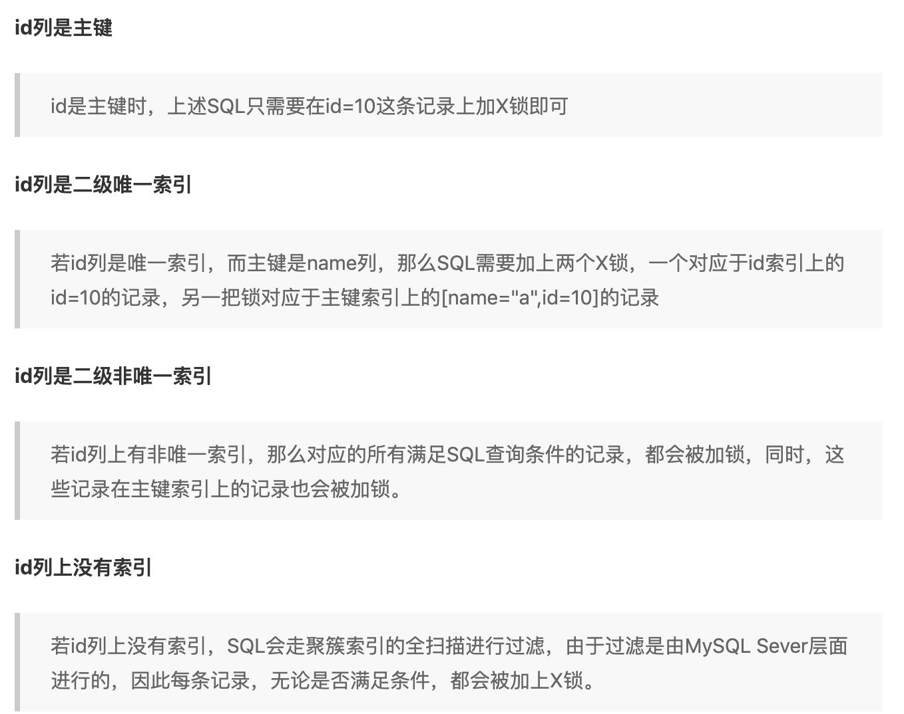

[TOC]
# 长度问题
varchar(n):n表示字符数，不论中英文；
mysql要求一条行记录的长度不能超过65535个字节，不包括text和blocb等大字段类型，但是varchar受此长度限制，和其他非大字段加起来不能超过65535个字节。
若编码为gbk，则每个字符占用2字节；
若编码为utf8，则每个字符最多占用3字节；

# 数据库文件
.frm文件：存储数据表的框架结构，文件名与表名相同，每个表对应一个frm文件，与存储引擎无关。
myisam的数据库表文件：
   .myd文件：存储表的数据
   .myi文件：存储表的索引
innodb的数据库表文件：
   .ibd文件：存放表的数据和索引；（ibdata1,ibdata2等为系统表空间文件，即该库下的所有表的数据和索引都存储在该文件中；ibd是单表表空间文件，每个表使用一个表空间的文件）
# 独立表空间&共享表空间
共享表空间：所有数据表共用一个表空间，可以分多个文件存储；
独立表空间：每个数据表使用一个表空间；
共享表空间缺点：删除数据时，文件不会自动收缩，会产生大量的空隙，对于统计分析或者经常删除操作的场景不适合用共享表空间；也不容易将单个数据表进行备份；

独立表空间优点：
1. 可以实现单表在不同的数据库中移动；（因为是单独的表空间文件）
2. 对于使用独立表空间的表，不管怎么删除，表空间的碎片不会太严重的影响性能，空间可以回收；

独立表空间缺点：
1. 单表多大的问题；对于共享表空间，是可以存储在多个文件中，不受文件本身大小的限制；对于独立表空间，可以采用分区表的方式，底层还会依据分区来分割成不同的ibd文件。


# change buffer
change buffer是对insert buffer的增强，insert buffer只是对insert有效，change buffer对insert/delete/update(delete+insert)/purge有效。
参考 mysql实战45讲--09普通索引和唯一索引如何选择

# 为什么会选错索引
使用explain可以查看一个sql的执行计划，不考虑缓存的影响；mysql有自己的优化器，会根据sql的执行计划选择自认为代价最低的索引；
影响mysql选择索引的因素有哪些：
1. 扫描的行数，越少，则与磁盘交互次数越少，性能越好
2. 是否需要回表，对于二级索引无法直接拿到返回的结果，需要再次根据主键查询
3. 是否需要排序，order by a，如果选择a作为索引，本身就是有序，不需要排序
4. 索引的区分度问题(大多数是不同的)，可以通过show index from table查看索引的基数

对于索引信息统计不准确导致的问题(如错误预估了行数)，可以采用analyze table解决；
其他情况下，可以采用force index来强行指定索引，或者修改sql语句，或者增加或者删除索引来避免选择错误的执行计划；

# count(*)
myisam记录了一个表的总行数到磁盘上，所以select count( * )效率很高;(没有where条件)
innodb在执行count( *)时需要把数据一行行从引擎里读出来，然后累积计数；

为什么innodb不维护总行数？ 应该和innodb事务有关系，当在多个事务中同时查询行数时，返回的结果应该是不同的；

innodb对count( *)优化：普通索引树比主键索引树小很多，因为主键索引树的叶子结点存放数据，普通索引树叶子结点存放主键，因此，mysql优化器回找到最小的那棵树来遍历。

count是一个聚合函数，如果参数不是null，则累计值加1，否则不加；
现在的优化器只优化了count( *)的语义为“取行数”，其他“显而易见”的优化并没有做。

对于count(主键id)来说，InnoDB引擎会遍历整张表，把每一行的id值都取出来，返回给server层。server层拿到id后，判断是不可能为空的，就按行累加。
对于count(1)来说，InnoDB引擎遍历整张表，但不取值。server层对于返回的每一行，放一个数字“1”进去，判断是不可能为空的，按行累加。
单看这两个用法的差别的话，你能对比出来，count(1)执行得要比count(主键id)快。因为从引擎返回id会涉及到解析数据行，以及拷贝字段值的操作。
对于count(字段)来说：
如果这个“字段”是定义为not null的话，一行行地从记录里面读出这个字段，判断不能为null，按行累加；
如果这个“字段”定义允许为null，那么执行的时候，判断到有可能是null，还要把值取出来再判断一下，不是null才累加。
也就是前面的第一条原则，server层要什么字段，InnoDB就返回什么字段。
但是count( * )是例外，并不会把全部字段取出来，而是专门做了优化，不取值。count(*)肯定不是null，按行累加。
# limit优化
limit m,n 会扫面m+n行，然后丢弃前面的m行，返回最后的n行；所以当偏移m很大时，那么limit的性能会差很多。
优化：
1. 子查询优化，先找出第一条数据，然后大于等于该条数据的id就是要获取的数据；缺点：数据必须是连续的，即不能有where条件，否则会过滤数据，导致数据失去连续性。

    ```sql
        select * from Member where MemberID >= (select MemberID from Member limit 100000,1) limit 100   
    ```
很多时候会根据某个条件来进行分页；这种适合数据迁移的时候使用，需要其他的处理逻辑；
1. 主键id进行优化
    前提需要知道主键id的范围
    
    ```sql
    select * from orders_history where type=2 and id between 1000000 and 1000100 limit 100;  
    select * from orders_history where id >= 1000001 limit 100;  
    select id,title from collect where id>=(select id from collect order by id limit 90000,1) limit 10;
    ```

1. 反向查找优化
    当偏移超过一半记录数时，先排序，再limit这样就反转了。
2. 覆盖索引优化

[记录当前页的最小最大id](http://ourmysql.com/archives/598)
[为什么偏移大的时候性能差](https://github.com/zhangyachen/zhangyachen.github.io/issues/117?comefrom=http://blogread.cn/news/)

# order by优化
order by支持两种方式排序：fileSort和index，index效率高，它指mysql扫描索引本身完成排序了。而fileSort会扫描表给结果集排序，即在整个查询过程中产生了额外的排序阶段。为了支持fileSort，优化器会分配一定数量的内存区域给排序使用，如果fileSort数据集太大，在内存中无法实现排序，优化器会使用一块磁盘作为临时文件来做排序。
<font color="#ff00">MySQL在查询时最多只能使用一个索引。因此，如果WHERE条件已经占用了索引，那么在排序中就不使用索引了。</font>
## index
当order by满足以下情况时选择index方式排序：
1. order by 语句使用索引最左前缀
2. where子句和order by子句条件列组合满足索引最左前列
## fileSort
以下情况会采用fileSort排序：
1. 检查的行数过多，且没有使用覆盖索引；
2. where语句和order by语句使用了不同的索引
3. order by中的列不包含在相同的索引，也就是使用了不同的索引
4. 对索引列同时使用了ASC和DESC
5. where语句或者order by语句中的索引使用了表达式
6. where和order by语句组合满足最左前缀，但where语句中使用了条件查询（非=，如大于小于）
7. left join时使用右边表的字端进行排序

mysql的fileSort有两种算法：
双路排序：根据相应的条件取出排序字端和可以直接定位行数据的指针信息，然后排序；
单路排序：一次性取出所有满足条件行的所有字端，然后进行排序；
单路排序只需要一次IO，而双路排序两次IO；但是单路排序需要占用更大的内存空间；如果max_length_for_sort_data足够大，那么mysql会选择使用单路排序，否则选择双路排序；

优化fileSort：
1. 加大max_length_for_sort_data参数设置，尽量采用单路排序；
2. 去掉不必要的返回字端，减少内存占用；
3. 增大sort_buffer_size参数设置，使得mysql在排序过程中减少对要排序的数据进行分段，因为分段会造成mysql不得不使用临时表来进行交换排序。（内部不够，磁盘充当临时内存来使用）

# mysql事务
## ACID如何实现的
事务的ACID是通过事务日志和锁来保证的。
隔离性通过数据库锁机制和MVCC实现的；（详解见下）
持久性是通过redo log(重做日志)实现的；（InnoDB是事务的存储引擎，其通过Force Log at Commit 机制实现事务的持久性，即当事务提交时，先将 redo log buffer 写入到 redo log file 进行持久化，待事务的commit操作完成时才算完成。这种做法也被称为 Write-Ahead Log(预先日志持久化)，在持久化一个数据页之前，先将内存中相应的日志页持久化。）
原子性是通过undo log(回滚日志)来实现的；
一致性是通过原子性、隔离性和持久性保证；
`UndoLog的原理很简单，为了满足事务的原子性，在操作任何数据之前，首先将数据备份到一个地方（这个存储数据备份的地方称为UndoLog）。然后进行数据的修改。如果出现了错误或者用户执行了ROLLBACK语句，系统可以利用Undo Log中的备份将数据恢复到事务开始之前的状态。
和Undo Log相反，RedoLog记录的是新数据的备份。在事务提交前，只要将RedoLog持久化即可，不需要将数据持久化。当系统崩溃时，虽然数据没有持久化，但是RedoLog已经持久化。系统可以根据RedoLog的内容，将所有数据恢复到最新的状态。`

假设有A、B两个数据，值分别为1,2.
1. 事务开始
2. 记录A=1到undo log
3. 修改A=3
4. 记录A=3到 redo log
5. 记录B=2到 undo log
6. 修改B=4
7. 记录B=4到redo log
8. 将redo log写入磁盘
9. 事务提交


## 隔离性如何实现
InnoDB的行锁锁定的是索引，而不是记录本身，这一点也需要有清晰的认识，故某索引相同的记录都会被加锁，会造成索引竞争，这就需要我们严格设计业务sql，尽可能的使用主键或唯一索引对记录加锁。索引映射的记录如果存在，加行锁，如果不存在，则会加 next-key lock / gap 锁 / 间隙锁，故InnoDB可以实现事务对某记录的预先占用，如果记录存在，它就是本事务的，如果记录不存在，那它也将是本事务的，只要本事务还在，其他事务就别想占有它。（给索引加锁的同时，也会找到主键，对主键进行加锁，因为都是通过主键查找的）

### 锁
共享锁：允许多个读请求共享一把锁，读锁是共享锁；
排他锁：只允许一个请求获得锁，写锁是排他锁；
读读可以并行，但是读写、写写不能并行！

元数据锁：修改表结构时加的锁；

意向锁其实是一种表锁，但是它不与行锁冲突的表级锁，分为意向共享锁和意向排他锁；意向锁有存储引擎自己维护，用户无法操作意向锁，是在为数据加共享/排他锁之前，innodb会获取该数据行锁在数据表的意向锁。意向锁与其他的排他锁/共享锁(表锁)互斥，不与行锁互斥。通过意向锁，可以不需要检查表中是否有行锁或者页面锁，提高效率。即，如果没有意向锁，那么一个事务加了行锁，另外一个事务想加表锁，那么需要检查表中是否有行锁，效率低；有了意向锁没那么事务在加行锁的时候会加意向锁，其他想加表锁的事务就会与意向锁互斥，无法加。

表锁，页面锁和行锁；

Record Locks（记录锁）：在索引记录上加锁。
Gap Locks（间隙锁）：在索引记录之间加锁，或者在第一个索引记录之前加锁，或者在最后一个索引记录之后加锁。
Next-Key Locks：在索引记录上加锁，并且在索引记录之前的间隙加锁。它相当于是Record Locks与Gap Locks的一个结合。
比如一个索引列有10,11,13和20这4个值，那么该索引可能被Next-Key Locking的区间为：
($-\infty$,10)
(10,11]
(11,13]
(13,20]
(20,$+\infty$)
当查询的索引含有唯一属性时，即是主键索引或者唯一索引时，InnoDB存储引擎会对Next-Key Lock进行优化，将其降级为Record Lock,即仅锁住索引本身，一般加上X锁。


在给二级索引加锁的同时，需要给主键也加锁。如果并发sql，没有给主键加索引，另外一个sql是根据主键来更新的，就能更新成功了。

如果没有索引，则只能走聚簇索引进行全表扫描，此时是对所有记录进行加锁，为什么不是针对指定的主键进行加锁呢？这是由mysql实现的，如果一个条件无法通过索引快速过滤，那么存储引擎会将所有记录加锁后返回，然后由mysql server层进行过滤。因此需要对所有记录都加锁。但是mysql进行了优化，会对不满足条件的记录释放锁，最终只会把满足条件的记录加上锁，这个违背了两阶段锁的约束(即只有commit时才能释放锁)；

判断一个sql加的什么锁，需要考虑在什么隔离级别下以及是否有索引，是否是唯一或者主键。
[mysql 索引加锁分析](https://www.jianshu.com/p/13f5777966dd)

为什么需要两阶段加锁协议？
保证了事务的隔离性，即多个事务在并发情况下等同于串行执行，而且如果不是在commit阶段才释放锁，而是加了锁执行完就释放，幻读
因此在事务中，尽量减少事务的粒度，并将热点数据的修改放在事务靠后进行操作，减少锁的时间。


### MVCC
多版本并发控制；
`InnoDB的 MVCC ，是通过在每行记录的后面保存两个隐藏的列来实现的。这两个列， 一个保存了行的创建时间，一个保存了行的过期时间， 当然存储的并不是实际的时间值，而是系统版本号。`
通过MVCC做到读写分离，从而不需要加读锁，做到读写并行；
MVCC的实现是依赖undo log和read view；
undo log记录了某行数据的多个版本数据，read view用来判断当前版本数据的可见性(视图)；

增删改查如下所示：
`SELECT：读取创建版本小于或等于当前事务版本号，并且删除版本为空或大于当前事务版本号的记录。这样可以保证在读取之前记录是存在的。
INSERT：将当前事务的版本号保存至行的创建版本号
UPDATE：新插入一行，并以当前事务的版本号作为新行的创建版本号，同时将原记录行的删除版本号设置为当前事务版本号
DELETE：将当前事务的版本号保存至行的删除版本号`

快照读：读的是快照版本，即历史版本；普通的select就是快照读；
当前读：读的是最新版本；update、delete、insert、select lock in share mode、select for update是当前读；（所以不会出现一个事务更新数据会覆盖另外一个事务的数据）

* 锁定读：在一个事务中，标准的SELECT语句是不会加锁，但是有两种情况例外。SELECT ... LOCK IN SHARE MODE 和 SELECT ... FOR UPDATE。
    1. SELECT ... LOCK IN SHARE MODE：给记录假设共享锁，这样一来的话，其它事务只能读不能修改，直到当前事务提交
    2. SELECT ... FOR UPDATE：给索引记录加锁，这种情况下跟UPDATE的加锁情况是一样的
* 一致性非锁定读
    consistent read （一致性读），InnoDB用多版本来提供查询数据库在某个时间点的快照。如果隔离级别是REPEATABLE READ，那么在同一个事务中的所有一致性读都读的是事务中第一个这样的读到的快照；如果是READ COMMITTED，那么一个事务中的每一个一致性读都会读到它自己刷新的快照版本。Consistent read（一致性读）是READ COMMITTED和REPEATABLE READ隔离级别下普通SELECT语句默认的模式。一致性读不会给它所访问的表加任何形式的锁，因此其它事务可以同时并发的修改它们。


### 读未提交
一个事务可以读取到另外一个事务中还未提交的数据；带来脏读、不可以重复读和幻读的问题；
该级别下，读没有加任何锁，所以写操作在读的过程中修改数据，会造成脏读；
读写并行，性能好，一般不会使用；

### 读已提交
一个事务可以读取到另外一个事务提交之后的数据；带来不可重复读和幻读的问题；
该级别下，写加了排他锁，读没有加锁但是采用了MVCC机制，也就是读写分离。该级别下的事务，在每次select时会生成一个版本号，所以select的时候读的不是一个副本，而是不同的副本。如果此时其他事务修改了数据，但是未提交，此时版本号不会发生改变，所以查询的时候依然是当前的版本（快照数据，一致性读）；但是事务提交后，版本号发生了改变，那么读取的时候也是最新版本的数据；因此无法解决不可重复读的问题，但是解决了脏读的问题；

### 可重复读
在一个事务中多次读取的结果是相同的，不管其他事务有没有提交数据。但是无法解决幻读的问题。但是，Mysql中在可重复读级别下，解决了脏读的问题，依赖了MVCC机制和next-locks；

该级别下的事务，会在事务开始的时候，如果有读，则会生成一个版本号，后续该事务中的所有读都会采用这个版本号，那么读取的数据始终都是创建版本号小于等于当前版本号，且删除版本号大于当前版本号的数据；自然就不会有脏读和可重复读的问题(其他事务提交后，会更新版本号)，因为始终是读取历史版本的数据，进行快照读。
幻读：在一个事务中，读取到了之前不存在的数据。（其他事务进行insert操作了，不是update）
通过next-locks解决了幻读问题，next-locks相当于记录锁和间隙锁，一旦加上锁，只有事务提交后才会释放(mysql是两阶段锁(加锁和释放锁)，即先加锁，然后在commit后才会释放锁)，而其他事务如果想向锁定区间插入数据，需要等待锁释放才可以继续执行。

### 串行化
读加读锁，写加写锁，读写不可并行；解决了所有问题，但是性能太差，一个事务需要等上一个事务结束后才能继续执行。


# redo和undo 区别
redo log是重做日志，通常是物理日志，记录的是数据页的物理修改，而不是每行的修改，用来恢复提交后的物理数据页（只能恢复到最后一次提交的位置）（恢复数据快）；是顺序写入，所以速度很快；（更新的数据并不是立刻刷到磁盘中，而是在内存缓冲区中，然后定时刷到磁盘中的，所以存在数据丢失，如果实时刷盘，是随机IO，性能差）
undolog是回滚行记录到某个版本，一般是逻辑日志，根据每行进行记录（如当delete时会对应记录insert）；提供回滚和MVCC。
binlog是server层，事务日志是存储引擎层面的；不管什么存储引擎，对数据库进行修改都会产生binlog；binlog中是逻辑性的语句，基于行格式的记录方式；在事务提交后，一次性写入binlog中；
# mysql redo log
redo log重做日志记录了innodb存储引擎的事务日志，当数据存储文件发生错误时，innodb可以利用redo log将数据恢复为正确的状态，以此保证数据的正确性和完整性。
innodb对数据文件和日志文件的刷盘遵守WAL和force-log-at-commit两个机制，从而保证了事务的持久性。wal要求数据的变更写入到磁盘前，必须先将内存中的日志刷新到磁盘上，如果日志刷新成果，缓冲池中的数据刷新到磁盘前数据库宕机了，那么重启时，数据库可以从redo log中恢复数据。


如上图所示，innodb在缓冲池变更数据时，首先将相关变更写入重做日志缓冲中，然后按时或者事务体积时写入磁盘，符合force-log-at-commit原则；当重做日志写入磁盘后，缓冲池中的变更数据才会依据checkpoint机制择时写入到磁盘，符合wal原则。如果重做日志文件比较小，经常被写满，就会频繁导致checkpoint将更高的数据写入磁盘，导致性能抖动。

# mysql两阶段提交
binlog是在server层，redo log是在存储引擎层，如果binlog和redo log数据不一致，那么依赖redo log恢复的master和依赖binlog同步的slave数据就会不一致了。因此需要保证binlog和redolog的一致性。mysql采用了两阶段提交(XA)提交：
当业务上提交事务的时候，mysql会进行两阶段提交，
prepared阶段：redo log持久化到磁盘，并将回滚短设置为prepared状态；
commit 阶段：innodb释放锁，释放回滚段，设置提交状态，binlog持久化到磁盘，然后存储引擎层提交；
（1. 先写入redo log状态为prepare阶段；2. 写binlog（一次性把事务的所有sql写进去）；3. redo log状态改为commit状态；）
这样当系统异常宕机时，
binlog有记录，redo log状态为commit：表示正常完成的事务，不需要恢复；
binlog有记录，redo log状态为prepare：表示binlog写完提交事务之前的crash了，恢复操作：redo log提交事务；
binlog无记录，redo log状态为prepare：表示binlog写之前的crash，恢复操作：回滚事务；
binlog无记录，redo log无记录：表示在redo log写之前crash，恢复操作：回滚事务；

# mysql宕机恢复
Crash Recovery(no binlog)
由于未提交的事务和已回滚的事务也会记录到redo log中，因此在进行恢复的时候，这些事务要进行特殊的处理

innodb的处理策略是：进行恢复时，从checkpoint开始，重做所有事务（包括未提交的事务和已回滚的事务），然后通过undo log回滚那些未提交的事务。（重启innodb时，checkpoint表示已经完整刷到磁盘上data page上的LSN，因此恢复时仅需要恢复从checkpoint开始的日志部分。例如，当数据库在上一次checkpoint的LSN为10000时宕机，且事务是已经提交过的状态。启动数据库时会检查磁盘中数据页的LSN，如果数据页的LSN小于日志中的LSN，则会从检查点开始恢复。）

XA Crash Recovery
1、扫描最后一个 binlog，提取xid（标识binlog中的第几个event）
2、xid也会写到redo中，将redo中prepare状态的xid，去跟最后一个binlog中的xid比较 ，如果binlog中存在，则提交，否则回滚
为什么只扫描最后一个binlog？因为binlog rotate的时候会把前面的binlog都刷盘，而且事务是不会跨binlog的

# mysql 双写
innodb的page size一般是16k，将数据写入到磁盘是以page为单位进行操作的，而计算机硬件和操作系统，写文件是以4k为单位的。那么每写一个innodb的page到磁盘上，在os级别上需要写4个块。
在极端情况下（比如断电）往往并不能保证这一操作的原子性，16K的数据，写入4K 时，发生了系统断电/os crash ，只有一部分写是成功的，这种情况下就是 partial page write 问题。有人会想到系统恢复后MySQL可以根据redolog 进行恢复，而mysql在恢复的过程中是检查page的checksum，checksum就是pgae的最后事务号，发生partial page write 问题时，page已经损坏，找不到该page中的事务号，就无法恢复。也就是说，在进行重做日志前，需要一个页的副本，当部分写失败时，先通过页的副本还原该页，然后再进行重做，这就是double write。

过程：
当mysql将脏数据flush到data file的时候, 先使用memcopy 将脏数据复制到内存中的double write buffer，通过double write buffer再分2次，每次写入1MB到共享表空间，然后马上调用fsync函数，同步到磁盘上，避免缓冲带来的问题。

在这个过程中，doublewrite是顺序写，开销并不大，在完成doublewrite写入后，再将double write buffer写入各表空间文件，这时是离散写入。如果发生了极端情况（断电），InnoDB再次启动后，发现了一个Page数据已经损坏，那么此时就可以从doublewrite buffer中进行数据恢复了。


 在数据库启动时（异常关闭的情况下），都会做数据库恢复（redo）操作，恢复的过程中，数据库都会检查页面是不是合法（校验等等），如果发现一个页面校验结果不一致，则此时会用到两次写这个功能，这个特点也正是为了处理这样的错误而设计的。
     此时的操作很明白了，将两次写的2个BLOCK（簇）都读出来，然后将所有这些页面写回到对应的页面中去，那么这时可以保证这些页面是正确的，并且是在写入前已经更新过的（最新数据）。在写回对应页面中去之后，那么就可以在这基础上继续做数据库恢复了，之后则不会再遇到这样的问题了，因为已经将最后有可能产生写断裂的数据页面都恢复了。

如果是写doublewrite buffer本身失败，那么这些数据不会被写到磁盘，InnoDB此时会从磁盘载入原始的数据，然后通过InnoDB的事务日志来计算出正确的数据，重新写入到doublewrite buffer。


