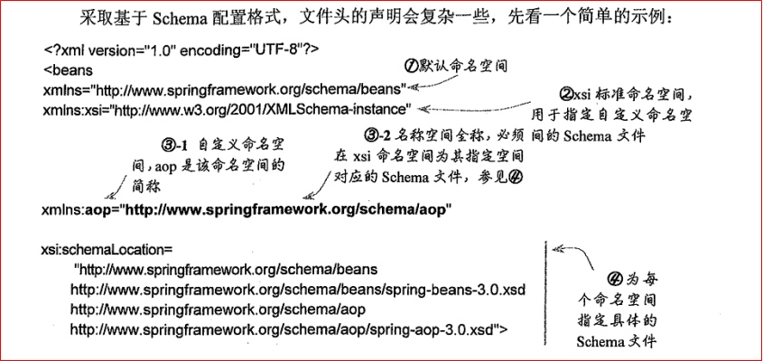
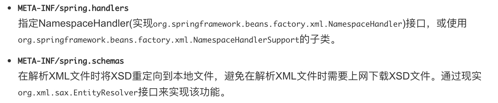
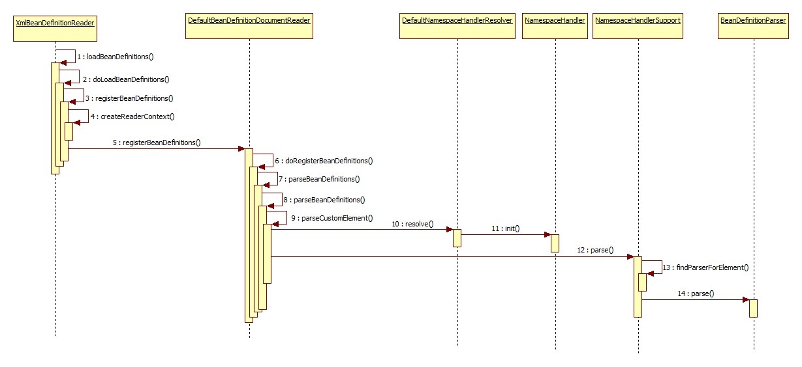
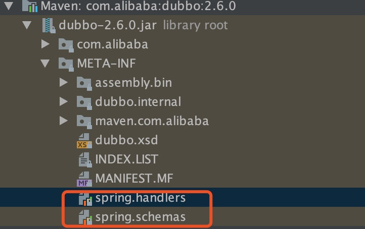

[TOC]

# 基础
第三方框架(dubbo)如何与Spring集成？这都依赖Spring提供的XML Schema可扩展机制，用户可以自定义XML Schema文件，并自定义XML Bean解析器，最终集成到Spring IOC容器中。

schema配置：


spring默认加载以下两个文件：



# 方法
1. 创建XML Schema 文件，描述自定义的合法构建模块，也就是xsd文件，主要用于定义数据约束；
2. 自定义个处理器类，并实现NamespaceHandler接口，在里面注册各个标签对应的BeanDefinitionParser；
3. 自定义一个或多个解析器，实现BeanDefinitionParser接口，用于定义Bean的解析逻辑；

# Spring扩展机制
调用流程：


Spring在解析bean时，会判断解析的BeanDefinition是否属于默认的命名空间，比如<bean>标签；DefaultBeanDefinitionDocumentReader中定义了parseBeanDefinitions方法，如下：
```java
protected void parseBeanDefinitions(Element root, BeanDefinitionParserDelegate delegate) {
    //解析默认的命名空间
    if (delegate.isDefaultNamespace(root)) {
        NodeList nl = root.getChildNodes();
        for (int i = 0; i < nl.getLength(); i++) {
            Node node = nl.item(i);
            if (node instanceof Element) {
                Element ele = (Element) node;
                if (delegate.isDefaultNamespace(ele)) {
                    // 默认解析
                    parseDefaultElement(ele, delegate);
                }else {
                    // 自定义解析
                    delegate.parseCustomElement(ele);
                }
            }
        }
    }
    else {
        //解析用户的自定义标签
        delegate.parseCustomElement(root);
    }
}
```
parseCustomElement方法中调用DefaultNamespaceHandlerResolver.resolve()方法负责解析用户自定义的标签：首先加载所有的META-INF/spring.handlers文件中的handler，key为uri，value为类的全限定名存入map中，然后根据标签的uri取出对应的类进行处理。
DefaultNamespaceHandlerResolver:
```java
public class DefaultNamespaceHandlerResolver implements NamespaceHandlerResolver {

    // 映射文件路径默认在 META-INF/spring.handlers，可以存在于多个jar文件中
    public static final String DEFAULT_HANDLER_MAPPINGS_LOCATION = "META-INF/spring.handlers";

    // 资源路径
    private final String handlerMappingsLocation;

    // 缓存 namespace URI：NamespaceHandler 映射关系
    private volatile Map<String, Object> handlerMappings;


    public DefaultNamespaceHandlerResolver() {
        this(null, DEFAULT_HANDLER_MAPPINGS_LOCATION);
    }


    public DefaultNamespaceHandlerResolver(ClassLoader classLoader) {
        this(classLoader, DEFAULT_HANDLER_MAPPINGS_LOCATION);
    }


    public DefaultNamespaceHandlerResolver(ClassLoader classLoader, String handlerMappingsLocation) {
        Assert.notNull(handlerMappingsLocation, "Handler mappings location must not be null");
        this.classLoader = (classLoader != null ? classLoader : ClassUtils.getDefaultClassLoader());
        this.handlerMappingsLocation = handlerMappingsLocation;
    }
    /**
     * 根据 namespace URI 加载 NamespaceHandler
     * @param namespaceUri the relevant namespace URI
     * @return the located {@link NamespaceHandler}, or {@code null} if none found
     */
    @Override
    public NamespaceHandler resolve(String namespaceUri) {
        Map<String, Object> handlerMappings = getHandlerMappings();
        Object handlerOrClassName = handlerMappings.get(namespaceUri);
        if (handlerOrClassName == null) {
            return null;
        }else if (handlerOrClassName instanceof NamespaceHandler) {
            return (NamespaceHandler) handlerOrClassName;
        }
        else {
            String className = (String) handlerOrClassName;
            try {
                Class<?> handlerClass = ClassUtils.forName(className, this.classLoader);
                if (!NamespaceHandler.class.isAssignableFrom(handlerClass)) {
                    throw new FatalBeanException("Class [" + className + "] for namespace [" + namespaceUri +
                            "] does not implement the [" + NamespaceHandler.class.getName() + "] interface");
                }
                NamespaceHandler namespaceHandler = (NamespaceHandler) BeanUtils.instantiateClass(handlerClass);
                // 实例化之后会调用init方法
                namespaceHandler.init();
                handlerMappings.put(namespaceUri, namespaceHandler);
                return namespaceHandler;
            }
            catch (ClassNotFoundException ex) {
                throw new FatalBeanException("NamespaceHandler class [" + className + "] for namespace [" +
                        namespaceUri + "] not found", ex);
            }
            catch (LinkageError err) {
                throw new FatalBeanException("Invalid NamespaceHandler class [" + className + "] for namespace [" +
                        namespaceUri + "]: problem with handler class file or dependent class", err);
            }
        }
    }

    private Map<String, Object> getHandlerMappings() {
        // 只会在第一次调用的时候执行以下逻辑，即只会加载一次，只会就从缓存中获取了
        if (this.handlerMappings == null) {
            synchronized (this) {
                if (this.handlerMappings == null) {
                    try {
                        // 加载所有配置文件：META-INF/spring.handlers
                        Properties mappings = PropertiesLoaderUtils.loadAllProperties(this.handlerMappingsLocation, this.classLoader);
                        if (logger.isDebugEnabled()) {
                            logger.debug("Loaded NamespaceHandler mappings: " + mappings);
                        }
                        Map<String, Object> handlerMappings = new ConcurrentHashMap<String, Object>(mappings.size());
                        // 将 Properties解析成 Map
                        CollectionUtils.mergePropertiesIntoMap(mappings, handlerMappings);
                        this.handlerMappings = handlerMappings;
                    }
                    catch (IOException ex) {
                        throw new IllegalStateException(
                                "Unable to load NamespaceHandler mappings from location [" + this.handlerMappingsLocation + "]", ex);
                    }
                }
            }
        }
        return this.handlerMappings;
    }
    @Override
    public String toString() {
        return "NamespaceHandlerResolver using mappings " + getHandlerMappings();
    }
```

# Dubbo案例
[Schema解析Spring扩展机制集成Spring](https://cloud.tencent.com/developer/article/1374498)

要求spring.handlers和spring.schemas要放在META-INF目录下，方便被加载。
spring.schemas中引用了dubbo.xsd文件，主要对xml文件的内容格式进行了约束。
spring.handlers内容为：
```java
http\://code.alibabatech.com/schema/dubbo=com.alibaba.dubbo.config.spring.schema.DubboNamespaceHandler
```
也就是定义类namespace url和namespaceHandler的映射关系，dubbo相关的命令空间的解析就是借助于DubboNamespaceHandler类。DubboNamespaceHandler继承了NamespaceHandlerSupport抽象类(实现了NamespaceHandler接口)。

```java
/ NamespaceHandlerSupport是一个抽象类，实现了NamespaceHandler接口
public class DubboNamespaceHandler extends NamespaceHandlerSupport {

    static {
        Version.checkDuplicate(DubboNamespaceHandler.class);
    }

    @Override
    public void init() {
        registerBeanDefinitionParser("application", new DubboBeanDefinitionParser(ApplicationConfig.class, true));
        registerBeanDefinitionParser("module", new DubboBeanDefinitionParser(ModuleConfig.class, true));
        registerBeanDefinitionParser("registry", new DubboBeanDefinitionParser(RegistryConfig.class, true));
        registerBeanDefinitionParser("monitor", new DubboBeanDefinitionParser(MonitorConfig.class, true));
        registerBeanDefinitionParser("provider", new DubboBeanDefinitionParser(ProviderConfig.class, true));
        registerBeanDefinitionParser("consumer", new DubboBeanDefinitionParser(ConsumerConfig.class, true));
        registerBeanDefinitionParser("protocol", new DubboBeanDefinitionParser(ProtocolConfig.class, true));
        registerBeanDefinitionParser("service", new DubboBeanDefinitionParser(ServiceBean.class, true));
        registerBeanDefinitionParser("reference", new DubboBeanDefinitionParser(ReferenceBean.class, false));
        registerBeanDefinitionParser("annotation", new AnnotationBeanDefinitionParser());
    }

}
```
registerBeanDefinitionParser主要就是将标签与对应的BeanDefinitionParser缓存到一个Map中。DubboBeanDefinitionParser实现了BeanDefinitionParser接口，调用NamespaceHandler的parse方法的时，其内部委托DubboBeanDefinitionParser执行真正的Bean解析逻辑。
已经将dubbo中的标签解析成对应的RootBeanDefinition，接下来就是Spring中正常的Bean实例化流程。Spring在实例化Bean的时候预留了很多接口，也就是生命周期函数，在实例化Bean的时候可以进行各种扩展，dubbo也就是借助这些接口完成了很多的功能。