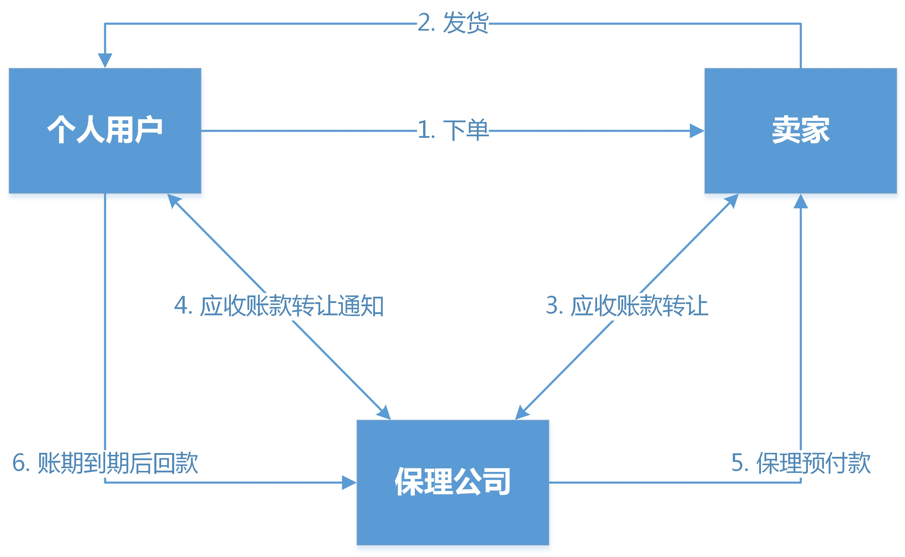

# 介绍
您好，我叫王元，是网易金融的一名高级java开发工程师。目前主要负责白条的贷中和贷后相关的工作，以及个人独立负责现金贷产品的维护工作，比如每个月财务报表对账、数据提取、问题排查和bug修复等；
# 现金贷和消费贷有什么不同
1. 对于同一个用户，消费贷的单笔放款金额小，但是频率高，现金贷的单笔放款金额大，频率低；
2. 现金贷的计息可以按日计息，而消费贷更多的是手续费的概念，两者逾期都会产生罚息；
3. 场景不同，消费贷需要严格依赖电商场景，主要是针对用户购买消费产品进行的贷款，现金贷没有这个要求；

# 在工作中，你遇见过什么难点
MQ发送消息可靠性
优雅停机
一分钱问题

dubbo的优雅关闭问题，其实就解决服务的提供者在进行重起等操作时，此时不会有新的请求到达该机器，从而导致请求报错。后来经过调研，dubbo在较新的版本中支持通过配置来实现优雅关闭，但是我们这次要做的是和自己的发布系统相结合，并且实现实现机器的上线和下线功能，也就是点击下线按钮后，这台机器不会对外提供服务了，但是java进程依然存在的，只不过把流量入口关闭了。所以当时第一，需要弄懂dubbo的工作原理，然后从这个方面下手。那么下线功能，其实也就是把服务从注册中心下掉，那么zk就会通知消费者更新本地的提供者列表。后来也看了相关的源码，实现了这个功能，就是先获取所有的注册中心，通过注册中心获取到注册的服务的url，反射调用unregister的方法，实现了服务的下线功能。

# 项目
## 联合贷系统改造
* 背景
在最开始时，白条的放款资金渠道主要有小贷和保理公司放款，但是由于保理放款不符合海关的“三单对碰”要求，所以后续又接了富民和上诚两家银行。这个就需要把现有的小贷放款用户转化为银行放款用户，这个转化过程需要用户不仅需要用户的四要素，姓名身份证手机号和银行卡号，还需要用户上传身份证的正反面和人脸识别的照片，以及签署对应的协议；从前期的转化率来看，大多数用户是到上传身份证这个环节直接退出了，影响了转化率，从而没有彻底解决资金问题。
联合贷，也就是小贷和银行按比例出资，通过这个方式，可以规避监管要求的上传身份证环节，而且也不会上征信，这个就是大背景。
* 改动
这次核心的改动点主要有两个，系统流程改造和支持联合贷。
1. 之前在现金贷产品存在联合贷的场景，但是存在一分钱的问题；虽然记录用户的每次还款行为，但是没有细分到还款到每个机构多少钱，每次都是按照比例实时的计算，最终会存在一个精度问题，导致多还其中一个机构一分钱的问题，而少还了另外一个机构一分钱；
    这里抽象出一个大订单和小订单的概念，大订单是用户层面的，同步生成大订单和还款计划，这里不需要知道资金路由的结果；等待资金处理完成后，异步生成小订单，小订单细分到每个机构的维度；这样用户在还款的时候，是针对大订单进行还款，然后系统进行拆账分到每个小订单中，保证大订单还清的同时，多笔小订单也必然是还清的；而且拆分成小订单，后续的银行报表都是从小订单中获取即可。会对大订单进行计罚息，然后按照比例分担到小订单。
    
2. 之前系统存在的问题，信贷系统和资金系统是同步调用，然后等待资金系统处理完成后，mq通知信贷系统生成用户的还款计划；这导致信贷和资金系统耦合在一起，而且信贷需要关心资金的结果才能生成还款计划，这个是不合理的，用户在支付完成或者成功后，我们一定要保证还款计划会生成，而不是依赖我们内部系统资金流转的一个结果来决定要不要生成。因此，这次改造成了，同步就会生成还款计划，异步发送mq给资金系统，信贷和资金完全解耦，保证用户在支付完成后能够尽快看到还款计划。

* 难点/关键点
    1. 一致性问题，信贷系统和资金系统是MQ异步操作，如何保证消息不丢失，保证最终一致性。虽然之前系统一直在用MQ，但是对消息不丢失这个问题并没有处理的很好。比如，对于生产者到MQ，采用的confirm模式，这样消息在发送mq，如果投递成功，则返回ack，否则会返回nack，在收到nack时只是打个日志而已，而且如果消息在网络中丢失根本没有发送到mq，这样系统是无法感知的；消费者采用的是手动确认机制并实现幂等；所以这次，会在生产者加一个消息表，记录每次发送的消息并维护状态。这个消息表能够支持不同消息类型，后续其他业务也可以直接使用这个消息表。为了多个不同的任务能够复用一个重试任务，所以会将生产者=mq的元数据信息记录在这个表中，不需要为每次业务写一个重试任务。
    2. 幂等+重试
    3. mq可靠性的保证
    4. 上线兼容性

## 问题
1. 保理为什么违规
考拉主要是做跨境支付，海关会对数据进行三次校验，也就是“三单对碰”，需要企业按照规定向海关传输交易/支付/仓储和物流等数据，由海关校验每一笔交易订单信息和消费者信息的真实性，促进跨境电商合规化发展。“三单“信息就是交易信息，支付信息和物流信息，对应的也就是订单，支付单核物流单；
订单：由电商企业推送数据
支付单：由支付企业推送支付单数据
物流单：由物流服务商推送数据
对于小贷放款来说，用户先从小贷借款，然后去考拉下单，这个是没问题的，是一个完整的支付交易流程（需要签署受托支付协议，用户委托小贷支付）；但是对于保理公司来说，流程不一样，用户是先去考拉下单支付，然后考拉将营收账款转让给保理公司，保理公司将转让关系通知给用户，然后保理公司付款给考拉，最后个人会把前还给保理公司，这个不是一个支付流程，而是一个债权转让的过程。

2. 你好

# 描述一下自己负责的业务或者针对某个业务流程进行阐述
## 放款
以放款为例，用户在考拉app支付的时候选择白条支付，这个对于白条来说其实就是一个order submit的过程，考拉app通过H5调用controller接口，进行下单，order记录表生成一条记录，状态为10表示初始化；然后，用户在收银台页面输入短密时，考拉app会唤起网易支付的sdk(sdk就是api接口的集合，调用方不需要关心其实现细节)，网易支付的sdk会调用我们kylin(交易)的loan out接口进行放款，放款的逻辑包括：判断用户状态是否激活，未激活则走激活并支付流程；调用octopus系统执行促销优惠；调用crocodile(信贷)系统生成放款请求记录并扣减额度，如果上述步骤都成功，则给网易支付返回成功；如果失败，则order的状态处于中间状态；网易支付拿到结果结果后，则进行商户之间的转账和通知kaola的操作，最后，网易支付会回调给我们这笔订单的支付结果，order的状态闭环，变为终态。
## 问题
1.分布式事务，你们是怎么解决的？