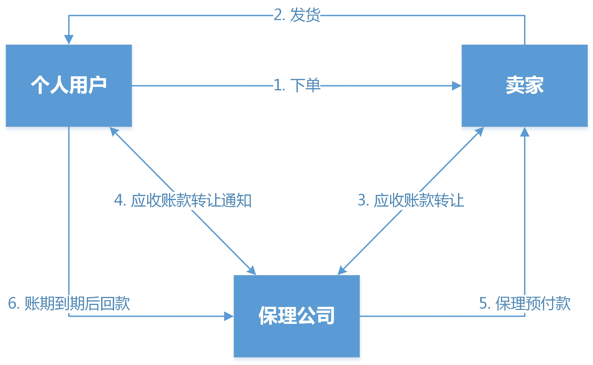
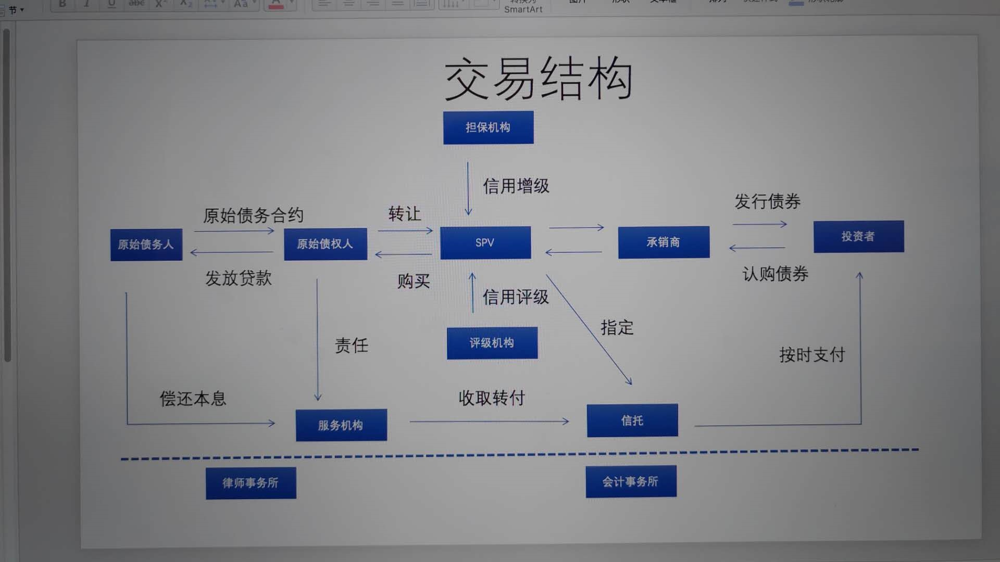

保理
核心：应收账款转让

1、先发生赊购交易，形成应收账款（债权）

2、卖方将债权转让至保理方，形成新的债权债务关系（买方&保理）

3、卖方获得保理融资款

4、买方后续还款给保理

小贷
核心：先借款后支付

1、买方先向小贷借款

2、再支付货款给卖方

3、买方后续还款给小贷
白条场景下，可走受托支付模式，即用户委托网易白条支付结算给卖方（需签署受托支付协议）

ABS
核心：小贷先持有信贷资产，然后转让给信托

涉及两个关键方案：资产切片、资产转让定价

该融资方式，适合放款规模较大的信贷产品，新规中ASB资产需算进小贷资产，放贷杠杆受限

信托
核心：区别于ABS，信托直接放款给用户

涉及两个关键点：资产收益率、资金利用效率

该融资方式，可以突破杠杆限制

银行
两种模式
1、助贷：银行100%放款，白条提供获客、风控、信息服务
2、联合贷：按比例放款，用户体验好，可以规避监管措施（不查征信、减少授信要素）