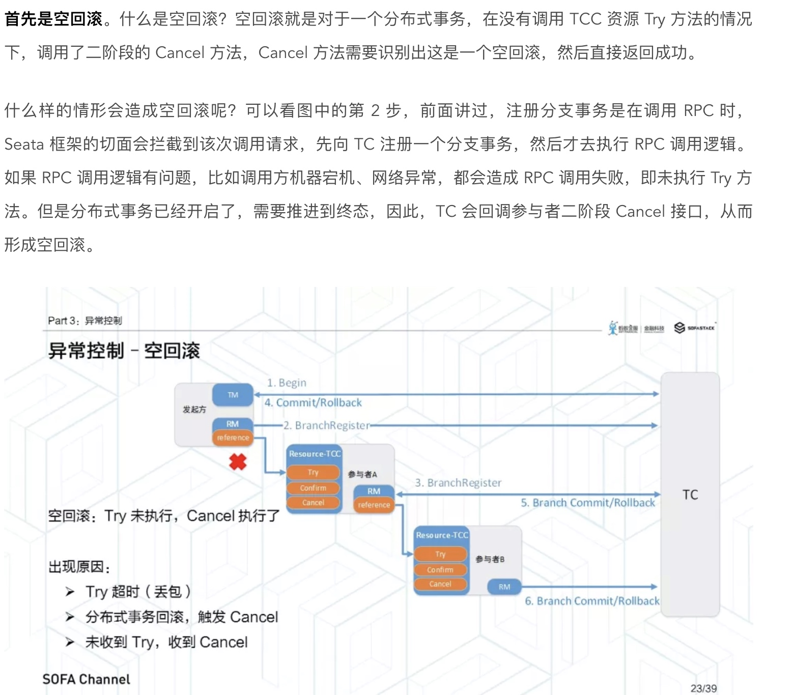
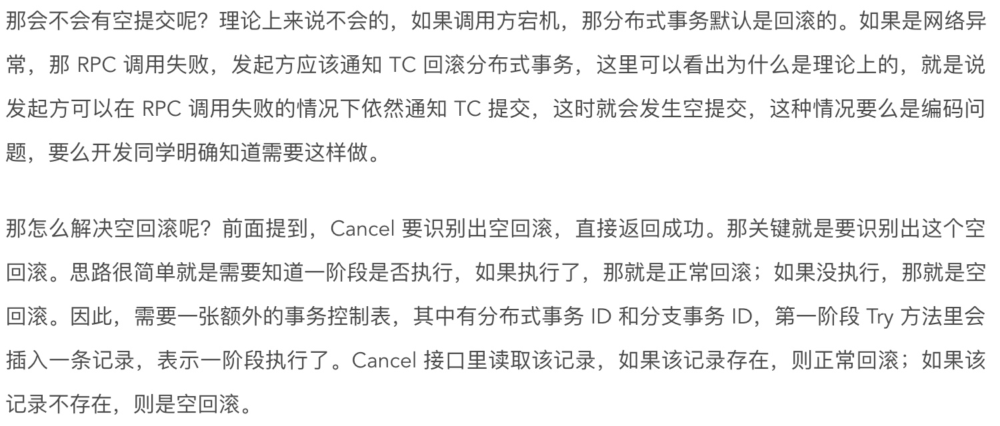
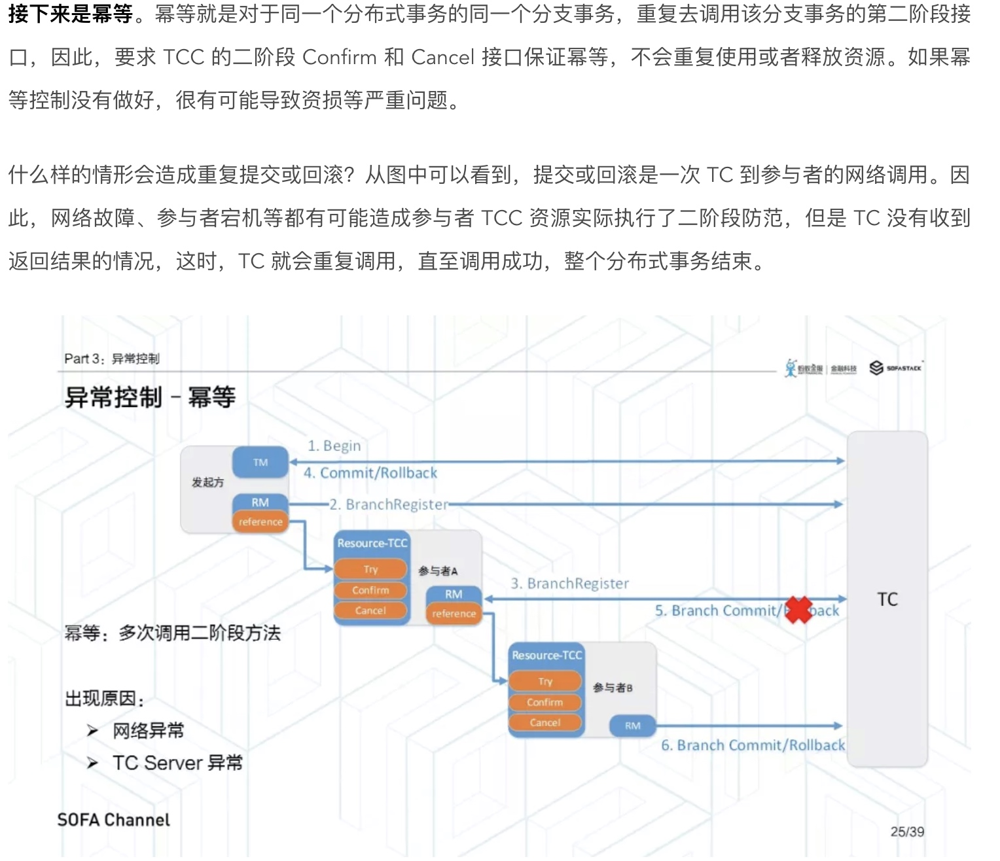
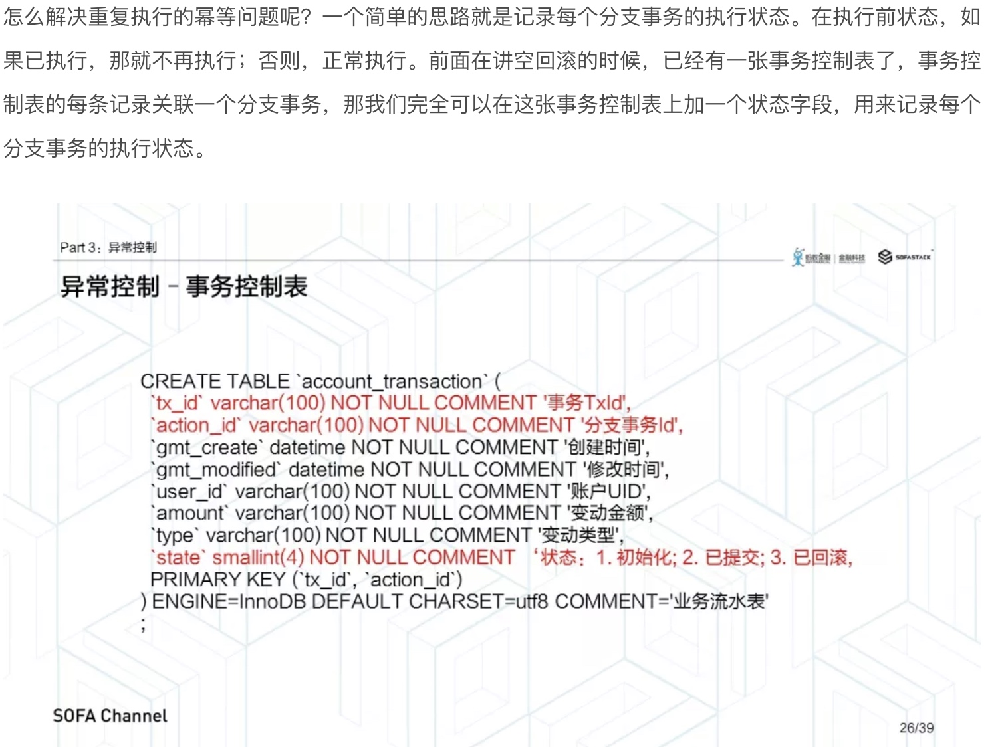
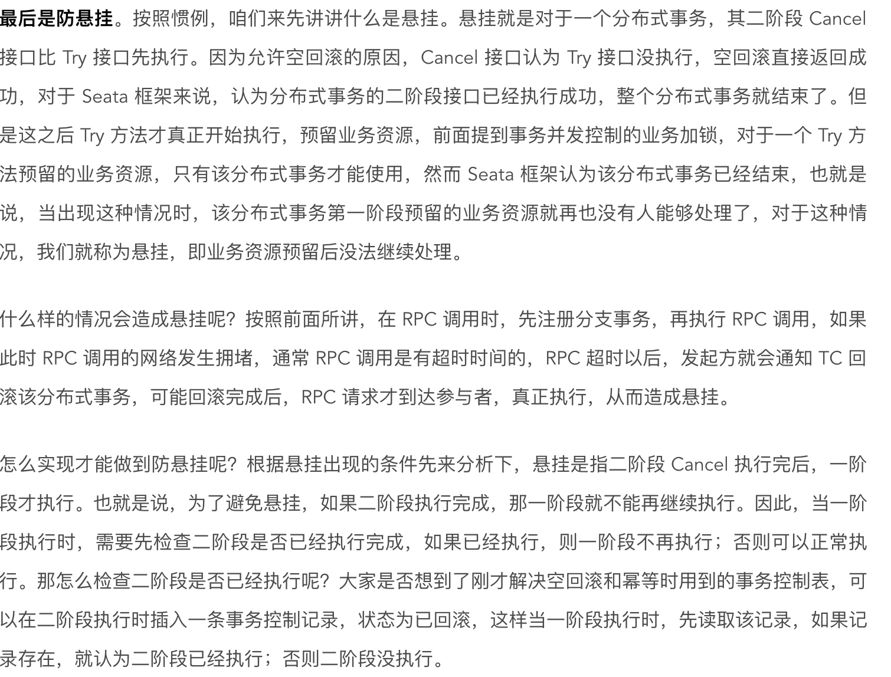

[TOC]
# 数据库未加索引触发MQ流控
在618大促时，我们有个底层的服务hydra系统主要负责资金流转，消费上游系统的MQ消息，在查资金路由表时，由于某个字端没有加索引，导致所有请求都进行全表扫描。主要有三个报警，一个是RabbitMQ的流控报警，一个是数据库慢查询，还有一个用户进行还款时rpc超时报警。当时查看MQ的放款队列，有很多消息堆积。当时的第一反应是下游系统出现问题了，由于生产者是定时钟控制的，防止更多的消息堆积，立刻将生产者的定时任务停了。然后将我们的贷后首页进行降级，这个期间用户不能还款。最后排查下游问题。下游系统是兄弟团队开发的。
DBA当时迅速给这个表字端加了索引后，请求恢复正常了，等着MQ队列中的消息消费差不多时，再开启定时钟任务。由于消息堆积触发了流控，但是为什么会影响还款呢？还款也是同一个上游系统通过MQ发给下游系统，所以猜测会不会跟流控有关。后来发现，流控最终会阻塞生产者的连接，不让生产者继续发送消息，从而阻塞了主流程。
后来的解决方案：在一个线程池中异步发送MQ事件。

# 分布式事务阐述
## 业务阐述/是如何使用的？
我们在用户下单支付过程中采用了分布式事务，需要生成用户订单，扣减用户的额度，如果订单参与活动还需要进行活动冲销，这些分别由交易系统、用户系统和活动系统执行，通过分布式事务保证了这些操作的一致性。
一开始我们用的是TCC事务。用户在选用白条进行支付后，交易系统会生成一笔订单，状态为init，然后用户输完短密支付后，交易系统会修改订单状态为processing处理中，然后rpc调用额度系统和活动系统执行对应的逻辑，额度系统首先会冻结用户的部分额度，比如现在用户额度是1000，该笔订单金额为100元，那么会在冻结额度上加100元，用户可用额度扣减100变为900(但是用户查询额度的时候是可用额度+冻结额度依然是1000元)(用户可能会并发下单扣减额度，则乐观锁和外层的悲观锁保证)；同样活动系统也需要先冻结资源，活动或者优惠券也有次数限制，对于优惠券是将用户的优惠券状态改为processing，这个时候用户无法使用这个优惠券了。这个就是try阶段做的事情。confirm阶段的逻辑比较简单，只是对try阶段中预留的资源进行确认，交易系统将订单状态改为success，用户系统将冻结额度字段减去刚才的订单金额100，活动系统需要把优惠券的状态改为已使用即可。cancel阶段主要对try阶段的资源进行释放，交易系统将订单状态改为fail失败，用户系统将冻结额度字段减去刚才的订单金额，同时需要把可用额度加上冻结额度，相当于是恢复了用户的额度，活动系统把优惠券状态改为未使用即可。如果在try中遇见网络超时，或者confirm如或者cancel时出现异常，则会依赖恢复的定时任务将未完成的事务进行重试，有最大重试次数限制。
这里要求confirm和cancel操作支持幂等。
理论上来说，框架做的还不够完善，比如对异常的操作可以放在框架完成，包含空回滚、幂等、悬挂。

## 用的什么开源框架
我们用的是开源的tcc-transaction，利用AOP实现对事务方法的增强，需要指定对应的confirm和cancel方法，而且事务上下文的信息传递给分支事务，这样根事务和分支事务通过全局唯一的事务ID进行关联。支持事务的持久化，防止应用进程崩溃导致未完成的事务丢失。有定时任务来执行事务恢复补偿的操作，支持最大的重试次数和恢复时间间隔。
但是tcc也有明显的缺点，一个是对业务代码有入侵，这个是无法避免的，`(无侵入方案主要有基于数据库XA协议的两阶段提交，优点是无侵入，缺点是数据库必须对XA协议的支持，而且会造成事务长时间得不到释放，锁定周期长，性能比较差)`第二是原先一次rpc现在需要两次rpc。后来在这个框架基础上，做了二次开发，使其支持saga事务，每一个参与者都是一个冲正补偿服务，需要用户根据业务场景实现其正向操作和逆向回滚操作。通过增加注解属性，如果指定来saga事务，则在try阶段就完成了事务操作，无confirm操作，在cancel时进行业务上的回滚，减少了网络调用。对于扣减额度来说，就是1000直接减100变为900元，用户看到的也是900元，如果失败了则反向调用回滚逻辑，再增加100元。虽然有一定的脏数据，但是一般来说，try成功的机率很大，所以对用户影响并不是很大。
同时也做了一些其他的改造，在将transaction存储在数据库中时用的是jdk的序列化方式，这里提供了json的序列化。

## 为什么选择这个框架
1. 首先是开源的，而且开源社区上有一定的活跃度，不能有太多bug；
2. 相对来说比较简单，这样出问题能够自己排查和修改，不是完全依赖作者；
3. 能够满足业务需求。当时也对比了一些框架，从stars的数量、issues问题多少，作者是否维护等进行判定。
4. 当时阿里的开源框架seata还没出来(201901出来的），目前是在seata下面star最多的分布式框架。

## 使用这个框架遇到了哪些问题
当时遇见的问题是，因为活动系统执行时间太长，导致rpc调用超时，这时交易系统立即去进行cancel操作，cancel执行成功后，但是活动系统后来也try成功了，导致数据最终不一致了，用户订单失败，但是券已经被使用了。原因在于try还没完成，然后就去执行cancel了。后来研究框架发现，可以将指定的网络超时异常加入到延迟取消异常集合中，这样就不会立即去cancel，而是依赖定时恢复任务来执行了。
但是并不是100%保证，前提是 事务恢复时间间隔要大于超时时间，否则还是会出现cancel在try未完成的时候继续操作。后来我们业务代码也做了修改，在核销券的时候使用了状态机，只有能够从processsing->success状态，可以从processing/success->init状态，这样即便先执行了cancel，那么try也不会成功。

在这个场景下，其实交易系统相当于是一个协调者，负责发起事务、提交和回滚。
用的是开源的tcc-transaction框架完成的，并在这个基础上做了些调整。原生的框架只支持tcc分布式事务，但是tcc存在的问题就是，
通过重试解决了防止网络出现的问题，当超过最大重试次数时，需要人工介入。而其他的业务，都是采用基于可靠消息的分布式事务，MQ来保证了最终一致性。本地维护一个消息表，消息表和业务逻辑需要在一个本地事务中，然后将消息通过mq发送给下游系统。通过轮询本地消息表的状态和MQ可靠性保证消息能够正确被消费，消费者需要做幂等。

## 框架改善点
[参考这里吧](https://www.infoq.cn/article/G33hCC-QoSJPlkt4e64E)
很多需要业务操作的事情可以移交给框架完成，比如空回滚、幂等和悬挂。
* 空回滚
    目前依赖业务代码来做检查的，每次扣减额度的时候都会有明细记录，检查是否有对应的扣减记录才决定是否回滚。否则什么都不做。
      
  

* 幂等
    

该状态字段有三个值，分别是初始化、已提交、已回滚。Try 方法插入时，是初始化状态。二阶段 Confirm 和 Cancel 方法执行后修改为已提交或已回滚状态。当重复调用二阶段接口时，先获取该事务控制表对应记录，检查状态，如果已执行，则直接返回成功；否则正常执行。

* 悬挂

* 异常控制的实现
    结合前面讲到空回滚和悬挂异常，Try 方法主要需要考虑两个问题，一个是 Try 方法需要能够告诉二阶段接口，已经预留业务资源成功。第二个是需要检查第二阶段是否已经执行完成，如果已完成，则不再执行。先插入事务控制表记录，如果插入成功，说明第二阶段还没有执行，可以继续执行第一阶段。如果插入失败，则说明第二阶段已经执行或正在执行，则抛出异常，终止即可。
    接下来是 Confirm 方法。因为 Confirm 方法不允许空回滚，也就是说，Confirm 方法一定要在 Try 方法之后执行。因此，Confirm 方法只需要关注重复提交的问题。可以先锁定事务记录，如果事务记录为空，则说明是一个空提交，不允许，终止执行。如果事务记录不为空，则继续检查状态是否为初始化，如果是，则说明一阶段正确执行，那二阶段正常执行即可。如果状态是已提交，则认为是重复提交，直接返回成功即可；如果状态是已回滚，也是一个异常，一个已回滚的事务，不能重新提交，需要能够拦截到这种异常情况，并报警。
    最后是 Cancel 方法。因为 Cancel 方法允许空回滚，并且要在先执行的情况下，让 Try 方法感知到 Cancel 已经执行，所以和 Confirm 方法略有不同。首先依然是锁定事务记录。如果事务记录为空，则认为 Try 方法还没执行，即是空回滚。空回滚的情况下，应该先插入一条事务记录，确保后续的 Try 方法不会再执行。如果插入成功，则说明 Try 方法还没有执行，空回滚继续执行。如果插入失败，则认为 Try 方法正再执行，等待 TC 的重试即可。如果一开始读取事务记录不为空，则说明 Try 方法已经执行完毕，再检查状态是否为初始化，如果是，则还没有执行过其他二阶段方法，正常执行 Cancel 逻辑。如果状态为已回滚，则说明这是重复调用，允许幂等，直接返回成功即可。如果状态为已提交，则同样是一个异常，一个已提交的事务，不能再次回滚。
    
# 业务中锁的使用
乐观锁：有个平账系统，管理员可以手动匹配用户的申报记录和对公流水记录，同时定时钟也会自动匹配，这里采用的是乐观锁，防止匹配冲突的问题。
悲观锁的使用：