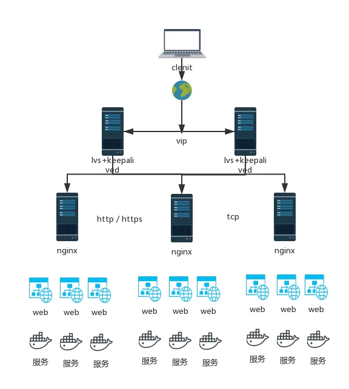
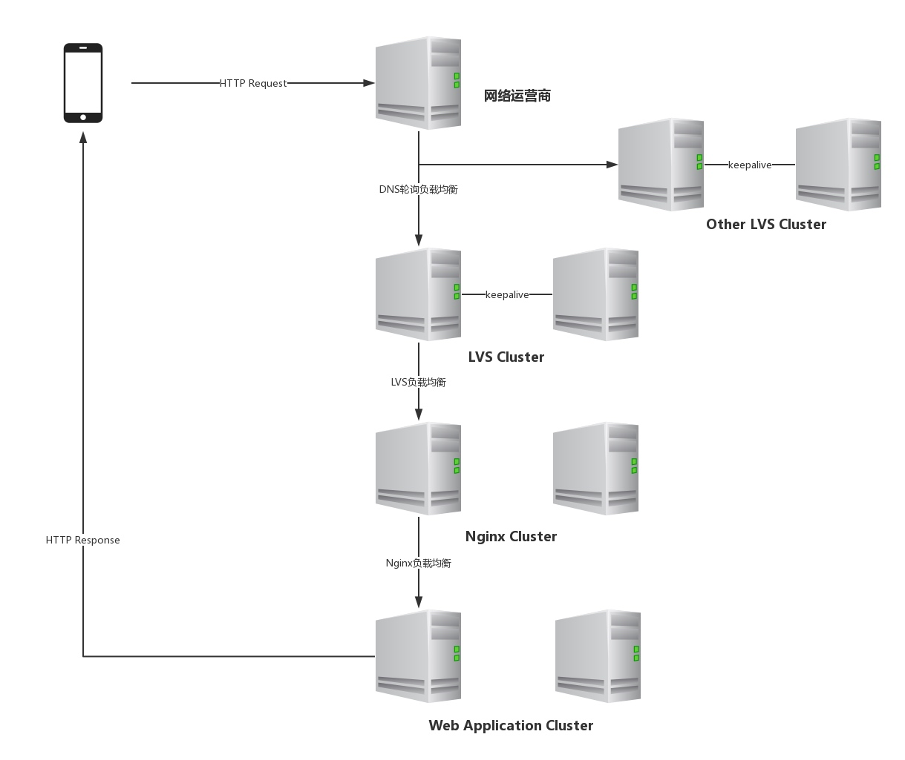

# 互联网架构

采用keepalived+lvs+nginx来做负载均衡器；
1. lvs+keepalived双机设置为不抢占模式，避免单点故障，宕机无缝切换到另外一台lvs，nginx故障自动剔除；
2. lvs做四层负载均衡，对请求是同步转发，即客户端重定向到具体的后端服务器上，只有请求的流量经过lvs，响应则不经过lvs，由后端服务器直接返回给客户端；lvs只是做请求的转发，没有流量，抗负载能力强；
3. nginx做七层负载均衡，对请求是异步转发，即客户端仍然是和nginx连接，由nginx负责将请求转发到后端的某一台服务器，如果一台服务器挂了，可以转发到另外的服务器，直至成功；
4. 如果lvs后面直接连接tomcat服务器，那么当一次请求失败后，无法转发请求到其他的tomcat服务器；
5. nginx可以动态添加负载的服务，平滑启动reload，能够承受很高的负载；也支持四层负载均衡；
6. keepalived解决的是单点故障问题，那么对lvs集群呢，需要采用ospf+lvs的方式；

# 客户端请求解析流程

在整个请求过程中有三种负载均衡技术：DNS轮询、lvs负载均衡，Nginx负载均衡
## DNS轮询
服务提供者在运营商针对某个域名配置多个提供服务的服务器IP，当请求该域名时，运营商会选出一个服务器的ip来响应请求；
DNS的优点是成本低，操作简单，但是有很大的缺点：1.当一台机器宕机了，DNS是无法知晓的，仍然会把请求路由到该台机器，修改DNS记录全部生效一般要1-3小时，甚至更久；2.DNS的负载均衡算法是简单的轮询算法，没有根据服务器的具体情况或者权重来分发请求；
所以一般来说，DNS会和其他负载均衡配合使用；

## LVS
为了实现高可用，至少有两台LVS服务器，使用KeepAlived定时通信，当一台机器挂了，可以平滑切到另外一台服务器；外部访问的是VIP；
同步转发，由lvs将请求转发至对应的服务器，后续服务器的响应则直接返回给客户端，不再经过lvs。即lvs只有请求经过，没有响应流量经过，抗负载能力强；（常用的是工作在DR模式下，lvs会请求的网络数据包的mac地址修改为后端服务器的mac地址，然后将请求直接转发到后端服务器，后端服务器收到数据包后，发现请求报文的mac地址是自己的地址，则接收报文并处理，处理完成后，则直接给客户端发送响应信息）
四层负载均衡；性能好；

## Nginx
七层负载均衡，异步转发，代理会和客户端、服务端建立连接；
如果后端服务器比较多，那么nginx的网络带宽会成为性能瓶颈，因为后端服务器的响应流量都会经过nginx，这时需要多个nginx；
可以作为网页静态服务器，支持重写规则，支持压缩，节省带宽，可以做缓存，可以针对http本身做分流，静态分离等；

## 为什么LVS在nginx前面
LVS主要是做流量转发的，功能比较单一，性能好，抗负载能力强；而nginx功能强大，支持七层负载均衡，应用比较广泛，用来做http的反向代理，能够upstream实现http请求的多种方式均衡转发，由于采用异步转发，可以做到如果一个服务器请求失败，立即切换到其他服务器，直至请求成功或最后一台失败为止；

# Nginx

# LVS

# HaProxy

# KeepAlived

三个重要功能：
1. 管理LVS负载均衡软件
2. 实现LVS集群节点的健康检查
3. 作为系统网络服务的高可用(failover)

VRRP是通过一种竞选机制来将路由的任务交给某台VRRp路由器的。