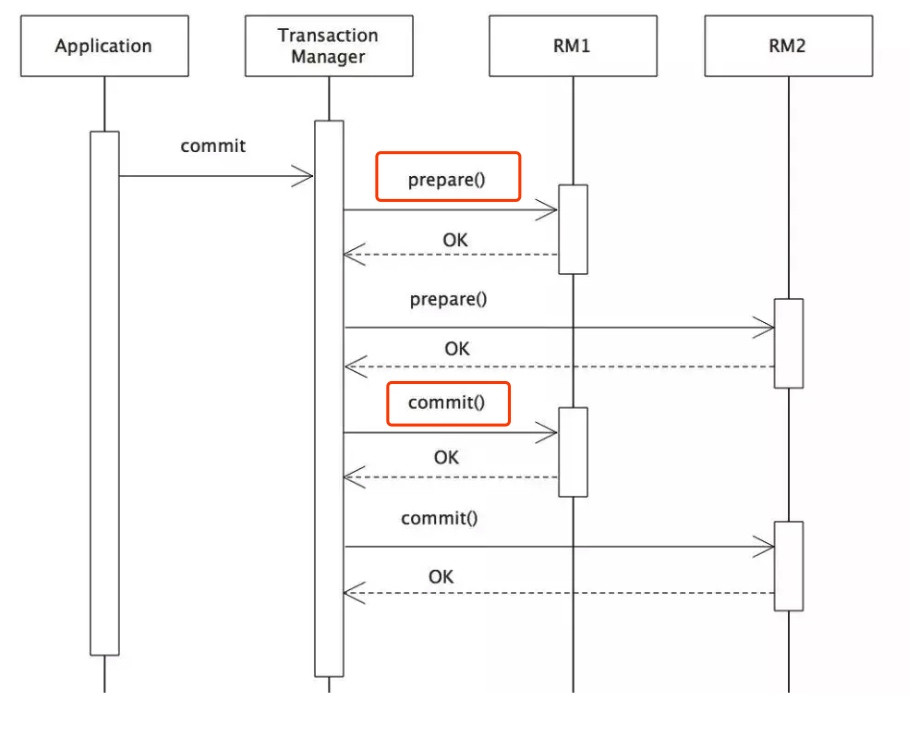
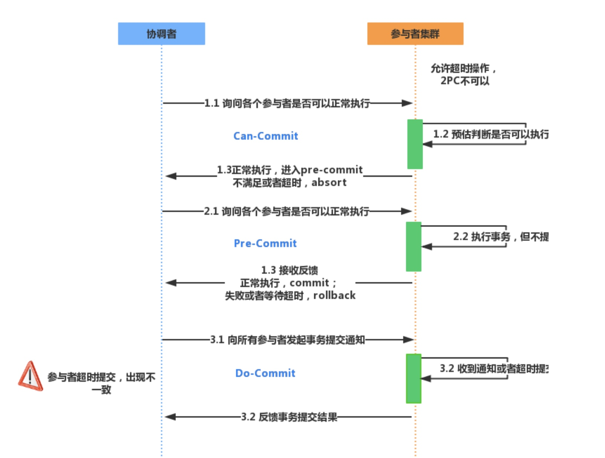
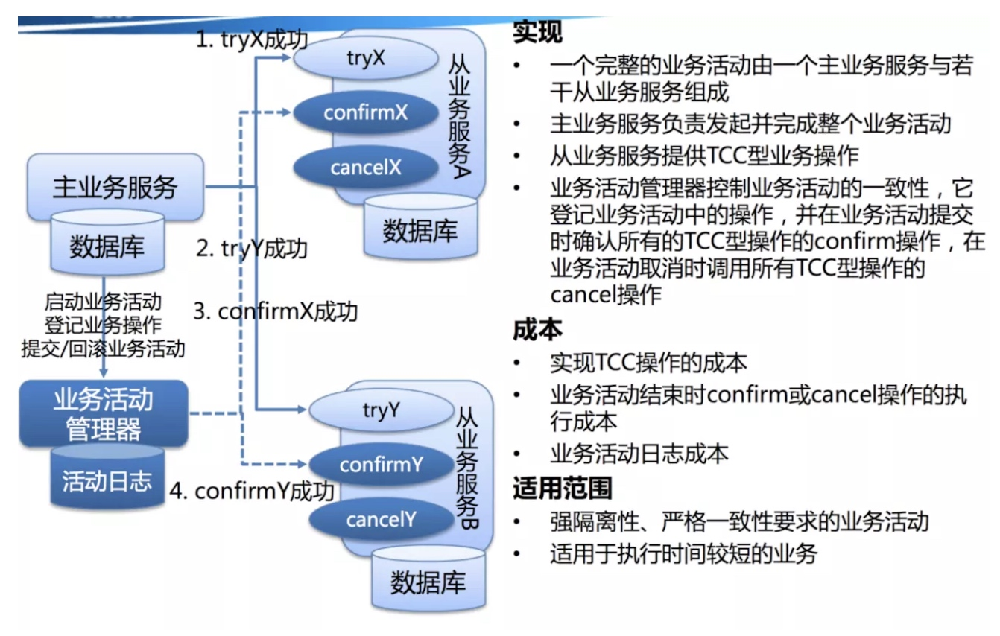
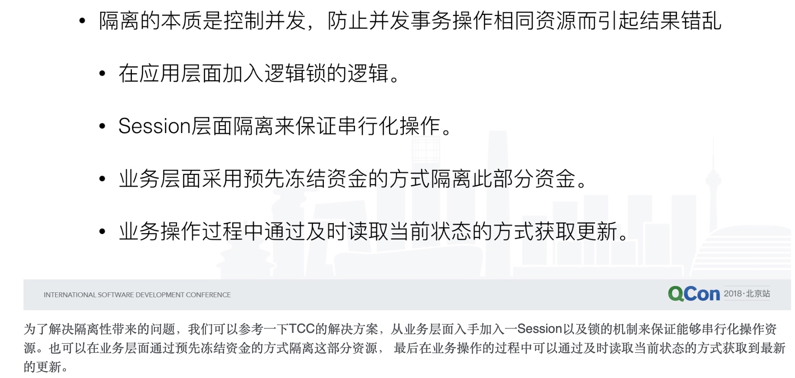
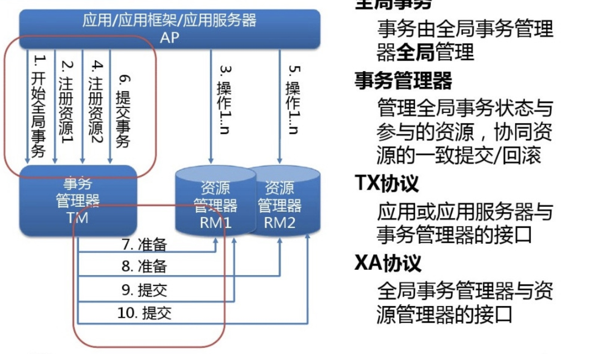
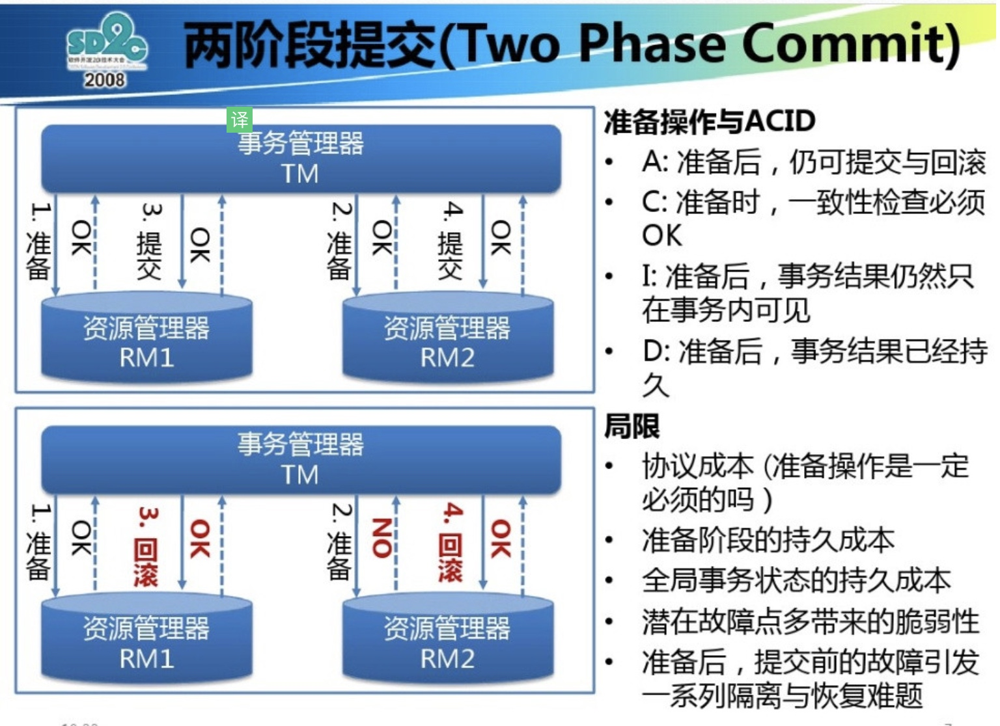
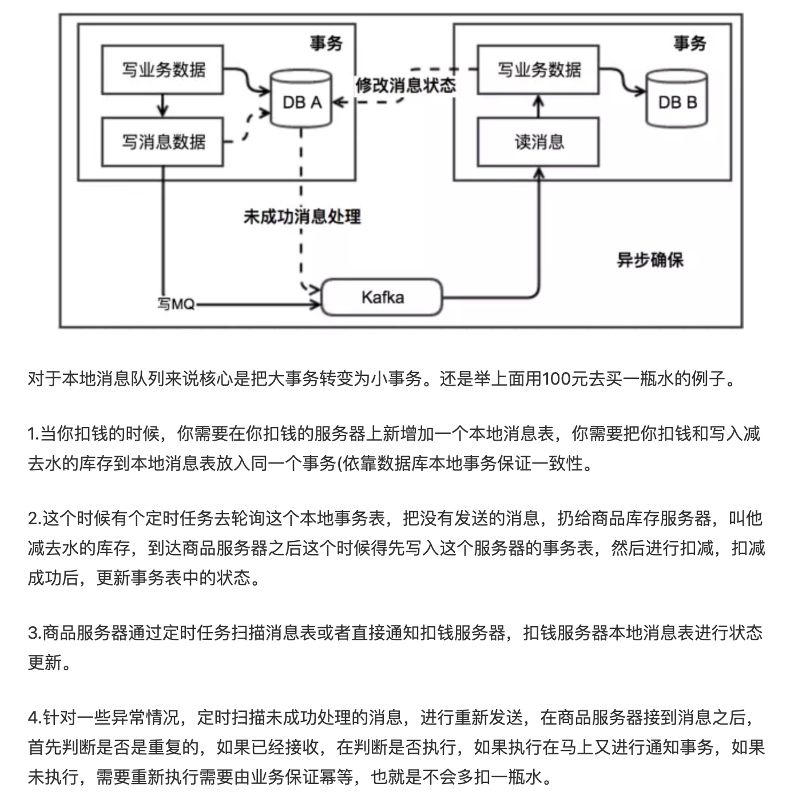
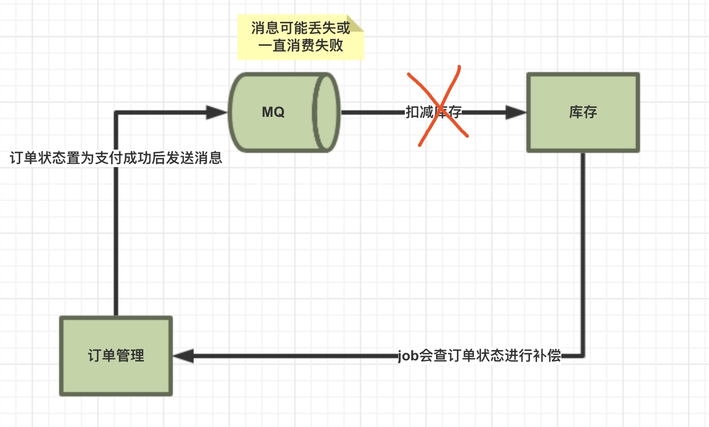

[TOC]
# 结论
两阶段/三阶段协议不是微服务架构的最佳选择，微服务架构中应满足数据的最终一致性，对账或者中间态报警是最后的终极防线。
# 事务的概念
事务由一组操作组成，我们希望这组操作能够全部正确的执行，如果这一组操作中任意一个步骤发生错误，就需要回滚之前已经完成的操作。即，同一个事务中的所有操作要么全部正确执行，要么全部都不执行。
# 事务特性
ACID
原子性：原子性要求，事务是一个不可分割的执行单元，事务中的所有操作要么全都执行，要么全都不执行。
一致性：一致性要求，事务在开始前和结束后，数据库的完整性约束没有被破坏。
隔离性：事务的执行是相互独立的，它们不会相互干扰，一个事务不会看到另一个正在运行过程中的事务的数据。
持久性：持久性要求，一个事务完成之后，事务的执行结果必须是持久化保存的。即使数据库发生崩溃，在数据库恢复后事务提交的结果仍然不会丢失。

`注意：事务只能保证数据库的高可靠性，即数据库本身发生问题后，事务提交后的数据仍然能恢复；而如果不是数据库本身的故障，如硬盘损坏了，那么事务提交的数据可能就丢失了。这属于『高可用性』的范畴。因此，事务只能保证数据库的『高可靠性』，而『高可用性』需要整个系统共同配合实现。`

* 数据库四种隔离级别(针对隔离性)
Read uncommitted 读未提交
在该级别下，一个事务对一行数据修改的过程中，不允许另一个事务对该行数据进行修改，但允许另一个事务对该行数据读。
因此本级别下，不会出现更新丢失，但会出现脏读、不可重复读。

Read committed 读提交
在该级别下，未提交的写事务不允许其他事务访问该行，因此不会出现脏读；但是读取数据的事务允许其他事务的访问该行数据，因此会出现不可重复读的情况。

Repeatable read 重复读
在该级别下，读事务禁止写事务，但允许读事务，因此不会出现同一事务两次读到不同的数据的情况（不可重复读），且写事务禁止其他一切事务。但是会出现幻读，即在事务中不同时刻读取数据时，可能会读取到之前不存在的数据。

Serializable 序列化
该级别要求所有事务都必须串行执行，因此能避免一切因并发引起的问题，但效率很低。

# 分布式事务基础
上面介绍的事务是基于单数据库的本地事务，目前数据仅支持单库事务，不支持跨库事务。而随着微服务的普及，一个业务流程可能需要涉及多个系统的操作，每个系统都有自己的数据库，而这些操作可能需要在一个事务中完成。分布式事务也就是解决 跨数据库的事务。
以白条业务为例，用户在支付完成后，需要由交易系统生成订单、额度系统进行额度扣减以及活动系统进行活动资格的冲销。需要这些操作在一个事务中完成，成功则都成功，失败则都失败，不可能出现用户下单失败但是额度扣减成功等不一致情况发生。
上述是service为多个结点引起的分布式事务。当然，resource多个节点也能引起分布式事务，比如A给B的转账，A的数据库可能在北京，B的数据库可能在上海。
分布式事务基于两个理论：CAP和BASE，ACID并不适应于分布式事务。
## CAP
在分布式系统中，最多只能满足CAP中的两个。一般来说，在分布式系统中，P是必然存在的，剩下的就是在AP还是CP中做选择。对于一般的服务网站来说，可以采用AP，然后保证最终一致性；对于zk，redis等则保证了CP，不允许发生不一致的情况。而对于服务发现来说，阿里选择了AP，所以没有采用ZK实现。
## Base
CAP告诉我们只能只能在CAP中选择两个，对于业务系统来说，一般都会牺牲一致性选择AP。但是这里的牺牲一致性并不是完全放弃数据一致性，而是牺牲强一致性换取弱一致性。
`BA：Basic Available 基本可用
整个系统在某些不可抗力的情况下，仍然能够保证“可用性”，即一定时间内仍然能够返回一个明确的结果。只不过“基本可用”和“高可用”的区别是：
“一定时间”可以适当延长
当举行大促时，响应时间可以适当延长
给部分用户返回一个降级页面
给部分用户直接返回一个降级页面，从而缓解服务器压力。但要注意，返回降级页面仍然是返回明确结果。
S：Soft State：柔性状态
同一数据的不同副本的状态，可以不需要实时一致。
E：Eventual Consisstency：最终一致性
同一数据的不同副本的状态，可以不需要实时一致，但一定要保证经过一定时间后仍然是一致的。`

## 分布式事务一致性
ACID能够保证事务的强一致性，即数据是实时一致的。这在本地事务中是没有问题的，在分布式事务中，强一致性会极大影响分布式系统的性能，因此分布式系统中遵循BASE理论即可。但分布式系统的不同业务场景对一致性的要求也不同。如交易场景下，就要求强一致性，此时就需要遵循ACID理论，而在注册成功后发送短信验证码等场景下，并不需要实时一致，因此遵循BASE理论即可。因此要根据具体业务场景，在ACID和BASE之间寻求平衡。

## 分类
* 从一致性角度来看
    基于Base理论的事务为柔性事务(最终一致性)两阶段/三阶段 TCC SAGA 消息可靠投递 最大尝试提交+补偿
    基于ACID的事务为刚性事务(强一致性)
* 从业务侵入程度角度来看
    XA、Seata AT模式对业务无侵入的解决方案
    TCC、Saga、MQ消息可靠投递等对业务存在不同程度侵入的解决方案，会需要业务提供对分支事务commit、rollback的幂等接口

* 刚性事务的实现方案
    1. WAL(Write Ahead Log)，日志使的实现方式(现代数据库都基于该方式)。WAL的中心思想是对数据文件的修改（它们是表和索引的载体）必须是只能发生在这些修改已经记录了日志之后。也就是说，在日志记录冲刷到永久存储器之后，如果我们遵循这个过程，那么我们就不需要在每次事务提交的时候都把数据页冲刷到磁盘，因为我们知道在出现崩溃的情况下， 我们可以用日志来恢复数据库。任何尚未附加到数据页的记录都将先从日志记录中重做（这叫向前滚动恢复，也叫做REDO），然后那些未提交的事务做的修改将被从数据页中删除 （这叫向后滚动恢复，UNDO）。相比写数据文件时的随机IO，写Redo log时的顺序IO能够提高事务提交速度。
    2. 影子分页，每个page只在日志文件中存一份，无论这个页被修改过多少次。日志文件中，只记录事务开始前page的原始信息，进行恢复时，只需要利用日志文件中的page进行覆盖即可。对于新生成的页，日志中不会记录，而是在日志头记录事务开始时数据文件page的数目，进行恢复时，只需要截断数据文件即可，不需要新页的数据，况且新页本来就没有任何数据。相对于WAL技术，shadow paging技术实现起来比较简单，消除了写日志记录的开销，恢复的速度也快（不需要redo和undo）。shadow paging的缺点就是事务提交时要输出多个块，这使得提交的开销很大，而且以块为单位，很难应用到允许多个事务并发执行的情况——这是它致命的缺点。
    3. 本地事务

* 柔性事务实现方案
    1. 两阶段/三阶段
    2. 补偿型TCC
    3. 异步确保
    4. 最大努力通知

# 分布式事务协议
## XA规范
DTP分布式模型主要包括应用程序AP、事务管理器TM、资源管理器RM和通信资源管理CRM。事务管理器是交易中间件，协调者，资源管理器是数据库，通信资源管理器是消息中间件。由事务管理器通知和协调相关数据库的提交或回滚。
XA是事务管理器和资源管理器的接口规范(接口函数)，XA 接口函数由数据库厂商提供。
二阶提交协议和三阶提交协议就是根据这一思想衍生出来的。可以说二阶段提交其实就是实现XA分布式事务的关键(确切地说：两阶段提交主要保证了分布式事务的原子性：即所有结点要么全做要么全不做)。
XA定义了资源管理器RM（DB）与事务管理器TM（Application）进行通信的标准接口，采用2PC原子提交方式管理分布式事务。由于DB充当了RM角色，所以需要数据库自身支持XA。XA最大的特点就是基于2PC保证了数据的强一致性。下图中，如果一个分支事务在prepare阶段更新了DB的某一行记录，那么该行记录在DB级别会一直加锁，直到commit/rollback即第二阶段执行结束再进行释放。从系统上看，资源锁定时间长，DB连接长时间没有释放，整体的并发、吞吐量受到制约。

二阶段提交和三阶段提交就是根据这种思想衍生而来。

### Mysql的XA事务
mysql采用两阶段事务提交协议保证了binlog和redolog数据的一致性。binlog是在server层，而redolog是在存储引擎层。redolog与binlog是通过事务id（XID）进行关联的。
`第一阶段：InnoDB redo log prepare，持有prepare_commit_mutex，并且write/sync redo log； 将回滚段设置为Prepared状态，binlog不作任何操作；
第二阶段：包含两步，1> write/sync Binlog； 2> InnoDB redo log commit (写入COMMIT标记后释放prepare_commit_mutex)；
以 binlog 的写入与否作为事务提交成功与否的标志，innodb commit标志并不是事务成功与否的标志。
因为此时的事务崩溃恢复过程如下：
	1. 崩溃恢复时，扫描最后一个Binlog文件，提取其中的xid； 
	2. InnoDB维持了状态为Prepare的事务链表，将这些事务的xid和Binlog中记录的xid做比较，如果在Binlog中存在，则提交，否则回滚事务。
	通过这种方式，可以让InnoDB和Binlog中的事务状态保持一致。如果在写入innodb commit标志时崩溃，则恢复时，会重新对commit标志进行写入；
	在prepare阶段崩溃，则会回滚，在write/sync binlog阶段崩溃，也会回滚。这种事务提交的实现是MySQL5.6之前的实现。`
	mysql也支持外部的XA事务，即分布式事务，需要业务传递一个全局唯一的ID作为事务的唯一标识，过程：开始事务，处理业务，事务结束，prepare，commit/rollback。
	
常见的XA实现有：基于JTA/XA的事务管理器Atomikos、Bitronix。SpringBoot提供了对Atomikos的集成，pom引入spring-boot-starter-jta-atomikos依赖即可，无需其他中间件的部署。
## 两阶段提交协议2PC
`在分布式系统中，每个节点虽然可以知晓自己的操作时成功或者失败，却无法知道其他节点的操作的成功或失败。当一个事务跨越多个节点时，为了保持事务的ACID特性，需要引入一个作为协调者的组件来统一掌控所有节点(称作参与者)的操作结果并最终指示这些节点是否要把操作结果进行真正的提交(比如将更新后的数据写入磁盘等等)。`
### 执行过程
* 准备阶段
    事务协调者(事务管理器)给每个参与者(资源管理器)发送Prepare消息，每个参与者要么直接返回失败(如权限验证失败)，要么在本地执行事务，写本地的redo和undo日志，但**不提交**，到达一种“万事俱备，只欠东风”的状态。
    
    `1）协调者节点向所有参与者节点询问是否可以执行提交操作(vote)，并开始等待各参与者节点的响应。
    2）参与者节点执行询问发起为止的所有事务操作，并将Undo信息和Redo信息写入日志。（注意：若成功这里其实每个参与者已经执行了事务操作）
    3）各参与者节点响应协调者节点发起的询问。如果参与者节点的事务操作实际执行成功，则它返回一个”同意”消息；如果参与者节点的事务操作实际执行失败，则它返回一个”中止”消息。`
    
* 提交阶段
    如果协调者收到了参与者的失败消息或者超时，直接给每个参与者发送回滚(Rollback)消息；否则，发送提交(Commit)消息；参与者根据协调者的指令执行提交或者回滚操作，释放所有事务处理过程中使用的锁资源。(注意:必须在最后阶段释放锁资源)
    当协调者节点从所有参与者节点获得的相应消息都为”同意”时:
    `1）协调者节点向所有参与者节点发出”正式提交(commit)”的请求。
    2）参与者节点正式完成操作，并释放在整个事务期间内占用的资源。
    3）参与者节点向协调者节点发送”完成”消息。
    4）协调者节点受到所有参与者节点反馈的”完成”消息后，完成事务。
    `
    如果任一参与者节点在第一阶段返回的响应消息为”中止”，或者 协调者节点在第一阶段的询问超时之前无法获取所有参与者节点的响应消息时：
    `1）协调者节点向所有参与者节点发出”回滚操作(rollback)”的请求。
    2）参与者节点利用之前写入的Undo信息执行回滚，并释放在整个事务期间内占用的资源。
    3）参与者节点向协调者节点发送”回滚完成”消息。
    4）协调者节点受到所有参与者节点反馈的”回滚完成”消息后，取消事务。`
    
### 存在的问题
1. 同步阻塞问题。执行过程中，所有参与节点都是事务阻塞型的。当参与者占有公共资源时，其他第三方节点访问公共资源不得不处于阻塞状态。
2. 单点故障。由于协调者的重要性，一旦协调者发生故障。参与者会一直阻塞下去。尤其在第二阶段，协调者发生故障，那么所有的参与者还都处于锁定事务资源的状态中，而无法继续完成事务操作。（如果是协调者挂掉，可以重新选举一个协调者，但是无法解决因为协调者宕机导致的参与者处于阻塞状态的问题）
3. 数据不一致。在二阶段提交的阶段二中，当协调者向参与者发送commit请求之后，发生了局部网络异常或者在发送commit请求过程中协调者发生了故障，这回导致只有一部分参与者接受到了commit请求。而在这部分参与者接到commit请求之后就会执行commit操作。但是其他部分未接到commit请求的机器则无法执行事务提交。于是整个分布式系统便出现了数据部一致性的现象。
4. 二阶段无法解决的问题：协调者再发出commit消息之后宕机，而唯一接收到这条消息的参与者同时也宕机了。那么即使协调者通过选举协议产生了新的协调者，这条事务的状态也是不确定的，没人知道事务是否被已经提交。

### 改进
针对上述问题可以引入 超时机制 和 互询机制 在很大程度上予以解决。对于协调者来说如果在指定时间内没有收到所有参与者的应答，则可以自动退出 WAIT 状态，并向所有参与者发送 rollback 通知。对于参与者来说如果位于 READY 状态，但是在指定时间内没有收到协调者的第二阶段通知，则不能武断地执行 rollback 操作，因为协调者可能发送的是 commit 通知，这个时候执行 rollback 就会导致数据不一致。此时，我们可以介入互询机制，让参与者 A 去询问其他参与者 B 的执行情况，如果 B 执行了 rollback 或 commit 操作，则 A 可以大胆的与 B 执行相同的操作；如果 B 此时还没有到达 READY 状态，则可以推断出协调者发出的肯定是 rollback 通知；如果 B 同样位于 READY 状态，则 A 可以继续询问另外的参与者，只有当所有的参与者都位于 READY 状态时，此时两阶段提交协议无法处理，将陷入长时间的阻塞状态。
    
## 三阶段提交协议3PC
三阶段提交协议是在两阶段基础上做了改进。

### 执行过程
* CanCommit阶段
    1. 事务询问 协调者向参与者发送CanCommit请求。询问是否可以执行事务操作。然后开始等待参与者的响应。
    2. 响应反馈 参与者接到CanCommit请求之后，正常情况下，如果其自身认为可以顺利执行事务，则返回Yes响应，并进入预备状态。否则反馈No
这里不会开启事务，是一个轻量级的询问操作。协调者检测与各个参与者的通信、验证事务是否有成功提交的可能性，参与者则进行事务自检，判断是否可以顺利执行事务。如果没有这个阶段，如果系统A不能执行事务，但是其他几个系统依然开始执行了事务。

* PreCommit阶段
    假如协调者从所有的参与者获得的反馈都是Yes响应，那么就会执行事务的预执行。
    1. 发送预提交请求 协调者向参与者发送PreCommit请求，并进入Prepared阶段。
    2. 事务预提交 参与者接收到PreCommit请求后，会执行事务操作，并将undo和redo信息记录到事务日志中。   
    3. 响应反馈 如果参与者成功的执行了事务操作，则返回ACK响应，同时开始等待最终指令。

    
    假如有任何一个参与者向协调者发送了No响应，或者等待超时之后，协调者都没有接到参与者的响应，那么就执行事务的中断。
    1. 发送中断请求 协调者向所有参与者发送abort请求。
    2. 中断事务 参与者收到来自协调者的abort请求之后（或超时之后，仍未收到协调者的请求），执行事务的中断。
* DoCommit阶段
    该阶段进行真正的事务提交。
    提交事务。
    1. 发送提交请求 协调接收到参与者发送的ACK响应，那么他将从预提交状态进入到提交状态。并向所有参与者发送doCommit请求。
    2. 事务提交 参与者接收到doCommit请求之后，执行正式的事务提交。并在完成事务提交之后释放所有事务资源。
    3. 响应反馈 事务提交完之后，向协调者发送Ack响应。
    4. 完成事务 协调者接收到所有参与者的ack响应之后，完成事务。

    
    中断事务。协调者没有接收到参与者发送的ACK响应（可能是接受者发送的不是ACK响应，也可能响应超时），那么就会执行中断事务。
    1. 发送中断请求 协调者向所有参与者发送abort请求
    2. 事务回滚 参与者接收到abort请求之后，利用其在阶段二记录的undo信息来执行事务的回滚操作，并在完成回滚之后释放所有的事务资源。
    3. 反馈结果 参与者完成事务回滚之后，向协调者发送ACK消息
    4. 中断事务 协调者接收到参与者反馈的ACK消息之后，执行事务的中断。

    `在doCommit阶段，如果参与者无法及时接收到来自协调者的doCommit或者rebort请求时，会在等待超时之后，会继续进行事务的提交。（其实这个应该是基于概率来决定的，当进入第三阶段时，说明参与者在第二阶段已经收到了PreCommit请求，那么协调者产生PreCommit请求的前提条件是他在第二阶段开始之前，收到所有参与者的CanCommit响应都是Yes。（一旦参与者收到了PreCommit，意味他知道大家其实都同意修改了）所以，一句话概括就是，当进入第三阶段时，由于网络超时等原因，虽然参与者没有收到commit或者abort响应，但是他有理由相信：成功提交的几率很大。 ）`

### 与2PC不同点
1. 引入超时机制。同时在协调者和参与者中都引入超时机制。
2. 在第一阶段和第二阶段中插入一个准备阶段。保证了在最后提交阶段之前各参与节点的状态是一致的。

`相对于2PC，3PC主要解决的单点故障问题，并减少阻塞，因为一旦参与者无法及时收到来自协调者的信息之后，他会默认执行commit。而不会一直持有事务资源并处于阻塞状态。但是这种机制也会导致数据一致性问题，因为，由于网络原因，协调者发送的abort响应没有及时被参与者接收到，那么参与者在等待超时之后执行了commit操作。这样就和其他接到abort命令并执行回滚的参与者之间存在数据不一致的情况。`

### 存在的问题
在本阶段如果因为协调者或网络问题，导致参与者迟迟不能收到来自协调者的commit或rollback请求，那么参与者将不会如两阶段提交中那样陷入阻塞，而是等待超时后继续commit。相对于两阶段提交虽然降低了同步阻塞，但仍然无法避免数据的不一致性。

两阶段和三阶段都无法彻底解决分布式事务一致性问题。

## TCC
[参考这里详细](http://developer.51cto.com/art/201811/587425.htm)
TCC是对业务侵入程度比较高的一种分布式事务解决方案，适合服务间同步调用的场景。比如说一个简单的转账业务，服务A通过rpc调用服务B。在XA中服务A只需要一个扣款接口即可。但是在TCC下，服务A可能需要实现三个接口：
T：try，检查、预留资源。检查账号可用余额，增加冻结金额、扣减可用余额
C：confirm，使用预留资源。减少try阶段的冻结金额
C：cancel，释放预留资源。减少try阶段的冻结金额，并根据此冻结金额增加可用余额

* Try阶段
    尝试执行，完成所有业务检查(一致性)，预留必须的业务资源(锁定资源)。(数据库事务已经提交)
* Confirm/Cancel阶段
    confirm：真正执行业务，不会做任何业务检查，只使用try阶段预留的业务资源。confirm操作需要保证幂等。
    cancel：取消执行，释放try阶段预留的业务资源，cancel操作需要保证幂等。    
    
TCC二阶段的confirm、cancel接口都是通过事务协调器TC根据全局事务执行结果通过rpc调用的。由于网络等原因，可能会存在重复confirm等情况，需要业务方针对confirm、cancel接口进行幂等处理。
    
TCC协议解决了协调者单点的问题，由主业务方发起并完成这个业务活动。引入超时机制，超时后进行补偿，不会锁定整个资源。通过补偿解决数据一致性问题。
TCC是一种最终一致性方案。并且采用业务加锁的方式（即由业务定义是否获得锁），相较于XA减少了资源的占用时间，允许多个全局事务并行。比如上述转账例子，在预留资源时，只要账户可用余额 > 要扣减的金额，即获得锁，可以执行新的全局事务，无需等待前一个全局事务提交。
TCC不仅并发能力强，而且由于事务逻辑完全交由业务定义，可以更好的支持HBase、MongoDB等非事务性资源。目前常见的TCC框架有TCC-transaction、ByteTCC。

与两阶段提交相比，TCC位于业务服务层， 没有单独的准备阶段，Try操作可以灵活选择业务资源锁的粒度。TCC是通过最终一致性来解决系统性能问题的这个设计。
两阶段的事务生命周期：begin -> 业务逻辑 -> prepare -> commit
tcc事务生命周期：begin -> 业务逻辑(try业务) -> commit(comfirm业务)
TCC不是两阶段提交，而只是它对事务的提交/回滚是通过执行一段confirm/cancel业务逻辑来实现，仅此而已。

## Saga事务
[saga事务](https://www.jianshu.com/p/e4b662407c66)
其核心思想是将长事务拆分为多个本地短事务（这样就不会长时间锁定资源，阻塞其他请求），由Saga事务协调器协调，如果正常结束那就正常完成，如果某个步骤失败，则根据相反顺序一次调用补偿操作。
SAGA事务只支持ACD，不提供隔离性保证。原子性通过saga协调器实现，一致性通过本地事务和saga log实现，持久性通过saga log实现。

* 与TCC比较
    1. saga没有prepare阶段，所以不会有预留资源的操作，数据未隔离，其他事务会读取到脏数据。
    2. TCC最少的通信次数为2n，而saga正常时为n，异常时才需要进行回滚，为2n
    3. tcc需要在业务表中有 冻结资源 这个字端

* 使用场景
    对于某些简单的场景可以采用saga，但是有些不行，如发送邮件，一旦发送成功了，回滚的话需要再次发一个邮件进行说明取消。

在saga模式中不能保证全局事务隔离性，因为没有锁住资源，其他事务依然可以覆盖或者影响当前事务。

常见的Saga实现有华为servicecomb，sharding-jdbc也将提供对saga的支持。

## 缺乏隔离性带来的问题
1. 两个saga事务同时操作一个资源会出现数据语义不一致的情况。
2. 两个saga事务同时操作一个订单，彼此操作会覆盖对方。（更新丢失）
3. 两个saga事务同时访问扣款账号，无法访问退款。（脏数据读取问题）
4. 在一个saga事务哪，数据被其他事务修改前后的读取值不一致。
因为saga事务没有 准备 阶段，事务没有隔离，如果两个saga事务同时操作同一资源会遇到多线程临界资源的情况。

## 如何应对隔离性问题

# 分布式事务解决方案
## 两阶段

两阶段型：就是分布式事务两阶段提交，对应技术上的XA、JTA/JTS。

## 事务补偿型
TCC和SAGA事务。

## 异步确保
将一些同步阻塞的事务操作变为异步的操作，避免对数据库事务的争用，典型例子是热点账户异步记账、批量记账的处理。

## 最大努力通知型
最大努力通知也被称为定期校对。
生产者发送消息，MQ将消息发送给消费者，消费者处理然后响应ack，消息中间件就可以将消息删除了。
关键在于如何保证可靠性呢？参考MQ章节。
1. 生产者->中间件：本地消息表，和业务在一个本地事务中。维护消息的发送状态和重试次数即可。
2. 中间件
3. 中间件->消费者：中间件的重试机制，设置重试次数和重试间隔。超过最大次数则记录在失败消息表中，定期校对或者人工介入。
### 本地消息表

适应于对一致性实效要求不高的场景。

## 最大尝试提交+补偿
最大尝试提交是一种简单也比较常见的分布式事务解决方案，核心思想是：分支事务执行失败后最大努力反复尝试，是在假定分支事务一定可以执行成功的前提下进行的。
比如说创建订单过程中，为了防止超卖，通常会先通过rpc调用同步锁定库存，在订单支付成功/确认收货后通过发送MQ消息进行库存实际扣减。

如果说不用事务消息，使用普通MQ消息通知库存扣减。当库存扣减失败时，可以利用MQ重试机制进行消息重复投递，即最大尝试提交。但是毕竟不是事务消息，支付成功的消息未必100%能被库存消费到，而且库存也有可能重试n次后仍然失败。此时就需要一种补偿机制达到最终一致性，比如说库存通过job轮询订单状态等（如上图所示）。

sharding-jdbc是在JDBC驱动层实现分库分表的组件。其在分布式事务方面目前支持的就是最大尝试提交，可以通过配置同步送达、异步送达的最大重试次数进行重试。

# 分布式事务的选择
1. 在条件允许的情况下，我们应该尽可能地使用单机事务，因为单机事务里，无需额外协调其他数据源，减少了网络交互时间消耗以及协调时所需的存储IO消耗，在修改等量业务数据的情况下，单机事务将会有更高的性能。
2. 何时选择基于消息实现的事务？
    基于消息实现的事务适用于分布式事务的提交或回滚只取决于事务发起方的业务需求，其他数据源的数据变更跟随发起方进行的业务场景。
    举个例子，假设存在业务规则：某笔订单成功后，为用户加一定的积分。这里事务的成功或者失败只是由订单决定，不会由积分决定。
3. 何时选择利用补偿实现的事务？
    基于消息实现的事务并不能解决所有的业务场景，例如以下场景：某笔订单完成时，同时扣掉用户的现金。这里事务发起方是管理订单库的服务，但对整个事务是否提交并不能只由订单服务决定，因为还要确保用户有足够的钱，才能完成这笔交易，而这个信息在管理现金的服务里。这里我们可以引入基于补偿实现的事务。
    流程如下:创建订单数据，但暂不提交本地事务->订单服务发送远程调用到现金服务，以扣除对应的金额->上述步骤成功后提交订单库的事务
4. 何时选择利用TCC实现的事务？
    基于补偿的事务形态也并非能实现所有的需求，如以下场景：某笔订单完成时，同时扣掉用户的现金，但交易未完成，也未被取消时，不能让客户看到钱变少了。
    流程如下：订单服务创建订单->订单服务发送远程调用到现金服务，冻结客户的现金->提交订单服务数据->订单服务发送远程调用到现金服务，扣除客户冻结的现金
5. 何时选择SAGA实现的事务？
    SAGA可以看做一个异步的、利用队列实现的补偿事务。

其适用于无需马上返回业务发起方最终状态的场景，例如：你的请求已提交，请稍后查询或留意通知 之类。
将上述补偿事务的场景用SAGA改写，其流程如下：
订单服务创建最终状态未知的订单记录，并提交事务->现金服务扣除所需的金额，并提交事务->订单服务更新订单状态为成功，并提交事务

# RocketMQ分布式事务（基于可靠消息的分布式事务）
第一阶段：发送Prepared消息时，会拿到消息的地址，此时消息对消费者不可见；
第二阶段：执行本地事务；
第三阶段：如果本地事务执行成功，则通知MQ进行commit，即通过第一阶段拿到的地址去访问消息，并修改状态。如果本地事务执行失败，会通知MQ进行回滚，异步定期删除prepared消息；

如果生产者由于重启或者网络导致没有把commit/rollback发送给MQ，MQ会定期扫描集群中的prepared消息，回调生产者的本地事务check逻辑，检查本地事务是否执行成功，然后决定是进行回滚还是提交。这样就保证了消息发送与本地事务同时成功或同时失败。

RocketMQ保证了上游消息100%投递，并不保证下游消息100%消费成功，也不支持上游事务的回滚（RocketMQ认为下游失败是业务上可以避免的）。当下游重复消费多次仍然失败时，需要依赖一些对账、补偿方案达到窗口更大的最终一致性。

# Tcc-Transaction框架
tcc transaction是在业务层面做的事务，不同于两阶段提交是在资源层的事务。一个业务事务中可以包含多个业务操作，tcc transaction将每个业务操作抽象成事务参与者。每个参与者需要声明try/confirm/cancel三个类型的方法，和tcc操作对应。注解@Compensable标记在try方法上，并指定confirmMethod，cancelMethod和对应的transactionContextEditor(事务编辑器，用于设置和获得事务上下文，对于通用的请求如http，则是在方法参数中显示传递上下文信息，而dubbo则采用隐式传参)。

实现分层包括：事务拦截器、事务管理器、事务存储器(持久化)、事务恢复job。事务拦截器通过AOP切面实现业务方法的TCC事务声明拦截；事务管理器提供事务的获取、发起、提交回滚等；

一个事务包含了事务id(UUID算法生成)，事务状态(try/confirm/cancel)，事务类型(根事务-发起事务的一方/分支事务)，事务的最大重试次数，事务的参与者等；
`根事务：如果事务传播级别为required且当前无事务，或者，事务传播级别为requiredNew，如果存在事务则把当前事务挂起，新建事务，此时事务管理器的当前线程事务队列(threadLocal)可能存在多个事务。==》 保证根事务是新建事务的一方
分支事务：如果事务传播级别为required/MANDATORY且当前不存在事务，并且方法参数传递了事务上下文 ==》解释：rpc调用时，服务提供者不在事务中，通过参数传递事务上下文，融入当前事务
其他情况下为Normal时，不进行事务处理`

事务发起的业务方会将事务上下文信息传给其他业务方，并通过事务编号TransactionXid.globalTransactionId 属性进行关联。其他参与者会在try阶段创建分支事务，并用传过来的事务上下文信息中的xid作为自己的xid。这样当发起者进行远程调用时，远程的分支事务的事务编号等于该参与者的事务编号。通过事务编号的关联，TCC Confirm / Cancel 阶段，使用参与者的事务编号和远程的分支事务进行关联，从而实现事务的提交和回滚;   (A调用B，B只需要暴露try方法给A即可，因为A在confirm和cancel时只会调用B的try方法，然后通过拦截器决定是走原有的逻辑还是走confirm或cancel逻辑)

实现时主要有两个AOP切面，一个是可补偿事务的切面，主要用于开启根事务或者分支事务、事务持久化、注册事务到当前线程以及执行confirm和回滚。另外一个是资源协调者拦截器，主要是在try阶段中向事务上下文中添加事务参与者信息，参与者信息包含了xid，confirm调用信息，cancel调用信息等，最终的confirm和cancel也是交给参与者完成的。

事务持久化：应用进程崩溃，未完成的事务会丢失。应用进程集群，当提供rpc调用时，事务信息需要集群内共享；
支持redis、zk、数据库和文件存储。

应用在集群部署时，相同的事务会被多个定时任务同时重试么？不会的。采用乐观锁更新状态，同时只有一个节点成功。但是极端情况下，如果socket调用的超时时间大于事务重试间隔，第一个节点重试某个任务，一直未完成，第二个节点就可以重试了。因此建议socket调用的超时时间小于事务重试间隔。（只有成功才会删除事务的记录）（重试规则：confirm状态则进行confirm重试，try-延迟异常和cancel则进行cancel重试，分支事务如果没有超过最大的重试时间也是可以重试的，不是必须根节点才能重试，重试成功后删除事务记录）

对dubbo通过隐式传参减少对业务的入侵，一般来说是在方法参数中传递事务上下文信息，通过隐式传参后只需一个@Compensable注解即可。

# Seata介绍
[Seata 分布式事务实践和开源详解](https://www.sofastack.tech/blog/seata-distributed-transaction-deep-dive/)
[全局锁的理解](https://www.jianshu.com/p/4cb127b737cf)
[由Seata看分布式事务的取舍](https://www.jianshu.com/p/917cb4bdaa03)
seata目前有AT(Automatic Transaction)、MT(Manual Transaction)和XA模式，XA需要在2.0版本才会开源。
AT类似两阶段提交协议，第一阶段是将业务数据和写回滚日志记录在同一个本地事务中提交，然后释放本地锁和连接资源；第二阶段，提交异步化，能够非常快速的完成，回滚则通过一阶段的回滚日志进行反向补偿。（传统的两阶段提交是在第二阶段才会释放数据库锁，持有锁的时间太长，性能差，而且要求RM支持XA规范），但是AT模式维护了一个全局锁，来做到写隔离和读隔离。
写隔离：在本地事务提交之前需要先获取全局锁，否则一直等待直至超时，获取到全局锁后才会完成本地的提交和本地锁的释放。会发生死锁。全局锁的维度是table+主键的维度，同一时刻其他请求无法写该条记录。
读隔离：seata默认的隔离级别为 读未提交，并通过select for update实现读已提交，即会申请全局锁，如果全局锁被其他事务持有，则释放本地锁并重试。这个过程，查询会被阻塞，直至全局锁拿到，即读取的数据是已经提交的。
可见，AT的性能还是比较差，多个线程同时操作一条记录需要竞争锁。
MT模式则类似TCC模式，入侵了业务代码，需要自定义try/confirm/cancel的逻辑。
其实相比XA的锁，fescar在每个分支事务的一阶段结束后都释放了db的锁，所以fescar的性能瓶颈应该在于二阶段的执行速度（释放锁的快慢）
