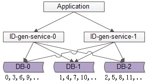
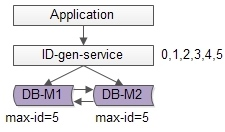
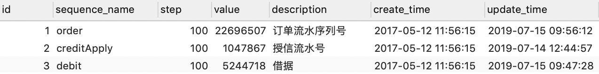
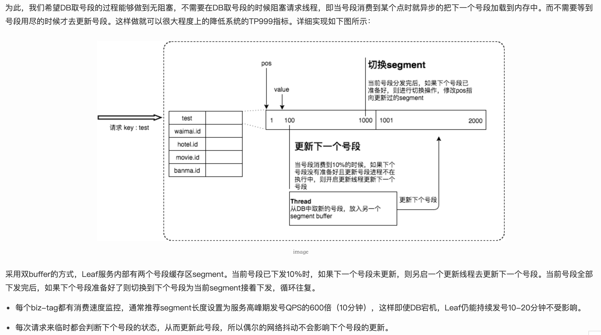
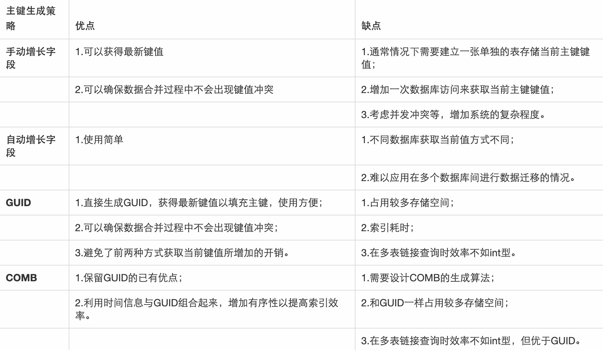
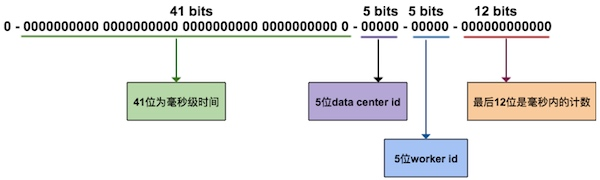
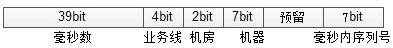

[TOC]

分布式全局唯一ID生成策略
场景：生成唯一记录标识的业务请求
如果有根据时间进行排序的需求，那么还需要在time字端上加索引；但是如果记录标识能够在生成的时候基本有序(递增)，那么可以省略这个time的索引。
索引，一般来说，分布式唯一ID要求全局唯一和趋势有序。
# 数据库方案
## 数据库的auto_increment来生成全局唯一ID
可以通过auto_increment_increment和auto_increment_offset控制自增的步长和初始值。
```sql
    begin;
    REPLACE INTO Tickets64 (stub) VALUES ('a');
    SELECT LAST_INSERT_ID();
    commit;
```
优点：简单，能够保证唯一性和递增性，步长固定
缺点：如果主库挂了，主从之间异步复制依然可能会丢失数据，导致发重复ID；mysql可能会成为性能瓶颈；（主从异步复制可能会丢失数据，可以使用半同步复制，保证事务至少到达一台slave机器）
* 改进方案1
    
    避免写入单点，可以增加主库，每个主库设置不同的自增初始值和相同的步长，保证每个数据库生成的ID是不同的，比如有三个数据库，初始值分别为1，2，3，补偿为3进行生成ID，则数据库1生成的ID为1，4，7等，数据库2生成的ID为2，5，8，数据库3生成的ID为3，6，9等。
    该方案保证了可用性，避免了单点故障，但是在高并发时，生成的ID并不是绝对递增的，可能先访问数据1的1和4，然后才访问数据库2的2，这里只是保证了趋势递增不是绝对递增；而且，该方案的数据库压力依然很大，每次生成ID都需要访问数据库；
    
* 改进方案2
    单点批量ID生成服务。数据库写压力大，因为每次生成ID都访问了数据库，可以使用批量的方式降低数据库写压力。
    
数据库使用双master保证可用性，数据库中只存储当前ID的最大值。例如ID生成服务每次批量拉取6个ID，服务访问数据库时将当前ID最大值改为5，这样ID生成服务本身有了0-5的6个ID，不需要每次都访问数据库了，这样数据库的压力变为原来的1/6了。
优点：降低数据库压力，保证ID生成的绝对递增有序；通过调整步长，可以提高性能；
缺点：ID生成服务是单点
(单点服务的高可用优化方案是 备用服务，也叫 影子服务，对外提供服务的是主服务，有一个影子服务时刻处于备用状态，当主服务挂了，影子服务继续提供服务，这个切换过程对于调用方是透明的，可以自动完成，常用的技术是vip+keepalived)

## 白条做法
一张表维护不同业务类型的当前ID值和步长

这里需要把sequnce_name加索引，因为查询的时候需要通过for update加行锁，否则会退化为表锁。
通过调整步长，允许服务在内存中生成更多的数，减少数据库压力。
采用时间戳+唯一ID的方案，即便因为主库挂了，切换到从库导致ID重复，但是时间戳没有重复，可以一定程度上避免这个问题。

优化：
我们的方案和美团第一个版本的方案类似，可以参考[美团分布式ID实现](https://tech.meituan.com/2017/04/21/mt-leaf.html)
如果内存中的号段用完了，那么最后一个请求需要等待从DB中获取号段，可能由于网络或者DB导致阻塞。因此，这里可以进行优化做到无阻塞，当号段消费到某个点时就异步地把下一个号段加载到内存中，而不是等到用完的时候才去加载。


# UUID
上述方案不论是数据库还是ID生成服务，业务方都需要进行一次rpc，耗时。UUID是常见的本地生成方案，UUID.randomUUID()。
UUID组成包含了当前时间戳、网卡MAC地址(IP地址)、名字空间、随机数和时序等元素，以及从这些元素生成UUID的算法。
GUID是微软对UUID这个标准的实现，还有其他的实现。
COMB型是数据库特有的一种设计思想，是一种改进的GUID，因为GUID数据毫无规律可言造成索引效率低；因此通过组合GUID和系统时间，以使其在索引和检索上有更优的性能。

UUID(Universally Unique Identifier)的标准型式包含32个16进制数字，以连字号分为五段，形式为8-4-4-4-12的36个字符，示例：550e8400-e29b-41d4-a716-446655440000
优点：本地生成，无网络调研，性能好，基本可以认为性能无上限
缺点：无法保证趋势递增，UUID过长，如果作为主键则查询效率低；基于MAC地址生成UUID的算法可能会造成MAC地址泄露；(IP地址)
* 优化
    将UUID转换为两个uint64整数存储，或者折半存储(折半后无法保证唯一)
    
# 当前毫秒数
uuid是一个本地算法，生成性能高，但无法保证趋势递增，且作为字符串ID检索效率低；通过获取当前毫秒数可以获取一个递增的数值。
优点：
1. 本地生成，无rpc，时延低；
2. 趋势递增；
3. 整数，建立索引后查询效率高
缺点：
1. 并发高使，会重复 ==》 使用微妙减少重复的概率，但是即使这样，一秒只能产生10^6的ID，再多的话就会冲突了，不能从根本上解决问题。

# redis来生成唯一ID
当使用数据库来生成ID性能不够要求的时候，我们可以尝试使用Redis来生成ID。这主要依赖于Redis是单线程的，所以也可以用生成全局唯一的ID。可以用Redis的原子操作 INCR 和 INCRBY 来实现。
优点：
依赖于数据库，灵活方便，且性能优于数据库。
数字ID天然排序，对分页或者需要排序的结果很有帮助。

为了防止单点故障或者单节点的性能瓶颈，可以使用redis集群来获取更高的吞吐量。初始化每台redis机器不同的初始值，相同的步长，至于负载到哪一台redis需要根据key决定。

考虑的问题：ID存储在redis中，是否需要进行持久化？是redis本身的持久化还是用数据库存储呢？那么一致性问题呢？
# 类snowflake算法
snowflake是twitter开源的分布式ID生成算法，其核心思想是：一个long型的ID，使用其中41bit作为毫秒数(可以使用69年)，10bit作为机器编号(5bit是数据中心，5bit是机器ID，最多支持1024节点)，12bit作为毫秒内序列号(12位的计数顺序号支持每个节点每毫秒产生4096个ID序号)。

这个算法单机每秒内理论上最多可以生成1000*(2^12)，也就是400W的ID，完全能满足业务的需求。
借鉴snowflake的思想，结合各公司的业务逻辑和并发量，可以实现自己的分布式ID生成算法。

举例，假设某公司ID生成器服务的需求如下：
（1）单机高峰并发量小于1W，预计未来5年单机高峰并发量小于10W
（2）有2个机房，预计未来5年机房数量小于4个
（3）每个机房机器数小于100台
（4）目前有5个业务线有ID生成需求，预计未来业务线数量小于10个
（5）…
分析过程如下：
（1）高位取从2016年1月1日到现在的毫秒数（假设系统ID生成器服务在这个时间之后上线），假设系统至少运行10年，那至少需要10年*365天*24小时*3600秒*1000毫秒=320*10^9，差不多预留39bit给毫秒数
（2）每秒的单机高峰并发量小于10W，即平均每毫秒的单机高峰并发量小于100，差不多预留7bit给每毫秒内序列号
（3）5年内机房数小于4个，预留2bit给机房标识
（4）每个机房小于100台机器，预留7bit给每个机房内的服务器标识
（5）业务线小于10个，预留4bit给业务线标识


这样设计的64bit标识，可以保证：
（1）每个业务线、每个机房、每个机器生成的ID都是不同的
（2）同一个机器，每个毫秒内生成的ID都是不同的
（3）同一个机器，同一个毫秒内，以序列号区区分保证生成的ID是不同的
（4）将毫秒数放在最高位，保证生成的ID是趋势递增的
缺点：
（1）由于“没有一个全局时钟”，每台服务器分配的ID是绝对递增的，但从全局看，生成的ID只是趋势递增的（有些服务器的时间早，有些服务器的时间晚）
最后一个容易忽略的问题：
生成的ID，例如message-id/ order-id/ tiezi-id，在数据量大时往往需要分库分表，这些ID经常作为取模分库分表的依据，为了分库分表后数据均匀，ID生成往往有“取模随机性”的需求，所以我们通常把每秒内的序列号放在ID的最末位，保证生成的ID是随机的。
又如果，我们在跨毫秒时，序列号总是归0，会使得序列号为0的ID比较多，导致生成的ID取模后不均匀。解决方法是，序列号不是每次都归0，而是归一个0到9的随机数，这个地方。
实现：
```java
public class SnowflakeIdGenerator {
    //================================================Algorithm's Parameter=============================================
    // 系统开始时间截 (UTC 2017-06-28 00:00:00)
    private final long startTime = 1498608000000L;
    // 机器id所占的位数
    private final long workerIdBits = 5L;
    // 数据标识id所占的位数
    private final long dataCenterIdBits = 5L;
    // 支持的最大机器id(十进制)，结果是31 (这个移位算法可以很快的计算出几位二进制数所能表示的最大十进制数)
    // -1L 左移 5位 (worker id 所占位数) 即 5位二进制所能获得的最大十进制数 - 31
    private final long maxWorkerId = -1L ^ (-1L << workerIdBits);
    // 支持的最大数据标识id - 31
    private final long maxDataCenterId = -1L ^ (-1L << dataCenterIdBits);
    // 序列在id中占的位数
    private final long sequenceBits = 12L;
    // 机器ID 左移位数 - 12 (即末 sequence 所占用的位数)
    private final long workerIdMoveBits = sequenceBits;
    // 数据标识id 左移位数 - 17(12+5)
    private final long dataCenterIdMoveBits = sequenceBits + workerIdBits;
    // 时间截向 左移位数 - 22(5+5+12)
    private final long timestampMoveBits = sequenceBits + workerIdBits + dataCenterIdBits;
    // 生成序列的掩码(12位所对应的最大整数值)，这里为4095 (0b111111111111=0xfff=4095)
    private final long sequenceMask = -1L ^ (-1L << sequenceBits);
    //=================================================Works's Parameter================================================
    /**
     * 工作机器ID(0~31)
     */
    private long workerId;
    /**
     * 数据中心ID(0~31)
     */
    private long dataCenterId;
    /**
     * 毫秒内序列(0~4095)
     */
    private long sequence = 0L;
    /**
     * 上次生成ID的时间截
     */
    private long lastTimestamp = -1L;
    //===============================================Constructors=======================================================
    /**
     * 构造函数
     *
     * @param workerId     工作ID (0~31)
     * @param dataCenterId 数据中心ID (0~31)
     */
    public SnowflakeIdGenerator(long workerId, long dataCenterId) {
        if (workerId > maxWorkerId || workerId < 0) {
            throw new IllegalArgumentException(String.format("Worker Id can't be greater than %d or less than 0", maxWorkerId));
        }
        if (dataCenterId > maxDataCenterId || dataCenterId < 0) {
            throw new IllegalArgumentException(String.format("DataCenter Id can't be greater than %d or less than 0", maxDataCenterId));
        }
        this.workerId = workerId;
        this.dataCenterId = dataCenterId;
    }
    // ==================================================Methods========================================================
// 线程安全的获得下一个 ID 的方法
    public synchronized long nextId() {
        long timestamp = currentTime();
        //如果当前时间小于上一次ID生成的时间戳: 说明系统时钟回退过 - 这个时候应当抛出异常
        if (timestamp < lastTimestamp) {
            throw new RuntimeException(
                    String.format("Clock moved backwards.  Refusing to generate id for %d milliseconds", lastTimestamp - timestamp));
        }
        //如果是同一时间生成的，则进行毫秒内序列
        if (lastTimestamp == timestamp) {
            sequence = (sequence + 1) & sequenceMask;
            //毫秒内序列溢出 即 序列 > 4095
            if (sequence == 0) {
                //阻塞到下一个毫秒,获得新的时间戳
                timestamp = blockTillNextMillis(lastTimestamp);
            }
        }
        //时间戳改变，毫秒内序列重置
        else {
            sequence = 0L;
        }
        //上次生成ID的时间截
        lastTimestamp = timestamp;
        //移位并通过或运算拼到一起组成64位的ID
        return ((timestamp - startTime) << timestampMoveBits) //
                | (dataCenterId << dataCenterIdMoveBits) //
                | (workerId << workerIdMoveBits) //
                | sequence;
    }
    // 阻塞到下一个毫秒 即 直到获得新的时间戳
    protected long blockTillNextMillis(long lastTimestamp) {
        long timestamp = currentTime();
        while (timestamp <= lastTimestamp) {
            timestamp = currentTime();
        }
        return timestamp;
    }
    // 获得以毫秒为单位的当前时间
    protected long currentTime() {
        return System.currentTimeMillis();
    }
    //====================================================Test Case=====================================================
    public static void main(String[] args) {
        SnowflakeIdGenerator idWorker = new SnowflakeIdGenerator(0, 0);
        for (int i = 0; i < 1000; i++) {
            long id = idWorker.nextId();
            System.out.println(Long.toBinaryString(id));
            System.out.println(id);
        }
    }
}
```

# 百度UIDGenerator
百度开源的分布式ID生成器，基于snowflake算法实现。
[github地址](https://github.com/baidu/uid-generator/blob/master/README.zh_cn.md)

# 美团Leaf分布式生成器
[参考官网](https://tech.meituan.com/2017/04/21/mt-leaf.html)