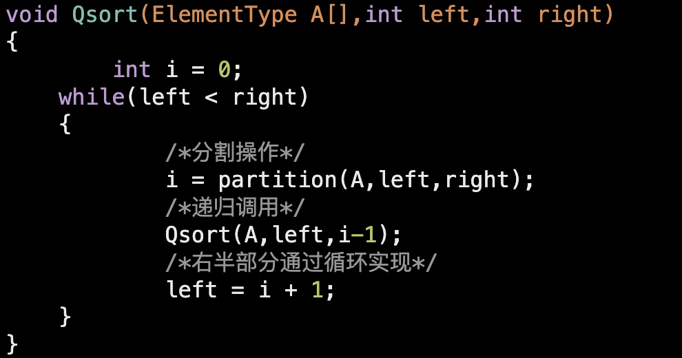

[TOC]

# 问题
## 为什么快排比堆排快？
1. 堆排序对于大根堆来说，需要将堆顶的元素移除，然后将叶子结点元素放到根，重新调整为大根堆，这样是有很多比较是浪费的，因为被拿到堆顶的那个元素几乎肯定是很小的，而靠近堆顶的元素几乎是很大的，因此被拿到堆顶的元素很有可能需要再次移动到底部。堆排序中有很多这样无效的比较，而快速排序每次是对基准值进行排序，基准值左侧的元素不需要和右侧的元素进行比较，大大提高了效率。快排每次移动数据都是将数据移动到距离正确的位置越来越近，而堆排序将堆尾数据移动到堆顶的操作只会让数据原理它正确的位置，大部分的时间都浪费在构建堆和调整堆上。
2. 对于涉及到磁盘读写或者cpu缓存的排序：堆排序需要比较父结点和子结点的大小，虽然计算下标很快完成，但是大规模数据中对数组指针的寻址也需要一定时间，是随机读取；而快速排序只需要将指针移动到相邻的区域即可，是顺序读取数据。也就是说，快速排序能够利用磁盘预读和局部性原理，大大提高了数据存取的效率。
3. 虽然时间复杂度都是O(NlogN)，但是快排前面的系数更小，所以性能更好。

* 优化
    堆排序--将堆顶元素移除，堆尾元素移动到堆顶，调整大根堆
    优化：将堆顶元素移除，选择堆顶元素的左右孩子结点移动到堆顶，然后调整大根堆。这样可以避免很多无用的比较。
    
## 对象排序为什么不用快排？
[参考这里喽](https://www.cnblogs.com/nucdy/p/9270594.html)
    对于对象的排序，稳定性很重要。比如成绩单，一开始可能是按人员的学号顺序排好了的，现在让我们用成绩排，那么你应该保证，本来张三在李四前面，即使他们成绩相同，张三不能跑到李四的后面去。
　　而快速排序是不稳定的，而且最坏情况下的时间复杂度是O(n^2)。

　　另外，对象数组中保存的只是对象的引用，这样多次移位并不会造成额外的开销，但是，对象数组对比较次数一般比较敏感，有可能对象的比较比单纯数的比较开销大很多。归并排序在这方面比快速排序做得更好，这也是选择它作为对象排序的一个重要原因之一。

# 排序算法

## 时间复杂度O(N^2)&空间O(1)

### 冒泡排序
时间O(n^2)  空间O(1) 稳定的排序 
第一个数和第二个数比较，大的数放在后面，第二个和第三个数比较，大的数放在后面….这样，第一轮比较结束时，最大的数已经到了数组的末尾，然后再从头开始进行比较，直至所有元素有序。
数组中有N个数，只需要进行N-1躺来回。每次循环中到n-1-i就结束。

```java
public class BubbleSort {
    public int[] bubbleSort(int[] A, int n) {
        for(int i=0;i<n-1;i++) {
            for(int j=0;j<n-1-i;j++) {
                if(A[j]>A[j+1]) {
                    int tmp = A[j];
                    A[j] = A[j+1];
                    A[j+1] = tmp;
                }
            }
        }
        return A;
    }
}
```

### 选择排序
时间O(n^2) 空间O(1)
第一个数和第二个数比较，小的数放在第一个位置上，然后第一个数和第三个数比较，小的放在第一个位置上….也就是说首先在0-N-1上选取一个最小值放在位置0上，然后再1-N-1选取一个最小值放在位置1上…..
N个数，需要N-1躺来回，每次循环中从j=i开始。

```java
public static int[] selectionSort1(int[] A, int n) {
       for(int i=0;i<n-1;i++) {
           for(int j=i+1;j<n;j++) {
               if(A[i]>A[j]) {
                   int tmp = A[i];
                   A[i] = A[j];
               	   A[j] = tmp;
               }
           }
       }
        return A;
    }
    
    //减少了交换的次数，先进行比较，记录下最小值的索引，最后进行一次交换
    public static int[] selectionSort(int[] A, int n) {
    	
    	for(int i=0;i<n-1;i++) {
    		int min = i;
    		for(int j=i+1;j<n;j++) {
    			if(A[min]>A[j]) {
    				min = j;
    			}
    		}
    		int tmp = A[min];
    		A[min] = A[i];
    		A[i] = tmp;
    	}
    	return A;
    }
    ```
    
### 插入排序
时间O(n^2)  空间O(1)
第一个数和第二个数比较，小的放在第一个位置上，然后第三个数和第二个数比较，如果第三个数比第二个数大，则位置不动，如果第三个数比第二数小，则第三个数再与第一个数进行比较，如果比第一个数小，就插入在第一个和第二个数之间，如果小于第一个数，则插入到第一个元素之前….
整体思想：每次插入一个数，都是向一个有序的数组中进行插入，插入后，要保证该数组继续有序。

```java
public void insertSort(int[] A) {
		//外层循环代表当前插入的元素,第一个元素已经有序
		for(int i=1;i<A.length;i++) {
			int tmp = A[i];
			int j;
			for(j=i;j>0;j--) {
				//与前一个元素进行比较
				if(tmp<A[j-1]) {
					A[j] = A[j-1];
				} else {
					break;//直接跳出循环
				}
 			}
			A[j] = tmp;
		}
	}
```
		
## 时间复杂度O(NlogN)

### 归并排序
时间O(NlogN)  空间O(N)
分治思想。
把长度为N的数组，进行分割，首先分隔成两个区间，每个区间长度N/2，然后再把每个区间进行分割，这样每个区间长度变为N/4….
然后再进行合并，先对相邻两个长度为1的有序区间进行合并，合并为长度为2的有序区间，然后再对相邻两个长度为2的有序区间进行合并，合并为长度为4的有序区间….
依次这样进行下去，直至合并成长度为N的有序区间
```java
public class Merge {
	public static void main(String[] args) {
		int[] arr = {2,3,5,1,2,6,3,4};
		sort(arr,0,arr.length-1);
		for(int i: arr) {
			System.out.print(i+" ");
		}
	}
	
	public static void sort(int[] arr,int low,int high) {
		int mid = (low+high)/2;
		if(low<high) {
			sort(arr,low,mid);
			sort(arr,mid+1,high);
			//进行合并
			mergeArray(arr,a,mid,high);
		}
	}

	//对有序数组的合并
	private static void mergeArray(int[] arr, int low, int mid, int high) {
		int i = low;
		int j = mid+1;
		int k = 0;
		int[] arr2 = new int[high-low+1];
		while(i<=mid && j<=high) {
			if(arr[i]<arr[j]) {
				arr2[k++] = arr[i++];
			} else {
				arr2[k++] = arr[j++];
			}
		}
		while(i<=mid) {
			arr2[k++] = arr[i++];
		}
		while(j<=high) {
			arr2[k++] = arr[j++];
		}
		
		i = low;
		for(k=0;k<arr2.length;k++) {
			arr[i] = arr2[k];
			i++;
		}
	}
}
```

### 快速排序
时间O(NlogN) 空间O(logN)-O(N)
首先选择一个基准数，这个基准数的选取可以选取一个固定的数如数组中第一个位置的元素或者随机选取一个数或者选择三个数中的中位数。然后按照这个基准数对数组进行分割，把小于基准数的元素放在数组左侧，大于基准数的元素放在数组右侧，这样经过第一轮排序，可知基准数左边的元素都小于基准数，大于基准数的元素都大于基准数，然后在这两个区间分别递归调用快排的过程，直至整个数组有序。
每次排序，相当于是对基准数进行排序，也就是把基准数放到一个了正确的位置。
性能的好坏在于基准数的选取。

快排的划分过程：时间O(N)
	思路1：选取一个基准元，放在数组元素的最后的一个位置。设置一个小于等于区间，放在数组的左边，初始长度为0。然后从左到右遍历所有元素，如果当前元素大于基准元，则继续遍历下一个元素，如果当前元素小于等于基准元，则把该元素与小于等于区间的下一个元素进行交换，然后小于等于区间向右扩一个元素，直至到数组的最后一个元素，也就是基准元，与小于等于区间的下一个元素进行交换。这样就完成了一次划分操作。
	
```java
public static void quickSort2(int[] A,int first,int last) {
		if(first<last) {
			int x = A[last];
			int k = first;
			for(int i=first;i<last;i++) {
				if(A[i]<x) {
					int tmp = A[k];
					A[k] = A[i];
					A[i] = tmp;
					k++;
				}
			}
			int tmp = A[k];
			A[k] = A[last];
			A[last] = tmp;
			
			quickSort2(A, first, k-1);
			quickSort2(A, k+1, last);
		}
	}
	思路2：看代码
public class QuickTest {
	public static void main(String[] args) {
		int[] arr = {2,3,4,12,3,12,};
		quickSort(arr,0,arr.length-1);
		for(int i: arr) {
			System.out.print(i+" ");
		}
	}

	private static void quickSort(int[] arr,int first,int last) {
		if(first<last) {
			int x = arr[first];
			int i=first,j=last;
			//若大于基准元，则元素不动，j--
			while(i<j) {
				while(i<j && arr[j]>x) {
					j--;
				}
				if(i<j) {
					arr[i++] = arr[j];
				}
				
				while(i<j && arr[i]<x) {
					i++;
				}
				if(i<j) {
					arr[j--] = arr[i];
				}
			}
			arr[i] = x;
			quickSort(arr, first, i-1);
			quickSort(arr, i+1, last);
			
		}
	}
}
```

快排的最优时间复杂度和平均时间复杂度为O(NlogN)，最坏的时间复杂度为O(N^2)；时间复杂度与基准值的选取有关；
如果每次基准值的选取都能将partition划分的很均匀，那么只需要递归log(N)就可以了，类似于二叉树的深度；但是如果每次基准值的选取，划分的分区一个是空，一个是原长度-1，那么时间复杂度就最差为O(N^2)。平均时间的复杂度与基准值在排序后的位置有关系！

平均时间复杂度为O(NlogN)，最坏时间复杂度为O(N^2)，如顺序数列的快排。

#### 优化
1. 通过引入随机函数或者三数取中(start/end/mid)能够阻止最坏情况发生，通过随机函数选取基准值，这样被划分出来的两个子数列大小更容易接近，划分容易平衡。
2. 当数列规模较小时，划分的平衡性容易被打破，因此当数列规模<N时，改用插入排序，插入排序在基本有序时性能更好，实践证明N取20较好。
3. 三向切分：如果数组中重复元素比较多，那么会有很多无用的比较，而且会导致切分后的均匀后不好；三向切分通过将数组分割为三个部分：小于基准值，等于基准值和大于基准值，从而呢保证等于基准值的元素始终在正确的位置，提高性能。
    [参考这里的实现，比较详细](https://blog.csdn.net/Holmofy/article/details/71168530)
4. 多线程排序。每个子序列采用多线程进行排序，但是需要注意，创建线程和线程上下文切换开销。CPU密集型，这里线程数=cpu核数+1；    
5. 尾递归：在函数的最后一行调用自身，这样就不需要保存栈的上下文信息，也不会保存栈的调用记录，不会导致栈越来越深，始终只有一个调用栈帧。在快排中并不是真正的尾递归，只是将第二次的递归采用迭代来代替而已。
    

### 堆排序
时间O(NlogN)  空间O(1)
把数组中的N个元素建立成一个大小为N的大根堆。将堆顶元素和堆的最后一个元素进行交换，然后把最大值脱离堆结构，放在数组的最后一个位置。然后把N-1大小的堆从堆顶位置进行调整，再次调整出来一个大根堆，重复上述过程…当堆的大小为1的时候，数组有序。
堆是一棵完全二叉树。
其任何一非叶节点满足性质：
Key[i]<=key[2i+1]&&Key[i]<=key[2i+2]或者Key[i]>=Key[2i+1]&&key>=key[2i+2]
 即任何一非叶节点的关键字不大于或者不小于其左右孩子节点的关键字。

```java
//调整大根堆
	//假设除了根节点parent外，其他节点都满足大根堆的定义
	public  void heapAdjust(int[] A,int parent,int end) {
		int tmp = A[parent];
		//完全二叉树 左孩子节点
		int child = 2*parent + 1;
		while(child<end) {
			//找到左右孩子中的较大者
			if(child+1<end && A[child]<A[child+1]) {
				child++;
			}
			//比较根节点和孩子大小
			if(tmp<A[child]) {
				//将孩子的值给父亲
				A[parent] = A[child];
				//更新parent值
				parent = child;
				child = 2*child +1;
			} else {
				break;
			}
		}
		A[parent] = tmp;
	}
	
	public void sort(int[] A) {
		//把数组中的元素创建成一个大根堆
		for(int i=A.length/2-1;i>=0;i--) {
			heapAdjust(A, i, A.length);
		}
		
		for(int i = A.length-1;i>0;i--) {
			int tmp = A[i];
			A[i] = A[0];
			A[0] = tmp;
			heapAdjust(A, 0, i);
		}
		
	}
```

构建大根堆：无序数组相当于完全二叉树，需要从第一个非叶子节点自底向上进行调整为大根堆。
参考：https://blog.csdn.net/qq_35178267/article/details/78313306

### 希尔排序  
空间O(1)  时间O(NlonN)
是插入排序的改良版。插入排序的步长为1，每次新插入的元素都会先与前一个元素进行比较。希尔排序的步长是从大到小进行调整的。
性能好坏取决于步长的选取。

比如 1 3 4 5 6 2 7  步长为3
思路1:步长为3，数组的前三个元素不需要进行比较，然后到第四个元素5，这时向前跳3步，与1进行比较，5比1大，不进行交换，然后到6，6与3比较，6比3大，不进行交换，然后到2，2向前跳3步，与4比较，2比4小，则2与4进行交换，然后2再次向前跳3步，已经越界了，然后到7，7比5大，不换。这样就完成了步长为3的操作，然后依次进行步长为2 为1的操作。
希尔排序最后肯定是步长为1的插入排序。但是此时基本有序，插入排序的效率会很高，因此得到了改善。
```java
public void shellSort(int[] A) {
		int j;
		//步长
		for(int gap=A.length/2;gap>0;gap/=2) {
			for(int i=gap;i<A.length;i++) {
				int tmp = A[i];
				for(j=i;j>=gap;j=j-gap) {
					if(tmp<A[j-gap]) {
						A[j] = A[j-gap];
					} else {
						break;
					}
				}
				A[j] = tmp;
			}
		}
	}
```

## 时间复杂度O(N) 空间O(M)
不是基于比较的排序算法，思想来自于桶排序。桶排序不是具体的实现，只是一种思想。
M为桶的数量

### 计数排序
需要事先知道一个数组中元素的最大值，然后以最大值+1为长度建立一个数组，遍历原数组，原数组中的元素值与新数组下标相等时，则新数组的值加1。最后遍历新数组，把元素值为1的下标输出，即为排序后的元素。
```java
public static void bucket(int[] A) {
		//找到数组中元素最大值
		int max = Integer.MIN_VALUE;
		for(int i=0;i<A.length;i++) {
			if(max<A[i]) {
				max = A[i];
			}
		}
		//必须加1
		max++;
		int[] arr = new int[max];
		for(int i=0;i<A.length;i++) {
			arr[A[i]]++;
		}
		int j=0;
		for(int i=0;i<arr.length;i++) {
			//循环，解决数重复问题
			while(arr[i]!=0) {
				A[j++] = i;
				arr[i]--;
			}
		}
	}
```

### 基数排序
假设要排序的一组数是十进制数，则建立一个0-9号桶。然后遍历数组，根据数组中元素上个位的值依次放入桶中 ，然后把这些数从0-9号桶倒出来，此时的序列是按照个位数从小到大排序好的。然后按照十位数上的数把这些序列再次放进相应的桶中，然后再倒出….
方法一：使用一维数组 
```java
public class RadixTest {
	public static void main(String[] args) {
		int[] A = {1200,12,3223,2};
		//数组中最多有多少位
		int wei = weiShu(A);
		radixSort(A, wei);
		for(int a : A) {
			System.out.println(a);
		}
	}
	
	//基数排序
	public static void radixSort(int[] A,int wei) {
		
		//临时数组，用于存放原始的数组A
		int[] tmpArray = new int[A.length];
		
		//用于计数，0-9
		int[] count = new int[10];
		
		//代表第几位，除以相应的rate
		int rate = 1;
		
		//从最低位开始
		for(int i=1;i<=wei;i++) {
			
			//初始化为0
			Arrays.fill(count, 0);
			//复制原数组
			System.arraycopy(A, 0, tmpArray, 0, A.length);
			
			for(int j=0;j<A.length;j++) {
				//个/十/百位置上的数
				int key = (tmpArray[j]/rate)%10;
				//对应的计数+1
				count[key]++;
			}
			
			//统计第j位上前面有多少个数（包括j） 与原数组的下标对应
			for(int j=1;j<count.length;j++) {
				count[j] = count[j]+count[j-1];
			}
			
			//这里使用A 对每次更新之后的序列进行处理
			for(int j=A.length-1;j>=0;j--) {
				//从原数组tmpArray中取数
				int key = (tmpArray[j]/rate)%10;
				//从下标0开始
				A[--count[key]] = tmpArray[j]; 
			}
			rate = rate * 10;
		}
	}
	
	//判断数组中元素最多有多少位
	public static int weiShu(int[] A) {
		int max = Integer.MIN_VALUE;
		for(int i=0;i<A.length;i++) {
			if(A[i]>max) {
				max = A[i];
			}
		}
		int count = 0;
		while(max!=0) {
			max /= 10;
			count++;
		}
		return count;
	}
}
```
方法二：使用二维数组实现 比较好理解
```java
public class RadixTest2 {
	public static void main(String[] args) {
		int[] A = {1200,12,3223,2};
		//数组中最多有多少位
		int wei = weiShu(A);
		radixSort(A, wei);
		for(int a : A) {
			System.out.println(a);
		}
	}
	
	public static void radixSort(int[] A,int wei) {
		
		//二维数组 
		//第一维表示有几个桶
		//第二维表示每个桶存放的元素
		int[][] tmp = new int[10][A.length];
		//计数数组
		int[] count = new int[10];
		
		int radix = 1;
		for(int i=1;i<=wei;i++) {
			
			for(int j=0;j<A.length;j++) {
				//key的值对应几号桶
				int key = (A[j]/radix)%10;
				//将A[i]存入key号桶count[key]位置上的数，从下标0开始
				tmp[key][count[key]] = A[j];
				count[key] ++;
			}
			
			//取出
			int k = 0;
			for(int j=0;j<count.length;j++) {
				//取出元素时，要先进先出 保证稳定性
				if(count[j]!=0) {
					for(int m=0;m<count[j];m++) {
						A[k] = tmp[j][m];
						k++;
					}
				}
				//清0
				count[j]=0;
			}
			radix = radix * 10;
		}
		
	}
	
	//判断数组中元素最多有多少位
	public static int weiShu(int[] A) {
		int max = Integer.MIN_VALUE;
		for(int i=0;i<A.length;i++) {
			if(A[i]>max) {
				max = A[i];
			}
		}
		int count = 0;
		while(max!=0) {
			max /= 10;
			count++;
		}
		return count;
	}
}
```

## 稳定排序
相同值的元素在排序前和排序后的相对位置保持不变。
稳定的排序算法：冒泡 插入 归并 桶排序 基数排序 计数排序
不稳定的排序算法：选择 快排 希尔 堆
	例子： 选择 3 3 3 1
		   快排 4 3 3 3 5 选择中间的3为基准元
		   堆排序 5 5 5 根元素与最后一个元素交换
		   希尔排序 5 1 1 5 步长为2

## 补充
桶排序适合于范围空间比较小的，否则会造成空间的浪费。
块排序的大多数时间都浪费在堆的调整上面。
为什么叫快速排序？
	快排的运行时间是O(nlogn)，常量系数比较小。
http://mindhacks.cn/2008/06/13/why-is-quicksort-so-quick/

当元素个数比较少时，会选择常量系数比较小的插入排序。
数组元素较多时，选择快排或者其他O(NlogN)的排序。

    