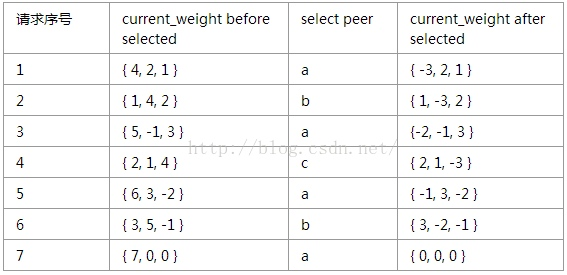

常见的负载算法有：按权重轮询、按权重随机、hash

按权重轮询的实现方式：
1. 维护一个计数器AtomicInteger，每次来一个请求，计数器就会加1；计数器对总的权重取模，然后遍历服务器列表，依次减去各个服务器的权重，直至减到0，则选择该服务器；这个算法会导致，某个时间段的请求集中打到一台服务器上，其他服务器却没有任何流量；
2. 参考dubbo的负载均衡策略实现，能够做到均匀的分配流量，比如有三台服务器a、b和c，权重依次为3:2:1，那么当请求来的时候，依次请求a b c a b a；同理，需要计数器维护请求的个数，同样需要遍历，外层循环为最大权重，内存循环需要遍历服务器列表，依次遍历，每遍历一次后需要把对应的服务器权重减1，取模值减1，直至取模值==0且服务器权重>0，才会选择该服务器；
3. 每个服务器的当前权重初始值为0，加上各自配置的权重，选择最大的作为这次轮询的结果，同时，当前服务器减去所有权重得到下一次轮询时的权重初始值；
4. 上面的轮询都需要遍历服务器列表集合，平均时间复杂度为O(N)，N为总权重；可以采用空间换时间的办法，即集合中会按照权重的比值来存放服务器，即一个集合中会存放4个服务器a，2个服务器b，1个服务器c，这样取模后，直接list.get(i)获取选择的服务器，时间复杂度O(1)；