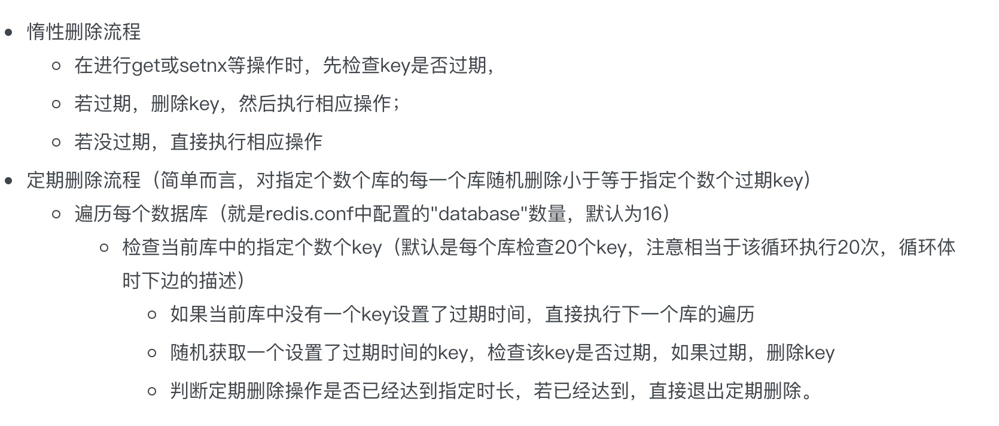

[TOC]
# redis高性能的原因
redis采用单进场单线程模型的KV数据库，由C语言编写，官网显示10万QPS（每秒查询）；mysql的QPS差不多在2000-2500左右。
    1. 数据存放在内存中，操作很快，字典结构存储，查找的时间复杂度O(1);
    2. 数据结构简单，对数据的操作也简单；
    3. 单线程模型，避免了不必要的上下文切换和竞争，也不存在多进程或者多线程导致的切换而消耗 CPU，不用去考虑各种锁的问题，不存在加锁释放锁操作，没有因为可能出现死锁而导致的性能消耗；
    4. redis虽然用c语言编写，但是也实现了自己的数据结构，比如SDS等；而且每种个数据结构采用多种编码方式，这样可以在不同的场景中，利用不同编码的优势，在内存和性能上达到平衡。
    5. 使用多路I/O复用模型，非阻塞IO；可以让单个线程高效的处理多个连接请求，由于redis是纯内存操作，速度非常快，不会成为影响redis的瓶颈。
    （官网表示，redis是基于内存操作，cpu不是redis瓶颈，redis瓶颈最有可能就是机器内存大小或者网络带宽；既然单线程容易实现，且cpu不会成为瓶颈，所以就采用单线程的设计）
   redis单线程只是在处理网络请求和响应的时候是一个线程，但是redis运行肯定不止一个线程，比如持久化的时候会fork子进程进行处理，以及lazyfree线程； 
    
# redis分布式锁的问题
## 加锁
使用hash结构，key为加锁的key，field为客户端的唯一标识(uuid)，value为加锁的次数(锁重入的时候使用)；
如果是集群，则根据hash算法选择一台机器；然后将lua脚本发送到redis上；判断key是否存在，不存在，则设置value和过期时间；否则，如果已经存在且是同一个客户端获取，那么重入次数+1；

redis在集群中执行lua脚本时，要求key必须在一个slot上，否则报错；这样不会有跨节点操作，性能好；可以使用hash tag，即key后面加{tag}，那么在进行hash时会取tag进行操作，那么所有的key会到同一个槽；缺点是，无法兼容老业务，且导致这个slot所在的节点压力大；

## 释放锁
判读key是否存在(只有自己加的锁自己才能释放，即key+field是否存在)，如果存在，则重入次数-1，如果为1，则直接删除这个key；

## 存在的问题
主从同步是异步的，如果主挂了，没有来得及将key同步到从，那么从变为主，可能导致多个客户端同时获得锁。redlock可以解决。

## 如果键快过期了，但是业务还没执行完怎么办
一般来说，在设置过期时间时，需要对这块业务的执行时间有一个估测，尽量保证在过期时间内释放锁。否则，可能导致其他客户端能够获得过期的锁，导致数据错误。

可以对快过期的key进行续期；
1. 每个key启动一个定时任务，指定在过期时间的2/3开始执行，如果redis中还存在这个key，则重新这个key的过期时间；准确但是性能开销大；
2. 客户端维护过期key的集合，定时任务扫描这个集合决定是否进行续期；
3. 时间轮算法；redisson采用hashweeltime实现；
    
    
# Redis与Memcached的区别
1 、Redis不仅仅支持简单的k/v类型的数据，同时还提供list，set，zset，hash等数据结构的存储。memcache支持简单的数据类型，String。
2 、Redis支持数据的备份，即master-slave模式的数据备份。
3 、Redis支持数据的持久化，可以将内存中的数据保持在磁盘中，重启的时候可以再次加载进行使用,而Memecache把数据全部存在内存之中
4、 redis的速度比memcached快很多
5、Memcached是多线程，非阻塞IO复用的网络模型；Redis使用单线程的IO复用模型。

# 过期数据清理算法
过期处理实际上针对key进行的，expires字典保存了所有键的过期时间，key是指向键的指针，value为unix时间戳；如果设置了过期时间，之后又想让缓存永不过期，使用persist key；
`1 EXPIRE key seconds　　//将key的生存时间设置为ttl秒
2 PEXPIRE key milliseconds　　//将key的生成时间设置为ttl毫秒
3 EXPIREAT key timestamp　　//将key的过期时间设置为timestamp所代表的的秒数的时间戳
4 PEXPIREAT key milliseconds-timestamp　　//将key的过期时间设置为timestamp所代表的的毫秒数的时间戳`

```java
expire key time 以s为单位
setex(String key, int seconds, String value)--字符串独有方式
```
* 定时删除：设置key过期时间的同时，为该key创建一个定时器，让定时器在key过期时间来临时，对key进行删除；
    优点：key过期立即被删除，内存能够尽快被释放
    缺点：如果过期key比较多，会占用很多的cpu时间，影响业务；为每个key维护一个定时器，性能影响严重；--所以基本不会使用；
* 惰性删除：key过期不会立即删除，只有在下次访问的时候会检查key是否过期，如果过期则删除，返回null；
    优点：消耗较少的cpu时间，而且此时的删除是到了非做不可的地步；
    缺点：如果过期的key没有被访问，那么这些key的内存一直不会被释放，占用内存，可能发生内存泄漏；
* 定期删除：每隔一段时间执行一次删除过期key的操作，并不是遍历所有的过期key，而是随机选取一些key
    优点：通过限制删除操作的时长和频率，减少删除操作对cpu时间的占用
    缺点：内存友好方面，不如 定时删除；cpu友好方面，不如 惰性删除；
    
redis采用的过期策略：惰性删除+定期删除



为了防止一次性清理大量过期Key导致Redis服务受影响，Redis只在空闲时清理过期Key。
Redis过期Key清理的机制对清理的频率和最大时间都有限制，在尽量不影响正常服务的情况下，进行过期Key的清理，以达到长时间服务的性能最优。
`Redis过期Key清理的机制对清理的频率和最大时间都有限制，在尽量不影响正常服务的情况下，进行过期Key的清理，以达到长时间服务的性能最优.
Redis会周期性的随机测试一批设置了过期时间的key并进行处理。测试到的已过期的key将被删除。具体的算法如下:
Redis配置项hz定义了serverCron任务的执行周期，默认为10，即CPU空闲时每秒执行10次;
每次过期key清理的时间不超过CPU时间的25%，即若hz=1，则一次清理时间最大为250ms，若hz=10，则一次清理时间最大为25ms;
清理时依次遍历所有的db;
从db中随机取20个key，判断是否过期，若过期，则逐出;
若有5个以上key过期，则重复步骤4，否则遍历下一个db;
在清理过程中，若达到了25%CPU时间，退出清理过程;
这是一个基于概率的简单算法，基本的假设是抽出的样本能够代表整个key空间，redis持续清理过期的数据直至将要过期的key的百分比降到了25%以下。这也意味着在长期来看任何给定的时刻已经过期但仍占据着内存空间的key的量最多为每秒的写操作量除以4.
由于算法采用的随机取key判断是否过期的方式，故几乎不可能清理完所有的过期Key;
调高hz参数可以提升清理的频率，过期key可以更及时的被删除，但hz太高会增加CPU时间的消耗;Redis作者关于hz参数的一些讨论`

# 数据逐出算法
在逐出算法中，根据用户设置的逐出策略，选出待逐出的key，直到当前内存小于最大内存值为主.

可选逐出策略如下：

volatile-lru：从已设置过期时间的数据集（server.db[i].expires）中挑选最近最少使用 的数据淘汰
volatile-ttl：从已设置过期时间的数据集（server.db[i].expires）中挑选将要过期的数 据淘汰
volatile-random：从已设置过期时间的数据集（server.db[i].expires）中任意选择数据 淘汰
allkeys-lru：从数据集（server.db[i].dict）中挑选最近最少使用的数据淘汰
allkeys-random：从数据集（server.db[i].dict）中任意选择数据淘汰
no-enviction（驱逐）：禁止驱逐数据

# 使用过哪些数据结构？
string,list,set,sortedSet,hash
我们在存储一个活动包含的商品时采用的是set数据结构，商品id自动去重，并利用SISMEMBER命令判断是否包含某个商品，O(1)的时间复杂度；
set中的元素比较多，所以我们在刷缓存的时候，采用的是分批向这个set中添加元素sadd，防止一次性添加太多元素导致redis阻塞其他请求，单线程。同样，在删除集合时(sscan)，并不是直接采用del命令，否则一样会阻塞redis。(如果设置key自动过期，在老版本也是存在一次性删除所有元素，阻塞redis的问题，所以没有采用自动过期。业务上有定时做，在空闲的时候会扫描数据库中失效的活动，然后删除redis中对应的缓存)
当set比较大时，可以业务进行分片，采用hash结构分割为多个小set；
# 过期key对持久化影响
过期key对RDB没有任何影响
`从内存数据库持久化数据到RDB文件
持久化key之前，会检查是否过期，过期的key不进入RDB文件
从RDB文件恢复数据到内存数据库
数据载入数据库之前，会对key先进行过期检查，如果过期，不导入数据库（主服务器情况），从服务器在载入rdb文件时，会载入所有的键包含过期和未过期，当主服务器同步时，从服务器的数据会被清空，所以过期对从服务器也没影响。从服务器没有权力删除key`

过期key对AOF没有任何影响
`从内存数据库持久化数据到AOF文件：
当key过期后，还没有被删除，此时进行执行持久化操作（该key是不会进入aof文件的，因为没有发生修改命令）
当key过期后，在发生删除操作时，程序会向aof文件追加一条del命令（在将来的以aof文件恢复数据的时候该过期的键就会被删掉）
AOF重写
重写时，会先判断key是否过期，已过期的key不会重写到aof文件
复制：
主服务器删除过期键之后，向从服务器发送一条DEL指令，告知删除该过期键。
从服务器接收到get指令的时候不会对过期键进行处理，只会当做未过期键一样返回（为了保持主从服务器数据的一致性）
从服务器只有接到主服务器发送的DEL指令后才会删除过期键。`

# 缓存雪崩
redis会定期扫描过期字典中的key，首先随机选择20个key，删除20个key中已经过期的key，如果过期的key比率超过1/4，那么重复，即再次随机选择20个key。为了保证过期扫描循环太久导致线程卡死，有最长时间限制不会超过25ms。因此如果大量key一起失效，那么最长会25ms，造成客户端卡顿。
缓存中的大量key在同一时间失效，导致请求都访问到数据库，数据库扛不住那么多并发压力，最终宕机。
1. key的过期时间加入随机数，避免所有key在同一时间失效；
2. 加锁或者队列，保证不会有大量请求来直接访问数据库，但是吞吐量会降低；
3. 对于某个key只允许一个线程查询数据库，其他线程等待，锁+唤醒+等待；guavacache有实现；
4. 二级缓存，A1为原始缓存，A2为拷贝缓存，A1失效时，可以访问A2，A1缓存的失效时间为短期，A2为长期。或者分布式缓存+本地缓存，本地缓存为一级缓存，分布式缓存为二级缓存，一级缓存过期时间比二级短。

# redis持久化机制
支持rdb和aof两种持久化方式。bgsave做镜像全量持久化，aof做增量持久化。因为bgsave会耗费较长时间，不够实时，在停机的时候会导致大量丢失数据，所以需要aof来配合使用。在redis实例重启时，会使用bgsave持久化文件重新构建内存，再使用aof重放近期的操作指令来实现完整恢复重启之前的状态。
aof最多损失1s的数据。
bgsave的原理？redis会fork出子进程执行bgsave操作，子进程创建后，父子进程共享数据段，父进程继续提供读写服务，写脏的页面数据会逐渐和子进行分离开来。(COW，写时复制)

# 多级缓存如何实现

# redis中插入大量的key-value如何处理
对于单个key的大集合可以分批sadd添加1000个元素，防止阻塞主线程；
但是对于操作大量key-value的话，需要多次的网络往返交互，大部分时间都会消耗在网络传输中。因此通过管道pipeline，客户端可以发送批量的命令，服务端处理完成后再将所有结果返回。注意：当一个连接开启了pipeline，那么pipeline将独占连接，期间不能进行其他非管道类型的操作，直至pipeline关闭；如果pipeline指令集比较大，为了不干扰连接中的其他操作，可以为pipeline新建client连接，让pipeline和其他业务操作分离在两个client连接中。pipeline是一次性提交一个队列给服务端，如果队列太大会占用较多的内存，增加网络传输时间，控制在几百条命令。pipeline非线程安全。

# 最佳实践
1. key尽量都要设置过期时间，否则需要业务定期手动清理；
2. 单key不要太大，一方面get时的网络传输延迟大，需要分配的输出缓冲区也大，另一方面，在清理的时候也会有较高的延迟；最好能够根据业务进行拆分、数据压缩等方式避免过大key的产生；
3. 选择合适的序列化方式，如protobuf,kyro等；
4. 不同业务如果使用同一个redis最好用不同的逻辑db分开，因为redis过期key的清理策略和强制淘汰策略会遍历各个db，将key分布在不同的db有助于过期key及时清理，而且方便问题排查和无用数据及时下线。

# redis并发竞争的问题是什么
当多个客户端同时并发写一个key时，可能本来应该先到的数据后到了，导致数据错误；或者多个客户端同时获取key的值，修改完成后再写回去，也有可能出现数据错误。
解决方案：
1. 加锁保证，保证同一时刻只有一个客户端能够操作；
2. 利用redis自带的watch命令，监控某个key，在提交exec命令的过程中如果key发生变化了，则事务不会执行；类似于乐观锁；（参考事务部分）
3. 通过队列，保证顺序操作；

# redis事务
[redis设计与实现-事务](https://redisbook.readthedocs.io/en/latest/feature/transaction.html)
Redis 事务保证了其中的一致性（C）和隔离性（I），但并不保证原子性（A）和持久性（D）。
（原子性：1.如果命令在入队之前就发现错误了，则事务不会执行；但是如果命令在入队之前没有错误，但是执行的时候发现错误，则不会影响其他命令的执行，其他命令会正常执行。2.redis在执行事务的过程被终止，不会有任何重试或者回滚。所以不满足原子性）
事务是一组命令的集合，可以让一个客户端在不被其他客户端打断的情况执行多个命令。
multi开启一个事务，然后将多个命令入队到事务中，最后由exec命令触发事务，执行所有命令。
multi表示事务的开始，会将客户端的redis_multi选项打开，让客户端从非事务状态切换到事务状态；当客户端处于非事务状态下时，所有发送给服务端的命令会被立即执行，但是客户端进入事务状态之后，服务端收到客户端命令后，不会立即执行，而是将这些命令全部放进一个事务队列中，返回queued，表示命令已经入队；事务队列是一个数组，每个数组项包含三个属性：要执行的命令+参数+参数个数；
exec命令，服务端根据客户端保存的事务队列，先进先出的方式执行事务队列中的命令；
discard取消一个事务，会清空事务队列，然后将客户端从事务状态调整为非事务状态；
watch只能在客户端进入事务之前执行，可以监视任意数量的key，当调用exec命令时，如果任意一个key会其他客户端修改了，则整个事务不会执行，返回失败；

# redis cpu过高的原因
1、连接数过多，通过redis-cli info | grep connected_clients查看
2、慢查询，因为redis是单线程，如果有慢查询的话，会阻塞住之后的操作，通过redis日志查 
3、value值过大？比如value几十兆，当然这种情况比较少，其实也可以看做是慢查询的一种
4、aof重写/rdb fork发生？瞬间会堵一下Redis服务器

使用redis的注意事项:
1、Master最好不要做任何持久化工作，包括内存快照和AOF日志文件，特别是不要启用内存快照做持久化。
2、如果数据比较关键，某个Slave开启AOF备份数据，策略为每秒同步一次。
3、为了主从复制的速度和连接的稳定性，Slave和Master最好在同一个局域网内。
4、尽量避免在压力较大的主库上增加从库
5、为了Master的稳定性，主从复制不要用图状结构，用单向链表结构更稳定，即主从关系为：Master<--Slave1<--Slave2<--Slave3.......，这样的结构也方便解决单点故障问题，实现Slave对Master的替换，也即，如果Master挂了，可以立马启用Slave1做Master，其他不变
6、使用Redis负载监控工具：redis-monitor，它是一个Web可视化的 redis 监控程序

# 假如Redis里面有1亿个key，其中有10w个key是以某个固定的已知的前缀开头的，如果将它们全部找出来？
使用keys 指令可以模糊匹配查询。但是由于redis是单线程，所以在执行的时候时间太长，会阻塞其他业务；
可以用scan指令查询，无阻塞的方式获取指定模式的key列表，但是有一定的重复概率，在客户端做去重即可。花费时间比keys长，但是不会阻塞。

# redis如何做队列
1. list结构，rpush,lpop消费消息；客户端while sleep定时获取；
2. list结构，rpush，blpop阻塞获取；
3. 实现一次发布多个消费？ 发布/订阅模式。如果没有订阅者，数据会丢失。

如何实现延迟队列？
sortedset，时间戳作为score，消费者用zrangebyscore指令获取Ns之前的消息进行处理；

# 

# 实战问题
## 给用户推荐的文章要求七日内不能重复
1. 采用list结构，key为userId，value为推荐的文章；如果直接设置key的过期时间，那么在过期的时候，集合全部内容都被删除了。因此，这里需要对某个元素进行过期设计。
2. 使用有序集合sortedSet，value为推荐的文章列表，score为当前时间戳，然后定时任务扫描集合，删除指定分数段的集合元素。ZREMRANGEBYSCORE key 0 score，这里的score为前七天对应的时间戳。或者删除有序集合的首位元素。

## 实时排行榜/直播间弹幕消息
使用sortedSet实现，key为直播间id，分数为unix时间戳，value为弹幕消息；可以获取最新的弹幕消息条数、指定时间段的消息；

## 计数类信息
计数类信息以用户维度为例，有未读消息，关注数，粉丝数，使用hash结构存储。
