[TOC]

# 数据结构和应用
在 Redis 中，常用的 5 种数据结构和应用场景如下：
* String：缓存、计数器、分布式锁等。
* List：链表、队列、栈、微博关注人时间轴列表等。
    获取最新N个数据的操作；消息队列；
     lpush+lpop=Stack(栈)、lpush+rpop=queue(队列)、lpush+brpop=message queue、lpush+ltrim=Capped Collection(有限集合)
* Hash：用户信息、Hash 表等。
* Set：去重、赞、踩、共同好友等。
    好友推荐时，根据tag求交集，大于某个阈值就可以推荐。
    利用唯一性，统计访问网站的独立IP；
* Zset(sortedSet)：访问量排行榜、点击量排行榜等。
    排行榜，topN操作；
    需要精准设置过期时间的应用；
    带有权重的元素；过期项目处理，按照时间排序；

redis中键总是 字符串 类型，值可以是 字符串、列表、集合、有序集合和哈希类型；

# 命令
OBJECT ENCODINGG key 可以查看key的底层数据结构

# 底层存储的数据结构
在Redis中，并没有直接使用这些数据结构来实现键值对数据库，而是基于这些数据结构创建了一个对象系统，这些对象系统也就是前面说的五大数据类型，每一种数据类型都至少用到了一种数据结构。通过这五种不同类型的对象，Redis可以在执行命令之前，根据对象的类型判断一个对象是否可以执行给定的命令，而且可以针对不同的场景，为对象设置多种不同的数据结构，从而优化对象在不同场景下的使用效率。
## 简单动态字符串
### 基本结构
redis使用C语言实现，但是redis的字符串并不是使用C语言的字符串(以空字符'\0'结尾的字符数组)，而是自己构建了 简单动态字符串(SDS,simple dynamic string)，并将SDS作为redis的默认字符串表示。
SDS的定义：
```java
struct sdshdr{
     //记录buf数组中已使用字节的数量
     //等于 SDS 保存字符串的长度
     int len;
     //记录 buf 数组中未使用字节的数量
     int free;
     //字节数组，用于保存字符串
     char buf[];
}
```
保存“redis”的示例如下：
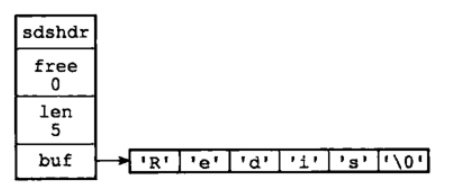

### 为什么不采用C语言的字符串实现
[SDS 与 C 字符串的区别](http://redisbook.com/preview/sds/different_between_sds_and_c_string.html)
1. 增加了len的属性，当获取字符串长度时时间复杂度为O(1)；而C语言获取字符串的长度需要通过遍历字符数组，累加计数，直至遇见空字符为止，时间复杂度O(N)；strlen key命令可以获取key的长度；
2. 杜绝缓冲区溢出：C语言的字符串没有记录自身的长度，当进行字符串复制或者拼接时，如果分配的内存不够，那么有可能产生缓冲区溢出；在redis中，首先检查SDS的空间是否满足拼接后的大小，如果不满足，则自动将SDS的空间扩展至所需大小，然后才执行拼接操作，不会有缓冲区溢出；（这里的缓冲区是指 预先分配给某个字符串的空间）
    case：内存中存在紧邻着的C字符串s1和s2，s1在s2前面；当对s1字符串修改或者拼接为新的字符串时，忘记了人为的在执行strcat拼接之前为s1分配足够的空间，那么strcat函数执行成功后，s1的数据会溢出到s2所在的空间，导致s2的内容被意外的修改。
3. 减少修改字符串的内存重新分配次数：C语言的字符串不保存自身的长度，所以对一个包含了N个字符的C字符串来说，这个C字符串底层实现是一个N+1唱的字符数组，那么当对字符串进行修改时，都需要对这个字符数组进行内存的重新分配操作；内存重新分配可能需要执行系统调用，是一个耗时的操作；redis作为数据库，被用于速度要求严苛、数据频繁修改的场合，如果每次修改字符串都需要重新分配内存，那么性能会很差；因此，SDS通过预先分配一定长度的空间(free记录)，避免修改时重新分配内存的操作。
`通过未使用空间，SDS实现了空间预分配和惰性空间释放两种优化策略。
空间预分配用于优化SDS的字符串增长操作，当对SDS修改时，不仅会为本次修改分配所需的空间，还会为SDS分配额外未使用的空间；分配策略为：如果修改后的SDS长度小于1M，则预分配和SDS长度一样的空间大小；否则分配1M的空间大小留作备用；通过预分配策略，原先必须要N次的内存分配变为最多需要N次的内存。
惰性空间释放用于优化SDS字符串缩短操作，当需要缩短SDS保存的字符串时，不会立即释放多余的内存空间，而是用free属性将这些字节的数量记录起来，等待将来使用`

## 链表
双向链表；无环链表，以NULL作为结束标志；len属性保存了链表的长度，因此获取链表长度时间复杂度O(1)；
```java
typedef  struct listNode{
       //前置节点
       struct listNode *prev;
       //后置节点
       struct listNode *next;
       //节点的值
       void *value;  
}listNode
```

## 字典
字典又称为符号表或者关联数组、映射，用于保存键值对的抽象数据结构；key是唯一的；redis中的字典采用哈希表作为底层实现；
```java
typedef struct dictht{
     //哈希表数组
     dictEntry **table;
     //哈希表大小
     unsigned long size;
     //哈希表大小掩码，用于计算索引值
     //总是等于 size-1
     unsigned long sizemask;
     //该哈希表已有节点的数量
     unsigned long used;
 
}dictht
```
哈希表由table组成，table中每个元素都是指向dictEntry结构，该结构定义如下：
```java
typedef struct dictEntry{
     //键
     void *key;
     //值
     union{
          void *val;
          uint64_tu64;
          int64_ts64;
     }v;
 
     //指向下一个哈希表节点，形成链表
     struct dictEntry *next;
}dictEntry
```
key保存键，value保存值，值可以是一个指针，也可以是unit64_t整数，也可以是int64_t整数；通过链地址法解决hash冲突；
当保存的键值对太多或者太少时，需要进行扩容和缩容。

## 跳跃表
跳跃表是一种有序数据结构，每个节点维护着多个指向其他节点的指针，从而达到快速访问的目的。
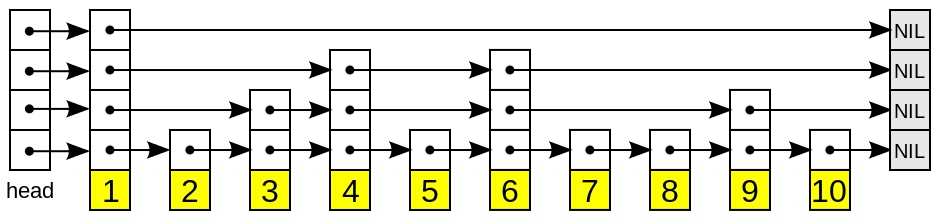

特点：跳跃表是由多层的链表组成，每层链表都是一个有序链表，最底层的链表包含了所有元素；如果一个节点出现在某一层的链表中，那么在该层之下的链表也会出现该节点，上一层链表的元素是下一层链表元素的子集，链表中每个节点包含两个指针，一个指向同一层的下一个链表节点，另一个指向下一层的同一个链表节点。
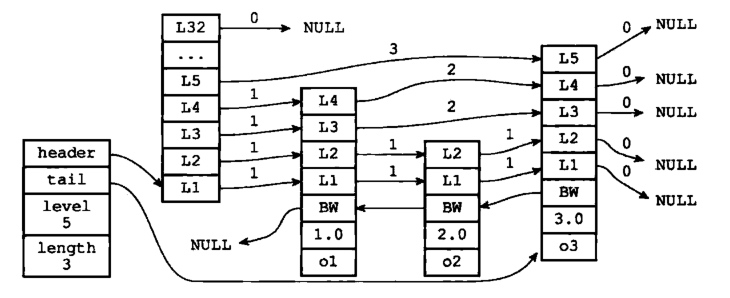

搜索：从最高层的链表节点开始查找，如果比当前节点大，则继续向后查找，找到一个小的节点，然后回退到前一个节点，向下查找；以此类推即可，最终会在底层找到节点。
插入：先插入最底层的链表，然后按照概率决定是否插入到上一层中，类似抛硬币一样；
删除：在每个层中找到包含指定值的节点，然后将节点从链表中删除即可。

## 整数集合
整数集合（intset）用于存放有序、无重复的整数值，根据元素的值，自动选择该用什么长度的整数类型来保存元素；它可以保存类型为int16_t、int32_t 或者int64_t 的整数值，并且保证集合中不会出现重复元素。
```java
typedef struct intset{
     //编码方式
     uint32_t encoding;
     //集合包含的元素数量
     uint32_t length;
     //保存元素的数组
     int8_t contents[];
 
}intset;
```
* 升级
　　当我们新增的元素类型比原集合元素类型的长度要大时，需要对整数集合进行升级，才能将新元素放入整数集合中。具体步骤：
　　1. 根据新元素类型，扩展整数集合底层数组的大小，并为新元素分配空间。
　　2. 将底层数组现有的所有元素都转成与新元素相同类型的元素，并将转换后的元素放到正确的位置，放置过程中，维持整个元素顺序都是有序的。
　　3. 将新元素添加到整数集合中（保证有序）。
　　举个例子， 如果在一个 intset 里面， 最长的元素可以用 int16_t 类型来保存， 那么这个 intset 的所有元素都以 int16_t 类型来保存。另一方面， 如果有一个新元素要加入到这个 intset ， 并且这个元素不能用 int16_t 类型来保存 —— 比如说， 新元素的长度为 int32_t ， 那么这个 intset 就会自动进行“升级”： 先将集合中现有的所有元素从 int16_t 类型转换为 int32_t 类型， 接着再将新元素加入到集合中。根据需要， intset 可以自动从 int16_t 升级到 int32_t 或 int64_t ， 或者从 int32_t 升级到 int64_t 。
* 降级
　　整数集合不支持降级操作，一旦对数组进行了升级，编码就会一直保持升级后的状态
　　
## 压缩列表
压缩列表（ziplist）是Redis为了节省内存而开发的，是由一系列特殊编码的连续内存块组成的顺序型数据结构，一个压缩列表可以包含任意多个节点（entry），每个节点可以保存一个字节数组或者一个整数值。
压缩列表的原理：压缩列表并不是对数据利用某种算法进行压缩，而是将数据按照一定规则编码在一块连续的内存区域，目的是节省内存。
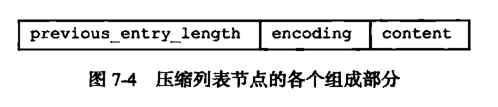
1. previous_entry_ength：记录压缩列表前一个字节的长度。previous_entry_ength的长度可能是1个字节或者是5个字节，如果上一个节点的长度小于254，则该节点只需要一个字节就可以表示前一个节点的长度了，如果前一个节点的长度大于等于254，则previous length的第一个字节为254，后面用四个字节表示当前节点前一个节点的长度。利用此原理即当前节点位置减去上一个节点的长度即得到上一个节点的起始位置，压缩列表可以从尾部向头部遍历。这么做很有效地减少了内存的浪费。
2. encoding：节点的encoding保存的是节点的content的内容类型以及长度，encoding类型一共有两种，一种字节数组一种是整数，encoding区域长度为1字节、2字节或者5字节长。
3. content：content区域用于保存节点的内容，节点内容类型和长度由encoding决定。

# redis 数据类型的实现原理
不同的数据类型采用多种编码方式实现，能够在不同场景下发挥不同编码的优势，从效率和内存空间考虑。
## 对象的类型与编码
redis支持string、list、set、sortedSet、hash五种数据类型，每次向redis保存键值对时，至少创建两个对象，键对象和值对象；redis的每个对象都是由redisObject结构表示。
```java
typedef struct redisObject{
     //类型
     unsigned type:4;
     //编码
     unsigned encoding:4;
     //指向底层数据结构的指针
     void *ptr;
     //引用计数
     int refcount;
     //记录最后一次被程序访问的时间
     unsigned lru:22;
 
}robj
```
* type
string、list、set、sortedSet、hash，通过type key命令可以查看对象的类型；
* encoding和ptr指针
    对象的ptr指针是指向底层的数据结构，而数据结构由encoding属性来决定的。每种类型的对象都至少使用了两种不同的编码；
    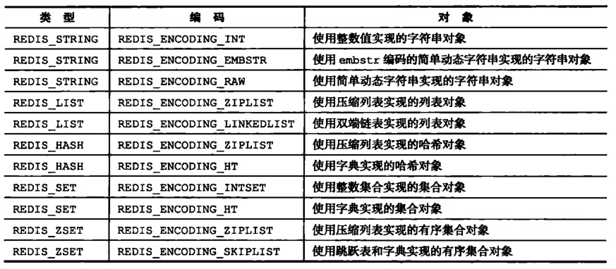

通过命令OBJECT ENCODING key查看对象的编码。

## 字符串对象
**注意：字符串的长度不能超过512M**
编码：
1. int编码：保存可以用long类型表示的整数值；（64位有符号的整型）（浮点数用字符串保存）
2. raw编码：保存长度大于44字节的字符串
3. embstr编码：保存长度小于44字节的字符串
### int编码
当字符串键值的内容可以用一个 64位有符号整形 来表示时，Redis会将键值转化为 long型来进行存储，此时即对应 OBJ_ENCODING_INT 编码类型。
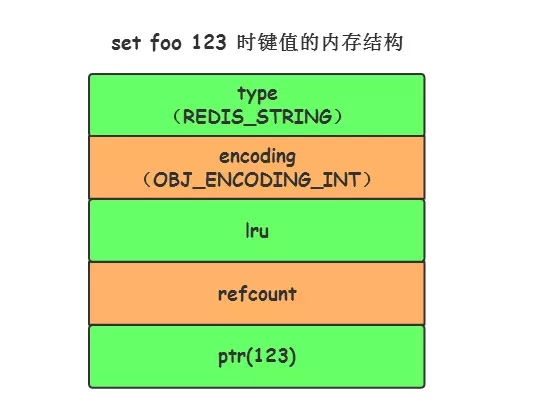
而且 Redis 启动时会预先建立 10000 个分别存储 0~9999 的 redisObject 变量作为共享对象，这就意味着如果 set字符串的键值在 0~10000 之间的话，则可以 直接指向共享对象 而不需要再建立新对象，此时键值不占空间！

这里将 value 直接存储在 redisObject中，不需要额外的寻址，且内存只会分配一次。
### embstr
Redis 在保存长度小于 44 字节的字符串时会采用 OBJ_ENCODING_EMBSTR 编码方式（embedded string，表示嵌入式的String）。从内存结构上来讲 即字符串 sds结构体与其对应的 redisObject 对象分配在 同一块连续的内存空间。
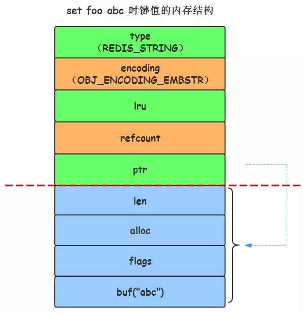

### raw
正如指令示例，当字符串的键值为长度大于 44 的 超长字符串 时，Redis 则会将键值的内部编码方式改为 OBJ_ENCODING_RAW 格式，这与上面的 OBJ_ENCODING_EMBSTR 编码方式的不同之处在于 此时动态字符串 sds 的内存与其依赖的 redisObject 的 内存不再连续 了。
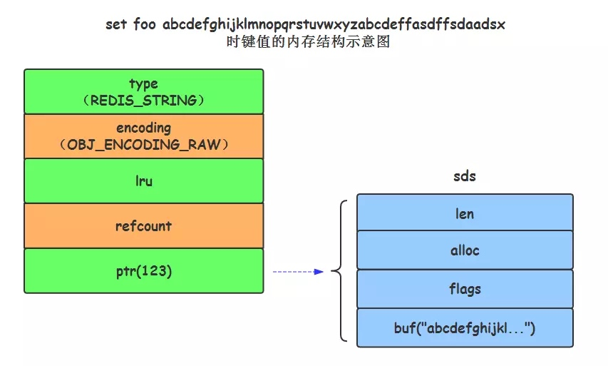

### 编码转换
当int编码保存不再是整数或者超过了long的范围(2^63-1)，则转换为raw存储；embstr编码的字符串是只读的，没有提供任何修改的方法，当对embstr编码的字符串执行修改命令时，会先将编码从embstr转换为raw，然后再进行修改，最终这个字符串变为raw，即使长度小于44.

### 总结
对于int存储，是直接存储在redisObject对象中，只会分配内存一次，且只需要寻址一次即可，内存消耗也小；而字符串需要保存额外的数据，如长度、未使用的空间等，因此不能直接放在redisObject中，需要通过指针进行寻址。embstr用于存放短字符串，sds字符串的内存和redisObject的内存是在同一块的连续内存空间，因此只需要分配一次即可，释放时也只需调用一次内存释放函数，且由于embstr编码的字符串对象的所有数据都保存在一块连续的内存空间，因此这种编码的字符串对象比raw编码能够更好的带来缓存优势；
但是如果字符串长度增加时进行重新分配内存，会导致redisObject和sds都需要重新分配内存空间；因此对于较长的字符串采用了raw实现，但是raw需要分配两次内存空间（redisObject和sds）；

## 列表对象
底层是双向链表，按照插入顺序排序，可以将元素放到列表的头部或者尾部。
列表对象的可以是ziplist(压缩列表)和linkedlist(双端链表)；
### ziplist
每个压缩列表节点保存了一个列表元素；
比如rpush numbers 1 "three" 5，对应的存储结构如下：
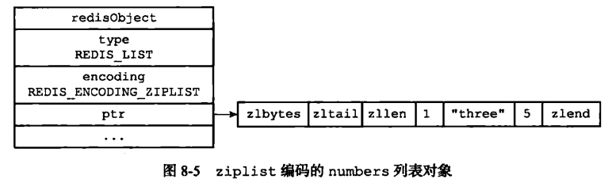
### linkedlist
每个双端链表节点都保存了一个字符串对象，而每个字符串对象都保存了一个列表元素；
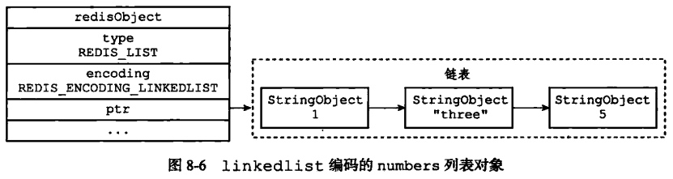
linkedlist会包含多个字符串对象，“three”的完整表示如下：
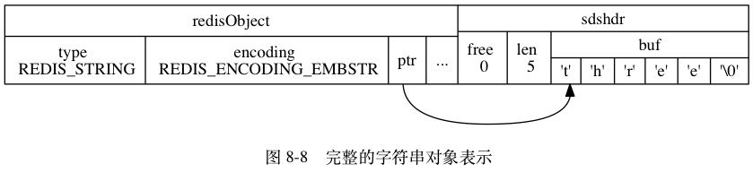


### 编码转换
使用压缩列表ziplist编码：
1. 列表保存元素个数小于512个
2. 且 每个元素长度小于64字节
如果不能满足上面两个条件，则使用linkedlist编码；
上面两个条件可以在redis.conf 配置文件中的 list-max-ziplist-value选项和 list-max-ziplist-entries 选项进行配置。

压缩列表将数据存储在连续的内存区域，占用内存少，节省内存，紧凑的数据结构，而且还可以减少内存碎片（将很多小的数据块合并存储在一个大的区域）；如果单独为每个小的数据块分配内存，那这些内存可能分散在内存的多个角落，导致内存碎片增加。
但是压缩列表中，如果新添加的元素不是在尾部，那么需要移动后面的元素，而且如果新插入的数据长度和以前这个位置长度不一样，那么next节点的pre_entry_length需要改变，从而需要扩展或者收缩next大小，next节点大小改变同时也需要改变next的下一个节点的pre_entry_length，直至整个压缩列表都需要修改，连锁更新！！！
所以对长度叫长的list，底层采用linkedlist存储，不会发生这些问题。

## 哈希对象
哈希对象的编码可以用ziplist或者hashtable；
### ziplist
当使用ziplist时，新增的键值对保存到压缩列表的表尾；
hash的结构：key filed value
每个key对应的fild-value存储结构如下所示：
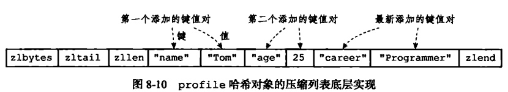
每当有新的键值对要加入到哈希对象时，程序会先将保存了键的压缩列表节点推入到压缩列表的表尾，然后再将保存了值的压缩列表节点推入到压缩列表表尾；
特点：
1. 保存了同一个键值对的两个节点总是挨在一起的，键在前面，值在后面；
2. 先添加到哈希对象中的键值对会被放在压缩列表的表头方向，而后来添加到哈希对象中的键值对会放在压缩列表的表尾；

### hashtable字典
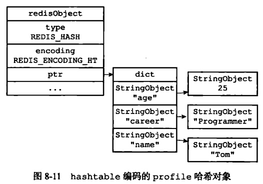

### 编码转换
当满足以下两个条件时，采用ziplist编码；
1. 列表元素个数小于512个；
2. 每个元素长度小于64字节；
hash-max-ziplist-value 选项和 hash-max-ziplist-entries 选项进行修改阈值。
注意：如果哈希对象底层采用压缩列表存储，查询的时间复杂度并不是O(1)，需要通过遍历来查找元素，但是保存的数据比较少，所以影响不大；如果采用hashtable查找，平均时间复杂度为O(1)，哈希冲突另外说。

## 集合set对象
set是无序的，不能重复，不能通过索引查找；列表是有序的，允许重复；
集合对象的编码可以是intset或者hashtable；
### intset整数集合
sdd numbers 1 3 5的存储结构如下所示：
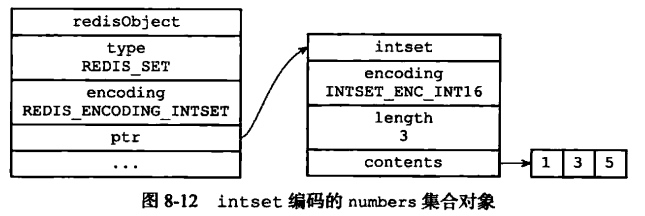

如果采用整数集合存储，那么查找元素的时候，平均时间复杂度为O(logN)(整数集合底层数组是有序的)；

### hashtable
sadd dfruits "apple' "banana" "cherry"
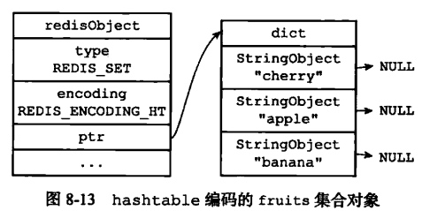

### 编码转换
当满足以下两个条件时，使用intset编码
1. 集合对象中所有元素都是整数
2. 集合对象所有元素数量不超过512

否则就使用hashtable编码；
通过set-max-intset-entries选项可以修改集合元素数量的阈值。

采用整数集合时，能够占用更少的内存，整数集合支持16/32/64位的存储，且支持升级和降级；但是如果元素个数太多，那么查询的时间复杂度log(N)会太慢，因此超过512个时会采用hashtable存储。

## 有序集合对象
有序集合对象是有序的，通过为每个元素设置一个分数作为排序依据。
可以采用ziplist或者skiplist实现。

### ziplist
集合元素使用两个挨在一起的压缩列表节点保存，第一个节点保存元素的成员，第二个节点保存元素的分值，并且压缩列表内的集合元素安好分值从小到大的顺序进行排列，分数低的靠近表头，分数高的靠近表尾。
zadd price 8.5 apple 5.0 banana 6.0 cheery的数据结构如下所示：

### skiplist
skiplist 编码的有序集合对象使用 zet 结构作为底层实现，一个 zset 结构同时包含一个字典和一个跳跃表：
```java
typedef struct zset{
     //跳跃表
     zskiplist *zsl;
     //字典
     dict *dice;
} zset;
```
字典的键保存元素的值，字典的值则保存元素的分值；跳跃表节点的 object 属性保存元素的成员，跳跃表节点的 score 属性保存元素的分值，按照分值进行排序；
这两种数据结构会通过指针来共享相同元素的成员和分值，所以不会产生重复成员和分值，造成内存的浪费。
说明：其实有序集合单独使用字典或跳跃表其中一种数据结构都可以实现，但是这里使用两种数据结构组合起来，原因是假如我们单独使用 字典，虽然能以 O(1) 的时间复杂度查找成员的分值，但是因为字典是以无序的方式来保存集合元素，所以每次进行范围操作的时候都要进行排序，至少需要O(NlogN)的时间复杂度；假如我们单独使用跳跃表来实现，虽然能执行范围操作，但是查找操作有 O(1)的复杂度变为了O(logN)。因此Redis使用了两种数据结构来共同实现有序集合。
因此，为了让有序集合的查找和范围型操作都可能尽快的指向，redis同时使用了字典和跳跃表两种数据结构实现有序集合。
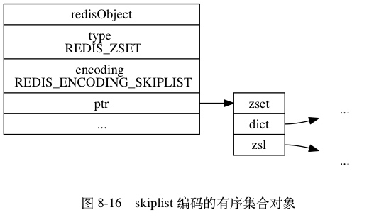
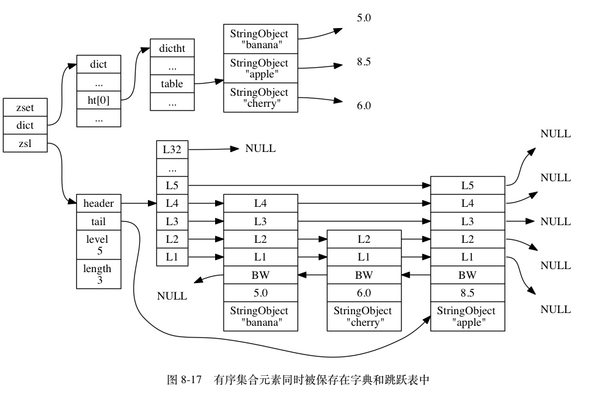

上图是为了展示方便，在字典和跳跃表中重复展示了各个元素的成员和分值， 但在实际中， 字典和跳跃表会共享元素的成员和分值， 所以并不会造成任何数据重复， 也不会因此而浪费任何内存。

zscore命令可以直接从字典中获取给定成员的分值；
zrange等范围型操作，就可以从跳跃表中获取；

### redis中的skiplist与经典的skiplist对比
1. 分数允许重复，即skiplist的key允许重复；
2. 在比较时，不仅比较分数，而且比较数据本身；在 Redis 的 Skiplist 实现中，数据本身的内容唯一标识这份数据，而不是由 key 来唯一标识。另外，当多个元素分数相同的时候，还需要根据数据内容来进字典排序。
3. 第一层的链表不是单向链表，而是双向链表，可以倒序方式获取指定一个范围内的元素；

### 跳跃表与平衡树、哈希表的比较
Skiplist 和各种平衡树（如AVL、红黑树等）的元素是有序排列的，而哈希表不是有序的。因此，在哈希表上只能做单个 key 的查找，不适宜做范围查找。
在做范围查找的时候，平衡树比 Skiplist 操作要复杂。在平衡树上，我们找到指定范围的小值之后，还需要以中序遍历的顺序继续寻找其它不超过大值的节点。如果不对平衡树进行一定的改造，这里的中序遍历并不容易实现。而在skiplist上进行范围查找就非常简单，只需要在找到小值之后，对第 1 层链表进行若干步的遍历就可以实现。
平衡树的插入和删除操作可能引发子树的调整，逻辑复杂，而 Skiplist 的插入和删除只需要修改相邻节点的指针，操作简单又快速。
从内存占用上来说，Skiplist 比平衡树更灵活一些。一般来说，平衡树每个节点包含 2 个指针（分别指向左右子树），而 Skiplist 每个节点包含的指针数目平均为1/(1−p)，具体取决于参数 p 的大小。如果像 Redis 里的实现一样，取 p=1/4，那么平均每个节点包含 1.33 个指针，比平衡树更有优势。
查找单个 key，Skiplist 和平衡树的时间复杂度都为 O(logN)；而哈希表在保持较低的哈希值冲突概率的前提下，查找时间复杂度接近 O(1)，性能更高一些。
从算法实现难度上来比较，Skiplist 比平衡树要简单得多。

### zset不使用平衡树的原因
1. 跳跃表也不是非常耗费内存，实际上取决于生成层数函数里的概率 p，取决得当的话其实和平衡树差不多。
2. 因为有序集合经常会进行 ZRANGE 或 ZREVRANGE 这样的范围查找操作，跳表里面的双向链表可以十分方便地进行这类操作。
3. 实现简单，ZRANK 操作还能达到 O(logN) 的时间复杂度。

### 范围查询原理
跳跃表的查找从最上层开始查找，然后层层进行定位到最底层的有序链表，类似二分查找。
对于 查找排名，或者排名区间的实现原理，如果不做任何改造，那么只能从最底层的链表依次向后遍历，时间复杂度O(N)；redis的跳跃表，会在每个节点维护span字段，表示步长，即当前节点到下一个节点之间的距离，通过这个步长，从最顶层开始查找，累加这个span，判断是否小于等于起始位置，如果不是，则到下一层继续查找。
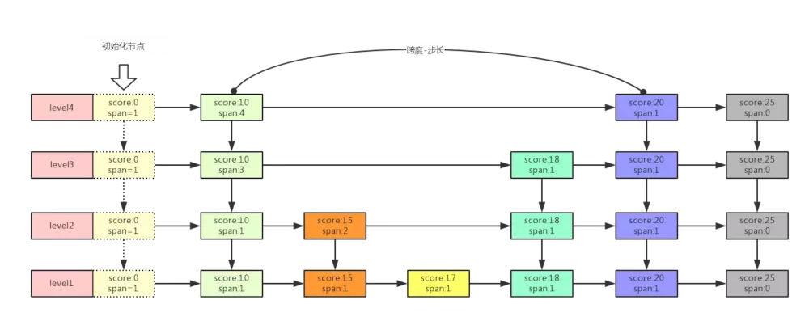
`举个栗子：
查找 > zrange  key 5,2
那么就从最高层开始计算，首先
level4 -- score:0-span:1 + score:10-span:4 == 5
level3 -- ....
level2 -- ....
这样的话直接计算出来 score:20 是第5个节点，那么就确认了，也就代表直接定位到了第5个节点指针位置，那么最后就会在最低层以这个score:20节点指针作为开始位置不断向后获取2个节点然后返回结束.`

所以使用 zrange 这个命令去范围获取,平均的时间复杂度就是 O[(LogN)+M],最坏的情况O(n)，N表示一共N个元素，M表示符合条件的数量；

zscore的查询，获得元素的分数，不是由skiplist来提供的，而是由那个dict来提供的。
zrevrange的查询，是根据排名查数据，由扩展后的skiplist来提供。
zrevrank获得元素的排名，是先在dict中由数据查到分数，再拿分数到skiplist中去查找，查到后也同时获得了排名。

### 编码转换
当满足以下条件时，采用ziplist编码：
1. 元素数量小于128；
2. 保存的所有元素长度小于64字节；
否则使用skiplist编码；
通过Redis配置文件zset-max-ziplist-entries 选项和 zset-max-ziplist-value 进行修改。

# 应用


    


