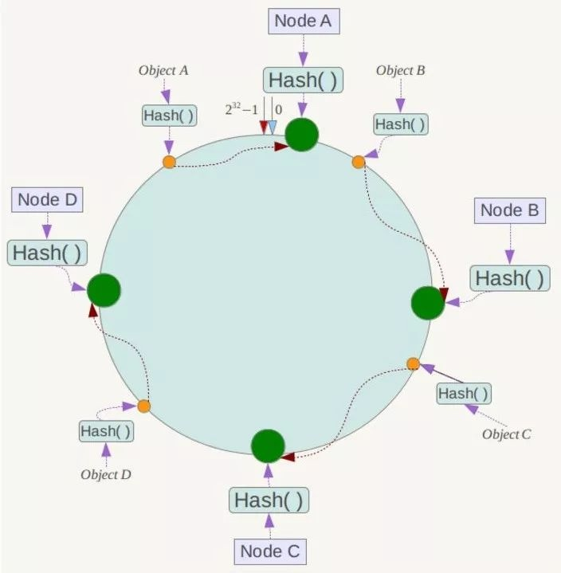
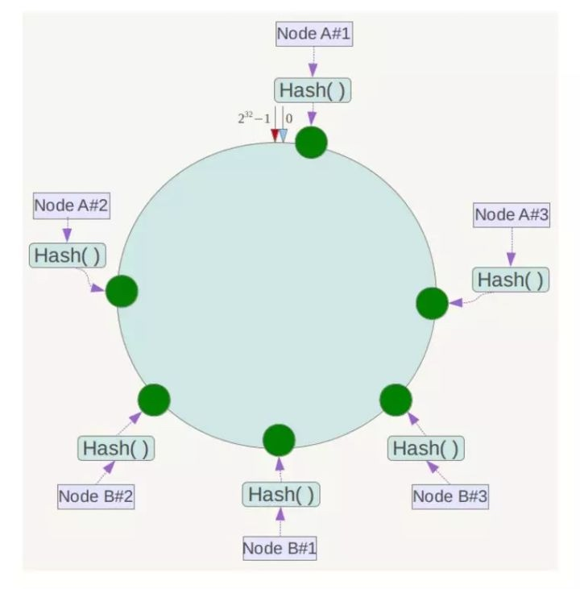
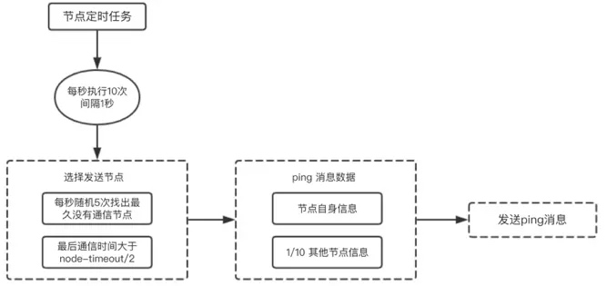

[TOC]
# redisCluster
redis cluster采用的是无中心节点的设计，节点和节点之间通过gossip协议通信；通过主备保证节点的高可用，主备之间采用异步同步的方式，因此极端情况下，会丢失部分数据。主挂了后，备在选为主时，需要有超过半数的master投票同意才行，否则无法选举为主，判断某个节点失败也是这样。所以在搭建集群时，最少为3个节点。
官方推荐cluster的最大节点数为1000.
redis cluster不支持 多key 的操作，即执行命令需要再多个节点之间移动数据，如并集等，除非这些key属于同一个node；但是为了兼容 多key 的操作，提供了hash tag，每个key可以自定义tag，这样存储数据时会根据tag决定将key映射到哪一个node上。
##目的
解决线性扩展性，通过增加节点提高redis的吞吐量。
## 数据一致性保证
只能保证最终一致性，无法实时一致性，gossip协议；
但是极端情况下会丢失数据：异步复制和网络分区
1. write命令提交到Master，Master执行完毕后向Client返回“OK”，但由于一部分replication，此时数据还没传播给Slave；如果此时Master不可达的时间超过阀值，此时集群将触发对应的slave选举为新的Master，此时没有replication同步到slave的数据将丢失。  
2. 由于网络分区，此时master不可达，且Client与Master处于一个分区，且此时集群处于“OK”。此时Failover机制，将其中一个Slave提升为新的Master，等待网络分区消除后，老的Master再次可达，此时节点被切换为Slave，而在这段期间，处于网络分区期间，Client仍然将write提交到老的Master，因为该Master被认为是仍然有效的。当老的Master再次加入集群，被切换成Slave后，这些数据将永远丢失。

## 一致性hash && 哈希槽算法
### 一致性hash
一般的hash算法，当增加节点或删除节点时，会导致缓存命中率很低，从而引起缓存雪崩等；而一致性算法能够较好的解决这个问题。
一致性hash也是采用取模的方法，只是一般的hash是对服务器数量进行取模，而一致性hash是对2^32取模；即，一致性hash算法将整个哈希值的空间组成一个虚拟的圆环，假设某哈希函数H的值空间为0-2^32-1（即哈希值是一个32位的无符号整数）；然后将各个节点使用hash进行一个hash，ip或者主机名等进行hash，这样可以确定每个节点在哈希环上的位置；每个节点所能管理的范围为逆时针到前一个节点的范围；
然后对数据进行hash，确定数据在环上的位置，如下：

现在如果NodeC宕机，可以看到A B C节点管理的数据不会受到影响，只有C节点管理的数据变成D节点管理了；如果一台服务器不可用，那么受影响的数据仅仅是此服务器到环空间中的前一台服务(逆时针)之间的数据，其他不会被影响；
同样，当增加一台服务器时，则受影响的数据仅仅是新服务器到环空间中前一台服务器之间的数据，其他数据不会被影响；

因此，一致性hash算法在节点增减时，只会影响节点之间的数据，具有较好的容错性和扩展性。

但是如果服务节点比较少，很容易造成数据倾斜问题，即被缓存的对象大部分集中在某一台服务器上，那么会给这个服务节点造成极大的压力；一致性hash算法引入虚拟节点机制，即对每个服务节点计算多个hash，每个计算结果位置都放置一个此服务节点，称为虚拟节点。（具体做法可以在服务区IP或者主机名后面加编号解决或者采用多个不同的hash函数）

当虚拟节点足够多(一般超过32)时，即使很少的服务节点也能做到相对均匀的数据分布。

### 哈希槽算法
redis采用的是将数据分片，分配至不同的哈希槽(16384个)上，放弃了一致性hash算法；
例如，我们取slot位置总数为 2^14 , 那么以下三个数据A、B、C，分别映射到以下slot中
Hash(A) /2^14= 333
Hash(B) /2^14= 4000
Hash(C) /2^14= 7000
然后由每个服务节点负责一部分槽位，比如：
0<= slot <1000 映射到server1上，
1000<=slot<5000映射到server2上，
5000<=slot<2^14 会映射到server3上；
从而做到每个节点管理对应槽位中的数据即可。

redis先对key使用crc16算法计算一个结果，然后对16384求取模；

使用哈希槽的好处就在于可以方便的添加或移除节点。
当需要增加节点时，只需要把其他节点的某些哈希槽挪到新节点就可以了；
当需要移除节点时，只需要把移除节点上的哈希槽挪到其他节点就行了；
在这一点上，我们以后新增或移除节点的时候不用先停掉所有的 redis 服务。

对于槽位的转移和分派，Redis集群是不会自动进行的，而是需要人工配置的。所以Redis集群的高可用是依赖于节点的主从复制与主从间的自动故障转移。

## 为什么是16384个槽位
[参考](https://www.cnblogs.com/rjzheng/p/11430592.html)
在redis节点发送心跳包时需要把所有的槽放到这个心跳包里，以便让节点知道当前集群信息，16384=16k，在发送心跳包时使用bitmap压缩后是2k（2 * 8 (8 bit) * 1024(1k) = 2K），也就是说使用2k的空间创建了16k的槽数。

虽然使用CRC16算法最多可以分配65535（2^16-1）个槽位，65535=65k，压缩后就是8k（8 * 8 (8 bit) * 1024(1k) = 8K），也就是说需要需要8k的心跳包，作者认为这样做不太值得；并且一般情况下一个redis集群不会有超过1000个master节点，所以16k的槽位是个比较合适的选择。

### 对比
1. 当发生扩容时候，哈希槽采用灵活的可配置映射表，可以随意组织映射到新增server上面的slot数，比一致性hash的算法更灵活方便；同时也给开发人员手工配置更大的简洁性。
2. 其次，在数据迁移时，一致性hash 需要算哪些key是落在新增服务节点的数据，然后迁移这部分数据，哈希槽则直接将一个slot对应的数据全部迁移，算法明确以及实现更简单。
3. 哈希槽的本质和一致性哈希算法非常相似，不同点就是对于哈希空间的定义。一致性哈希的空间是一个圆环，节点分布是基于圆环的，无法很好的控制数据分布。而Redis Cluster的槽位空间是自定义分配的，类似于Windows盘分区的概念。这种分区是可以自定义大小，自定义位置的。Redis Cluster包含了16384个哈希槽，每个Key通过计算后都会落在具体一个槽位上，而这个槽位是属于哪个存储节点的，则由用户自己定义分配。例如机器硬盘小的，可以分配少一点槽位，硬盘大的可以分配多一点。如果节点硬盘都差不多则可以平均分配。所以哈希槽这种概念很好地解决了一致性哈希的弊端。
4. 另外在容错性和扩展性上，表象与一致性哈希一样，都是对受影响的数据进行转移。而哈希槽本质上是对槽位的转移，把故障节点负责的槽位转移到其他正常的节点上。扩展节点也是一样，把其他节点上的槽位转移到新的节点上。

## 节点通信
### 介绍
redis Cluster采用的无中心节点的设计，节点和节点之间通过gossip协议进行通信，通过gossip协议，节点和节点之间交换元数据信息，一段时间后节点信息一致，每个节点都知道集群的完整信息。（最终一致性）
gossip 协议包含多种消息，包括 ping、pong、meet、fail，等等
meet：某个节点发送meet给新加入的节点，让新节点加入集群中，然后新节点就会开始与其他节点进行通信；
ping：集群内交换最频繁的消息，集群内每个节点每秒向多个其他节点发送ping消息，用于检测节点是否在线和交换彼此状态信息。ping消息发送封装了自身节点和部分其他节点的状态数据。
pong：当接收到ping、meet消息时，作为响应消息回复给发送方确认消息正常通信。pong消息内部封装了自身状态数据。节点也可以向集群内广播自身的pong消息来通知整个集群对自身状态进行更新。
fail：某个节点判断另一个节点fail后，就发送fail给其他节点，通知其他节点，指定的节点宕机了。

### redis cluster通信过程
1. 集群中的每个节点都会单独开辟一个TCP通道，用于节点之间彼此通信，通信端口号在基础对外暴露的端口上加10000；
2. 每个节点在固定周期内通过特定规则选择几个节点发送ping消息；
3. 接收到ping消息的节点用pong消息作为响应；
集群中每个节点通过一定规则挑选要通信的节点，每个节点可能知道全部节点，也可能仅知道部分节点，只要这些节点彼此可以正常通信，最终它们会达到一致的状态。当节点出故障、新节点加入、主从角色变化、槽信息变更等事件发生时，通过不断的ping/pong消息通信，经过一段时间后所有的节点都会知道整个集群全部节点的最新状态，从而达到集群状态同步的目的。

### 消息处理流程
 接收节点收到ping/meet消息时，执行解析消息头和消息体流程：
• 解析消息头过程：消息头包含了发送节点的信息，如果发送节点是新节点且消息是meet类型，则加入到本地节点列表；如果是已知节点，则尝试更新发送节点的状态，如槽映射关系、主从角色等状态。
• 解析消息体过程：如果消息体的clusterMsgDataGossip数组包含的节点是新节点，则尝试发起与新节点的meet握手流程；如果是已知节点，则根据clusterMsgDataGossip中的flags字段判断该节点是否下线，用于故障转移。
消息处理完后回复pong消息，内容同样包含消息头和消息体，发送节点接收到回复的pong消息后，采用类似的流程解析处理消息并更新与接收节点最后信息时间，完成一次消息通信。

### 通信规则
Redis集群内节点通信采用固定频率(定时任务每秒执行10次)。由于内部需要频繁地进行节点信息交换，而ping/pong消息会携带当前节点和部分其他节点的状态数据，势必会加重带宽和计算的负担。通信节点选择过多可以让信息及时交换，但是成本过高；通信节点选择过少会降低集群内所有节点彼此信息交换频率，从而影响故障判定、新节点发现等需求的速度。

    

### 节点选择和通信开销
消息交换的成本主要体现在单位时间选择发送消息的节点数量和每个消息携带的数据量。
(1)选择发送消息的节点数量集群内每个节点维护定时任务默认每秒执行10次，每秒会随机选择5个节点找出最久没有通信的节点发送ping消息，用于Gossip信息交换的随机性。每100毫秒都会扫描本地节点列表，如果发现节点最后一次接受pong消息的时间大于cluster_node_timeout/2，则立刻发送ping消息,防止该节点信息太长时间未更新。根据以上规则得出每个节点每秒需要发送ping消息的数量=1+10*num(node.pong_received> cluster_node_timeout/2)，因此cluster_node_timeout参数对消息发送的节点数量影响非常大。当我们的带宽资源紧张时，可以适当调大此参数。但是如果cluster_node_timeout过大会影响消息交换的频率从而影响故障转移、槽信息更新、新节点发现的速度。因此需要根据业务容忍度和资源消耗进行平衡。同时整个集群消息总交换量也跟节点数成正比。
(2)消息数据量每个ping消息的数据量体现在消息头和消息体中，其中消息头主要占用空间的字段是myslots[CLUSTER_SLOTS/8]，占用2KB，这块空间占用相对固定。消息体会携带一定数量的其他节点信息用于信息交换。而消息体携带数据量跟集群的节点数量相关，集群越大每次消息通信的成本也就更高。

通信开销：
(1)节点自身信息，主要是自己负责的slots信息：slots[CLUSTER_SLOTS/8]，占用2KB;(2)携带总节点1/10的其他节点的状态信息（1个节点的状态数据约为104byte）注：并不是所有的都是携带十分之一的节点信息的。如果total_nodes/10小于3，那就至少携带3个节点信息；如果total_nodes/10大于total_nodes-2，最多携带total_nodes-2个节点信息；Else就total_nodes/10个节点信息。

可以看出影响Gossip开销的主要两点：Cluster Redis的节点数和cluster_node_timeout设置的阈值；
(1)尽量避免大集群，针对大集群就拆分出去；(2)如果某些场景必须使用大集群，那就可以通过增大cluster_node_timeout来降低带宽的消耗，但是会影响failover的时效，这个可以根据业务场景和集群具体状态评估；(3）docker的分配问题，将大集群打散到小集群的物理机上，可以平衡和更高效的利用资源。

客户端可以挑选任意一个redis实例发送命令，每个redis实例收到命令，都会计算key对应的hash slot，如果正好在本地，则直接处理；否则返回moved给客户端，让客户端进行重定向。通过cluster ketslot key可以查看key对应的slot；
由于存在客户端请求重定向的问题，会导致一次请求会产生两次网络IO，浪费性能；所以大部分客户端如jedis都会在本地维护一个hashslot->node的映射表，缓存起来，大部分情况下，直接走本地缓存就可以直接找到hashslot对应的node，不需要再进行重定向。如果hashslot正在迁移，那么会返回ask重定向给jedis，jedis收到ask后，重新定位目标节点去执行，直至返回moved才会更新本地hashslot->node映射表的缓存。

## 高可用与主备切换
1. 判断节点宕机：如果一个节点认为另外一个节点宕机，那么就是 pfail，主观宕机。如果多个节点都认为另外一个节点宕机了，那么就是 fail，客观宕机，跟哨兵的原理几乎一样，sdown、odown，在cluster-node-timeout 内，某个节点一直没有返回 pong，那么就被认为 pfail，如果一个节点认为某个节点 pfail 了，那么会在 gossip ping 消息中，ping 给其他节点，如果超过半数的节点都认为 pfail 了，那么就会变成 fail
2. 从节点过滤：对宕机的 master node，从其所有的 slave node 中，选择一个切换成 master node，检查每个 slave node 与 master node 断开连接的时间，如果超过了 cluster-node-timeout * cluster-slave-validity-factor，那么就没有资格切换成 master，这个也是跟哨兵是一样的，从节点超时过滤的步骤
3. 从节点选举：哨兵：对所有从节点进行排序，slave priority，offset，run id，每个从节点，都根据自己对 master 复制数据的 offset，来设置一个选举时间，offset 越大（复制数据越多）的从节点，选举时间越靠前，优先进行选举，所有的 master node 开始 slave 选举投票，给要进行选举的 slave 进行投票，如果大部分 master node（N/2 + 1）都投票给了某个从节点，那么选举通过，那个从节点可以切换成 master，从节点执行主备切换，从节点切换为主节点

## 主从同步
当slave启动，连接master后，会触发全量同步；全量同步结束后，slave正常工作，此时是增量同步；
主从可以进行读写分离，主写，从读；
主从可以进行容灾，高可用；
[redis主从同步原理概述](https://segmentfault.com/a/1190000012390817)
