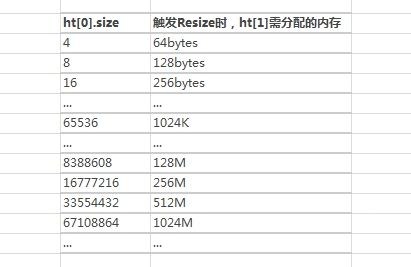

[TOC]
# 为什么有rehash
随着我们的redis操作不断执行，哈希表保存的键值对会逐渐地增多或者减少，当字典内数据过大时，会导致更多的键冲突，造成查询数据的成本增加。当数据减少时，已经分配的内存还在占用，会造成内存浪费。为了让哈希表的负载因子维持在一个合理的范围之内，程序需要对哈希表的大小进行相应的扩展或者收缩

# 字典
redis中采用字典来存储键值对，底层采用hash表实现。hash表则是由数组组成，并通过链表解决hash冲突问题。字典中持有了两个hash表(ht[0]和ht[1])的引用，用来做渐进式的rehash。
[redis设计与实现-字典的实现](http://redisbook.com/preview/dict/datastruct.html)

# 为什么需要渐进式的rehash
当需要进行扩容或者缩容时，需要把ht0中的所有键值对rehash到ht1中，但是这个过程并不是一次性、集中式的完成，而是分多次、渐进式的完成。
这样做的原因在于， 如果 ht[0] 里只保存着四个键值对， 那么服务器可以在瞬间就将这些键值对全部 rehash 到 ht[1] ； 但是， 如果哈希表里保存的键值对数量不是四个， 而是四百万、四千万甚至四亿个键值对， 那么要一次性将这些键值对全部 rehash 到 ht[1] 的话， 庞大的计算量可能会导致服务器在一段时间内停止服务。
因此， 为了避免 rehash 对服务器性能造成影响， 服务器不是一次性将 ht[0] 里面的所有键值对全部 rehash 到 ht[1] ， 而是分多次、渐进式地将 ht[0] 里面的键值对慢慢地 rehash 到 ht[1] 。（redis是单线程，由主线程进行rehash，而不是新起线程完成的，这样就不需要加锁同步的操作了，性能好）
渐进式 rehash 的好处在于它采取分而治之的方式， 将 rehash 键值对所需的计算工作均滩到对字典的每个添加、删除、查找和更新操作上， 从而避免了集中式 rehash 而带来的庞大计算量。

# rehash条件
hashtable元素总个数 / 字典的链个数 = 每个链平均存储的元素个数(load_factor)

服务器目前没有在执行BGSAVE命令或者BGREWRITEAOF命令，load_factor >= 1，dict就会触发扩大操作rehash

服务器目前正在执行BGSAVE命令或者BGREWRITEAOF命令，load_factor >= 5，dict就会触发扩大操作rehash

load_factor < 0.1，dict就会触发缩减操作rehash。

执行BGSAVE命令或者BGREWRITEAOF命令的过程中，Redis需要创建当前服务器进程的子进程，而大多数操作系统都采用写时复制（copy-on-write）来优化子进程的使用效率，所以在子进程存在期间，服务器会提高负载因子的阈值，从而避免在子进程存在期间进行哈希表扩展操作，避免不必要的内存写入操作，最大限度地节约内存。

# rehash步骤
[redis设计与实现-渐进式rehash](http://redisbook.com/preview/dict/incremental_rehashing.html)
若是扩展操作，那么ht[1]的大小为>=ht[0].used*2的2^n
若是收缩操作，那么ht[1]的大小为>=ht[0].used的2^n
1. 为 ht[1] 分配空间， 让字典同时持有 ht[0] 和 ht[1] 两个哈希表。
2. 在字典中维持一个索引计数器变量 rehashidx ， 并将它的值设置为 0 ， 表示 rehash 工作正式开始。
3. 在 rehash 进行期间， 每次对字典执行添加、删除、查找或者更新操作时， 程序除了执行指定的操作以外， 还会顺带将 ht[0] 哈希表在 rehashidx 索引上的所有键值对 rehash 到 ht[1] ， 当 rehash 工作完成之后， 程序将 rehashidx 属性的值增一。
4. 随着字典操作的不断执行， 最终在某个时间点上， ht[0] 的所有键值对都会被 rehash 至 ht[1] ， 这时程序将 rehashidx 属性的值设为 -1 ， 表示 rehash 操作已完成。

也就是说，可以通过rehashidx判断是否正在进行rehash操作。

# rehash期间的hash表操作
因为在进行渐进式 rehash 的过程中， 字典会同时使用 ht[0] 和 ht[1] 两个哈希表， 所以在渐进式 rehash 进行期间， 字典的删除（delete）、查找（find）、更新（update）等操作会在两个哈希表上进行： 比如说， 要在字典里面查找一个键的话， 程序会先在 ht[0] 里面进行查找， 如果没找到的话， 就会继续到 ht[1] 里面进行查找， 诸如此类。

另外， 在渐进式 rehash 执行期间， 新添加到字典的键值对一律会被保存到 ht[1] 里面， 而 ht[0] 则不再进行任何添加操作： 这一措施保证了 ht[0] 包含的键值对数量会只减不增， 并随着 rehash 操作的执行而最终变成空表。

# rehash带来的问题和优化
[美团针对Redis Rehash机制的探索和实践](https://tech.meituan.com/2018/07/27/redis-rehash-practice-optimization.html)
## 问题
rehash会导致redis内存增加，如果内存因为rehash后增加，超过了maxmemory，且该集群未开启自动扩容，但是开启了驱逐策略，那么会淘汰大量数据。
哈希表大小和内存申请大小的关系：

## 优化
1. 在进行rehash时可以判断，如果剩余内存不够触发rehash操作所需申请的内存大小，则不进行rehash；
2. 业务上提前规划，需要把rehash时需要的内存考虑在内，如果redis使用内存达到某个阈值可以报警，提前发现；
3. 开启自动扩容机制，或者调低内存告警阈值；