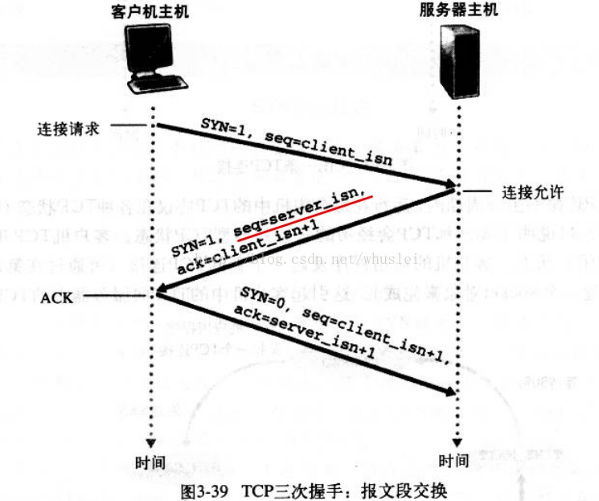
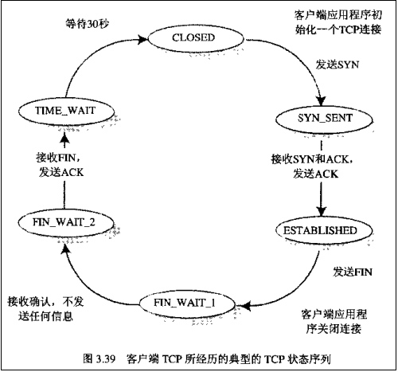
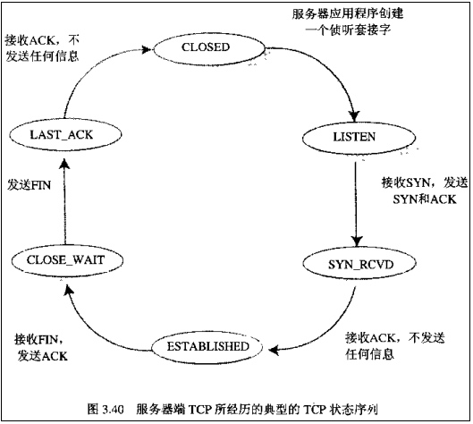

[TOC]

# http构成
## http请求
http请求由请求行、请求头和请求数据组成，请求头和请求数据需要空行进行分割；

请求行：请求的方法字段、URL和http协议组成，如 get /index.html http/1.1；get方法将请求参数拼接在url后面，私密性不好（安全性不好，get提交的数据，参数出现在url上，可能会被缓存或者浏览器历史记录可以查到url），而且浏览器对url的长度也有限制的（http协议本身没有对url进行长度限制）；post方法将请求参数放在请求数据中，也就是放在http包的包体中，key-value的形式，安全性好，且长度没有限制（服务端会对post提交的数据大小有限制）；head只会返回响应头，不会返回响应的内容，用来查看状态时，是非常高效的；

请求头：包含了一些属性信息，比如host主机名，user-agent浏览器的类型，Connection等；

请求数据：请求头和请求数据需要用空行分割，在post方法中存在；

## http响应
http响应由状态行、响应头，响应正文组成；
状态行：HTTP-Version Status-Code Reason-Phrase CRLF
1xx：指示信息--表示请求已接收，继续处理。
2xx：成功--表示请求已被成功接收、理解、接受。 200成功
3xx：重定向--要完成请求必须进行更进一步的操作。301永久重定向，302临时重定向。
4xx：客户端错误--请求有语法错误或请求无法实现。 400bad request，客户端请求有语法错误；401Unauthorized未授权，请求可能缺失认证信息或者带有错误的认证；403Forbidden，拒绝访问，用户虽然认证成功，但是没有权限在特定资源上执行操作；404not found，请求资源不存在，url错误；
5xx：服务器端错误--服务器未能实现合法的请求。500服务端内部错误，503Server Unavailable，服务器当前无法处理客户端请求，一段时间后可能恢复正常，可能由于临时超载或者系统维护造成。（被攻击，超过限制；并发请求数太多；如果下载插件的数量很多，而且超过了服务商的限制，那么可能返回503，过一段时间就可以了）

响应头：content-length，content-type，encode等；
响应数据：需要和响应头用空行分割。

# 一次http请求是服务端还是客户端主动关闭连接
短连接的情况：如果响应的头部中有content-length属性，那么客户端会依据这个长度接收数据，接收完成后，客户端主动关闭连接，进入四次挥手；如果没有content-length，body长度不可知，那么客户端会一直接收数据，直至服务端主动断开；

长连接的情况：有content-length，则根据长度来接收这次请求的数据；如果有transfer-encoding:chunked表示分块传输，那么当接收一个分块的数据长度为0时表示本次请求的数据接收完毕；可以对keep-alive设置超时时间，如果在超时时间内没有数据传输，那么服务端会断开连接。

# 三次握手和四次挥手
三次握手：
1. 客户端发送syn(seq=j)包给服务器，并进入syn_send状态，等待服务器确认；
2. 服务器收到syn包后，需要对客户端进行确认，发送syn(seq=k)和ack(ack=j+1)包给客户端，并进入syn_recv状态；
3. 客户端收到syn和ack包后，向服务器发送确认包ack(ack=k+1)，发送完毕后，客户端和服务器进入established状态，完成了三次握手。

四次挥手：客户端和服务端都可以主动关闭连接，如果客户端先关闭连接，那么它会发送FIN包给服务端，服务端收到FIN包后，回ack给客户端，此时表明客户端没有数据发送给服务端了，但是服务端可能还有数据继续发送给客户端；此时客户端的处于FIN_WAIT2的状态，服务端处于Close_wait状态；当服务端发送FIN包给客户端后，客户端处于Time_wait状态，并发送ack给服务端；此时连接关闭；

# http长连接
http1.0默认是短连接，如果想用长连接，需要在header中指定connection:keep-alive；http1.1默认为长连接，如果想用短连接，需要在header中指定connection:close；可以指定keep-alive的timeout，当超过超时时间后也会关闭长连接。
而且服务端一般都会用nginx，nginx也会设置timeout，如果在超时时间内没有数据传输，那么会关闭这个长连接，避免长连接太多，给服务端带来太大的压力。

# http如何知道请求什么时候结束呢
## http长连接如何区分多个请求
1. http响应中有content-length属性，表示实体内容的长度，浏览器通过这个字段判断当前请求的数据是否已经全部接收；所以，当浏览器请求一个静态资源时，即服务端能明确知道返回内容的长度时，可以设置content-length来标志请求的结束；但是对于一个动态的页面或者数据时，content-length是无法解决的，不可能在服务端维护一个buffer，然后统计长度的，这时只能用transfer-encoding字段了。
2. transfer-encoding表示传输编码，改变了报文的格式，当服务端无法知道实体内容的长度时，可以指定transfer-encoding:chunked，表明是分块传递的，即服务端一边生产数据，一边发送数据。最终当浏览器收到一个长度为0的chunked时，表明当前请求内容已经全部接收。（最后一个chunked的数据长度必须为0，表示结束）（chunked可以和内容的压缩编码gzip一起使用，效果更好）

`什么时候用到chunked分块传输呢？当要加载的内容比较多时，服务端可以分块传输给客户端进行展示。比如一篇文章有标题、作者、很多章节，如果不用chunked，那么用户可能需要等待5s才能看到全部返回的数据，5s内就是一个空白的页面；但是如果采用chunked，先传输标题和作者，后面再传输部分的章节，用户可以更快的看到页面的数据，用户体验更好；当然也可以通过ajax异步加载来做，标题 作者 不同的章节用不同的ajax请求，但是这样会增加http请求的次数，采用chunked依然是一个http请求。`

# http和tcp的keepalive区别
1. http的keep-alive的目的是复用tcp连接，在一次http请求结束后不会立刻关闭tcp连接，从而让其他请求也可以使用这个tcp连接，减少tcp连接创建和销毁的开销，提高性能；（现在的一个网页上会包含很多http请求，如图片、css和js文件等，如果不采用keep-alive，那么效率会很低）
2. tcp的keepAlive目的是保活，如果应用层长时间不发送数据，那么如何判断客户端是否依然存在呢？那么在超时时间内如果还没有应用层的数据，那么tcp会发送空报文给客户端，如果客户端响应了，那么不会关闭连接，否则说明说明客户端不存在了，就会关闭这个tcp连接了。也就是说，检测到这种半开放的连接然后进行关闭；tcp协议层默认是不开启keepAlive的功能的，即超过多长时间没有应用层的数据就会关闭。
3. 写法不同，http的keep-alive，tcp是KeepAlive；

# tcp层有了心跳机制(keepAlive)，为什么应用层还需要有心跳
1. tcp层心跳的目的是保活，能够将半开放的连接关闭，节省服务端资源；但是对于应用能否正常提供服务，tcp层的心跳是无法知道的。应用层的心跳功能是依赖应用的，如果当前无法正常提供服务，通过应用层心跳就能立刻知道；
2. 应用层的心跳不依赖传输层的协议，也就是说如果tcp改为了udp，依然能够依赖应用层的心跳，通用性更好。
3. tcp的keepalive只能设置秒级别的，如果毫秒的话就无法办到；而且应用层的心跳能够更加灵活的调整；

# tcp的三次握手和四次挥手
需要明白，请求 是在应用层才有的，请求本身就代表了一个事务，说 http请求是没问题的，但是tcp传输层是没有 请求 这个说法的，tcp的发送端发送报文，应该用 报文 来阐述。

# 四次挥手时，为什么主动关闭的一端要维护TIME_WAIT状态
TIME_WAIT状态属于主动发起关闭连接的一端，当主动关闭的一端也收到了对端的FIN信号时，那么会变为TIME_WAIT状态，然后会在该状态停留2MSL时间，最终变为CLOSED状态。MSL(Mast Segment Live)为一个数据报文在网络中的最大生存时间。任何TCP实现都需要为MSL选择一个值，建议值是2分钟。（每个数据报文都含有一个跳限的8位字端(IPv4的TTL和IPv6的跳限字端)，最大值是255，这是一个跳数限制，而不是真正时间限制，假设具有最呆跳限的分组在网络中存在的时间不会超过MSL）
假设客户端c为主动关闭连接一端，服务端s为被动关闭；
1. 维护TIME_WAIT状态，是为了可靠的实现TCP全双工连接的终止。因为客户端最后发送的ACK可能因为网络原因没有送到服务端，服务端没有收到ACK后，会进行超时重试，重新发送FIN，如果此时客户端关闭了，那么将会响应一个RST包，服务端会认为这是一个错误，上报给系统，虽然也关闭了连接，但是不符合TCP可靠性连接的原则。
2. 如果立刻关闭该连接，这时有一个新的连接过来，ip地址和端口号与刚关闭的连接相同，如果老连接的某个数据包在网络中传输比较久，这个时候到达，会误以为新的连接就是老的连接，那么导致新连接接收到了老连接分组的数据；

等待2MSL，是为了保证此次连接产生的所有报文在网络中都消失。如果是1MSL，只能保证客户端发送的ACK包会在网络中消失，但是如果服务端超时重传FIN包，超时重传的时间差+1MSL已经大于1MSL了，因此无法保证服务端重传过来的FIN包会在网络中消息。（保证了某个方向上的分组最多存活MSL被丢弃，另一个方向上的应答最多存活MSL被丢弃，最终保证了老连接在网络中的所有分组都已经在网络中消失了。）（当客户端收到重传的FIN包后，会重新计时2MSL；重传的时间一般是0.5s，1s这样，远远小于MSL，而且当重传超过一定次数后，会reset连接(rst)，也就是非正常关闭了这个连接）（一般来说不会发生单向丢包）
为什么是2呢？假如客户端发送ACK刚刚过了一个MSL，而服务端咋收到这个ACK之前刚好进行超时重传FIN，所以等这个FIN消失了，也就是2MSL。等待2MSL，能够确保本次连接在网络中产生的所有报文段都会失效，消失。

TIME_WAIT状态下发送的ACK丢失，LAST_ACK时刻设定的重传定时器超时，发送重传的FIN，很不幸，这个FIN也丢失，主动关闭方在TIME_WAIT状态等待2MSL没收到任何报文段，进入CLOSED状态，当此时被动关闭方并没有收到最后的ACK。所以即使要主动关闭方在TIME_WAIT状态下停留2MSL，也不一定表示四次握手关闭就一定正常完成。
结论：在TIME_WAIT下等待2MSL，只是为了尽最大努力保证四次握手正常关闭。确保老的报文段在网络中消失，不会影响新建立的连接。
[为什么需要2MSL](https://www.zhihu.com/question/67013338)

# RST
表示复位，用来异常的关闭连接。发送端直接丢弃缓冲区的包发送RST包，接收端收到RST包后不需要回复ACK，立即关闭连接。TCP程序会在自己认为异常的时候发送RST包，比如，A向B发送，但是B上无相应的监听端口，这时B系统的TCP程序会发送RST包

# 四元组
包含源IP 源端口 目标IP 目标端口；通过四元组可以唯一的确定一个连接。
B作为服务端，IP和端口是公开的，只需要知道A的端口和IP就可以发送RST攻击，伪造的序列号需要在滑动窗口范围内。

# 应用中出现大量的closed_wait状态
客户端发起http请求的时候设置了超时时间，而服务端在超时时间内没有处理完成，导致客户端主动关闭连接，由于服务端还在处理请求，所以不会发送FIN包给客户端，从而导致服务端出现大量的closed wait状态；日志异常信息是，一般已经关闭了。