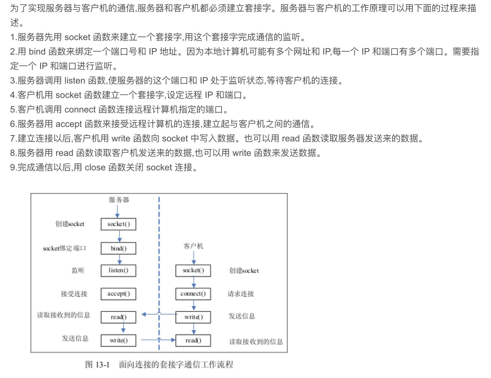
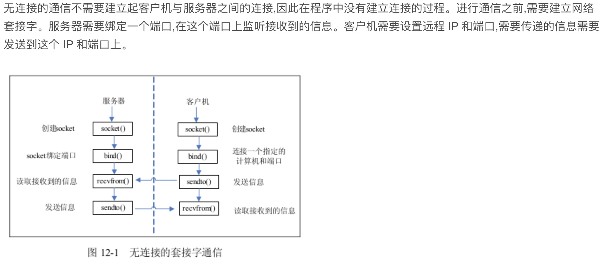

[TOC]
# socket
我们知道两个进程如果需要进行通讯最基本的一个前提能能够唯一的标示一个进程，在本地进程通讯中我们可以使用PID来唯一标示一个进程，但PID只在本地唯一，网络中的两个进程PID冲突几率很大，这时候我们需要另辟它径了，我们知道IP层的ip地址可以唯一标示主机，而TCP层协议和端口号可以唯一标示主机的一个进程，这样我们可以利用ip地址＋协议＋端口号唯一标示网络中的一个进程。

能够唯一标示网络中的进程后，它们就可以利用socket进行通信了，什么是socket呢？我们经常把socket翻译为套接字，socket是在应用层和传输层之间的一个抽象层，它把TCP/IP层复杂的操作抽象为几个简单的接口供应用层调用，从而实现进程在网络中通信。

# 通信流程
## tcp socket

## udp socket

