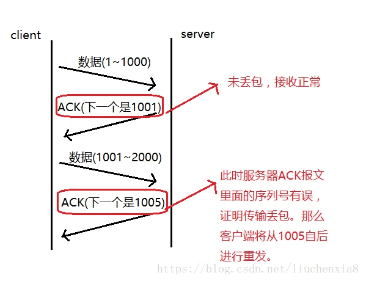

# TCP如何保证可靠性
TCP协议是面向连接的、可靠的数据传输协议；
1. 超时重传：发送端发送一个报文段后，会启动一个定时器，等待接收端收到这个报文段后会发发送确认给发送端；如果在超时时间内没有收到确认，则发送端会重发这个报文。（重传的原因可能是因为发送的数据丢包或者ack丢包，如果是因为ack丢包，那么接收端会根据序列号发现数据已经存在，那么直接丢弃，仍旧发送ack应答）
2. 数据校验：发送端在发送数据之前会计算校验和，将校验和和数据一起传输到接收端，接收端收到数据后，采用同样的方式进行计算校验和，与发送端计算的进行比较。对接收的数据进行校验，防止传输过程中被修改，如果校验不通过，则直接丢弃这个报文端并且不进行确认，等待发送端超时重传。
3. 确认应答和序列号：tcp在传输时，对每个报文端进行编号，这就是序列号；接收方收到数据后，会对发送端进行确认应答，即发送ACK报文，包含确认的序列号。

4. 流量控制：发送端会根据接收端缓冲区的大小来调整发送数据的速度；接收端在收到数据后会发送确认应答给发送端，同时包含了接收端剩余窗口的大小的信息，发送端会根据ACK报文中的窗口大小来调整自己发送窗口的大小，从而调整发送速度；如果接收窗口大小为0，那么发送方会停止发送数据，并定期向接收端发送窗口探测数据段，让接收端把窗口大小告诉发送端；
5. 拥塞控制：发送端刚开始发送数据时，如果发送数据很大，可能导致网络一开始就阻塞了，阻塞就会产生大量的丢包，从而引发超时重传，严重影响传输。所以TCP引入了慢启动机制，在开始发送数据时，发送少量的数据，来探测网络情况，再决定下次传输多大的数据量，比如刚开始定义拥塞窗口为1，每次收到ack后，拥塞窗口加1，在发送数据之前，取拥塞窗口和发送窗口的较小值；拥塞窗口的增长是指数级别的，增长很快，当超过拥塞窗口的阈值后，不会按照指数进行增长，而是线性增长。在慢启动开始的时候，阈值等于窗口的最大值，一旦造成网络阻塞，发生超时重传，慢启动的阈值会变为原来的一半，同时将拥塞窗户大小置为1.
6. 滑动窗口：发送窗口和接收窗口，作用是提供TCP的可靠性，提供TCP的流控特性；对于TCP会话的发送方，任何时候在其发送缓存内的数据都可以分为4类，“已经发送并得到对端ACK的”，“已经发送但还未收到对端ACK的”，“未发送但对端允许发送的”，“未发送且对端不允许发送”。“已经发送但还未收到对端ACK的”和“未发送但对端允许发送的”这两部分数据称之为发送窗口（中间两部分）。对于TCP的接收方，在某一时刻在它的接收缓存内存在3种。“已接收”，“未接收准备接收”，“未接收并未准备接收”（由于ACK直接由TCP协议栈回复，默认无应用延迟，不存在“已接收未回复ACK”）。其中“未接收准备接收”称之为接收窗口。[窗口理解](https://my.oschina.net/xinxingegeya/blog/485650)
