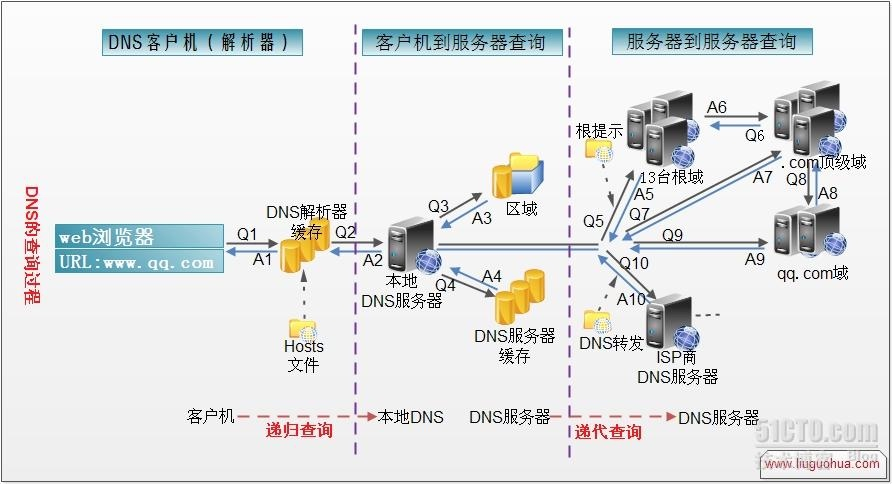

# 在网站上输入url后的请求流程
1. 首先会进行域名解析；先查浏览器缓存中是否有该域名对应的ip地址，如果曾经访问过且没有清空缓存便存在，如果没有，则找本地的hosts文件，进行域名和ip的解析，如果有则直接向ip发送请求，如果没有，再去本地DNS服务器(tcp/ip参数中有设置)进行查询，如果有则将解析结果返回给客户端，如果没有，则本地DNS会请求根DNS服务器查询，根DNS收到请求后会解析url的顶级域名如com,edu等，然后将对应的顶级域名服务器的ip返回给本地DNS，本地DNS拿到ip后会向对应的顶级域名服务器进行查询，如果自己无法解析，则会把下一级的DNS服务器地址(权威DNS服务器，如qq.com)返回给本地DNS服务器，然后本地DNS服务器再去权威DNS服务器查询解析；递归去查询，最终找到对应的ip地址返回给客户端；（客户端到本地DNS是递归查询，而DNS服务器之间是迭代查询）
2. 客户端拿到ip地址后，会和ip对应的服务器建立tcp连接，也就是三次握手的过程；
3. 连接建立完成后，就可以向服务器发送http请求；
4. 服务器收到请求后，会由web服务器处理请求；期间可能会经过nginx进行负载均衡，然后业务处理，查询数据库和缓存等；
5. 服务端返回响应给客户端，然后渲染展示给用户；
6. 关闭tcp连接，四次挥手；

